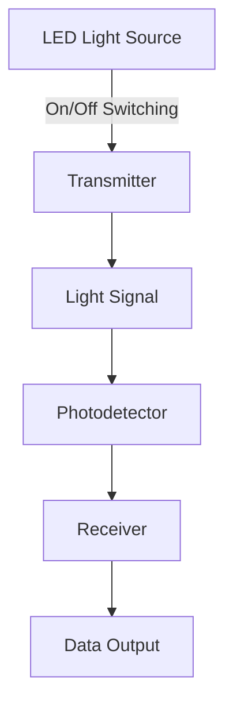
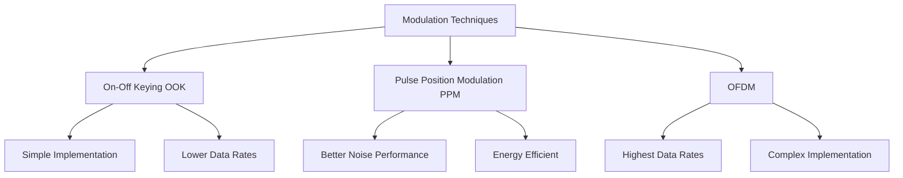

# Networks Li-Fi

## Introduction

Light Fidelity, commonly known as Li-Fi, is an emerging wireless communication technology that uses light to transmit data. Unlike Wi-Fi which uses radio waves, Li-Fi utilizes the visible light spectrum, ultraviolet, and infrared radiation to send and receive data. First introduced by Professor Harald Haas at the University of Edinburgh during a 2011 TED Talk, Li-Fi has the potential to revolutionize how we connect to the internet and transmit data in various environments.

## What is Li-Fi?

Li-Fi stands for Light Fidelity and refers to Visible Light Communication (VLC) technology that uses light as a medium to deliver networked, mobile, high-speed communication. It functions similarly to Wi-Fi but uses light instead of radio waves to transmit data.



### How Li-Fi Works

At its core, Li-Fi works through a remarkably simple principle:

1. **Data Encoding**: Data is encoded into light intensity variations.
2. **Transmission**: LED bulbs rapidly switch on and off (imperceptible to human eyes) to transmit binary data.
3. **Reception**: A photodetector captures these light signals.
4. **Decoding**: The receiver converts the light signals back into electronic data.

The LEDs can be switched on and off at extremely high speeds (in the range of nanoseconds), which allows for data transmission rates much higher than conventional wireless technologies.

## Technical Implementation

### Basic Setup Components

A basic Li-Fi system consists of:

1. **Transmitter**: LED bulbs or other light sources
2. **Modulation Unit**: Controls the LED to encode data
3. **Receiver**: Photodiodes or photosensors
4. **Processing Unit**: Decodes the received signals

### Implementing a Simple Li-Fi Transmitter (Conceptual Code)

Here's a simplified representation of how a Li-Fi transmitter might be programmed:

```python
import time

class LiFiTransmitter:
    def __init__(self, led_pin):
        self.led_pin = led_pin
        # Setup LED pin (hardware-specific code would go here)
        
    def send_bit(self, bit):
        if bit == 1:
            # Turn LED on
            self.led_on()
        else:
            # Turn LED off
            self.led_off()
        # Very short delay for bit timing
        time.sleep(0.000001)  # 1 microsecond
    
    def send_byte(self, byte):
        # Convert byte to bits and send each bit
        for i in range(8):
            bit = (byte >> i) & 1
            self.send_bit(bit)
    
    def send_message(self, message):
        # Convert string to bytes and send each byte
        for char in message:
            self.send_byte(ord(char))
            
    def led_on(self):
        # Hardware-specific code to turn on LED
        pass
        
    def led_off(self):
        # Hardware-specific code to turn off LED
        pass

# Usage example
transmitter = LiFiTransmitter(led_pin=13)
transmitter.send_message("Hello Li-Fi World!")
```

### Implementing a Simple Li-Fi Receiver

```python
import time

class LiFiReceiver:
    def __init__(self, photodiode_pin):
        self.photodiode_pin = photodiode_pin
        # Setup photodiode pin (hardware-specific code would go here)
        
    def read_bit(self):
        # Read light intensity from photodiode
        light_detected = self.read_photodiode()
        return 1 if light_detected else 0
    
    def read_byte(self):
        byte = 0
        # Read 8 bits to form a byte
        for i in range(8):
            bit = self.read_bit()
            byte |= (bit << i)
            # Very short delay for bit timing
            time.sleep(0.000001)  # 1 microsecond
        return byte
    
    def read_message(self, length):
        message = ""
        for _ in range(length):
            byte = self.read_byte()
            message += chr(byte)
        return message
    
    def read_photodiode(self):
        # Hardware-specific code to read photodiode
        # Returns True if light is detected, False otherwise
        pass

# Usage example
receiver = LiFiReceiver(photodiode_pin=7)
received_message = receiver.read_message(17)  # Length of "Hello Li-Fi World!"
print(f"Received: {received_message}")
```

**Input and Output Example:**

**Transmitter Input:**
```
transmitter.send_message("Hello Li-Fi World!")
```

**Receiver Output:**
```
Received: Hello Li-Fi World!
```

Note that these examples are conceptual. In a real implementation, you would need to consider hardware specifics, synchronization, error correction, and more advanced modulation techniques.

## Modulation Techniques in Li-Fi

Li-Fi systems can use various modulation schemes:

1. **On-Off Keying (OOK)**: The simplest form where data is transmitted by turning the LED on and off.
2. **Pulse Position Modulation (PPM)**: Data is encoded in the position of a pulse within a time frame.
3. **Orthogonal Frequency Division Multiplexing (OFDM)**: Multiple carrier signals transmit data in parallel.



## Advantages of Li-Fi

Li-Fi offers several significant advantages over traditional wireless technologies:

### 1. Extremely High Bandwidth

The visible light spectrum is 10,000 times larger than the radio frequency spectrum, providing significantly more bandwidth potential.

### 2. Superior Data Transfer Speeds

Li-Fi has demonstrated speeds up to 224 Gbps in laboratory conditions, far exceeding most Wi-Fi implementations.

### 3. Enhanced Security

Since light cannot penetrate walls, Li-Fi signals are naturally confined to the room they originate in, providing inherent security against eavesdropping.

### 4. No Electromagnetic Interference

Li-Fi doesn't cause electromagnetic interference, making it suitable for use in:
- Hospitals
- Aircraft cabins
- Nuclear power plants
- Other sensitive environments

### 5. Energy Efficiency

LEDs consume less energy than other communication technologies, and the same light source can be used for both illumination and data transmission.

## Limitations and Challenges

Despite its advantages, Li-Fi faces several challenges:

### 1. Line-of-Sight Requirement

Li-Fi generally requires a direct line of sight between transmitter and receiver, limiting mobility and flexibility.

### 2. Limited Range

The effective range of Li-Fi is typically shorter than Wi-Fi, often limited to the room where the light source is located.

### 3. Interference from Other Light Sources

Ambient light from natural sources or other artificial lighting can potentially interfere with Li-Fi signals.

### 4. Cannot Work in Darkness

Without modifications, basic Li-Fi systems cannot operate when lights are turned off (though infrared Li-Fi variants can address this).

### 5. Connectivity Challenges

Moving between rooms requires handover mechanisms similar to cellular networks.

## Real-World Applications

### Smart Lighting

```javascript
// Example smart lighting control with Li-Fi capabilities
const configureLiFiLight = (lightId, brightness, dataRate) => {
  // Connect to the light fixture
  const light = SmartLightingSystem.connect(lightId);
  
  // Configure illumination settings
  light.setBrightness(brightness);
  
  // Configure Li-Fi data transmission
  light.enableLiFi(true);
  light.setDataRate(dataRate); // in Mbps
  
  // Start broadcasting network
  light.broadcastNetwork("LiFi_Network");
  
  return {
    status: "configured",
    networkName: "LiFi_Network",
    dataRate: `${dataRate} Mbps`
  };
};

// Usage
const lightStatus = configureLiFiLight("living_room_main", 85, 1000);
console.log(lightStatus);
```

**Output:**
```
{
  status: "configured",
  networkName: "LiFi_Network",
  dataRate: "1000 Mbps"
}
```

### Healthcare Environments

Li-Fi is ideal for healthcare settings where:
- Radio frequency-based communications might interfere with medical equipment
- Data security is paramount
- High bandwidth is needed for image and data transfers

### Transportation Systems

Li-Fi can provide:
- Internet connectivity in airplanes through overhead lights
- Vehicle-to-vehicle communication using headlights and taillights
- Underground transportation connectivity where radio signals struggle

### Underwater Communications

Traditional radio waves don't propagate well underwater, but light can penetrate to reasonable depths, making Li-Fi a potential solution for:
- Diver communications
- Underwater vehicle control
- Subsea exploration

### Industrial Internet of Things (IIoT)

In factory settings, Li-Fi can provide:
- Reliable connectivity in radio-hostile environments
- Precise indoor positioning
- Secure machine-to-machine communication

## Implementation Example: Room-Scale Li-Fi Network

Here's a conceptual implementation of a room-scale Li-Fi network:

```python
class LiFiNetwork:
    def __init__(self, room_id):
        self.room_id = room_id
        self.light_fixtures = []
        self.connected_devices = []
        
    def add_light_fixture(self, fixture_id, position, coverage_radius):
        """Add a Li-Fi enabled light fixture to the network"""
        fixture = {
            "id": fixture_id,
            "position": position,  # (x, y, z) coordinates
            "radius": coverage_radius,
            "status": "active",
            "connected_devices": 0
        }
        self.light_fixtures.append(fixture)
        print(f"Added Li-Fi fixture {fixture_id} at position {position}")
    
    def connect_device(self, device_id, device_position):
        """Connect a device to the nearest Li-Fi fixture"""
        nearest_fixture = None
        min_distance = float('inf')
        
        # Find the nearest fixture in range
        for fixture in self.light_fixtures:
            distance = self._calculate_distance(device_position, fixture["position"])
            if distance <= fixture["radius"] and distance < min_distance:
                min_distance = distance
                nearest_fixture = fixture
        
        if nearest_fixture:
            device_conn = {
                "id": device_id,
                "connected_to": nearest_fixture["id"],
                "position": device_position,
                "signal_strength": self._calculate_signal_strength(min_distance, nearest_fixture["radius"])
            }
            self.connected_devices.append(device_conn)
            
            # Update fixture connected device count
            for fixture in self.light_fixtures:
                if fixture["id"] == nearest_fixture["id"]:
                    fixture["connected_devices"] += 1
                    
            return {
                "status": "connected",
                "fixture": nearest_fixture["id"],
                "signal_strength": device_conn["signal_strength"]
            }
        else:
            return {
                "status": "failed",
                "reason": "No Li-Fi fixture in range"
            }
    
    def _calculate_distance(self, pos1, pos2):
        """Calculate Euclidean distance between two 3D points"""
        return ((pos1[0] - pos2[0])**2 + 
                (pos1[1] - pos2[1])**2 + 
                (pos1[2] - pos2[2])**2) ** 0.5
    
    def _calculate_signal_strength(self, distance, max_radius):
        """Calculate signal strength based on distance (0-100%)"""
        return max(0, min(100, int(100 * (1 - distance/max_radius))))
    
    def network_stats(self):
        """Return network statistics"""
        total_devices = sum(fixture["connected_devices"] for fixture in self.light_fixtures)
        return {
            "room_id": self.room_id,
            "total_fixtures": len(self.light_fixtures),
            "total_connected_devices": total_devices,
            "fixtures": [{
                "id": fixture["id"], 
                "connected_devices": fixture["connected_devices"]
            } for fixture in self.light_fixtures]
        }

# Example usage
classroom = LiFiNetwork("CS-101")
classroom.add_light_fixture("ceiling-1", (1, 1, 3), 2.5)
classroom.add_light_fixture("ceiling-2", (4, 1, 3), 2.5)
classroom.add_light_fixture("ceiling-3", (1, 4, 3), 2.5)
classroom.add_light_fixture("ceiling-4", (4, 4, 3), 2.5)

# Connect devices
laptop1 = classroom.connect_device("laptop-1", (1.5, 1.5, 0.8))
laptop2 = classroom.connect_device("laptop-2", (3.5, 3.5, 0.8))
tablet = classroom.connect_device("tablet-1", (2.5, 2.5, 0.9))

# Check network stats
print(classroom.network_stats())
```

**Output:**
```
Added Li-Fi fixture ceiling-1 at position (1, 1, 3)
Added Li-Fi fixture ceiling-2 at position (4, 1, 3)
Added Li-Fi fixture ceiling-3 at position (1, 4, 3)
Added Li-Fi fixture ceiling-4 at position (4, 4, 3)
{
  'room_id': 'CS-101',
  'total_fixtures': 4,
  'total_connected_devices': 3,
  'fixtures': [
    {'id': 'ceiling-1', 'connected_devices': 1},
    {'id': 'ceiling-2', 'connected_devices': 0},
    {'id': 'ceiling-3', 'connected_devices': 0},
    {'id': 'ceiling-4', 'connected_devices': 2}
  ]
}
```

## Current State and Future Developments

### Current State

- Commercial Li-Fi products are becoming available from companies like pureLiFi, Signify, and Oledcomm
- Standardization efforts are ongoing through the IEEE 802.11bb Light Communication Task Group
- Data rates of 1-10 Gbps are achievable in commercial implementations

### Future Developments

Several exciting developments are on the horizon:

1. **Integration with 5G/6G**: Li-Fi is expected to complement RF technologies in heterogeneous networks
2. **Solar Panel Receivers**: Using solar cells as photodetectors to receive Li-Fi signals
3. **Li-Fi for IoT**: Specialized protocols for low-power Li-Fi IoT devices
4. **Bidirectional Li-Fi**: Systems that use the same light source for both uplink and downlink
5. **Li-Fi Positioning Systems**: Using multiple Li-Fi transmitters for indoor positioning with centimeter-level accuracy

## Summary

Li-Fi represents a significant innovation in wireless communication technology, utilizing light instead of radio waves to transmit data. With its potential for extremely high bandwidth, enhanced security, and reduced electromagnetic interference, Li-Fi is positioned to play a key role in next-generation wireless networks.

While challenges remain, particularly regarding line-of-sight requirements and range limitations, ongoing research and development are addressing these issues. As Li-Fi technology matures, we can expect to see it increasingly deployed in various sectors, especially in environments where traditional Wi-Fi faces limitations.

## Exercises

1. **Design Exercise**: Sketch a Li-Fi network design for a hospital room that needs to maintain connectivity while avoiding electromagnetic interference with medical equipment.

2. **Programming Exercise**: Implement a simple On-Off Keying (OOK) modulation and demodulation system using an Arduino, an LED, and a photoresistor.

3. **Research Exercise**: Compare and contrast the different modulation techniques used in Li-Fi systems and analyze which would be most suitable for specific application scenarios.

4. **Calculation Exercise**: If a Li-Fi system uses visible light with frequencies between 400 THz and 800 THz, calculate the theoretical bandwidth available compared to the entire radio frequency spectrum used by Wi-Fi.

5. **Discussion Exercise**: Analyze the potential security implications of Li-Fi technology compared to Wi-Fi. Consider both advantages and potential new vulnerabilities.

## Additional Resources

- IEEE 802.11bb Light Communication Task Group documentation
- The Li-Fi Consortium research papers
- "Visible Light Communication: Applications, Architecture, Standardization and Research Challenges" (journal article)
- "Principles of LED Light Communications: Towards Networked Li-Fi" by Harald Haas (book)
- pureLiFi and other commercial Li-Fi product documentation