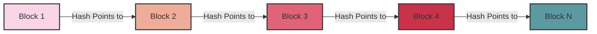
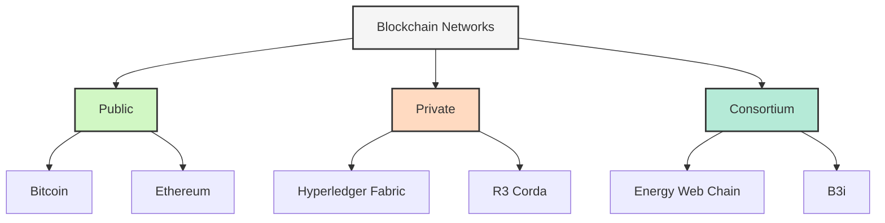

# Blockchain Networks

## Introduction

Blockchain networks represent one of the most significant technological innovations of the 21st century. At their core, blockchain networks are distributed systems that maintain a continuously growing list of records (blocks) linked together using cryptography. Unlike traditional centralized networks, blockchain networks operate on a peer-to-peer basis, eliminating the need for a central authority and enabling transparent, secure, and tamper-proof data exchange.

In this guide, we'll explore how blockchain networks function, their key components, various types, and real-world applications that are transforming industries beyond just cryptocurrency.

## Understanding Blockchain Fundamentals

### What Is a Blockchain?

A blockchain is a distributed digital ledger that records transactions across many computers in a way that ensures the records cannot be altered retroactively. Each "block" contains a timestamp, transaction data, and a cryptographic hash of the previous block, forming a "chain."



### Key Components of Blockchain Networks

1. **Nodes**: Computers that participate in the network
2. **Distributed Ledger**: The shared database that exists across multiple nodes
3. **Consensus Mechanism**: Rules and procedures to achieve agreement on the blockchain state
4. **Cryptographic Hashing**: Mathematical algorithm that maps data of any size to a fixed-size output
5. **Smart Contracts**: Self-executing contracts with terms directly written into code

## How Blockchain Networks Work

### The Block Creation Process

Let's walk through how transactions become part of the blockchain:

1. **Transaction Initiation**: A user initiates a transaction
2. **Transaction Verification**: Network nodes verify the transaction's validity
3. **Block Formation**: Verified transactions are grouped into a block
4. **Consensus**: Nodes agree on the valid state through a consensus mechanism
5. **Block Addition**: The new block is added to the chain
6. **Finality**: The transaction is now considered complete

Here's a simple code example demonstrating a basic block structure in JavaScript:

```javascript
class Block {
  constructor(index, timestamp, data, previousHash = '') {
    this.index = index;
    this.timestamp = timestamp;
    this.data = data;
    this.previousHash = previousHash;
    this.hash = this.calculateHash();
    this.nonce = 0;
  }

  calculateHash() {
    return SHA256(
      this.index + 
      this.previousHash + 
      this.timestamp + 
      JSON.stringify(this.data) + 
      this.nonce
    ).toString();
  }

  mineBlock(difficulty) {
    while (this.hash.substring(0, difficulty) !== Array(difficulty + 1).join("0")) {
      this.nonce++;
      this.hash = this.calculateHash();
    }
    console.log("Block mined: " + this.hash);
  }
}
```

### Consensus Mechanisms

Blockchain networks use various consensus mechanisms to agree on the valid state of the ledger:

#### Proof of Work (PoW)

Used by Bitcoin, PoW requires nodes (miners) to solve complex mathematical puzzles to validate transactions and create new blocks.

```javascript
// Simplified Proof of Work implementation
mineBlock(difficulty) {
  // Target: Create a hash with 'difficulty' number of leading zeros
  const target = Array(difficulty + 1).join("0");
  
  while (this.hash.substring(0, difficulty) !== target) {
    // Increment nonce and recalculate hash until we find a valid one
    this.nonce++;
    this.hash = this.calculateHash();
  }
  
  console.log(`Block mined: ${this.hash}`);
  return this.hash;
}
```

**Input**: A block with transactions to validate  
**Output**: A valid block with a hash meeting the difficulty requirement

```
// Example output
Block mined: 0000a1b2c3d4e5f6...
```

#### Proof of Stake (PoS)

PoS selects validators in proportion to their quantity of cryptocurrency holdings.

#### Delegated Proof of Stake (DPoS)

Stakeholders vote for a small number of delegates who validate transactions and create blocks.

#### Practical Byzantine Fault Tolerance (PBFT)

Used in enterprise blockchain networks, PBFT achieves consensus even if some nodes are faulty or malicious.

## Types of Blockchain Networks

### Public Blockchains

Open networks where anyone can participate, read the chain, submit transactions, and participate in the consensus process.

**Examples**: Bitcoin, Ethereum

**Characteristics**:
- Fully decentralized
- Transparent
- Permissionless
- Higher security through broad distribution

### Private Blockchains

Restricted networks where participation is controlled by an organization.

**Examples**: Hyperledger Fabric, R3 Corda

**Characteristics**:
- Controlled access
- Better performance and scalability
- Lower transparency
- Centralized governance

### Consortium Blockchains

Semi-decentralized networks governed by a group of organizations.

**Examples**: Energy Web Chain, B3i

**Characteristics**:
- Partially decentralized
- Shared governance
- Controlled visibility
- Higher transaction throughput



## Building a Simple Blockchain in JavaScript

Let's implement a simple blockchain to demonstrate the core concepts:

```javascript
const SHA256 = require('crypto-js/sha256');

class Block {
  constructor(timestamp, data, previousHash = '') {
    this.timestamp = timestamp;
    this.data = data;
    this.previousHash = previousHash;
    this.hash = this.calculateHash();
    this.nonce = 0;
  }

  calculateHash() {
    return SHA256(
      this.previousHash + 
      this.timestamp + 
      JSON.stringify(this.data) + 
      this.nonce
    ).toString();
  }

  mineBlock(difficulty) {
    const target = Array(difficulty + 1).join("0");
    
    while (this.hash.substring(0, difficulty) !== target) {
      this.nonce++;
      this.hash = this.calculateHash();
    }
    
    console.log("Block mined: " + this.hash);
  }
}

class Blockchain {
  constructor() {
    this.chain = [this.createGenesisBlock()];
    this.difficulty = 2;
  }

  createGenesisBlock() {
    return new Block("01/01/2022", "Genesis Block", "0");
  }

  getLatestBlock() {
    return this.chain[this.chain.length - 1];
  }

  addBlock(newBlock) {
    newBlock.previousHash = this.getLatestBlock().hash;
    newBlock.mineBlock(this.difficulty);
    this.chain.push(newBlock);
  }

  isChainValid() {
    for (let i = 1; i < this.chain.length; i++) {
      const currentBlock = this.chain[i];
      const previousBlock = this.chain[i - 1];

      // Verify current block's hash
      if (currentBlock.hash !== currentBlock.calculateHash()) {
        return false;
      }

      // Verify chain linkage
      if (currentBlock.previousHash !== previousBlock.hash) {
        return false;
      }
    }
    return true;
  }
}
```

**How to use our simple blockchain**:

```javascript
// Initialize a new blockchain
let myCoin = new Blockchain();

console.log("Mining block 1...");
myCoin.addBlock(new Block("10/07/2023", { amount: 4 }));

console.log("Mining block 2...");
myCoin.addBlock(new Block("12/07/2023", { amount: 10 }));

// Validate the blockchain
console.log("Is blockchain valid? " + myCoin.isChainValid());

// Try to tamper with the blockchain
myCoin.chain[1].data = { amount: 100 };
console.log("Is blockchain valid after tampering? " + myCoin.isChainValid());
```

**Output**:

```
Mining block 1...
Block mined: 00f7a3nf8s9d8f7as9d8f7a9s8df79as8df79
Mining block 2...
Block mined: 00as98df7a9s8df7a9s8df79as8df7a9s8d7f
Is blockchain valid? true
Is blockchain valid after tampering? false
```

## Real-World Applications of Blockchain Networks

### Financial Services

Beyond cryptocurrencies, blockchain networks enable:
- Cross-border payments
- Asset tokenization
- Trade finance
- Insurance claims processing

### Supply Chain Management

Blockchain improves supply chain transparency and traceability:

```javascript
// Example of a supply chain transaction in a blockchain
const supplyChainTransaction = {
  productId: "PRD-12345",
  timestamp: "2023-07-12T15:30:00Z",
  location: {
    latitude: 37.7749,
    longitude: -122.4194,
    facility: "San Francisco Warehouse"
  },
  temperature: 4.5, // For cold chain monitoring
  handledBy: "Operator-789",
  previousCustodian: "Supplier-456",
  newCustodian: "Retailer-101",
  verificationHash: "a1b2c3d4e5f6..."
};

// Add this transaction to our blockchain
myCoin.addBlock(new Block(Date.now(), supplyChainTransaction));
```

### Healthcare

Blockchain enables secure sharing of medical records while maintaining patient privacy:
- Medical record management
- Drug traceability
- Clinical trial management
- Health insurance claims

### Voting Systems

Electronic voting systems built on blockchain provide:
- Transparency
- Immutability
- Verifiability
- Reduced fraud

### Identity Management

Blockchain-based identity solutions offer:
- Self-sovereign identity
- Privacy-preserving authentication
- Reduced identity theft

## Challenges and Limitations

While blockchain networks offer numerous advantages, they also face significant challenges:

1. **Scalability**: Most public blockchains have limited transaction throughput
2. **Energy Consumption**: Proof of Work consensus requires substantial energy
3. **Regulatory Uncertainty**: Legal frameworks are still developing
4. **Integration**: Connecting with legacy systems can be complex
5. **User Experience**: Blockchain applications often lack user-friendly interfaces

## Blockchain Development Tools and Frameworks

For those interested in developing blockchain applications, several tools and frameworks are available:

### Ethereum Development

- **Solidity**: Programming language for Ethereum smart contracts
- **Truffle**: Development environment, testing framework, and asset pipeline
- **Web3.js**: JavaScript library for interacting with Ethereum
- **Ganache**: Personal Ethereum blockchain for development

Here's a simple Solidity smart contract example:

```solidity
// SPDX-License-Identifier: MIT
pragma solidity ^0.8.0;

contract SimpleStorage {
    uint private storedData;
    
    function set(uint x) public {
        storedData = x;
    }
    
    function get() public view returns (uint) {
        return storedData;
    }
}
```

### Hyperledger Frameworks

- **Fabric**: Modular blockchain framework for enterprise solutions
- **Sawtooth**: Highly modular platform for building, deploying, and running distributed ledgers
- **Besu**: Enterprise-grade Ethereum client

## Summary

Blockchain networks represent a paradigm shift in how we think about digital transactions and trust. By distributing data across a network of computers and using cryptography to secure the information, blockchain creates tamper-resistant systems that can operate without central authorities.

Key points to remember:
- Blockchain is a distributed ledger technology that links blocks of data using cryptography
- Different consensus mechanisms like PoW and PoS secure the network
- Blockchain networks come in various types: public, private, and consortium
- Real-world applications extend far beyond cryptocurrencies
- Despite challenges, blockchain technology continues to evolve and find new applications

## Exercises for Practice

1. **Blockchain Explorer**: Create a simple web interface to view the blocks in your JavaScript blockchain
2. **Add Transactions**: Extend the blockchain example to handle multiple transactions per block
3. **Implement Merkle Trees**: Enhance the security by implementing Merkle trees for transaction verification
4. **Change Consensus**: Modify the blockchain to use Proof of Stake instead of Proof of Work
5. **Smart Contract Integration**: Connect your blockchain to a simple smart contract

## Additional Resources

- **Books**: 
  - "Mastering Bitcoin" by Andreas M. Antonopoulos
  - "Blockchain Basics" by Daniel Drescher
  - "Mastering Ethereum" by Andreas M. Antonopoulos and Gavin Wood

- **Online Courses**:
  - Coursera: "Blockchain Specialization" by University at Buffalo
  - Udemy: "Blockchain A-Z™: Learn How To Build Your First Blockchain"
  - edX: "Blockchain Fundamentals" by Berkeley

- **Development Resources**:
  - Ethereum Developer Documentation
  - Hyperledger Fabric Documentation
  - GitHub repositories with open-source blockchain projects