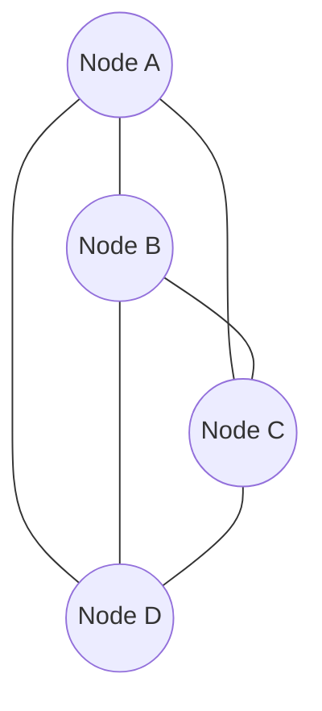
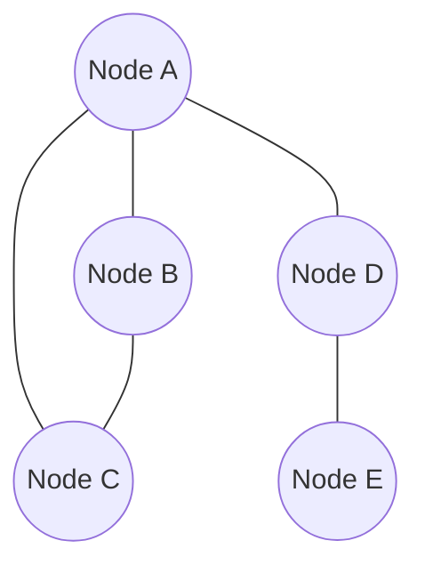
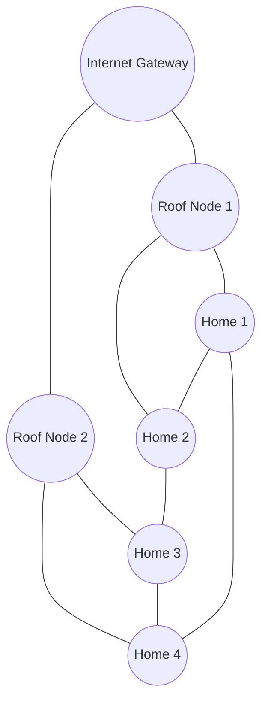

# Mesh Networks

## Introduction

Mesh networks represent a powerful and resilient network topology where devices (or nodes) connect directly to as many other nodes as possible, creating multiple pathways for data to travel. Unlike traditional networks with centralized infrastructure, mesh networks distribute responsibilities across nodes, enabling self-configuration, self-healing, and efficient routing.

In a mesh network, each device acts both as a data point and as a relay, capable of receiving and transmitting information to other nodes. This architecture creates a web-like structure that offers exceptional reliability and scalability, making mesh networks increasingly popular in various applications, from smart homes to enterprise solutions.

## Understanding Mesh Network Topology

Mesh networks come in two primary types:

### Full Mesh Topology

In a full mesh topology, every node connects directly to every other node in the network.



**Advantages:**
- Maximum redundancy
- Shortest possible paths between any two nodes
- No single point of failure

**Disadvantages:**
- High implementation cost
- Complex to manage as the network grows
- Number of connections grows exponentially

### Partial Mesh Topology

In a partial mesh topology, only some nodes connect to multiple other nodes, while others may connect to just one or two neighbors.



**Advantages:**
- Better balance of redundancy and cost
- Easier to scale than full mesh
- Strategic deployment of connections

**Disadvantages:**
- Less redundancy than full mesh
- More complex routing decisions
- Potential bottlenecks at highly connected nodes

## How Mesh Networks Work

### Self-Organization

Mesh networks can automatically configure themselves when new nodes join:

```javascript
// Example pseudocode for node discovery
function discoverNeighbors() {
  // Broadcast discovery message
  let discoveryMessage = {
    nodeId: this.id,
    capabilities: this.capabilities,
    timestamp: Date.now()
  };
  
  broadcast(discoveryMessage);
  
  // Listen for responses
  this.neighbors = [];
  setTimeout(() => {
    // Process received responses and establish connections
    for (let response of receivedResponses) {
      if (isWithinRange(response.nodeId)) {
        this.neighbors.push(response.nodeId);
        establishConnection(response.nodeId);
      }
    }
    console.log(`Connected to ${this.neighbors.length} neighboring nodes`);
  }, 5000);
}
```

### Routing Mechanisms

Mesh networks employ various routing protocols to find optimal paths for data transmission:

#### 1. Flooding

The simplest approach where each node retransmits messages to all neighbors except the one it received from:

```python
def flood_message(message, source_node):
    # Keep track of messages already seen to avoid loops
    if message.id in processed_messages:
        return
        
    processed_messages.add(message.id)
    
    # Forward to all neighbors except source
    for neighbor in my_neighbors:
        if neighbor != source_node:
            forward_message(message, neighbor)
```

#### 2. Distance Vector Routing

Nodes maintain tables with the "distance" (hops) to every other node:

```python
# Simplified distance vector routing table
routing_table = {
    'node_A': {'next_hop': None, 'distance': 0},  # This is the current node
    'node_B': {'next_hop': 'node_B', 'distance': 1},
    'node_C': {'next_hop': 'node_B', 'distance': 2},
    'node_D': {'next_hop': 'node_E', 'distance': 2},
    'node_E': {'next_hop': 'node_E', 'distance': 1}
}

def route_packet(destination):
    if destination in routing_table:
        next_node = routing_table[destination]['next_hop']
        if next_node:
            send_to_node(packet, next_node)
            return True
    return False  # Unable to route
```

#### 3. Link State Routing

Each node builds a complete map of the network by sharing connectivity information:

```python
# Each node maintains a graph of the entire network
network_graph = {
    'node_A': ['node_B', 'node_E'],
    'node_B': ['node_A', 'node_C', 'node_D'],
    'node_C': ['node_B', 'node_D'],
    'node_D': ['node_B', 'node_C', 'node_E'],
    'node_E': ['node_A', 'node_D']
}

def find_shortest_path(source, destination):
    # Implementation of Dijkstra's algorithm
    # Returns the shortest path from source to destination
    # ...
```

### Self-Healing

A key advantage of mesh networks is their ability to recover from node failures:

```javascript
// Pseudocode for handling node failure
function handleNodeFailure(failedNodeId) {
  console.log(`Node ${failedNodeId} has failed. Recalculating routes...`);
  
  // Remove failed node from neighbor list
  this.neighbors = this.neighbors.filter(id => id !== failedNodeId);
  
  // Update routing table
  for (let destination in this.routingTable) {
    if (this.routingTable[destination].nextHop === failedNodeId) {
      // Find alternative route
      let alternativeRoute = findAlternativeRoute(destination);
      if (alternativeRoute) {
        this.routingTable[destination] = alternativeRoute;
        console.log(`New route to ${destination} established`);
      } else {
        console.log(`No alternative route to ${destination} available`);
      }
    }
  }
}
```

## Mesh Network Protocols

Several protocols have been developed specifically for mesh networks:

### 1. 802.11s (Wi-Fi Mesh)

An IEEE amendment to the 802.11 standard that enables mesh networking over Wi-Fi:

```
Key features of 802.11s:
- Hybrid Wireless Mesh Protocol (HWMP) for path selection
- Peer link management
- Security mechanisms
- Radio-aware metrics for path selection
```

### 2. Zigbee

A low-power, low-data-rate wireless mesh network standard popular in IoT:

```javascript
// Example of Zigbee device initialization
const zigbeeDevice = {
  initialize: function() {
    // Set device type
    this.deviceType = 'ROUTER'; // Options: COORDINATOR, ROUTER, END_DEVICE
    
    // Join network
    const networkParams = {
      panId: 0x1234,
      channel: 15,
      securityEnabled: true,
      networkKey: [0x01, 0x23, 0x45, 0x67, 0x89, 0xAB, 0xCD, 0xEF, 
                   0x01, 0x23, 0x45, 0x67, 0x89, 0xAB, 0xCD, 0xEF]
    };
    
    this.joinNetwork(networkParams);
  },
  
  // Other device methods
  discoverNeighbors: function() { /* ... */ },
  routeData: function(data, destination) { /* ... */ }
};
```

### 3. Thread

An IPv6-based, low-power mesh networking protocol for IoT devices:

```
Thread Network Architecture:
- Border Router: Connects Thread network to other networks
- Router: Forwards packets and may serve sleepy end devices
- REED (Router-Eligible End Device): Can become a router if needed
- SED (Sleepy End Device): Battery-powered device that sleeps to save power
```

### 4. B.A.T.M.A.N. (Better Approach To Mobile Ad-hoc Networking)

A routing protocol for multi-hop ad-hoc mesh networks:

```
B.A.T.M.A.N. Operation:
1. Each node periodically broadcasts its existence
2. Neighbors relay these messages
3. Nodes count received messages to determine best routes
4. No node has complete topology information
5. Decisions based on collective intelligence
```

## Implementing a Simple Mesh Network

Let's create a basic mesh network simulation in JavaScript:

```javascript
class MeshNode {
  constructor(id, position) {
    this.id = id;
    this.position = position;
    this.neighbors = [];
    this.messages = [];
    this.seenMessages = new Set();
  }
  
  // Connect to another node if in range
  connectTo(otherNode, range) {
    const distance = Math.sqrt(
      Math.pow(this.position.x - otherNode.position.x, 2) +
      Math.pow(this.position.y - otherNode.position.y, 2)
    );
    
    if (distance <= range && this.id !== otherNode.id) {
      if (!this.neighbors.includes(otherNode)) {
        this.neighbors.push(otherNode);
        otherNode.connectTo(this, range); // Reciprocal connection
        console.log(`Node ${this.id} connected to Node ${otherNode.id}`);
      }
      return true;
    }
    return false;
  }
  
  // Send a message to the network
  sendMessage(message) {
    message.id = Math.random().toString(36).substring(2, 15);
    message.sender = this.id;
    message.hops = 0;
    
    console.log(`Node ${this.id} sending message: ${message.content}`);
    this.relayMessage(message);
  }
  
  // Relay a message to neighbors
  relayMessage(message) {
    // Don't process if we've seen this message before
    if (this.seenMessages.has(message.id)) {
      return;
    }
    
    this.seenMessages.add(message.id);
    message.hops++;
    
    // Store message if it's addressed to us or is a broadcast
    if (message.recipient === this.id || message.recipient === 'broadcast') {
      this.messages.push(message);
      console.log(`Node ${this.id} received message: ${message.content}`);
    }
    
    // Forward to all neighbors
    for (const neighbor of this.neighbors) {
      console.log(`Node ${this.id} forwarding message to Node ${neighbor.id}`);
      neighbor.relayMessage({...message}); // Pass a copy
    }
  }
}

// Usage example
function createMeshNetwork() {
  // Create nodes
  const node1 = new MeshNode('A', {x: 0, y: 0});
  const node2 = new MeshNode('B', {x: 10, y: 10});
  const node3 = new MeshNode('C', {x: 20, y: 0});
  const node4 = new MeshNode('D', {x: 10, y: 20});
  
  // Connect nodes based on range
  node1.connectTo(node2, 15);
  node2.connectTo(node3, 15);
  node2.connectTo(node4, 15);
  
  // Send a message
  node1.sendMessage({
    content: "Hello mesh network!",
    recipient: "broadcast"
  });
  
  return [node1, node2, node3, node4];
}

// Create and test the network
const nodes = createMeshNetwork();

/* Output:
Node A connected to Node B
Node B connected to Node C
Node B connected to Node D
Node A sending message: Hello mesh network!
Node A forwarding message to Node B
Node B received message: Hello mesh network!
Node B forwarding message to Node A
Node B forwarding message to Node C
Node B forwarding message to Node D
Node C received message: Hello mesh network!
Node C forwarding message to Node B
Node D received message: Hello mesh network!
Node D forwarding message to Node B
*/
```

## Real-World Applications

### 1. Smart Home Networks

Mesh networks enable reliable communication between smart home devices:

```javascript
// Example of a smart home mesh network setup
const smartHomeMesh = {
  devices: [
    { id: 'hub', type: 'coordinator', location: 'living-room' },
    { id: 'light1', type: 'router', location: 'living-room' },
    { id: 'light2', type: 'router', location: 'kitchen' },
    { id: 'motion1', type: 'end-device', location: 'hallway' },
    { id: 'thermo1', type: 'router', location: 'bedroom' }
  ],
  
  setupNetwork() {
    console.log("Initializing smart home mesh network...");
    // Establish connections based on device proximity
    // ...
  },
  
  scenarioExample() {
    console.log("Example scenario: Motion detected in hallway");
    // 1. Motion sensor detects movement
    // 2. Sends signal through mesh network
    // 3. Reaches hub via nearest router (light2)
    // 4. Hub processes and sends command to turn on hallway lights
    // 5. Command reaches lights through optimal path in mesh
  }
};
```

### 2. Community Networks

Mesh networks can provide internet access to underserved communities:



Key benefits for community networks:
- Cost-effective deployment
- Resilience to individual node failures
- Community ownership and maintenance
- Scalable to add new households

### 3. Disaster Recovery

Mesh networks provide communication when infrastructure is damaged:

```javascript
// Example deployment scenario
function deployEmergencyMesh() {
  console.log("Deploying emergency mesh network in disaster zone...");
  
  // Step 1: Deploy gateway nodes with satellite backhaul
  const gateways = deployGatewayNodes(3);
  
  // Step 2: Deploy mesh nodes throughout affected area
  const meshNodes = deployMeshNodes(20);
  
  // Step 3: Connect emergency services
  connectEmergencyServices(gateways, meshNodes);
  
  // Step 4: Provide public access points
  const publicAccessPoints = createPublicAccessPoints(meshNodes, 5);
  
  console.log(`Emergency network deployed with ${gateways.length} gateways, 
                ${meshNodes.length} mesh nodes, and 
                ${publicAccessPoints.length} public access points`);
}
```

### 4. Industrial IoT (IIoT)

Mesh networks connect industrial sensors and control systems:

```python
# Example IIoT mesh network for a manufacturing plant
class IndustrialMeshNetwork:
    def __init__(self):
        self.nodes = []
        self.gateway = None
        
    def deploy_in_factory(self, factory_map):
        # Deploy nodes based on factory layout
        for location in factory_map.sensor_locations:
            node_type = self.determine_node_type(location)
            new_node = self.create_node(node_type, location)
            self.nodes.append(new_node)
            
        # Connect nodes based on proximity and obstacles
        self.establish_mesh_connections()
        
        # Deploy gateway for cloud connection
        self.gateway = self.create_gateway_node(factory_map.optimal_gateway_location)
        
        print(f"Industrial mesh network deployed with {len(self.nodes)} nodes")
        
    def monitor_machinery(self):
        # Example of collecting sensor data through the mesh
        for node in self.nodes:
            if node.type == "vibration_sensor":
                data = node.collect_data()
                # Route data through mesh to gateway
                self.route_data(data, node, self.gateway)
```

## Advantages and Challenges

### Advantages

1. **Reliability and Redundancy**: Multiple paths mean no single point of failure
2. **Self-healing**: Network automatically reroutes around failed nodes
3. **Easy Expansion**: New nodes can join and extend the network seamlessly
4. **Coverage**: Can extend network range without additional infrastructure
5. **Load Balancing**: Traffic can be distributed across multiple paths

### Challenges

1. **Latency**: Multiple hops can increase delay for distant nodes
2. **Complexity**: More complex to set up and manage than traditional networks
3. **Scalability Limits**: Very large mesh networks may face performance issues
4. **Power Consumption**: Nodes that relay traffic consume more power
5. **Security**: Distributed nature creates multiple potential attack vectors

## Security Considerations

Security is particularly important in mesh networks due to their distributed nature:

```javascript
// Example of mesh network security implementation
const meshSecurity = {
  // Key rotation mechanism for mesh networks
  rotateNetworkKey: function(network) {
    console.log("Initiating network-wide key rotation...");
    
    // Generate new network key
    const newKey = this.generateSecureKey();
    
    // Distribute via secure channel to all authenticated nodes
    for (const node of network.authenticatedNodes) {
      this.distributeKey(node, newKey, network.currentKey);
    }
    
    // Set timeout for switching to new key
    setTimeout(() => {
      console.log("All nodes switching to new network key");
      network.currentKey = newKey;
    }, 60000); // 1 minute for all nodes to receive
  },
  
  // Node authentication process
  authenticateNode: function(node, network) {
    console.log(`Authenticating node ${node.id} to join network...`);
    
    // Verify node identity using certificates or pre-shared keys
    if (this.verifyNodeIdentity(node)) {
      // Provide current network key using secure exchange
      this.secureKeyExchange(node, network.currentKey);
      network.authenticatedNodes.push(node);
      return true;
    }
    
    console.log(`Authentication failed for node ${node.id}`);
    return false;
  }
};
```

Key security measures include:
1. Node authentication
2. Encrypted communication
3. Regular key rotation
4. Intrusion detection
5. Secure routing protocols

## Performance Optimization

Optimizing mesh networks requires balancing several factors:

```python
# Example of mesh network optimization algorithm
def optimize_mesh_network(network):
    # 1. Analyze current topology
    current_topology = analyze_network_topology(network)
    
    # 2. Identify bottlenecks
    bottlenecks = find_bottlenecks(current_topology)
    
    # 3. Calculate optimal routing paths
    optimal_routes = calculate_optimal_routes(current_topology)
    
    # 4. Recommend topology changes if needed
    if bottlenecks:
        recommended_changes = generate_topology_recommendations(
            current_topology, bottlenecks
        )
        print("Recommended topology changes:")
        for change in recommended_changes:
            print(f"- {change}")
    
    # 5. Update routing tables
    update_network_routing(network, optimal_routes)
    
    print("Mesh network optimization complete")
    return {
        "performance_improvement": calculate_improvement(
            current_topology, optimal_routes
        ),
        "topology_changes": len(recommended_changes) if bottlenecks else 0
    }
```

Best practices for optimization include:
1. Strategic node placement
2. QoS (Quality of Service) rules for traffic prioritization
3. Load balancing across multiple paths
4. Frequency management (for wireless mesh)
5. Regular performance monitoring and adjustment

## Summary

Mesh networks represent a powerful networking paradigm that offers exceptional reliability, flexibility, and scalability through distributed connectivity. By creating multiple paths between nodes, mesh networks eliminate single points of failure and enable self-healing capabilities when individual nodes fail.

Key takeaways from this guide include:

1. Mesh networks connect nodes in either full mesh (all-to-all) or partial mesh topologies
2. They employ various routing protocols to find optimal paths for data
3. Self-organization and self-healing are fundamental characteristics
4. Mesh networks are ideal for applications requiring reliability and coverage
5. Common implementations include smart homes, IoT, community networks, and disaster recovery
6. Security and performance optimization are important considerations

Mesh networks continue to evolve with advancements in IoT, 5G, and edge computing, making them an increasingly important technology for building resilient, distributed systems.

## Exercises

1. **Basic Implementation**: Create a simple mesh network simulation with 5 nodes and implement a flooding protocol for message delivery.

2. **Routing Challenge**: Implement a distance vector routing algorithm for a mesh network and test its efficiency compared to flooding.

3. **Failure Recovery**: Extend your mesh network simulation to handle node failures and demonstrate self-healing properties.

4. **Security Enhancement**: Add a basic security layer to your mesh network that includes node authentication and encrypted messages.

5. **Real-world Application**: Design a mesh network solution for a specific application (smart home, industrial monitoring, etc.) and justify your design choices.

## Additional Resources

- **Books**:
  - "Wireless Mesh Networks" by Gilbert Held
  - "Ad Hoc Mobile Wireless Networks" by C. K. Toh

- **Standards and Protocols**:
  - IEEE 802.11s (Wi-Fi Mesh)
  - Zigbee Alliance Documentation
  - Thread Group Specifications

- **Open Source Projects**:
  - OpenWrt (for mesh networking on routers)
  - Yggdrasil (global IPv6 mesh network)
  - Babel routing protocol

- **Online Courses**:
  - Network Fundamentals on Coursera, edX, and Udemy
  - Specialized mesh networking courses on advanced networking platforms