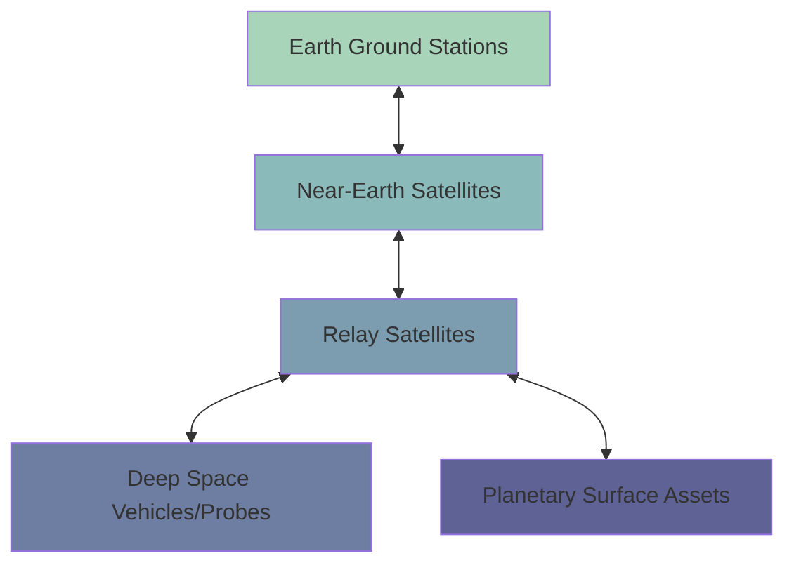
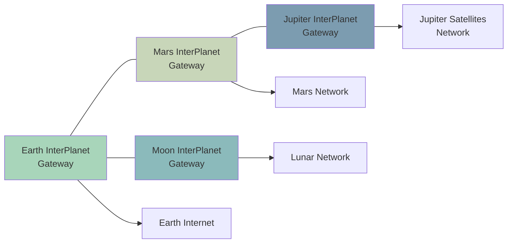
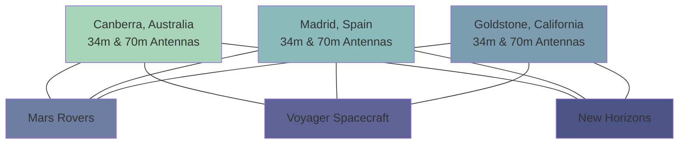

# Space Networks

## Introduction

Space networks represent one of the most fascinating frontiers in networking technology. Unlike traditional terrestrial networks that operate within Earth's atmosphere, space networks connect satellites, space stations, planetary rovers, and other spacecraft across the vastness of space. These networks face unique challenges including extreme distances, significant communication delays, harsh radiation environments, and limited power resources.

In this guide, we'll explore the fundamentals of space networks, their key technologies, and how they're revolutionizing both space exploration and Earth-based communications.

## Key Concepts in Space Networks

### Delay Tolerant Networking (DTN)

Traditional networking protocols like TCP/IP assume relatively stable connections with minimal delays. In space, signals can take minutes or even hours to travel between nodes, making these protocols impractical.

**Delay Tolerant Networking (DTN)** was developed specifically to handle these challenges:

- **Store-and-Forward Mechanism**: Data is stored at intermediate nodes until a connection becomes available
- **Bundle Protocol**: Data is packaged into "bundles" that include metadata for routing across disrupted networks
- **Custody Transfer**: Nodes can take "custody" of data, ensuring reliable delivery even with intermittent connections

Let's look at a simple example of how the Bundle Protocol works:

```python
# Simplified example of Bundle Protocol functionality
class Bundle:
    def __init__(self, source, destination, data, lifetime=3600):
        self.source = source  # Source node
        self.destination = destination  # Destination node
        self.data = data  # Payload
        self.creation_time = time.time()
        self.lifetime = lifetime  # Time in seconds before bundle expires
        self.custodian = source  # Current custodian of the bundle
        
    def transfer_custody(self, new_custodian):
        self.custodian = new_custodian
        print(f"Custody transferred to {new_custodian}")
        
    def is_expired(self):
        return (time.time() - self.creation_time) > self.lifetime

# Example usage:
mars_data = Bundle("Mars_Rover", "Earth_Station", rover_telemetry, lifetime=86400)
# When the bundle reaches a relay satellite
mars_data.transfer_custody("Relay_Satellite_1")
```

**Input:** Rover telemetry data from Mars  
**Output:** "Custody transferred to Relay_Satellite_1"

### Space Network Architecture

Space networks typically organize into several different layers:



1. **Ground Segment**: Earth-based stations and control centers
2. **Near-Earth Segment**: Satellites in Low Earth Orbit (LEO) and Geostationary Orbit (GEO)
3. **Relay Segment**: Satellites designed to forward communications between Earth and deep space
4. **Deep Space Segment**: Distant spacecraft, orbiters, and interplanetary probes
5. **Surface Segment**: Rovers, landers, and other assets on planetary surfaces

### Frequency Bands in Space Communications

Space networks operate across different frequency bands, each with specific advantages:

| Band | Frequency Range | Advantages | Disadvantages |
|------|----------------|------------|---------------|
| S-Band | 2-4 GHz | Moderate data rates, less affected by atmospheric attenuation | Limited bandwidth |
| X-Band | 8-12 GHz | Higher data rates, common for deep space | More susceptible to rain attenuation |
| Ka-Band | 26-40 GHz | Very high data rates | Highly affected by weather conditions |
| Optical | ~100+ THz | Extremely high bandwidth | Requires precise pointing, blocked by clouds |

### Optical Communications

While radio frequencies have been the mainstay of space communications, **optical communications** using lasers are emerging as a game-changing technology:

```python
# Example calculation of data rate advantage of optical vs radio
def calculate_data_rate_comparison(distance_km, optical_power_w, radio_power_w):
    """Compare theoretical data rates for optical vs radio communications"""
    # Constants (simplified)
    c = 299792458  # Speed of light (m/s)
    optical_wavelength = 1064e-9  # 1064 nm laser (m)
    radio_wavelength = 0.01  # X-band ~3cm (m)
    
    # Beam divergence is proportional to wavelength/aperture_diameter
    # Assuming same aperture size, divergence ratio is:
    divergence_ratio = radio_wavelength / optical_wavelength
    
    # At the given distance, beam spot size ratio will be:
    spot_size_ratio = divergence_ratio ** 2
    
    # For same transmit power, received power is inversely proportional to spot size
    # Data rate is roughly proportional to received power
    data_rate_ratio = spot_size_ratio
    
    print(f"At {distance_km} km:")
    print(f"Optical communication theoretical advantage: {data_rate_ratio:.2e}x higher data rate")
    
    return data_rate_ratio

# Example: Mars at closest approach (~56 million km)
calculate_data_rate_comparison(56000000, 5, 5)
```

**Output:**
```
At 56000000 km:
Optical communication theoretical advantage: 7.93e+10x higher data rate
```

This massive theoretical advantage is why NASA's Deep Space Optical Communications (DSOC) and similar projects are being developed to revolutionize space data transmission.

## Practical Applications of Space Networks

### 1. InterPlanetary Internet (IPN)

The InterPlanetary Internet is an evolving network architecture designed to support communications across the solar system:



Key characteristics include:
- **Delay/Disruption Tolerance**: Handles light-time delays and planetary rotations
- **Automated Network Management**: Self-healing and autonomous adaptation to changing conditions
- **Security**: Protection against both natural phenomena and potential security threats

### 2. Satellite Constellations

Large satellite constellations in Low Earth Orbit (LEO) are creating new types of space networks:

```python
# Simple simulation of satellite coverage
import math

def calculate_coverage(num_satellites, orbital_altitude_km, min_elevation_deg=25):
    """Calculate approximate coverage of a satellite constellation"""
    earth_radius = 6371  # km
    
    # Calculate coverage area per satellite
    max_distance = earth_radius * math.sin(
        math.acos(earth_radius / (earth_radius + orbital_altitude_km)) - 
        math.radians(min_elevation_deg)
    )
    
    coverage_area = math.pi * max_distance**2
    earth_surface = 4 * math.pi * earth_radius**2
    
    # Calculate total coverage (capped at 100%)
    total_coverage_percent = min(100, (coverage_area * num_satellites / earth_surface) * 100)
    
    return total_coverage_percent

# Example: SpaceX Starlink (first phase)
starlink_coverage = calculate_coverage(1584, 550)
print(f"Starlink Phase 1 approximate coverage: {starlink_coverage:.2f}%")

# Example: OneWeb initial constellation
oneweb_coverage = calculate_coverage(648, 1200)
print(f"OneWeb initial constellation approximate coverage: {oneweb_coverage:.2f}%")
```

**Output:**
```
Starlink Phase 1 approximate coverage: 99.95%
OneWeb initial constellation approximate coverage: 79.28%
```

These constellations provide benefits like:
- Global coverage including remote and ocean areas
- Lower latency than traditional geostationary satellites
- Higher bandwidth for Internet services
- Resilience through distributed network design

### 3. Deep Space Network (DSN)

NASA's Deep Space Network is the backbone of space communications for scientific missions:



The DSN operates by:
- Maintaining three facilities spaced approximately 120° apart around Earth
- Ensuring continuous coverage as Earth rotates
- Supporting multiple missions simultaneously through scheduling
- Handling extremely weak signals from billions of kilometers away

## Building Your Own Space Network Simulation

Let's create a simple Python simulation to understand the fundamental challenges of space networking:

```python
import math
import time

class SpaceNode:
    def __init__(self, name, position_km):
        self.name = name
        self.position_km = position_km  # (x, y, z) in km
        self.message_queue = []
        self.received_messages = []
        
    def send_message(self, destination, message, current_time):
        """Queue a message to be sent"""
        self.message_queue.append({
            'destination': destination,
            'message': message,
            'sent_time': current_time,
            'size_mb': len(message) / 1000000  # Simulated size in MB
        })
        print(f"T+{current_time}s: {self.name} queued message to {destination.name}")
        
    def process_communications(self, current_time, speed_of_light=299792.458):
        """Process outgoing messages based on distance and bandwidth"""
        for msg in list(self.message_queue):
            # Calculate distance
            dx = self.position_km[0] - msg['destination'].position_km[0]
            dy = self.position_km[1] - msg['destination'].position_km[1]
            dz = self.position_km[2] - msg['destination'].position_km[2]
            distance = math.sqrt(dx**2 + dy**2 + dz**2)
            
            # Calculate delay (in seconds)
            delay = distance / speed_of_light
            
            # Check if message has arrived
            if current_time >= msg['sent_time'] + delay:
                # Message arrived at destination
                arrival = {
                    'from': self.name,
                    'message': msg['message'],
                    'sent_time': msg['sent_time'],
                    'received_time': current_time,
                    'delay': delay
                }
                msg['destination'].received_messages.append(arrival)
                self.message_queue.remove(msg)
                print(f"T+{current_time}s: Message from {self.name} arrived at {msg['destination'].name} after {delay:.2f}s delay")

# Create simulation nodes
earth = SpaceNode("Earth_Station", (0, 0, 0))
moon = SpaceNode("Lunar_Relay", (384400, 0, 0))
mars = SpaceNode("Mars_Rover", (225000000, 0, 0))

# Simulation time steps
for t in range(0, 1501, 300):  # 0 to 1500 seconds in 5-minute increments
    # Actions at specific times
    if t == 0:
        earth.send_message(moon, "Hello, Lunar Relay!", t)
    elif t == 300:
        earth.send_message(mars, "Hello, Mars Rover!", t)
    elif t == 600:
        moon.send_message(earth, "Lunar data transmission", t)
    
    # Process communications for all nodes
    earth.process_communications(t)
    moon.process_communications(t)
    mars.process_communications(t)
```

**Output:**
```
T+0s: Earth_Station queued message to Lunar_Relay
T+300s: Earth_Station queued message to Mars_Rover
T+300s: Message from Earth_Station arrived at Lunar_Relay after 1.28s delay
T+600s: Lunar_Relay queued message to Earth_Station
T+600s: Message from Lunar_Relay arrived at Earth_Station after 1.28s delay
T+1500s: Message from Earth_Station arrived at Mars_Rover after 750.52s delay
```

This simulation illustrates the fundamental challenge of space networks: **light-time delay**. While communications with the Moon experience only about 1.3 seconds of delay (one-way), Mars communications can experience 3-22 minutes depending on planetary positions!

## Challenges and Solutions in Space Networks

### 1. Energy Constraints

Space assets operate with limited power resources:

| Challenge | Solution Approaches |
|-----------|---------------------|
| Limited solar power | - Adaptive data rates<br />- Scheduled transmission windows<br />- Energy-efficient encoding |
| Battery limitations | - Asymmetric communications (more download than upload)<br />- Sleep modes for non-critical periods |

### 2. Radiation and Hardware Reliability

Space is filled with radiation that affects electronics:

```python
# Simplified example of radiation-hardened error correction
def encode_with_redundancy(data, redundancy_factor=3):
    """Encode data with simple repetition code for radiation tolerance"""
    encoded = []
    for bit in data:
        # Repeat each bit multiple times
        encoded.extend([bit] * redundancy_factor)
    return encoded

def decode_with_error_correction(encoded_data, redundancy_factor=3):
    """Decode data with majority voting for each bit group"""
    decoded = []
    for i in range(0, len(encoded_data), redundancy_factor):
        # Get the group of redundant bits
        group = encoded_data[i:i+redundancy_factor]
        # Majority vote
        ones = sum(group)
        zeros = len(group) - ones
        # Add the majority bit to decoded data
        decoded.append(1 if ones > zeros else 0)
    return decoded

# Example
original = [1, 0, 1, 1, 0]
print(f"Original data: {original}")

encoded = encode_with_redundancy(original)
print(f"Encoded data: {encoded}")

# Simulate radiation bit flips (corruption)
encoded[1] = 1  # Flip a bit
encoded[7] = 0  # Flip another bit
print(f"Corrupted data: {encoded}")

decoded = decode_with_error_correction(encoded)
print(f"Decoded data: {decoded}")
print(f"Successful recovery: {original == decoded}")
```

**Output:**
```
Original data: [1, 0, 1, 1, 0]
Encoded data: [1, 1, 1, 0, 0, 0, 1, 1, 1, 1, 1, 1, 0, 0, 0]
Corrupted data: [1, 1, 1, 0, 0, 0, 1, 0, 1, 1, 1, 1, 0, 0, 0]
Decoded data: [1, 0, 1, 1, 0]
Successful recovery: True
```

This demonstrates how redundancy and error correction are essential in space communications where radiation can flip bits in memory or during transmission.

### 3. Protocol Adaptations

Space networks require specialized protocol modifications:

| Challenge | Protocol Adaptation |
|-----------|---------------------|
| Long delays | LTP (Licklider Transmission Protocol) - designed for high latency |
| Disrupted links | Bundle Protocol (BP) - "postal-style" delivery with custody transfer |
| Intermittent connectivity | Contact Graph Routing - pre-planned routing based on known contact opportunities |

## Future Directions in Space Networks

### Quantum Communications in Space

China's Micius satellite has demonstrated quantum key distribution (QKD) from space, potentially enabling:
- Theoretically unhackable encryption keys
- Global quantum networks with satellites as trusted nodes
- Future quantum internet spanning Earth and nearby space

### Autonomous Networking

Future space networks will feature increasing autonomy:
- Self-configuring network topologies
- Cognitive radio systems that adapt to interference
- Automated prioritization of science data vs. telemetry

### Interstellar Communications

Looking even further ahead, researchers are exploring concepts for potential interstellar communications:
- Extremely high-gain optical systems
- Data compression optimized for one-way, high-latency links
- Potential use of gravitational lensing as a "cosmic magnifier"

## Summary

Space networks represent a fascinating extension of networking principles into the most challenging environment imaginable. By adapting and extending terrestrial networking concepts to handle extreme distances, radiation, and resource constraints, space networks enable everything from satellite internet constellations to communications with distant spacecraft.

Key takeaways include:
- Space networks must handle delays of seconds, minutes, or even hours
- Specialized protocols like DTN and Bundle Protocol address unique space challenges
- Optical communications promise dramatic increases in data rates
- Space radiation requires specialized hardware and error correction
- Future developments may include quantum communications and increased autonomy

As we extend human and robotic presence throughout the solar system, space networks will become increasingly important infrastructure, connecting Earth with our growing interplanetary presence.

## Exercises and Projects

1. **Simulation Exercise**: Extend the Python space network simulation to include bandwidth limitations and packet loss.

2. **Research Project**: Investigate how the James Webb Space Telescope communicates its massive data sets back to Earth.

3. **Programming Challenge**: Implement a simple version of the Bundle Protocol for store-and-forward messaging.

4. **Design Exercise**: Design a communication architecture for a lunar base that needs to communicate with Earth, lunar satellites, and rovers.

5. **Math Problem**: Calculate the maximum theoretical data rate for an optical link from Mars using a 10W laser transmitter and 30cm apertures.

## Additional Resources

- NASA's Delay/Disruption Tolerant Networking documentation
- CCSDS (Consultative Committee for Space Data Systems) standards
- "Interplanetary Internet Development" papers by Vint Cerf et al.
- ESA's "Space Network Infrastructure" documentation
- "Fundamentals of Space Communications" courses from various universities