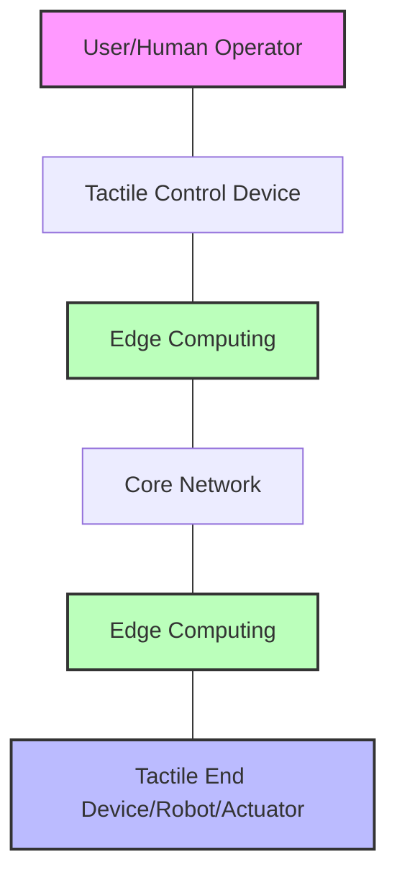

# Networks: Tactile Internet

## Introduction

The Tactile Internet represents one of the most exciting frontiers in networking technology. While previous internet generations focused on connecting people (through text, voice, and video) and things (through the Internet of Things), the Tactile Internet aims to enable real-time physical interactions over networks with extremely low latency.

Defined by the International Telecommunication Union (ITU), the Tactile Internet is a network that combines ultra-low latency with extremely high availability, reliability, and security. It enables real-time control and physical tactile experiences remotely, essentially allowing humans and machines to interact with their environment over distances as if they were physically present.

## Core Characteristics

The Tactile Internet is characterized by four fundamental requirements:

1. **Ultra-low latency**: Typically 1-10 milliseconds end-to-end
2. **High reliability**: 99.999% availability or higher
3. **Security**: Strong encryption and authentication mechanisms
4. **Carrier-grade network quality**: Consistent performance under varying conditions

Let's explore these requirements and why they're critical for Tactile Internet applications.

## Architecture of the Tactile Internet

The Tactile Internet follows a specific architecture designed to minimize latency while maximizing reliability. Here's a simplified view of its architecture:



### Key Components:

1. **Master Domain** - Where control inputs originate (human operator)
2. **Network Domain** - The communication infrastructure
3. **Controlled Domain** - Where actions are executed (robots, actuators)
4. **Edge Computing Nodes** - Local processing to reduce round-trip times

## Technical Implementation

Let's look at some key technical aspects of implementing Tactile Internet applications.

### Round-Trip Latency Requirements

For the Tactile Internet to work effectively, the entire round-trip time must be extremely low. Here's a breakdown of the latency budget:

```javascript
// Example latency budget calculation
const sensorLatency = 1; // ms
const encodingLatency = 0.5; // ms
const networkLatency = 5; // ms
const decodingLatency = 0.5; // ms
const processingLatency = 2; // ms
const actuationLatency = 1; // ms

const totalRoundTripLatency = sensorLatency + encodingLatency + networkLatency + 
                              decodingLatency + processingLatency + actuationLatency;

console.log(`Total round-trip latency: ${totalRoundTripLatency} ms`);
// Output: Total round-trip latency: 10 ms
```

This example shows how quickly the entire process must occur for realistic tactile feedback.

### Leveraging Edge Computing

Edge computing is critical for Tactile Internet applications. By processing data closer to the end devices, we can significantly reduce latency.

```javascript
// Pseudocode for Tactile Internet edge processing
function processHapticFeedback(sensorData) {
  // Process locally at the edge instead of sending to cloud
  if (isEmergencySituation(sensorData)) {
    // Handle locally with pre-programmed safety responses
    return getEmergencyResponse(sensorData);
  }
  
  // Only send non-critical data to the cloud
  if (requiresCloudProcessing(sensorData)) {
    // Parallel processing: start local computation and send to cloud
    const localResult = startLocalProcessing(sensorData);
    const cloudRequest = sendToCloud(sensorData);
    
    // Use local result first, update with cloud result when available
    return {
      immediateResponse: localResult,
      followUpAction: waitForCloudResponse(cloudRequest)
    };
  }
  
  return processLocally(sensorData);
}
```

### Coding for Ultra-Low Latency

When developing applications for the Tactile Internet, specialized coding techniques are required:

```javascript
// Example: Event-based programming for low-latency haptic feedback
class TactileController {
  constructor() {
    this.lastPosition = { x: 0, y: 0, z: 0 };
    this.feedbackBuffer = [];
    this.latencyThreshold = 5; // ms
  }
  
  // Process incoming sensor data
  processSensorInput(newPosition) {
    // Calculate position delta
    const delta = {
      x: newPosition.x - this.lastPosition.x,
      y: newPosition.y - this.lastPosition.y,
      z: newPosition.z - this.lastPosition.z
    };
    
    // Generate haptic feedback based on movement
    const feedback = this.calculateHapticFeedback(delta);
    
    // Store timestamp with feedback
    this.feedbackBuffer.push({
      feedback,
      timestamp: performance.now()
    });
    
    // Update last position
    this.lastPosition = newPosition;
    
    // Return immediately to ensure low latency
    return feedback;
  }
  
  // Example method to calculate appropriate haptic response
  calculateHapticFeedback(delta) {
    // Simplified example: resistance increases with speed
    const movementMagnitude = Math.sqrt(
      delta.x * delta.x + 
      delta.y * delta.y + 
      delta.z * delta.z
    );
    
    return {
      force: movementMagnitude * 0.8, // Calculate proportional force
      direction: {
        x: delta.x > 0 ? -1 : 1,
        y: delta.y > 0 ? -1 : 1,
        z: delta.z > 0 ? -1 : 1
      },
      vibration: movementMagnitude > 10 ? "strong" : "light"
    };
  }
  
  // Check if we're meeting latency requirements
  checkLatencyPerformance() {
    if (this.feedbackBuffer.length < 2) return true;
    
    const latest = this.feedbackBuffer[this.feedbackBuffer.length - 1];
    const previous = this.feedbackBuffer[this.feedbackBuffer.length - 2];
    const processingTime = latest.timestamp - previous.timestamp;
    
    return processingTime <= this.latencyThreshold;
  }
}

// Usage example:
const controller = new TactileController();
const feedback = controller.processSensorInput({ x: 10, y: 5, z: 0 });
console.log(feedback);
/* Example output:
{
  force: 11.18, 
  direction: { x: -1, y: -1, z: 1 },
  vibration: "strong"
}
*/
```

This code demonstrates how to create responsive haptic feedback while maintaining the strict latency requirements of the Tactile Internet.

## Protocol Considerations for the Tactile Internet

Traditional internet protocols like TCP aren't suitable for Tactile Internet applications due to their retransmission mechanisms that introduce delays. Instead, specialized protocols are being developed:

```javascript
// Example implementation of a simplified Tactile protocol
class TactileProtocol {
  constructor() {
    this.sequenceNumber = 0;
    this.priorityLevels = {
      CRITICAL: 0,  // Highest priority (safety-related)
      CONTROL: 1,   // Control commands
      HAPTIC: 2,    // Haptic feedback
      TELEMETRY: 3  // Background data
    };
  }
  
  createPacket(data, priority) {
    // Keep packets small for lower transmission time
    return {
      seq: this.sequenceNumber++,
      priority: priority,
      timestamp: performance.now(),
      payload: data,
      // No retransmission for old data - better to send new data
      validityPeriod: 50 // ms
    };
  }
  
  // Prioritize critical messages
  transmitQueue(packetQueue, availableBandwidth) {
    // Sort by priority first, then by sequence number
    packetQueue.sort((a, b) => {
      if (a.priority !== b.priority) {
        return a.priority - b.priority;
      }
      return a.seq - b.seq;
    });
    
    let transmittedBytes = 0;
    const transmittedPackets = [];
    const currentTime = performance.now();
    
    for (const packet of packetQueue) {
      // Skip expired packets
      if (currentTime - packet.timestamp > packet.validityPeriod) {
        continue;
      }
      
      const packetSize = JSON.stringify(packet).length;
      
      if (transmittedBytes + packetSize <= availableBandwidth) {
        transmittedPackets.push(packet);
        transmittedBytes += packetSize;
      } else {
        // Not enough bandwidth for this packet
        break;
      }
    }
    
    return transmittedPackets;
  }
}

// Usage example
const protocol = new TactileProtocol();

// Create packets with different priorities
const criticalPacket = protocol.createPacket(
  { command: "EMERGENCY_STOP" }, 
  protocol.priorityLevels.CRITICAL
);

const hapticPacket = protocol.createPacket(
  { force: 0.8, direction: "left" }, 
  protocol.priorityLevels.HAPTIC
);

const telemetryPacket = protocol.createPacket(
  { temperature: 36.5, battery: 72 }, 
  protocol.priorityLevels.TELEMETRY
);

// Simulate transmission with limited bandwidth
const queue = [telemetryPacket, hapticPacket, criticalPacket];
const transmitted = protocol.transmitQueue(queue, 1000);

console.log("Transmission order:");
transmitted.forEach(p => console.log(`Priority: ${p.priority}, Command: ${JSON.stringify(p.payload)}`));

/* Example output:
Transmission order:
Priority: 0, Command: {"command":"EMERGENCY_STOP"}
Priority: 2, Command: {"force":0.8,"direction":"left"}
Priority: 3, Command: {"temperature":36.5,"battery":72}
*/
```

## Real-World Applications

The Tactile Internet enables numerous revolutionary applications across various domains:

### Healthcare: Remote Surgery

Surgeons can perform operations on patients located elsewhere, with robotics systems providing precise haptic feedback as if they were physically present.

```javascript
// Pseudocode for a remote surgery system
class RemoteSurgerySystem {
  constructor() {
    this.roboticArm = new RoboticArm();
    this.hapticGlove = new HapticGlove();
    this.connectionManager = new LowLatencyConnection({
      maxLatency: 2, // ms
      reliability: 99.9999 // %
    });
  }
  
  initialize() {
    // Set up failsafe mechanisms
    this.roboticArm.setFailsafe("RETRACT_TO_SAFE_POSITION");
    
    // Initialize connection
    this.connectionManager.onConnectionLost(() => {
      this.roboticArm.activateFailsafe();
      this.hapticGlove.provideWarning("CONNECTION_LOST");
    });
    
    // Set up haptic feedback loop
    this.roboticArm.onContactDetected((force, position) => {
      // Send force feedback to surgeon's haptic glove
      this.hapticGlove.provideFeedback(force, position);
    });
    
    // Set up control input 
    this.hapticGlove.onMovement((movement) => {
      // Send movement commands to robotic arm
      this.roboticArm.move(movement);
    });
  }
  
  startProcedure() {
    console.log("Remote surgery system initialized and ready");
    this.connectionManager.establishConnection();
    return this.connectionManager.getConnectionStatus();
  }
}

// Example usage
const surgerySystem = new RemoteSurgerySystem();
const status = surgerySystem.startProcedure();
console.log(`Surgery system status: ${status}`);
// Output: Surgery system status: Connected (Latency: 1.8ms)
```

### Industrial Automation

The Tactile Internet enables remote control of industrial robots with real-time feedback.

```javascript
// Industrial robot control with tactile feedback
class IndustrialRobotController {
  constructor() {
    this.operatingMode = "MANUAL"; // or "AUTONOMOUS"
    this.currentTool = "GRIPPER";
    this.telemetryInterval = 5; // ms
  }
  
  setTorqueFeedback(joint, value) {
    console.log(`Joint ${joint} experiencing ${value}N of resistance`);
    
    // If unexpected resistance is detected
    if (value > this.safetyThresholds[joint]) {
      this.emergencyStop(`Excessive torque detected on joint ${joint}`);
      return false;
    }
    
    return true;
  }
  
  processTactileInput(sensorData) {
    // Extract key metrics from sensor data
    const { pressure, temperature, vibration } = sensorData;
    
    // Example condition: Detect if robot is handling fragile object
    if (pressure > 5 && this.currentTool === "GRIPPER") {
      // Adjust grip strength to prevent damage
      this.adjustGripStrength(pressure);
      return {
        status: "ADJUSTED",
        action: "Reduced grip strength to prevent damage"
      };
    }
    
    // Example condition: Detect abnormal vibration indicating machine fault
    if (vibration > 10) {
      return {
        status: "WARNING",
        action: "Excessive vibration detected, maintenance recommended"
      };
    }
    
    return { status: "NORMAL" };
  }
  
  adjustGripStrength(pressure) {
    const newStrength = 20 - pressure * 2; // Example algorithm
    console.log(`Adjusting grip strength to ${newStrength}%`);
    // Actual implementation would send command to the robot
  }
  
  emergencyStop(reason) {
    this.operatingMode = "EMERGENCY";
    console.log(`EMERGENCY STOP: ${reason}`);
    // Additional safety protocols would be implemented here
  }
}

// Example usage:
const robotController = new IndustrialRobotController();
robotController.safetyThresholds = { arm1: 50, arm2: 45, wrist: 30 };

// Simulate tactile feedback
const feedback = robotController.processTactileInput({
  pressure: 8,
  temperature: 35,
  vibration: 3
});

console.log(feedback);
// Output: { status: 'ADJUSTED', action: 'Reduced grip strength to prevent damage' }
```

### Virtual and Augmented Reality

The Tactile Internet dramatically enhances VR/AR experiences by adding realistic haptic feedback.

```javascript
// Example VR haptic feedback system
class VRHapticSystem {
  constructor() {
    this.hapticDevices = {
      gloves: { connected: true, batteryLevel: 95 },
      vest: { connected: true, batteryLevel: 87 },
      headset: { connected: true, batteryLevel: 92 }
    };
    
    // Different feedback patterns
    this.feedbackPatterns = {
      rain: { intensity: 0.3, pattern: "random", area: "full_body" },
      impact: { intensity: 0.9, pattern: "pulse", area: "targeted" },
      texture: { intensity: 0.5, pattern: "continuous", area: "hands" }
    };
  }
  
  provideFeedback(type, location) {
    const pattern = this.feedbackPatterns[type];
    
    if (!pattern) {
      console.error(`Unknown feedback type: ${type}`);
      return false;
    }
    
    console.log(`Providing ${type} feedback at ${location} with intensity ${pattern.intensity}`);
    
    // Simulate haptic rendering
    return this.renderHapticEffect(pattern, location);
  }
  
  renderHapticEffect(pattern, location) {
    // In a real implementation, this would send signals to haptic devices
    
    // Simulate processing time (should be < 1ms in production)
    const processingTime = Math.random() * 0.8;
    
    return {
      success: true,
      latency: processingTime,
      pattern: pattern,
      location: location,
      timestamp: performance.now()
    };
  }
  
  // Check if we're maintaining low enough latency
  checkPerformance(feedbackHistory) {
    const latencies = feedbackHistory.map(f => f.latency);
    const avgLatency = latencies.reduce((sum, l) => sum + l, 0) / latencies.length;
    
    return {
      averageLatency: avgLatency,
      maxLatency: Math.max(...latencies),
      performanceRating: avgLatency < 2 ? "Excellent" : avgLatency < 5 ? "Acceptable" : "Poor"
    };
  }
}

// Example usage:
const hapticSystem = new VRHapticSystem();

// Simulate user touching different virtual objects
const feedback1 = hapticSystem.provideFeedback("texture", "right_hand_fingertips");
const feedback2 = hapticSystem.provideFeedback("impact", "chest");

// Check performance
const performanceMetrics = hapticSystem.checkPerformance([feedback1, feedback2]);
console.log(performanceMetrics);
/* Example output:
{
  averageLatency: 0.42,
  maxLatency: 0.75,
  performanceRating: "Excellent"
}
*/
```

### Other Applications

- **Autonomous driving**: Vehicle-to-vehicle communication with ultra-low latency
- **Gaming**: Immersive gaming experiences with realistic haptic feedback
- **Education**: Remote laboratory experiments with tactile feedback
- **Smart grid control**: Real-time control of power distribution systems

## Implementation Challenges

Building Tactile Internet applications comes with significant challenges:

### Dealing with Network Variability

```javascript
// Example: Adaptive controller that adjusts to network conditions
class AdaptiveTactileController {
  constructor() {
    this.currentLatency = 0;
    this.predictiveModel = new PredictiveModel();
    this.adaptationThresholds = {
      excellent: 5,  // ms
      good: 10,      // ms
      marginal: 20,  // ms
      poor: 50       // ms
    };
  }
  
  updateNetworkConditions(latency, jitter, packetLoss) {
    this.currentLatency = latency;
    this.currentJitter = jitter;
    this.currentPacketLoss = packetLoss;
    
    // Determine current network quality
    const networkQuality = this.determineNetworkQuality();
    
    // Adapt to current conditions
    this.adaptToNetworkConditions(networkQuality);
    
    return networkQuality;
  }
  
  determineNetworkQuality() {
    if (this.currentLatency <= this.adaptationThresholds.excellent && 
        this.currentJitter < 2 && 
        this.currentPacketLoss < 0.01) {
      return "EXCELLENT";
    } else if (this.currentLatency <= this.adaptationThresholds.good && 
              this.currentJitter < 5 && 
              this.currentPacketLoss < 0.1) {
      return "GOOD";
    } else if (this.currentLatency <= this.adaptationThresholds.marginal && 
              this.currentJitter < 10 && 
              this.currentPacketLoss < 1) {
      return "MARGINAL";
    } else {
      return "POOR";
    }
  }
  
  adaptToNetworkConditions(quality) {
    switch (quality) {
      case "EXCELLENT":
        // Full fidelity mode
        this.setHapticResolution("HIGH");
        this.setPredictionMode("MINIMAL");
        break;
        
      case "GOOD":
        // Slightly reduced fidelity
        this.setHapticResolution("MEDIUM");
        this.setPredictionMode("LOW");
        break;
        
      case "MARGINAL":
        // Engage prediction to compensate for latency
        this.setHapticResolution("MEDIUM");
        this.setPredictionMode("AGGRESSIVE");
        break;
        
      case "POOR":
        // Maximum prediction, reduced haptic detail
        this.setHapticResolution("LOW");
        this.setPredictionMode("MAXIMUM");
        // Consider switching to safety mode for critical applications
        if (this.isApplication("CRITICAL")) {
          this.engageSafetyMode();
        }
        break;
    }
  }
  
  setHapticResolution(level) {
    console.log(`Setting haptic resolution to ${level}`);
    // Implementation would configure haptic hardware
  }
  
  setPredictionMode(level) {
    console.log(`Setting prediction mode to ${level}`);
    this.predictiveModel.setAggressiveness(level);
  }
  
  engageSafetyMode() {
    console.log("ENGAGING SAFETY MODE - Network conditions below minimum requirements");
    // Implementation would engage application-specific safety protocols
  }
}

// Example usage
const controller = new AdaptiveTactileController();
const quality = controller.updateNetworkConditions(12, 3, 0.05);
console.log(`Network quality: ${quality}`);
// Output: Network quality: GOOD
```

### Security Considerations

Security is paramount in Tactile Internet applications, especially for critical use cases:

```javascript
// Example security implementation for Tactile Internet
class TactileSecurityManager {
  constructor() {
    this.encryptionEnabled = true;
    this.authenticationMethod = "CERTIFICATE";
    this.anomalyDetection = true;
  }
  
  secureChannel(channelId, priority) {
    console.log(`Securing channel ${channelId} with priority ${priority}`);
    
    // Higher encryption for critical channels, lower for non-critical
    // to balance security with latency requirements
    const encryptionLevel = priority === "CRITICAL" ? "AES-256" : "AES-128";
    
    return {
      channelId,
      encryptionLevel,
      authenticated: true,
      securityOverhead: this.calculateOverhead(encryptionLevel)
    };
  }
  
  calculateOverhead(encryptionLevel) {
    // Simplified calculation of latency overhead due to security measures
    switch (encryptionLevel) {
      case "AES-256":
        return 0.5; // ms
      case "AES-128":
        return 0.2; // ms
      default:
        return 0;
    }
  }
  
  detectAnomalies(commandSequence) {
    // Simplified anomaly detection
    const isAnomalous = commandSequence.some(cmd => {
      // Check for unusual patterns or potentially harmful commands
      return cmd.velocity > this.velocityThreshold || 
             cmd.force > this.forceThreshold;
    });
    
    if (isAnomalous) {
      this.logSecurityEvent("Anomalous command sequence detected");
      return true;
    }
    
    return false;
  }
  
  logSecurityEvent(message) {
    console.log(`SECURITY EVENT: ${message} at ${new Date().toISOString()}`);
    // In a real implementation, this would log to a secure audit system
  }
}

// Example usage
const securityManager = new TactileSecurityManager();
securityManager.velocityThreshold = 100;
securityManager.forceThreshold = 50;

const securedChannel = securityManager.secureChannel("surgery-control-1", "CRITICAL");
console.log(securedChannel);
/* Example output:
{
  channelId: 'surgery-control-1',
  encryptionLevel: 'AES-256',
  authenticated: true,
  securityOverhead: 0.5
}
*/

// Check for anomalous commands
const commandSequence = [
  { velocity: 10, force: 20 },
  { velocity: 15, force: 25 },
  { velocity: 120, force: 30 } // Anomalous high velocity
];

const anomalyDetected = securityManager.detectAnomalies(commandSequence);
console.log(`Anomaly detected: ${anomalyDetected}`);
// Output: Anomaly detected: true
```

## Future of the Tactile Internet

The Tactile Internet is still evolving, with ongoing research in several areas:

1. **Network infrastructure**: 5G and beyond mobile networks
2. **Haptic codecs**: Standardized ways to encode and transmit tactile information
3. **Edge computing**: More powerful and specialized edge computing platforms
4. **AI integration**: Using AI to predict movements and reduce perceived latency

## Summary

The Tactile Internet represents a paradigm shift in how we interact with remote environments. By enabling real-time haptic feedback and control with ultra-low latency, it opens up possibilities for applications that were previously impossible. From remote surgery to immersive virtual reality, industrial automation to autonomous vehicles, the Tactile Internet will transform numerous fields.

Key takeaways:
- Ultra-low latency (1-10ms) is the defining characteristic
- Edge computing is essential for meeting latency requirements
- New protocols and security approaches are needed
- Applications span healthcare, industrial, entertainment, and educational domains

## Additional Resources

For further exploration of the Tactile Internet:

1. Research papers:
   - "The Tactile Internet: Vision, Recent Progress, and Open Challenges" by M. Simsek et al.
   - "Towards the Tactile Internet: Decreasing Communication Latency with Network Coding and Software Defined Networking" by M. Maier et al.

2. Standards:
   - IEEE P1918.1 "Tactile Internet: Application Scenarios, Definitions and Terminology, Architecture, Functions, and Technical Assumptions"

## Exercises

1. Calculate the maximum distance between a master and controlled domain if the speed of light in fiber is approximately 200,000 km/s and the maximum allowed one-way network latency is 5ms.

2. Design a simple haptic protocol that prioritizes different types of tactile feedback based on their importance.

3. Research and compare different haptic devices currently available in the market. How might they be incorporated into Tactile Internet applications?

4. Implement a basic edge computing simulation that demonstrates how processing at the edge reduces latency compared to cloud processing.

5. Discuss the ethical implications of remote surgery via the Tactile Internet. What safeguards should be in place?