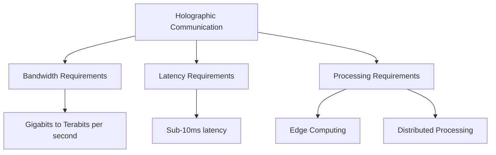
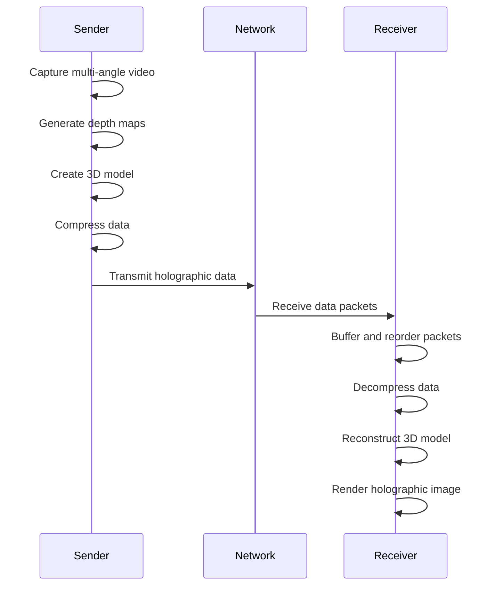

# Networks Holographic Communication

## Introduction

Holographic communication represents one of the most exciting frontiers in networking technology. Unlike traditional video conferencing which presents flat, two-dimensional images, holographic communication aims to create three-dimensional representations of people and objects that can be viewed from multiple angles, creating a more immersive and realistic telepresence experience.

This technology combines advanced networking capabilities with cutting-edge display systems, sophisticated image capture techniques, and powerful data processing to create the illusion that participants are physically present in the same room, despite being potentially thousands of miles apart.

## Understanding Holographic Technology

### What is a Hologram?

A hologram is a three-dimensional image formed by the interference pattern of laser light that has been reflected off an object and then combined with a reference beam. In networking contexts, we use the term more broadly to refer to any technology that creates the appearance of three-dimensional objects in space.

### Key Components of Holographic Communication

1. **Capture Technology**: Multiple cameras and depth sensors capture visual information from different angles
2. **Data Processing**: Powerful processors convert the captured data into 3D models in real-time
3. **Network Transmission**: High-bandwidth, low-latency connections transfer massive amounts of data
4. **Display Technology**: Specialized screens, projectors, or light field displays recreate the 3D image

## Network Requirements for Holographic Communication

Holographic communication places extreme demands on network infrastructure:



### Bandwidth Requirements

Realistic holographic communication requires significantly more bandwidth than standard video:

| Communication Type                | Typical Bandwidth Requirement |
|-----------------------------------|-------------------------------|
| Voice Call                        | 64 Kbps                       |
| HD Video Call                     | 1.5-4 Mbps                    |
| 4K Video Conference               | 15-25 Mbps                    |
| Basic Holographic Call            | 100-500 Mbps                  |
| High-Quality Holographic Presence | 1-5 Gbps                      |
| Full Volumetric Holography        | 5+ Gbps                       |

### Latency Requirements

For natural interaction, holographic communication systems must maintain extremely low latency:

- **Maximum Acceptable Latency**: `<100ms` end-to-end
- **Ideal Latency**: `<20ms` end-to-end
- **Processing Delay Budget**: `<5ms`

### Network Protocols for Holographic Data

Specialized protocols are being developed to handle the unique requirements of holographic data transmission:

```javascript
// Example of a simplified holographic data packet structure
const holographicPacket = {
  header: {
    packetType: "HOLOGRAPHIC_FRAME",
    timestamp: 1647287461089,
    sequenceNumber: 4231,
    priority: "HIGH",
    compressionMethod: "WAVELET_TRANSFORM"
  },
  payload: {
    pointCloudData: [...], // 3D coordinate and color information
    depthMap: [...],       // Depth information for each point
    textureData: [...],    // Surface texture information
    metaData: {
      viewAngle: 235,
      captureResolution: "8K",
      colorDepth: "10-bit"
    }
  }
}
```

## Data Compression Techniques

Given the enormous data requirements, advanced compression techniques are essential:

### Geometry-Based Compression

```python
# Pseudocode for a simple point cloud compression algorithm
def compress_point_cloud(points):
    # Quantize coordinates to reduce precision needs
    quantized_points = quantize_coordinates(points)
    
    # Cluster similar points
    clusters = spatial_clustering(quantized_points)
    
    # For each cluster, store centroid and offsets
    compressed_data = []
    for cluster in clusters:
        centroid = calculate_centroid(cluster)
        offsets = [point - centroid for point in cluster]
        compressed_data.append({
            "centroid": centroid,
            "offsets": encode_offsets(offsets)
        })
    
    return compressed_data
```

### Perception-Based Compression

Holographic systems can use knowledge about human perception to prioritize data:

- Areas in direct line of sight receive highest quality
- Peripheral areas can use lower resolution
- Motion prediction reduces need to transmit complete frames

## Real-World Implementation Examples

### Example 1: Basic Holographic Conferencing System

```javascript
// Simplified client-side code for holographic conference initialization
class HolographicConferenceClient {
  constructor(config) {
    this.captureDevices = [];
    this.networkConnection = null;
    this.displaySystem = null;
    this.dataProcessor = null;
    this.compressionLevel = config.compressionLevel || "high";
    this.maxBandwidth = config.maxBandwidth || 1000; // Mbps
  }
  
  async initialize() {
    // Initialize capture devices (cameras, depth sensors)
    this.captureDevices = await this.initializeCaptureDevices();
    
    // Set up network connection with QoS parameters
    this.networkConnection = await NetworkManager.createConnection({
      type: "holographic",
      minBandwidth: 100, // Mbps
      maxLatency: 50,    // ms
      priority: "critical"
    });
    
    // Initialize display system
    this.displaySystem = await DisplaySystem.initialize({
      type: config.displayType,
      resolution: config.resolution
    });
    
    // Set up data processing pipeline
    this.dataProcessor = new HolographicProcessor({
      inputStreams: this.captureDevices.map(device => device.stream),
      compressionLevel: this.compressionLevel,
      processingMode: "realtime"
    });
    
    console.log("Holographic conference system initialized");
    return true;
  }
  
  // Additional methods for starting/ending conference, etc.
}

// Usage
const conference = new HolographicConferenceClient({
  displayType: "lightField",
  resolution: "8K",
  compressionLevel: "adaptive"
});

conference.initialize()
  .then(() => console.log("Ready for holographic communication"))
  .catch(err => console.error("Initialization failed:", err));
```

### Processing Pipeline

The data flow in a holographic communication system follows these steps:

1. **Capture**: Multiple cameras and sensors record visual data
2. **Processing**: Raw data is converted to 3D models
3. **Compression**: Data is compressed for efficient transmission
4. **Transmission**: Data travels across the network
5. **Decompression**: Receiving end expands the data
6. **Rendering**: Display system creates visible hologram



## Current Challenges and Solutions

### Challenge 1: Bandwidth Limitations

**Solutions:**
- Advanced compression algorithms
- Edge computing to pre-process data
- Selective transmission based on viewer attention
- 5G and future 6G networks

### Challenge 2: Display Technology

**Solutions:**
- Light field displays
- Volumetric displays
- Specialized AR/VR headsets
- Projection-based systems

### Challenge 3: Processing Power

**Solutions:**
- Distributed processing across network
- Specialized holographic processing units (HPUs)
- GPU acceleration
- ASIC-based solutions

## Practical Applications

### Remote Collaboration

Holographic communication enables teams to collaborate as if they were in the same physical space:

- Engineers can jointly examine and manipulate 3D models
- Medical professionals can provide remote assistance during procedures
- Architects can walk clients through building designs

### Example Scenario: Remote Engineering Review

```javascript
// Example of a simplified holographic collaboration session
function initEngineeringReview() {
  // Create shared holographic space
  const sharedSpace = new HolographicSpace({
    participants: ["local", "remote1", "remote2"],
    objectPermissions: "multi-user-edit",
    persistenceLevel: "session"
  });
  
  // Load engineering model
  const engineModel = await HolographicModel.load("engine-v2.holo", {
    resolution: "high",
    interactable: true,
    sections: ["all"]
  });
  
  // Add model to shared space
  sharedSpace.addObject(engineModel, {
    position: [0, 0, 0],
    scale: 1.0,
    permissions: "all-participants"
  });
  
  // Enable pointing and annotation
  sharedSpace.enableFeature("spatialPointers");
  sharedSpace.enableFeature("3dAnnotation");
  
  return sharedSpace;
}
```

### Education and Training

Holographic systems provide immersive learning experiences:

- Medical students can observe procedures from any angle
- Technical training can include hands-on holographic equipment
- Historical or scientific concepts can be visualized in 3D

### Entertainment and Media

Beyond practical applications, holographic networks are transforming entertainment:

- Concerts with performers appearing as holograms in multiple locations
- Sports events viewed from any angle in your living room
- Interactive holographic gaming experiences

## Future Directions

The evolution of holographic communication will likely follow these trajectories:

1. **Integration with Haptic Feedback**: Adding touch sensation to holographic interactions
2. **AI-Enhanced Rendering**: Using AI to predict and generate missing visual information
3. **Quantum Networking**: Using quantum communication to transfer the massive amounts of data required
4. **Ubiquitous Deployment**: From specialized rooms to everyday devices

## Summary

Holographic communication represents a paradigm shift in how we connect across distances. While still emerging, this technology promises to transform remote collaboration, education, entertainment, and many other fields by creating truly immersive shared experiences.

The key technologies enabling holographic communication include:

- Advanced capture systems with depth sensing
- Extremely high-bandwidth, low-latency networks
- Sophisticated compression algorithms
- Powerful distributed processing systems
- Specialized display technologies

As network infrastructure continues to evolve with 5G, edge computing, and eventually 6G technologies, holographic communication will become increasingly practical and widespread.

## Exercises for Practice

1. **Bandwidth Calculation**: Calculate the bandwidth required for a holographic call with 3 participants, each represented by a point cloud of 2 million points, with 10-bit color depth, at 30 frames per second.

2. **Network Design**: Design a network architecture for a corporate building that would support 5 simultaneous holographic conference rooms.

3. **Compression Exploration**: Research and compare three different compression techniques for point cloud data. What are their trade-offs between visual quality and bandwidth requirements?

4. **Latency Budget**: Break down the end-to-end latency budget for a holographic call, allocating maximum allowed time for each step in the pipeline from capture to display.

## Additional Resources

- IEEE Special Interest Group on Holographic Communications
- IETF Working Groups on High-Performance Real-Time Networks
- ACM Digital Library: Collection on Volumetric and Holographic Displays
- "Network Requirements for Holographic Telepresence" research paper series
- Open-source holographic processing frameworks