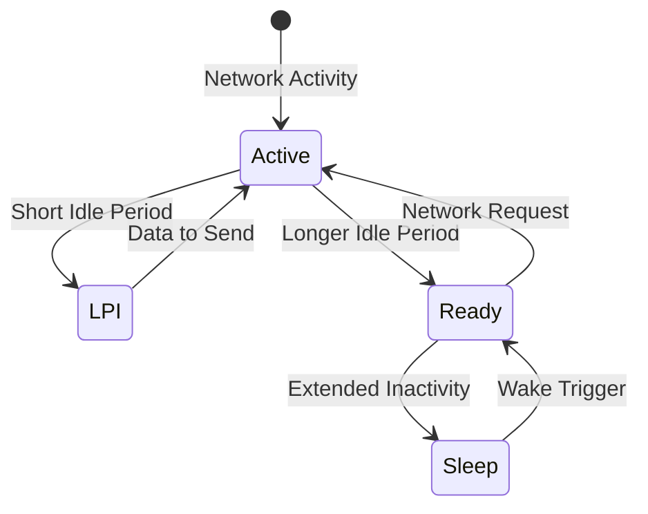
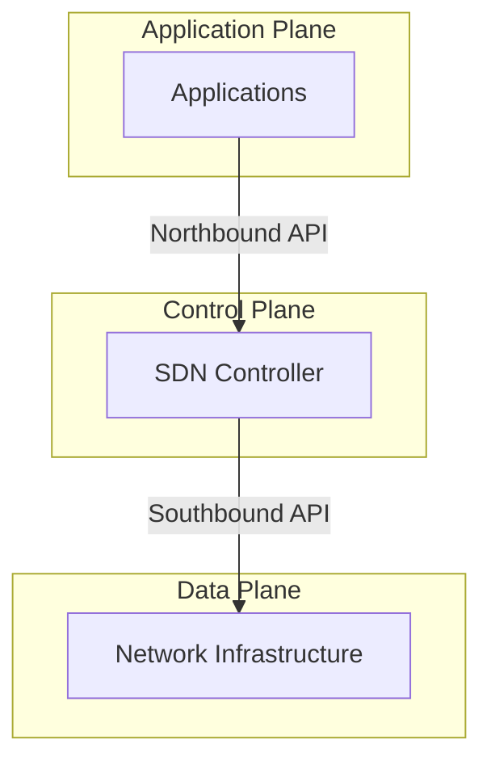

# Green Networking

## Introduction

Green Networking refers to the practice of selecting energy-efficient networking technologies and products, and minimizing resource use whenever possible. As our digital infrastructure continues to grow, so does its environmental impact. Data centers and network infrastructure currently consume approximately 3% of the world's electricity and produce 2% of global carbon emissions—comparable to the aviation industry.

This tutorial introduces you to the core concepts, technologies, and practices of Green Networking, helping you understand how to develop and maintain network systems that are both high-performing and environmentally sustainable.

## Why Green Networking Matters

### The Environmental Challenge

The exponential growth of internet usage, cloud computing, and connected devices has led to significant increases in:

- **Energy consumption** by network infrastructure
- **Electronic waste** from outdated equipment
- **Carbon emissions** from powering and cooling systems
- **Resource depletion** for manufacturing networking hardware

### Benefits of Green Networking

Implementing green networking strategies provides multiple benefits:

1. **Reduced environmental impact** through lower carbon emissions
2. **Cost savings** from decreased energy consumption
3. **Extended hardware lifecycles** reducing e-waste
4. **Improved brand image** through environmental responsibility
5. **Regulatory compliance** with emerging environmental legislation

## Core Green Networking Strategies

### 1. Energy-Efficient Hardware

Modern networking hardware is designed with energy efficiency in mind:

- **Energy-efficient processors** that consume less power
- **Advanced power management** features
- **More efficient cooling systems**
- **Modular designs** that allow for component upgrades rather than full replacement

#### Example: Power Consumption Comparison

```
// Traditional Switch (24-port gigabit)
Power consumption: 65-80 watts
Annual energy cost: ~$85-105 (at $0.15/kWh)

// Energy-efficient Switch (24-port gigabit)
Power consumption: 25-35 watts
Annual energy cost: ~$33-46 (at $0.15/kWh)

// Savings: 50-60% reduction in energy costs
```

### 2. Adaptive Link Rate (ALR)

Adaptive Link Rate technologies adjust network speeds based on traffic demands, reducing power during periods of low activity.

```javascript
// Simplified pseudocode for ALR implementation
function adaptiveLinkRate(trafficLoad) {
  const LOW_THRESHOLD = 30;  // percent of capacity
  const HIGH_THRESHOLD = 70; // percent of capacity
  
  if (trafficLoad < LOW_THRESHOLD) {
    setLinkSpeed("low");    // e.g., 100 Mbps
    setPowerMode("save");
  } else if (trafficLoad < HIGH_THRESHOLD) {
    setLinkSpeed("medium"); // e.g., 1 Gbps
    setPowerMode("balanced");
  } else {
    setLinkSpeed("high");   // e.g., 10 Gbps
    setPowerMode("performance");
  }
}
```

### 3. Sleep Modes and Low-Power Idle

Modern network devices implement various states of operation to reduce power consumption when not actively transmitting data:

- **Active mode**: Full power, all functions available
- **Ready mode**: Reduced power, quick return to active
- **Sleep mode**: Minimal power, longer wake-up time
- **Low-Power Idle (LPI)**: Reduces power during short idle periods



### 4. Virtualization and Software-Defined Networking (SDN)

Virtualization technologies significantly reduce hardware requirements by consolidating multiple network functions onto fewer physical devices:

- **Network Function Virtualization (NFV)**: Replaces dedicated hardware appliances with software running on standard servers
- **Software-Defined Networking (SDN)**: Separates control and forwarding functions for more efficient resource allocation
- **Virtual Network Functions (VNFs)**: Implement specific network services as software components

#### SDN Architecture Example



### 5. Smart Grid Integration

Integrating network infrastructure with smart grid technologies enables power optimization:

- **Demand-response systems** adjust power consumption based on grid conditions
- **Renewable energy** sources can be prioritized when available
- **Energy storage** systems help balance load and provide backup power

## Measuring and Monitoring Green Performance

To effectively implement green networking, you need to measure and monitor various metrics:

### Energy Efficiency Metrics

- **Power Usage Effectiveness (PUE)**: Ratio of total facility energy to IT equipment energy
- **Carbon Usage Effectiveness (CUE)**: Carbon emissions associated with IT energy use
- **Water Usage Effectiveness (WUE)**: Water used for cooling and other purposes
- **Energy Reuse Effectiveness (ERE)**: Measures how much energy is reused (e.g., heat recovery)

### Monitoring Tools

You can use various tools to track your network's environmental impact:

```python
# Example Python script to monitor network device power usage
import time
import psutil
import matplotlib.pyplot as plt

def monitor_network_power(duration_hours=24, sample_interval_mins=15):
    samples = int((duration_hours * 60) / sample_interval_mins)
    timestamps = []
    power_readings = []
    
    for i in range(samples):
        # Get network interfaces statistics
        net_stats = psutil.net_io_counters(pernic=True)
        
        # Calculate approximate power based on activity
        # This is a simplified model - real implementations would use SNMP or similar
        total_power = 0
        for interface, stats in net_stats.items():
            if "eth" in interface or "en" in interface:  # Physical interfaces
                bytes_transferred = stats.bytes_sent + stats.bytes_recv
                # Simplified power model: base power + activity component
                power = 10 + (bytes_transferred / 1000000) * 0.1  # Watts
                total_power += power
        
        timestamps.append(time.time())
        power_readings.append(total_power)
        
        print(f"Sample {i+1}/{samples}: Estimated power usage {total_power:.2f} Watts")
        time.sleep(sample_interval_mins * 60)
    
    # Plot results
    plt.figure(figsize=(10, 6))
    plt.plot(timestamps, power_readings)
    plt.title("Network Power Consumption Over Time")
    plt.xlabel("Time")
    plt.ylabel("Estimated Power (Watts)")
    plt.savefig("network_power_usage.png")
    plt.show()

# Run monitoring for 2 hours with 5-minute intervals
monitor_network_power(duration_hours=2, sample_interval_mins=5)
```

## Practical Implementation Case Study: Green Campus Network

Let's look at how a university campus could implement green networking principles:

### Step 1: Baseline Assessment

Before making changes, establish current performance:
- Network inventory and power consumption
- Traffic patterns and peak usage times
- Equipment age and upgrade schedule

### Step 2: Hardware Optimization

- Replace aging switches with energy-efficient models
- Implement modular systems for partial upgrades
- Configure power management features on all devices

### Step 3: Software and Policy Implementation

```javascript
// Sample configuration for power management on a Cisco switch
// (in pseudocode format for learning purposes)

// Enable Energy Efficient Ethernet (EEE)
interface range GigabitEthernet1/0/1-48
  power efficient-ethernet auto

// Set port power down during off-hours
interface range GigabitEthernet1/0/1-24
  power inline never time-range AFTER_HOURS

// Define the after-hours time range
time-range AFTER_HOURS
  periodic weekdays 22:00 to 6:00
  periodic weekend 00:00 to 23:59
```

### Step 4: Virtualization and Consolidation

- Implement NFV to replace multiple physical appliances
- Use SDN for dynamic resource allocation
- Consolidate network services onto fewer physical servers

### Step 5: Renewable Energy Integration

- Install solar panels for powering network equipment
- Implement battery backup systems charged during off-peak hours
- Use smart PDUs to prioritize renewable energy sources

### Step 6: Continuous Monitoring and Improvement

- Deploy network monitoring tools with power tracking
- Regularly analyze performance and adjust configurations
- Set progressive reduction targets

## Emerging Green Networking Technologies

### Energy Harvesting for Network Devices

New technologies are enabling network devices to harvest energy from their environment:

- **Photovoltaic cells** on outdoor access points
- **Thermal energy harvesting** from heat sources
- **Kinetic energy** from vibrations or movement
- **RF energy harvesting** from ambient radio waves

### Edge Computing for Energy Optimization

Moving computing resources closer to data sources reduces transmission energy:

- **Edge data centers** reduce the need for long-distance data transport
- **Fog computing** distributes processing to reduce network loads
- **Content Delivery Networks (CDNs)** cache data closer to users

### AI-Driven Network Optimization

Artificial intelligence can dramatically improve network energy efficiency:

```python
# Pseudocode for AI-based network power optimization
class GreenNetworkAI:
    def __init__(self, network_topology):
        self.topology = network_topology
        self.historical_data = []
        self.power_model = self.train_power_model()
    
    def train_power_model(self):
        # Train ML model on historical network usage and power consumption
        # Return trained model
        pass
    
    def predict_traffic(self, time_window):
        # Predict upcoming traffic patterns
        return predicted_traffic
    
    def optimize_power_settings(self):
        # Get traffic prediction for next hour
        predicted_traffic = self.predict_traffic(hours=1)
        
        # For each network segment
        for segment in self.topology.segments:
            # Predict optimal capacity needed
            required_capacity = self.calculate_required_capacity(
                segment, predicted_traffic)
            
            # Calculate optimal power settings
            optimal_power_settings = self.calculate_optimal_power(
                segment, required_capacity)
            
            # Apply settings
            segment.apply_power_settings(optimal_power_settings)
        
        return "Network optimized for predicted traffic pattern"
```

## Summary

Green Networking represents an essential evolution in how we design, implement, and manage network infrastructure. By adopting energy-efficient hardware, implementing smart power management, virtualizing network functions, and leveraging emerging technologies, we can significantly reduce the environmental impact of our digital infrastructure while simultaneously reducing costs.

As network engineers and administrators, we have both the responsibility and the opportunity to make our systems more sustainable. Each implementation of green networking principles contributes to a more environmentally responsible technology ecosystem.

## Additional Resources

### Technical Standards

- IEEE 802.3az Energy Efficient Ethernet
- IETF Energy Management Working Group (EMAN)
- The Green Grid standards

### Tools and Frameworks

- GreenIT Analysis Tool for network power assessment
- ISO 14001 Environmental Management System
- ENERGY STAR certified networking products

## Exercises

1. **Basic**: Research and compare the power consumption specifications of three different network switches from the same manufacturer. Calculate the annual energy cost savings of choosing the most efficient model.

2. **Intermediate**: Design a power management policy for a small office network that includes scheduled port shutdowns, adaptive link rates, and power monitoring.

3. **Advanced**: Develop a simple Python script that uses SNMP to collect power usage data from network devices and generates a daily report on energy consumption and potential savings opportunities.

4. **Project**: Design a green networking implementation plan for a fictional company with 500 employees across three locations. Include hardware recommendations, virtualization strategies, power management policies, and monitoring solutions with a focus on both environmental impact and cost savings.