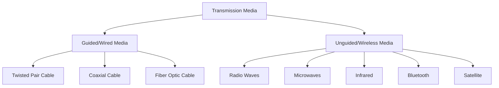
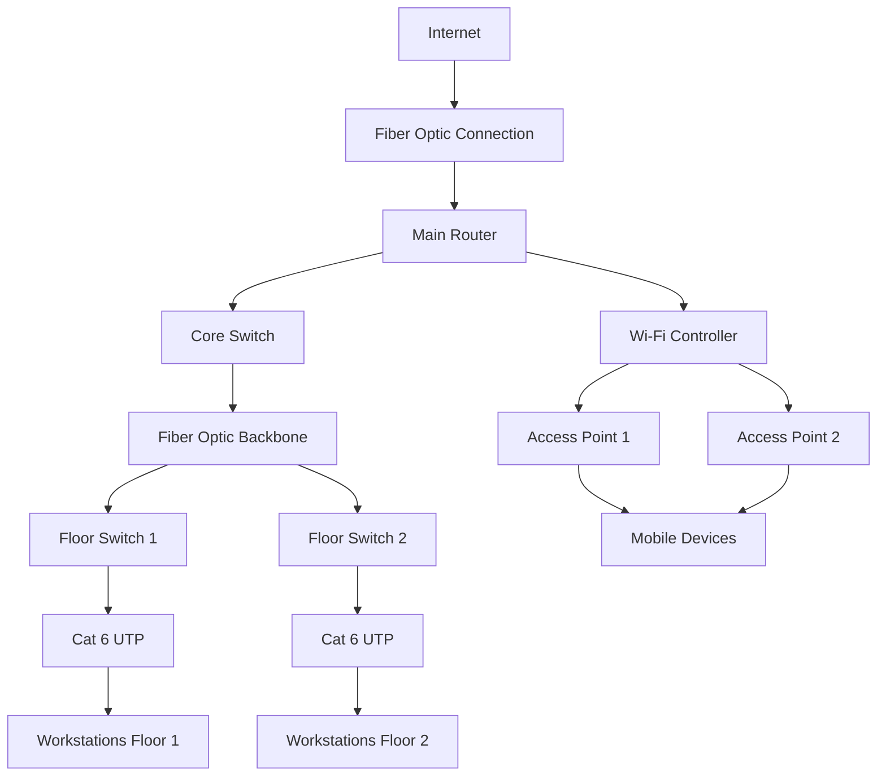

# Networks Transmission Media

## Introduction

The physical layer is the foundation of any network, and transmission media are the channels through which data travels between devices. Think of transmission media as the highways and roads that transport digital information from one place to another. The choice of transmission medium significantly impacts a network's speed, distance capabilities, security, and cost.

In this guide, we'll explore the various types of transmission media, their characteristics, and how they're used in real-world applications. Understanding these fundamentals is crucial whether you're setting up a home network or planning an enterprise infrastructure.

## Types of Transmission Media

Transmission media can be broadly categorized into two types:

1. **Guided Media** (Wired): Physical pathways that guide the data signals along a specific route
2. **Unguided Media** (Wireless): Transmission through air or space without physical pathways

Let's examine each type in detail.



## Guided Transmission Media

### Twisted Pair Cable

Twisted pair cabling consists of pairs of insulated copper wires twisted together. The twisting helps reduce electromagnetic interference (EMI) and crosstalk between adjacent pairs.

#### Types of Twisted Pair Cables

1. **Unshielded Twisted Pair (UTP)**: Most common type used in Ethernet networks
2. **Shielded Twisted Pair (STP)**: Includes additional shielding to protect against interference

#### UTP Categories

| Category | Maximum Data Rate | Typical Use |
|----------|-------------------|-------------|
| Cat 3    | 10 Mbps           | Legacy telephone systems and 10BASE-T Ethernet |
| Cat 5    | 100 Mbps          | Fast Ethernet |
| Cat 5e   | 1 Gbps            | Gigabit Ethernet |
| Cat 6    | 10 Gbps (up to 55m) | Gigabit and 10G Ethernet |
| Cat 6a   | 10 Gbps (up to 100m) | 10G Ethernet with improved alien crosstalk performance |
| Cat 7    | 10 Gbps+          | 10G Ethernet with additional shielding |
| Cat 8    | 40 Gbps           | Data centers and high-performance computing |

#### Advantages
- Low cost
- Easy to install and maintain
- Widely available
- Supported by existing network infrastructure

#### Disadvantages
- Limited bandwidth compared to fiber optic
- Limited distance (typically 100 meters maximum for Ethernet)
- Susceptible to electromagnetic interference
- Security concerns (can be tapped)

#### Real-world Application

In a typical office building, Cat 5e or Cat 6 UTP cables connect computers to network switches within each floor. The RJ-45 connectors at each end of these cables plug into network interface cards (NICs) on computers and ports on network switches.

```
Computer → RJ-45 → Cat 6 UTP Cable → RJ-45 → Switch Port
```

### Coaxial Cable

Coaxial cable consists of a central copper conductor surrounded by insulating material, a braided metal shield, and an outer jacket. This design helps protect the signal from interference.

#### Types of Coaxial Cable

1. **RG-6**: Common for cable TV and internet
2. **RG-59**: Used for short-distance video applications
3. **RG-11**: Used for longer runs and higher frequencies

#### Advantages
- Higher bandwidth than twisted pair
- Better noise immunity
- Can transmit over longer distances than twisted pair
- Less susceptible to electromagnetic interference

#### Disadvantages
- More expensive than twisted pair
- Less flexible (harder to install)
- More difficult to terminate

#### Real-world Application

Cable television services and cable internet providers use coaxial cables to deliver signals to homes and businesses. The cable company's distribution network uses coaxial cables to connect from neighborhood nodes to individual buildings.

### Fiber Optic Cable

Fiber optic cables transmit data as pulses of light through thin strands of glass or plastic. They offer the highest performance of all guided media.

#### Types of Fiber Optic Cable

1. **Single-mode Fiber (SMF)**: Uses a single ray of light; suitable for long distances
2. **Multi-mode Fiber (MMF)**: Uses multiple rays of light; suitable for shorter distances

#### Advantages
- Extremely high bandwidth (terabits per second)
- Very long transmission distances (kilometers without repeaters)
- Immune to electromagnetic interference
- More secure (difficult to tap)
- Smaller and lighter than copper cables

#### Disadvantages
- More expensive than copper-based media
- More difficult to install and terminate
- Requires specialized equipment for testing and repair
- More fragile than copper cables

#### Real-world Application

Fiber optic cables form the backbone of the internet. Undersea fiber optic cables span oceans to connect continents, enabling global data exchange at incredible speeds. For example, the MAREA cable between Virginia Beach, USA, and Bilbao, Spain, spans 6,600 kilometers and can transmit up to 200 terabits per second.

## Unguided Transmission Media

### Radio Waves

Radio waves are electromagnetic waves with frequencies between 3 kHz and 1 GHz, used for various wireless communications.

#### Applications
- Wi-Fi networks (2.4 GHz and 5 GHz bands)
- AM and FM radio broadcasting
- Mobile phone communications
- IoT device communication

#### Advantages
- Can penetrate walls and buildings
- Supports mobile users
- Covers large areas

#### Disadvantages
- Limited bandwidth
- Security concerns
- Susceptible to interference
- Regulated by government agencies

#### Real-world Application: Wi-Fi Network Implementation

Setting up a Wi-Fi network involves configuring a wireless router or access point to broadcast on specific channels. Devices connect to this network using compatible Wi-Fi adapters.

```javascript
// Simple JavaScript code to detect available Wi-Fi networks
// (This would be part of a mobile app or web application with proper permissions)
function scanWifiNetworks() {
  if (navigator.wifi && navigator.wifi.getNetworks) {
    navigator.wifi.getNetworks().then(networks => {
      networks.forEach(network => {
        console.log(`Network SSID: ${network.ssid}, Signal Strength: ${network.signalStrength}`);
      });
    }).catch(error => {
      console.error("Error scanning Wi-Fi networks:", error);
    });
  } else {
    console.log("Wi-Fi scanning not supported in this browser");
  }
}
```

### Microwaves

Microwaves are high-frequency radio waves (1 GHz to 300 GHz) used for point-to-point communications.

#### Types
1. **Terrestrial Microwave**: Tower-to-tower communication
2. **Satellite Microwave**: Earth-to-satellite communication

#### Advantages
- High bandwidth
- No physical cabling required between points
- Useful for reaching remote locations

#### Disadvantages
- Requires line of sight
- Affected by weather conditions (rain fade)
- Expensive equipment

#### Real-world Application

Telecommunications companies use microwave relays to transmit signals between towers in areas where laying fiber optic or copper cables would be impractical or too expensive, such as across mountains or over bodies of water.

### Infrared

Infrared transmission uses infrared light waves to transmit data over short distances.

#### Advantages
- Secure (does not penetrate walls)
- No frequency licensing required
- Immune to radio frequency interference

#### Disadvantages
- Very short range
- Requires line of sight
- Affected by obstacles and environmental conditions

#### Real-world Application

TV remote controls use infrared to send signals to the television. Smart home systems also use infrared for device control, like turning on air conditioners or controlling entertainment systems.

### Bluetooth

Bluetooth uses short-wavelength UHF radio waves (2.4 to 2.485 GHz) for exchanging data over short distances.

#### Advantages
- Low power consumption
- Automatic connection between devices
- No line of sight required
- Relatively secure

#### Disadvantages
- Limited range (typically 10-100 meters)
- Limited bandwidth compared to Wi-Fi
- May experience interference from other devices

#### Real-world Application

Bluetooth connects wireless headphones to smartphones, allowing music streaming without physical cables. It also enables smart watches to sync with phones and provides connectivity for wireless keyboards, mice, and other peripherals.

### Satellite Communication

Satellite communication uses satellites orbiting the Earth as relays for radio signals.

#### Advantages
- Global coverage including remote and rural areas
- Not affected by terrestrial infrastructure limitations
- Broadcast capabilities to multiple locations simultaneously

#### Disadvantages
- High latency (signal delay)
- Weather-sensitive
- Expensive infrastructure
- Limited bandwidth compared to modern fiber

#### Real-world Application

In remote areas without cellular or landline infrastructure, satellite phones and internet services provide connectivity. Maritime vessels use satellite communication for navigation, weather updates, and staying connected while at sea.

## Comparison of Transmission Media

| Medium | Bandwidth | Distance | Security | Cost | Installation Complexity |
|--------|-----------|----------|----------|------|------------------------|
| UTP Cable | Low-Medium | < 100m | Low | Low | Low |
| Coaxial Cable | Medium | < 500m | Medium | Medium | Medium |
| Fiber Optic | Very High | Several km | High | High | High |
| Wi-Fi | Medium | < 100m | Medium | Medium | Low |
| Microwave | High | Line of sight | Medium | High | High |
| Satellite | Medium | Global | Medium | Very High | Very High |
| Bluetooth | Low | < 100m | Medium | Low | Low |
| Infrared | Low | < 10m | High | Low | Low |

## Selecting the Right Transmission Medium

When designing a network, consider these factors when choosing transmission media:

1. **Required bandwidth** - How much data needs to be transmitted?
2. **Distance** - How far does the signal need to travel?
3. **Environment** - Indoor or outdoor? Presence of interference?
4. **Security requirements** - How sensitive is the data?
5. **Budget** - What are the cost constraints?
6. **Scalability** - Will the network need to grow in the future?

## Practical Example: Designing a Small Office Network

For a small office with 20 employees, a typical network design might include:

- **Internal connections**: Cat 6 UTP cabling for connecting desktops to switches
- **Backbone connection**: Fiber optic cable between main switches and the server room
- **Wireless access**: Wi-Fi access points for mobile device connectivity
- **Internet connection**: Fiber optic or coaxial (cable) connection to the ISP



## Summary

Transmission media form the foundation of network communications, providing the pathways through which data travels. Each medium has its strengths and weaknesses:

- **Twisted pair cables** offer an economical solution for short-distance connections
- **Coaxial cables** provide better performance for television and broadband internet
- **Fiber optic cables** deliver unmatched bandwidth and distance capabilities
- **Wireless technologies** like Wi-Fi, Bluetooth, and satellite enable connectivity without physical cabling

The choice of transmission medium depends on specific requirements including bandwidth, distance, security, environment, and budget constraints. Modern networks often employ a mix of different media to create optimal solutions.

## Exercises

1. Compare and contrast the advantages and disadvantages of fiber optic cable versus UTP cable for a campus network backbone.

2. Design a network infrastructure for a three-story office building with 50 employees per floor. Specify the transmission media you would use for different parts of the network and explain your choices.

3. Research the latest advancements in transmission media technology. How are researchers working to increase bandwidth and overcome current limitations?

4. Calculate the theoretical time required to transfer a 10 GB file over:
   - 100 Mbps Cat 5e UTP connection
   - 1 Gbps Cat 6 UTP connection
   - 10 Gbps fiber optic connection

5. Investigate how environmental factors affect different transmission media. How would extreme temperatures, moisture, or electromagnetic interference impact performance?

## Additional Resources

- **Books**:
  - "Computer Networks" by Andrew S. Tanenbaum
  - "Data and Computer Communications" by William Stallings

- **Online Courses**:
  - Cisco Networking Academy courses on network fundamentals
  - CompTIA Network+ certification materials

- **Standards Organizations**:
  - IEEE 802.3 (Ethernet standards)
  - TIA/EIA (Telecommunications Industry Association standards)

- **Practical Learning**:
  - Set up a small lab with different types of cables
  - Use network analyzer tools to compare performance across different media