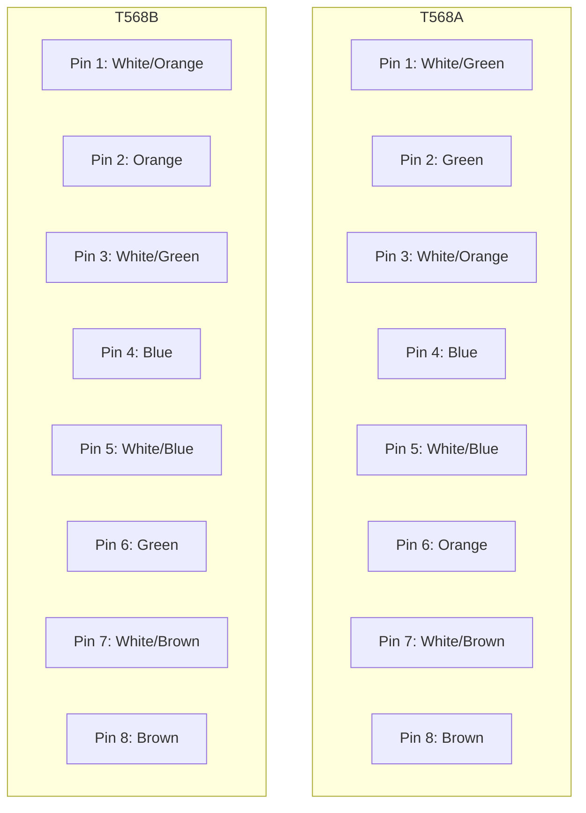

# Network Cables

## Introduction

Network cables form the backbone of our connected world, serving as the physical medium through which data travels between devices in a network. While wireless technologies have gained popularity, cables remain essential for reliable, secure, and high-speed networking infrastructure. This guide explores the various types of network cables, their characteristics, and appropriate applications to help you make informed decisions when building or troubleshooting networks.

## Types of Network Cables

Different networking scenarios require specific types of cables. Let's explore the most common ones used in modern networks:

### Twisted Pair Cables

Twisted pair cables are the most common type used in local area networks (LANs). They consist of pairs of insulated copper wires twisted together to reduce electromagnetic interference (EMI).

#### Unshielded Twisted Pair (UTP)

UTP cables are the most widely used network cables due to their cost-effectiveness and ease of installation.

**Categories of UTP cables:**

| Category | Max Speed | Max Bandwidth | Common Uses |
|----------|-----------|---------------|------------|
| Cat 3    | 10 Mbps   | 16 MHz        | Legacy telephone systems, outdated networks |
| Cat 5    | 100 Mbps  | 100 MHz       | Fast Ethernet |
| Cat 5e   | 1 Gbps    | 100 MHz       | Gigabit Ethernet |
| Cat 6    | 10 Gbps   | 250 MHz       | Fast networks (shorter distances) |
| Cat 6a   | 10 Gbps   | 500 MHz       | Fast networks (longer distances) |
| Cat 7    | 10+ Gbps  | 600 MHz       | Data centers, enterprise networks |
| Cat 8    | 40 Gbps   | 2000 MHz      | Data centers, high-performance computing |

**Practical Example:**

For a home or small office network, Cat 5e or Cat 6 cables provide excellent performance for most applications. Cat 5e supports gigabit speeds and is sufficient for internet connections, while Cat 6 offers better future-proofing for higher speeds.

#### Shielded Twisted Pair (STP)

STP cables include additional shielding to protect against electromagnetic interference, making them ideal for industrial environments or areas with high electrical noise.

**Advantages of STP:**
- Better protection against EMI/RFI (electromagnetic/radio frequency interference)
- Reduced crosstalk between cable pairs
- Better performance in noisy environments

**Disadvantages of STP:**
- More expensive than UTP
- Less flexible and harder to install
- Requires proper grounding for effective shielding

### Coaxial Cables

Coaxial cables (or "coax") were once the primary medium for Ethernet networks but are now more commonly used for cable television and specialized networking applications.

**Types of coaxial cables:**

| Type | Impedance | Common Uses |
|------|-----------|------------|
| RG-6 | 75 Ohm    | Cable TV, satellite, broadband internet |
| RG-8 | 50 Ohm    | Amateur radio, specialized networks |
| RG-11 | 75 Ohm   | Long-distance CATV, broadband |
| RG-58 | 50 Ohm   | Thin Ethernet (10Base2), amateur radio |
| RG-59 | 75 Ohm   | Analog video, short-run CATV |

**Practical Example:**

If you're setting up a cable modem for internet access, you'll likely use RG-6 coaxial cables to connect from the wall outlet to your modem. The cable's shielding helps prevent signal loss and interference, ensuring a stable internet connection.

### Fiber Optic Cables

Fiber optic cables use strands of glass or plastic to transmit data as pulses of light. They offer the highest speeds and transmission distances of all network cable types.

**Types of fiber optic cables:**

1. **Single-Mode Fiber (SMF)**
   - Very thin core (8-10 microns)
   - Uses laser light source
   - Longer transmission distances (up to 100km)
   - Higher bandwidth
   - More expensive
   - Common in telecommunications and long-haul networks

2. **Multi-Mode Fiber (MMF)**
   - Larger core (50 or 62.5 microns)
   - Uses LED light source
   - Shorter transmission distances (up to 2km)
   - Lower cost than single-mode
   - Common in building and campus networks

**Practical Example:**

A university campus might use multi-mode fiber to connect buildings within its network, providing high-speed connectivity between different departments. For the connection from the campus to the internet service provider several miles away, single-mode fiber would be the appropriate choice due to the distance involved.

## Connectors and Terminations

The effectiveness of network cables depends on proper termination with the appropriate connectors.

### Twisted Pair Connectors

**RJ-45 (Registered Jack 45)**

This is the standard connector for Ethernet twisted pair cables.

**Wiring Standards:**

There are two main wiring standards for RJ-45 connectors:
- T568A (used in residential applications)
- T568B (more common in commercial settings)

**Note:** Using different standards on each end of a cable creates a crossover cable, which was once needed to connect similar devices directly. Modern equipment typically has auto-sensing capabilities (Auto-MDIX), eliminating the need for crossover cables in most scenarios.

### Coaxial Connectors

Common coaxial cable connectors include:

- **F-Type Connector**: Used for cable TV and internet
- **BNC (Bayonet Neill-Concelman)**: Used in legacy networks and video applications
- **N-Type Connector**: Used in high-frequency applications and outdoor installations

### Fiber Optic Connectors

Fiber optic cables use various connector types:

- **SC (Subscriber Connector)**: Push-pull mechanism, common in datacom and telecom
- **LC (Lucent Connector)**: Smaller form factor, common in high-density applications
- **ST (Straight Tip)**: Bayonet-style connector, common in legacy networks
- **FC (Ferrule Connector)**: Threaded connector for high-vibration environments
- **MTP/MPO**: Multi-fiber connectors for high-density applications

## Cable Performance Characteristics

When selecting network cables, consider these key performance metrics:

### Bandwidth

Bandwidth refers to the maximum data transmission rate supported by the cable, measured in Megahertz (MHz). Higher MHz ratings indicate the cable can support higher data rates.

### Attenuation

Attenuation is the loss of signal strength as data travels along the cable. Measured in decibels (dB), lower attenuation values are better. Attenuation increases with:
- Cable length
- Higher frequencies
- Environmental factors (temperature, humidity)

### Crosstalk

Crosstalk occurs when signals in one wire create unwanted effects in adjacent wires. Types include:

- **Near-End Crosstalk (NEXT)**: Interference measured at the same end of the cable as the signal source
- **Far-End Crosstalk (FEXT)**: Interference measured at the opposite end from the signal source
- **Alien Crosstalk (AXT)**: Interference between adjacent cables

### Cable Lengths

Maximum recommended lengths for common cable types:

| Cable Type | Maximum Length |
|------------|----------------|
| Cat 5e     | 100 meters (328 feet) |
| Cat 6      | 100 meters (328 feet) for 1 Gbps; 55 meters (180 feet) for 10 Gbps |
| Cat 6a     | 100 meters (328 feet) for 10 Gbps |
| Coaxial    | 500 meters (1640 feet) depending on type |
| Multimode Fiber | 550 meters (1804 feet) to 2 kilometers (1.24 miles) |
| Single-mode Fiber | Up to 100 kilometers (62 miles) |

## Practical Applications

### Building a Home Network

For a typical home network:

1. **Internet Connection**: Use RG-6 coaxial from the wall to the cable modem
2. **Router to Devices**: Cat 5e or Cat 6 UTP cables for wired connections
3. **Media Streaming**: Cat 6 recommended for 4K video streaming between devices

### Small Business Setup

For a small business network:

1. **Internet Connection**: Fiber connection to the premises if available
2. **Backbone**: Cat 6a or fiber between network closets
3. **Workstations**: Cat 6 to desktop computers
4. **Server Room**: Cat 6a or fiber for server connections

### Industrial Environment

For industrial settings with electrical interference:

1. **Factory Floor**: Shielded twisted pair (STP) cables
2. **Long Runs**: Fiber optic cables for distances over 100 meters
3. **Outdoor Connections**: Outdoor-rated cables with UV protection and water resistance

## Troubleshooting Cable Issues

Common network cable problems and their solutions:

### Physical Inspection

Check for:
- Bent or crushed cables
- Damaged connectors
- Proper termination
- Excessive bending (should not exceed the minimum bend radius)

### Using Cable Testers

Cable testers can verify:
- Continuity (no breaks in wires)
- Proper pin-to-pin connections
- Distance to faults
- Cable performance metrics

### Common Issues and Solutions

| Issue | Possible Causes | Solutions |
|-------|----------------|-----------|
| Intermittent connectivity | Loose connections, damaged cable | Re-terminate connectors, replace cable |
| Slow speeds | Poor quality cable, excessive length, interference | Use higher category cable, check for EMI sources |
| No connectivity | Broken wires, incorrect wiring | Test with cable tester, re-terminate or replace |
| High error rates | Interference, attenuation | Use shielded cables, reduce length, check for interference sources |

## Best Practices for Cable Installation

For optimal network performance:

1. **Planning**
   - Document cable runs and labeling schemes
   - Calculate distances to ensure they're within specifications
   - Consider future growth needs

2. **Installation**
   - Maintain minimum bend radius (typically 4x cable diameter)
   - Avoid running parallel to power cables
   - Use appropriate cable management tools (J-hooks, cable trays)
   - Leave service loops for future adjustments

3. **Termination**
   - Follow TIA/EIA standards for terminations
   - Maintain proper twist up to the point of termination
   - Use high-quality connectors
   - Test all connections after installation

4. **Maintenance**
   - Label all cables
   - Keep documentation updated
   - Periodically test critical connections
   - Replace aging cables before they cause problems

## Summary

Network cables are the foundation of reliable network infrastructure. The choice of cable depends on several factors:

- **Distance**: Longer runs may require fiber optic cables
- **Speed requirements**: Higher data rates need higher category cables
- **Environment**: Interference-prone areas need shielded or fiber cables
- **Budget**: Balance cost with performance needs
- **Future needs**: Consider future bandwidth requirements

By understanding the characteristics and applications of different network cables, you can build more reliable, efficient, and future-proof networks.

## Additional Resources

### Practice Exercises

1. **Cable Identification Exercise**:
   Identify different types of network cables by their appearance and connector types.

2. **Termination Practice**:
   Practice terminating UTP cables with RJ-45 connectors following the T568B standard.

3. **Network Planning Challenge**:
   Design a cable layout for a small office, selecting appropriate cable types for different network segments.

### Certification Resources

To deepen your knowledge of network cables and infrastructure, consider these certification paths:

- CompTIA Network+
- Cisco CCNA
- BICSI Installer certifications

Remember that hands-on experience with different cable types is invaluable for developing practical networking skills.