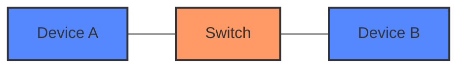
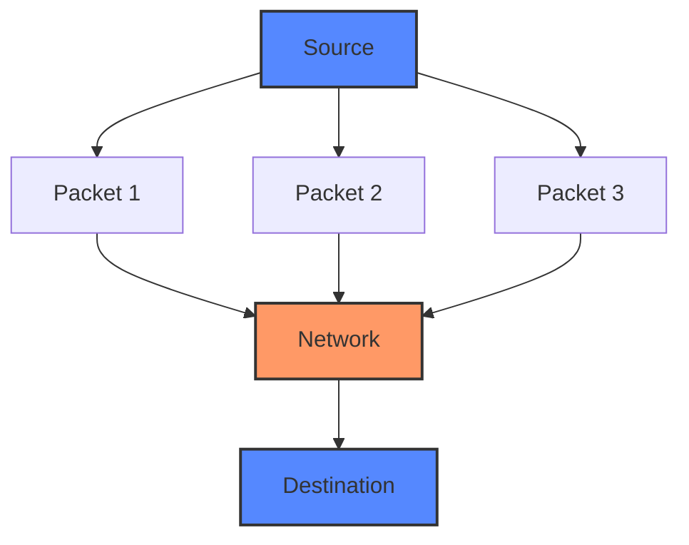
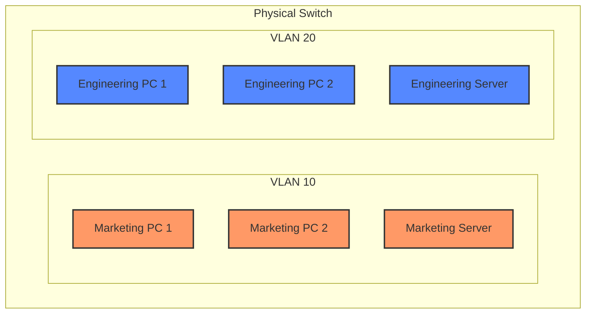

# Networks Switching

## Introduction

Network switching is a fundamental concept in computer networking that enables data to travel from a source to a destination through interconnected devices. At the physical layer, switching refers to the hardware mechanisms that establish temporary connections between network segments to facilitate data transmission. Unlike older technologies like hubs that broadcast data to all connected devices, switches make intelligent decisions about where to send data packets, improving network efficiency and security.

In this guide, we'll explore the core concepts of network switching, different switching methods, and how they form the backbone of modern network infrastructures.

## What is a Network Switch?

A network switch is a hardware device that connects multiple devices on a local area network (LAN). Operating primarily at the data link layer (Layer 2) of the OSI model, switches use MAC addresses to forward data to the appropriate destination.

### Key Features of Switches

- **Port-based**: Switches have multiple ports where devices connect
- **MAC address learning**: Switches build and maintain tables of MAC addresses
- **Intelligent forwarding**: Data is sent only to the intended recipient
- **Full-duplex communication**: Allows simultaneous sending and receiving of data
- **Low latency**: Provides faster data transmission than older technologies

## Switching Methods

There are three primary methods of packet switching used in networks:

### 1. Circuit Switching

Circuit switching establishes a dedicated communication path between two stations. This path remains active for the entire duration of the communication session.



**Characteristics:**
- Creates a fixed bandwidth connection
- Guarantees quality of service
- Common in traditional telephone networks
- Inefficient for bursty data traffic

**Example:** When you make a traditional landline phone call, a circuit is established and maintained throughout your conversation, regardless of whether you're speaking or silent.

### 2. Packet Switching

In packet switching, data is divided into packets that are routed through the network independently. Each packet contains addressing information to help it reach its destination.



**Characteristics:**
- More efficient use of network resources
- Better handling of network congestion
- No dedicated path between source and destination
- Packets may arrive out of order and need reassembly

**Example:** When you browse a website, the data is broken into packets, each taking potentially different routes to reach your computer, where they're reassembled into the complete webpage.

### 3. Message Switching

Message switching involves transmitting entire messages through the network, with each switch storing and forwarding the complete message.

**Characteristics:**
- Store-and-forward mechanism
- No dedicated path
- Efficient for non-real-time applications
- Higher latency than packet switching

**Example:** Email systems often use a form of message switching, where the entire email is stored at various servers before being forwarded to the next hop.

## Switch Forwarding Methods

Switches use different approaches to process and forward frames:

### Cut-Through Switching

The switch begins forwarding a frame as soon as it reads the destination MAC address, without waiting for the entire frame.

```
Frame Header                      Frame Data                     Frame Trailer
┌───────────────────────┬─────────────────────────────────┬───────────────────┐
│ Preamble | Dest MAC | Src MAC | Type | Payload           | CRC | Interframe │
└───────────────────────┴─────────────────────────────────┴───────────────────┘
             ↑
     Switch reads only this
     before forwarding
```

**Advantages:**
- Lower latency
- Faster performance

**Disadvantages:**
- May forward corrupt frames (no error checking)
- Requires more sophisticated hardware

### Store-and-Forward Switching

The switch receives the entire frame, checks it for errors, and then forwards it.

```
Frame Header                      Frame Data                     Frame Trailer
┌───────────────────────┬─────────────────────────────────┬───────────────────┐
│ Preamble | Dest MAC | Src MAC | Type | Payload           | CRC | Interframe │
└───────────────────────┴─────────────────────────────────┴───────────────────┘
                                                                  ↑
                                                 Switch waits until here
                                                 before forwarding
```

**Advantages:**
- Ensures data integrity
- Prevents propagation of bad frames

**Disadvantages:**
- Higher latency
- Requires more buffer memory

### Fragment-Free Switching

A compromise between cut-through and store-and-forward, this method checks the first 64 bytes of a frame before forwarding.

**Advantages:**
- Moderate latency
- Detects most collision fragments

**Disadvantages:**
- Doesn't catch all errors
- More complex implementation

## Types of Switches

### Unmanaged Switches

Simple plug-and-play devices with fixed configurations.

**Characteristics:**
- No configuration interface
- Fixed functionality
- Suitable for small networks
- Lower cost

### Managed Switches

Configurable switches that provide more control and monitoring capabilities.

**Characteristics:**
- Configuration interface (CLI, web, SNMP)
- VLAN support
- Quality of Service (QoS) settings
- Port mirroring
- Security features

**Example Code for Switch Configuration (Cisco IOS):**

```
Switch> enable
Switch# configure terminal
Switch(config)# hostname NetworkSwitch
NetworkSwitch(config)# interface gigabitethernet 0/1
NetworkSwitch(config-if)# description Connection to Server
NetworkSwitch(config-if)# speed 1000
NetworkSwitch(config-if)# duplex full
NetworkSwitch(config-if)# no shutdown
NetworkSwitch(config-if)# exit
NetworkSwitch(config)# exit
NetworkSwitch# write memory
```

This configures a single port on a Cisco switch with a description, speed, and duplex settings.

## Virtual LANs (VLANs)

VLANs are logical subdivisions of a switch that group together devices as if they were connected to a separate, isolated physical switch.



**Benefits:**
- Improved security through isolation
- Reduced broadcast traffic
- Logical organization by function rather than location
- Simplified network management

**VLAN Configuration Example (Cisco IOS):**

```
Switch> enable
Switch# configure terminal
Switch(config)# vlan 10
Switch(config-vlan)# name Marketing
Switch(config-vlan)# exit
Switch(config)# vlan 20
Switch(config-vlan)# name Engineering
Switch(config-vlan)# exit
Switch(config)# interface gigabitethernet 0/1
Switch(config-if)# switchport mode access
Switch(config-if)# switchport access vlan 10
Switch(config-if)# exit
```

This creates two VLANs (10 for Marketing and 20 for Engineering) and assigns port gigabitethernet 0/1 to VLAN 10.

## Layer 2 vs. Layer 3 Switching

### Layer 2 Switching

Traditional switching that operates at the data link layer using MAC addresses.

**Characteristics:**
- MAC address-based forwarding
- Fast, hardware-based packet switching
- Limited to single broadcast domain

### Layer 3 Switching

Combines routing functions with switching hardware.

**Characteristics:**
- IP address-based forwarding
- Hardware-accelerated routing
- Support for multiple network segments
- Maintains separate routing tables

## Practical Applications

### Small Office Setup

For a small office with 20 computers:

1. A single 24-port managed switch
2. Basic VLAN configuration (separate guest and internal networks)
3. Quality of Service settings to prioritize VoIP traffic

### Enterprise Network

For a large enterprise:

1. Distribution layer switches connecting departments
2. Core switches connecting distribution switches
3. Multiple VLANs for different departments
4. Advanced security features (port security, 802.1X)
5. Redundant connections for fault tolerance

### Data Center

For a data center environment:

1. High-speed switches (10/40/100 Gbps)
2. Very low latency switching
3. Support for virtualization technologies
4. Traffic monitoring and analysis tools

## Troubleshooting Network Switching Issues

### Common Problems and Solutions

1. **Port errors or collisions**
   - Check for duplex mismatches
   - Inspect cables for damage
   - Verify speed settings

2. **High latency**
   - Look for network congestion
   - Check for broadcast storms
   - Verify QoS settings

3. **Connectivity issues**
   - Verify port status (up/down)
   - Check MAC address tables
   - Test with different cables/ports

**Sample Diagnostic Commands:**

```
Switch# show interfaces status
Switch# show mac address-table
Switch# show vlan brief
Switch# show spanning-tree
```

## Summary

Network switching is a critical component of modern networks that enables efficient, targeted data transmission. Key points to remember:

- Switches forward data based on MAC addresses
- Different switching methods (circuit, packet, message) serve different purposes
- Forwarding techniques balance latency and reliability
- VLANs enable logical segmentation of physical networks
- Layer 3 switches combine routing and switching functions
- Modern switches offer advanced features for security and performance

## Exercises

1. Draw a network diagram showing how a switch connects five computers in a star topology.
2. Configure a basic VLAN on a switch (using a simulator like Packet Tracer if available).
3. Compare the performance of cut-through and store-and-forward switching in different scenarios.
4. Design a small office network with appropriate switching infrastructure.
5. Research and describe how Spanning Tree Protocol prevents loops in switched networks.

## Additional Resources

- Networking certification materials (CompTIA Network+, Cisco CCNA)
- Online switch simulators and labs
- Switch manufacturer documentation (Cisco, Juniper, HP)
- RFCs related to switching technologies

Remember that network switching continues to evolve with technologies like Software-Defined Networking (SDN) changing how traditional switches operate and are managed.