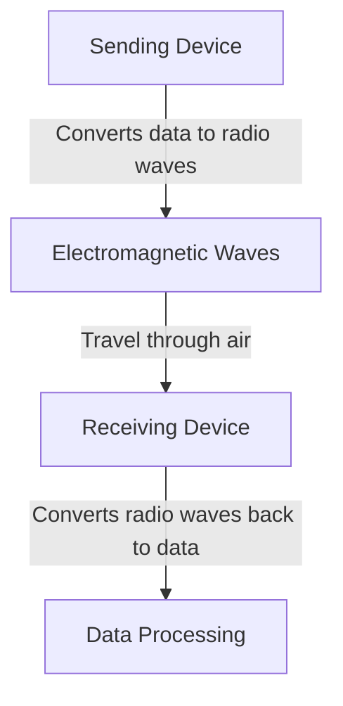
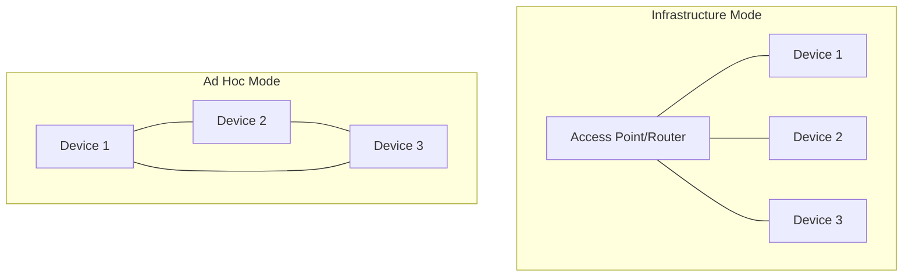

# Networks Wireless

## Introduction

Wireless networks have revolutionized how we connect to the internet and communicate with other devices. Unlike traditional wired networks that use physical cables, wireless networks transmit data through the air using radio waves, enabling mobility and flexibility that wasn't possible before.

In this guide, we'll explore the fundamental concepts of wireless networking, focusing on how they operate at the physical layer, the various wireless technologies in use today, and how to implement basic wireless functionality in your applications.

## Wireless Network Fundamentals

### How Wireless Communication Works

At its core, wireless networking relies on electromagnetic waves to carry information through the air. These waves operate at specific frequencies within the radio spectrum, depending on the wireless technology being used.



The basic process involves:

1. A sending device (like your laptop) converts digital data into radio signals
2. These signals propagate through the air as electromagnetic waves
3. A receiving device (like a wireless router) captures these waves
4. The receiver converts the radio signals back into digital data

### Key Characteristics of Wireless Networks

Wireless networks have several important characteristics that distinguish them from wired networks:

- **Range**: The maximum distance over which devices can communicate
- **Bandwidth**: The amount of data that can be transmitted per second
- **Frequency**: The specific radio frequency bands used for transmission
- **Signal Strength**: The power of the transmitted signal, which affects range and reliability
- **Interference**: Susceptibility to disruption from obstacles or other devices using the same frequency

## Wireless Technologies

### Wi-Fi (IEEE 802.11)

Wi-Fi is the most common wireless networking technology used in homes and businesses. It's based on the IEEE 802.11 set of standards and operates primarily in the 2.4 GHz and 5 GHz frequency bands.

#### Wi-Fi Standards

| Standard | Max Speed | Frequency | Range (Indoor) | Year Introduced |
|----------|-----------|-----------|----------------|-----------------|
| 802.11a  | 54 Mbps   | 5 GHz     | ~35 meters     | 1999            |
| 802.11b  | 11 Mbps   | 2.4 GHz   | ~35 meters     | 1999            |
| 802.11g  | 54 Mbps   | 2.4 GHz   | ~38 meters     | 2003            |
| 802.11n  | 600 Mbps  | 2.4/5 GHz | ~70 meters     | 2009            |
| 802.11ac | 3.5 Gbps  | 5 GHz     | ~35 meters     | 2014            |
| 802.11ax | 9.6 Gbps  | 2.4/5/6 GHz | ~35 meters   | 2019            |

#### Basic Wi-Fi Configuration in Code

Here's a simple example of how you might connect to a Wi-Fi network programmatically using Python and the `pywifi` library:

```python
import pywifi
import time
from pywifi import const

def connect_to_wifi(ssid, password):
    wifi = pywifi.PyWiFi()
    iface = wifi.interfaces()[0]  # Get the first wireless interface
    
    # Disconnect if already connected
    if iface.status() == const.IFACE_CONNECTED:
        iface.disconnect()
        time.sleep(1)
    
    # Create a new profile
    profile = pywifi.Profile()
    profile.ssid = ssid
    profile.auth = const.AUTH_ALG_OPEN
    profile.akm.append(const.AKM_TYPE_WPA2PSK)
    profile.cipher = const.CIPHER_TYPE_CCMP
    profile.key = password
    
    # Add the profile to the interface
    iface.remove_all_network_profiles()
    tmp_profile = iface.add_network_profile(profile)
    
    # Connect
    iface.connect(tmp_profile)
    
    # Wait for connection
    time.sleep(5)
    
    # Check connection status
    if iface.status() == const.IFACE_CONNECTED:
        return True
    else:
        return False

# Example usage
if connect_to_wifi("MyHomeNetwork", "MySecurePassword"):
    print("Successfully connected to Wi-Fi!")
else:
    print("Failed to connect to Wi-Fi.")
```

### Bluetooth

Bluetooth is a wireless technology designed for short-range communication between devices. It's commonly used for connecting peripherals like keyboards, headphones, and speakers.

#### Key Bluetooth Characteristics

- Operates in the 2.4 GHz ISM band
- Typical range of 10 meters (33 feet), although newer versions can reach up to 100 meters
- Low power consumption compared to Wi-Fi
- Support for both point-to-point and point-to-multipoint communication

#### Basic Bluetooth Scanning in Python

Here's how you can scan for nearby Bluetooth devices using Python and the `bluetooth` library:

```python
import bluetooth

def scan_for_devices():
    print("Scanning for Bluetooth devices...")
    nearby_devices = bluetooth.discover_devices(lookup_names=True)
    
    print(f"Found {len(nearby_devices)} devices:")
    
    for addr, name in nearby_devices:
        print(f"  Device: {name}")
        print(f"  Address: {addr}")
        print()

    return nearby_devices

# Example usage
devices = scan_for_devices()
```

### Cellular Networks (3G, 4G, 5G)

Cellular networks are wireless networks designed for wide-area coverage and mobile communications. They've evolved through several generations:

- **3G**: Introduced mobile internet access
- **4G/LTE**: Brought broadband speeds to mobile devices
- **5G**: Features ultra-low latency and multi-gigabit speeds

### LoRaWAN and Other LPWAN Technologies

Low-Power Wide-Area Networks (LPWANs) like LoRaWAN are designed for IoT devices that need to transmit small amounts of data over long distances while consuming minimal power.

## Wireless Network Architecture

### Infrastructure Mode vs. Ad Hoc Mode

Wireless networks typically operate in one of two modes:

1. **Infrastructure Mode**: Devices connect through a central access point
2. **Ad Hoc Mode**: Devices connect directly to each other without a central access point



### Wireless Mesh Networks

Mesh networks consist of multiple interconnected nodes that can dynamically route traffic between them, creating a resilient network structure.

## Wireless Security

Security is particularly important for wireless networks since the transmission medium (air) is accessible to anyone within range.

### Common Security Protocols

- **WEP (Wired Equivalent Privacy)**: An older, now insecure protocol
- **WPA (Wi-Fi Protected Access)**: An improvement over WEP
- **WPA2**: The most widely used security protocol today
- **WPA3**: The newest standard with enhanced security features

### Implementing Basic Wireless Security Checks

Here's a simple Python example that checks if a Wi-Fi network is using secure encryption:

```python
import pywifi
from pywifi import const

def check_network_security(network_name):
    wifi = pywifi.PyWiFi()
    iface = wifi.interfaces()[0]
    
    # Scan for networks
    iface.scan()
    time.sleep(2)  # Give time for scanning
    
    scan_results = iface.scan_results()
    
    for result in scan_results:
        if result.ssid == network_name:
            # Check the security type
            if result.akm[0] == const.AKM_TYPE_NONE:
                return "Open (Unsecured)"
            elif result.akm[0] == const.AKM_TYPE_WEP:
                return "WEP (Insecure)"
            elif result.akm[0] == const.AKM_TYPE_WPA:
                return "WPA (Moderately Secure)"
            elif result.akm[0] == const.AKM_TYPE_WPA2PSK:
                return "WPA2 (Secure)"
            elif result.akm[0] == const.AKM_TYPE_WPA3PSK:
                return "WPA3 (Most Secure)"
            else:
                return "Unknown Security"
    
    return "Network not found"

# Example usage
security_level = check_network_security("MyHomeNetwork")
print(f"The network is using: {security_level}")
```

## Signal Propagation and Network Planning

### Factors Affecting Wireless Signal

Several factors affect wireless signal propagation:

1. **Distance**: Signal strength decreases as distance increases
2. **Obstacles**: Walls, floors, and large objects can block or weaken signals
3. **Interference**: Other wireless devices or electromagnetic sources can cause interference
4. **Antenna Type and Orientation**: Different antennas have different radiation patterns

### Simple Signal Strength Measurement

Here's how you might measure Wi-Fi signal strength using Python:

```python
import subprocess
import re
import platform

def get_wifi_signal_strength():
    system = platform.system()
    
    if system == "Windows":
        # For Windows
        result = subprocess.check_output(["netsh", "wlan", "show", "interfaces"], text=True)
        signal_match = re.search(r"Signal\s+:\s+(\d+)%", result)
        if signal_match:
            return int(signal_match.group(1))
    
    elif system == "Linux":
        # For Linux
        result = subprocess.check_output(["iwconfig"], text=True, stderr=subprocess.STDOUT)
        signal_match = re.search(r"Signal level=(-\d+) dBm", result)
        if signal_match:
            # Convert dBm to percentage (rough approximation)
            signal_dbm = int(signal_match.group(1))
            # -50 dBm is excellent (100%), -100 dBm is poor (0%)
            signal_percentage = max(0, min(100, 2 * (signal_dbm + 100)))
            return signal_percentage
    
    elif system == "Darwin":  # macOS
        # For macOS
        result = subprocess.check_output(["/System/Library/PrivateFrameworks/Apple80211.framework/Versions/Current/Resources/airport", "-I"], text=True)
        signal_match = re.search(r"agrCtlRSSI: (-\d+)", result)
        if signal_match:
            # Convert dBm to percentage (rough approximation)
            signal_dbm = int(signal_match.group(1))
            # -50 dBm is excellent (100%), -100 dBm is poor (0%)
            signal_percentage = max(0, min(100, 2 * (signal_dbm + 100)))
            return signal_percentage
    
    return None

# Example usage
signal_strength = get_wifi_signal_strength()
if signal_strength is not None:
    print(f"Current Wi-Fi signal strength: {signal_strength}%")
    
    if signal_strength >= 80:
        print("Excellent signal")
    elif signal_strength >= 60:
        print("Good signal")
    elif signal_strength >= 40:
        print("Fair signal")
    elif signal_strength >= 20:
        print("Poor signal")
    else:
        print("Very poor signal")
else:
    print("Could not determine signal strength")
```

## Real-World Applications

### Building a Simple Wireless Scanner

Let's create a basic wireless network scanner that can identify nearby Wi-Fi networks:

```python
import pywifi
import time
from pywifi import const

def scan_wireless_networks():
    wifi = pywifi.PyWiFi()
    interface = wifi.interfaces()[0]  # Get the first wireless interface
    
    # Trigger scanning
    interface.scan()
    time.sleep(5)  # Wait for scan to complete
    
    # Get scan results
    networks = interface.scan_results()
    
    # Create a dictionary to store unique networks (by SSID)
    unique_networks = {}
    
    for network in networks:
        if network.ssid not in unique_networks or unique_networks[network.ssid]['signal'] < network.signal:
            security_type = "Unknown"
            
            if len(network.akm) > 0:
                if network.akm[0] == const.AKM_TYPE_NONE:
                    security_type = "Open"
                elif network.akm[0] == const.AKM_TYPE_WEP:
                    security_type = "WEP"
                elif network.akm[0] == const.AKM_TYPE_WPA:
                    security_type = "WPA"
                elif network.akm[0] == const.AKM_TYPE_WPA2PSK:
                    security_type = "WPA2"
                elif network.akm[0] == const.AKM_TYPE_WPA3PSK:
                    security_type = "WPA3"
            
            frequency = "2.4 GHz" if network.freq <= 3000 else "5 GHz"
            
            unique_networks[network.ssid] = {
                'ssid': network.ssid,
                'signal': network.signal,
                'security': security_type,
                'frequency': frequency,
                'bssid': network.bssid.hex(':').upper()
            }
    
    return unique_networks

# Example usage
networks = scan_wireless_networks()

print(f"Found {len(networks)} wireless networks:
")

for ssid, info in networks.items():
    if ssid:  # Skip hidden networks
        print(f"Network: {info['ssid']}")
        print(f"Signal Strength: {info['signal']} dBm")
        print(f"Security: {info['security']}")
        print(f"Frequency: {info['frequency']}")
        print(f"BSSID (MAC): {info['bssid']}")
        print()
```

### IoT Wireless Communication

In IoT applications, you might need to establish wireless communication between devices. Here's a simplified example using socket programming to create a basic client-server wireless communication:

Server code (`wireless_server.py`):

```python
import socket

def start_server():
    # Create a socket object
    server_socket = socket.socket(socket.AF_INET, socket.SOCK_STREAM)
    
    # Get local machine name and choose a port
    host = socket.gethostname()
    port = 12345
    
    # Bind the socket to a public host and port
    server_socket.bind((host, port))
    
    # Set up the server to listen for connections
    server_socket.listen(5)
    
    print(f"Server started on {host}:{port}")
    print("Waiting for client connections...")
    
    while True:
        # Establish connection with client
        client_socket, addr = server_socket.accept()
        print(f"Got connection from {addr}")
        
        # Send a welcome message
        message = "Welcome to the Wireless IoT Server!"
        client_socket.send(message.encode('utf-8'))
        
        # Receive data from the client
        data = client_socket.recv(1024).decode('utf-8')
        print(f"Received: {data}")
        
        # Send a response
        response = f"Server received: {data}"
        client_socket.send(response.encode('utf-8'))
        
        # Close the connection
        client_socket.close()

if __name__ == "__main__":
    start_server()
```

Client code (`wireless_client.py`):

```python
import socket

def connect_to_server():
    # Create a socket object
    client_socket = socket.socket(socket.AF_INET, socket.SOCK_STREAM)
    
    # Get local machine name and use the same port as server
    host = socket.gethostname()  # For a real remote server, you'd use its IP address
    port = 12345
    
    # Connect to the server
    print(f"Connecting to server at {host}:{port}...")
    client_socket.connect((host, port))
    
    # Receive the welcome message
    welcome_msg = client_socket.recv(1024).decode('utf-8')
    print(f"Server says: {welcome_msg}")
    
    # Send data to the server
    message = "Hello from IoT Client Device!"
    client_socket.send(message.encode('utf-8'))
    
    # Receive the response
    response = client_socket.recv(1024).decode('utf-8')
    print(f"Server response: {response}")
    
    # Close the connection
    client_socket.close()

if __name__ == "__main__":
    connect_to_server()
```

To run this example:
1. Start the server in one terminal: `python wireless_server.py`
2. Run the client in another terminal: `python wireless_client.py`

This demonstrates basic TCP/IP communication over a wireless network between two devices.

## Challenges in Wireless Networking

Wireless networks face several challenges that must be addressed:

1. **Security**: Wireless signals can be intercepted more easily than wired connections
2. **Interference**: Multiple devices using the same frequency can cause collisions
3. **Range Limitations**: Signal strength decreases with distance and obstacles
4. **Bandwidth Constraints**: Wireless networks typically have lower bandwidth than wired
5. **Reliability**: Connections can be affected by environmental factors

## Summary

In this guide, we've explored the fundamentals of wireless networking:

- How wireless communication works at the physical layer using electromagnetic waves
- Major wireless technologies including Wi-Fi, Bluetooth, and cellular networks
- Different wireless network architectures
- Security considerations and protocols
- Signal propagation factors and network planning
- Real-world applications with code examples for scanning networks and establishing communication

Wireless networking continues to evolve, with new technologies emerging to meet the growing demands of mobile devices, IoT, and high-bandwidth applications. Understanding these concepts provides a solid foundation for working with wireless technologies in your own projects.

## Additional Resources and Exercises

### Exercises

1. **Build a Wi-Fi Signal Mapper**: Create a program that maps the signal strength of your Wi-Fi network throughout your home or office.
2. **Implement a Simple Chat Application**: Build a chat application that uses socket programming to allow multiple clients to communicate over a wireless network.
3. **Create a Wireless Security Auditor**: Develop a tool that scans for nearby wireless networks and checks for security vulnerabilities.
4. **IoT Weather Station**: Create a wireless IoT device that collects environmental data and transmits it to a central server.

### Resources for Further Learning

- IEEE 802.11 Standards Documentation
- Wi-Fi Alliance Website
- Bluetooth SIG Documentation
- "Wireless Communications and Networks" by William Stallings
- "Computer Networking: A Top-Down Approach" by Kurose and Ross