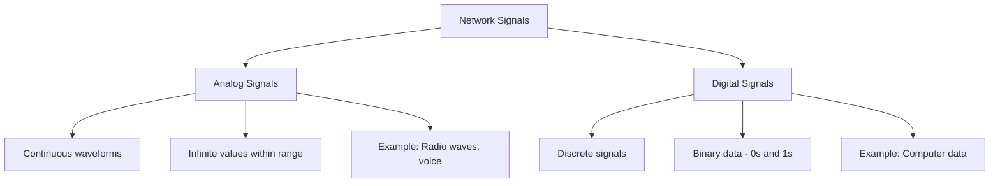
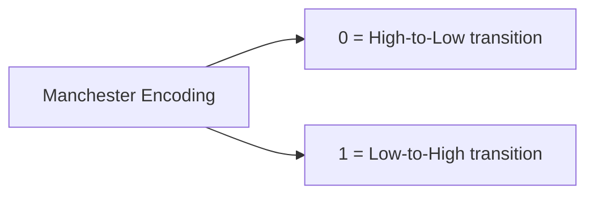

# Network Signals

## Introduction

At the heart of all network communication lies a fundamental concept: **signals**. When you send a message, browse a website, or stream a video, your data is transformed into signals that travel across various media to reach its destination. These signals form the foundation of the physical layer in the OSI network model.

In this tutorial, we'll explore what network signals are, how they work, and why they matter for anyone learning about network communication. Whether signals travel through copper wires, fiber optic cables, or wirelessly through the air, understanding their properties is essential for grasping how modern networks function.

## What Are Network Signals?

Network signals are the physical representation of data as it travels across a communication medium. They are the actual electrical voltages, light pulses, or radio waves that carry your information from one device to another.

### Types of Network Signals

Network signals generally fall into two main categories:

1. **Analog Signals**: Continuous waveforms that can have infinite values within a range
2. **Digital Signals**: Discrete signals that represent binary data (0s and 1s)

Let's visualize these two types:



## Digital Signals in Computer Networks

Most modern computer networks primarily use digital signals. Let's examine why and how they work.

### Binary Representation

Digital signals represent data using binary code - sequences of 0s and 1s. In physical terms:
- A **high state** (often a higher voltage) represents a binary 1
- A **low state** (often a lower voltage) represents a binary 0

For example, the ASCII representation of the letter 'A' is 65 in decimal, which is `01000001` in binary.

```js
// Example: Converting a character to its binary representation
const letter = 'A';
const asciiCode = letter.charCodeAt(0);
const binaryRepresentation = asciiCode.toString(2).padStart(8, '0');

console.log(`The letter ${letter} has ASCII code ${asciiCode}`);
console.log(`In binary: ${binaryRepresentation}`);

// Output:
// The letter A has ASCII code 65
// In binary: 01000001
```

## Signal Characteristics

Network signals have several important characteristics that affect how data is transmitted:

### 1. Amplitude

Amplitude represents the strength of a signal, often measured in volts for electrical signals or decibels for wireless signals.

### 2. Frequency

Frequency is the number of complete waveform cycles that occur per second, measured in Hertz (Hz). Higher frequencies can potentially carry more data but may not travel as far.

### 3. Phase

Phase describes the position of a waveform relative to a reference point, measured in degrees.

### 4. Bandwidth

Bandwidth represents the range of frequencies that a signal occupies. In digital communications, bandwidth often correlates with the data transmission capacity.

## Signal Encoding Techniques

To transmit data efficiently and reliably, networks use various encoding techniques to convert binary data into signals. Here are some common methods:

### Non-Return-to-Zero (NRZ)

In NRZ encoding, a high voltage represents a 1, and a low voltage represents a 0.

### Manchester Encoding

Manchester encoding represents 0 as a high-to-low transition and 1 as a low-to-high transition (or vice versa, depending on the convention). This ensures that each bit has a transition, making clock recovery easier.



Let's see a simple example of how Manchester encoding works:

```js
// Simple function to demonstrate Manchester encoding
function manchesterEncode(binaryData) {
  let manchesterCode = '';
  
  for (let bit of binaryData) {
    if (bit === '0') {
      manchesterCode += '10'; // High-to-Low for 0
    } else if (bit === '1') {
      manchesterCode += '01'; // Low-to-High for 1
    }
  }
  
  return manchesterCode;
}

const data = '10110';
const encoded = manchesterEncode(data);

console.log(`Original data: ${data}`);
console.log(`Manchester encoded: ${encoded}`);

// Output:
// Original data: 10110
// Manchester encoded: 0110011001
```

## Signal Modulation

Modulation is the process of varying one or more properties of a carrier signal to transmit data. It's especially important for wireless and long-distance communications.

### Common Modulation Techniques

1. **Amplitude Modulation (AM)**: Varies the amplitude of the carrier signal
2. **Frequency Modulation (FM)**: Varies the frequency of the carrier signal
3. **Phase Modulation (PM)**: Varies the phase of the carrier signal
4. **Quadrature Amplitude Modulation (QAM)**: Combines amplitude and phase modulation

For digital communication, we use specific forms of these techniques:

- **Amplitude Shift Keying (ASK)**
- **Frequency Shift Keying (FSK)**
- **Phase Shift Keying (PSK)**

## Signal Propagation and Transmission Media

Signals travel through different media, each with its own characteristics:

### 1. Copper Wire

Electrical signals travel through copper wires in many network types:

- **Twisted Pair**: Used in Ethernet cables (Cat5e, Cat6, etc.)
- **Coaxial Cable**: Used in cable television and some older networks

```js
// Example: Calculating signal propagation time in copper wire
function calculatePropagationTime(distanceInMeters) {
  // Signal travels at about 2/3 the speed of light in copper
  const speedOfLightInVacuum = 299792458; // meters per second
  const speedInCopper = speedOfLightInVacuum * (2/3);
  
  return (distanceInMeters / speedInCopper) * 1000; // Convert to milliseconds
}

const distance = 100; // meters
const time = calculatePropagationTime(distance);

console.log(`Time to propagate ${distance}m in copper: ${time.toFixed(3)} milliseconds`);

// Output:
// Time to propagate 100m in copper: 0.500 milliseconds
```

### 2. Fiber Optic Cable

Light pulses travel through glass or plastic fibers:
- Higher bandwidth
- Longer distances
- Immune to electromagnetic interference
- More expensive than copper

### 3. Wireless

Electromagnetic waves travel through air:
- Radio waves (WiFi, cellular)
- Microwave
- Infrared
- Susceptible to interference and attenuation

## Real-World Applications

### Network Troubleshooting with Signal Analysis

Network engineers often use tools like oscilloscopes or spectrum analyzers to examine signal quality:

```js
// Pseudocode for basic signal strength analysis
function analyzeSignalQuality(signalStrength) {
  if (signalStrength > -50) {
    return "Excellent signal strength";
  } else if (signalStrength > -70) {
    return "Good signal strength";
  } else if (signalStrength > -80) {
    return "Fair signal strength";
  } else {
    return "Poor signal strength, connection may be unstable";
  }
}

// Example WiFi signal strength in dBm
const wifiSignal = -65;
console.log(analyzeSignalQuality(wifiSignal));

// Output:
// Good signal strength
```

### Signal-to-Noise Ratio

A critical measure of signal quality is the Signal-to-Noise Ratio (SNR):

```js
// Example: Calculating Signal-to-Noise Ratio
function calculateSNR(signalPower, noisePower) {
  // SNR in decibels
  return 10 * Math.log10(signalPower / noisePower);
}

const signalPower = 0.1; // watts
const noisePower = 0.001; // watts
const snr = calculateSNR(signalPower, noisePower);

console.log(`Signal Power: ${signalPower} W`);
console.log(`Noise Power: ${noisePower} W`);
console.log(`SNR: ${snr.toFixed(2)} dB`);

// Output:
// Signal Power: 0.1 W
// Noise Power: 0.001 W
// SNR: 20.00 dB
```

### Ethernet Signal Standards

Different Ethernet standards use different signaling methods:

- **10BASE-T**: Uses Manchester encoding at 10 Mbps
- **100BASE-TX**: Uses MLT-3 encoding at 100 Mbps
- **1000BASE-T**: Uses PAM-5 encoding at 1000 Mbps (1 Gbps)

## Common Signal Problems

### Attenuation

Signal strength naturally decreases over distance:

```js
// Example: Calculating signal attenuation
function calculateAttenuation(distanceInMeters, attenuationPerMeter) {
  return distanceInMeters * attenuationPerMeter;
}

const distance = 100; // meters
const attenPerMeter = 0.1; // dB per meter (hypothetical value)
const totalAttenuation = calculateAttenuation(distance, attenPerMeter);

console.log(`Signal loss over ${distance}m: ${totalAttenuation.toFixed(1)} dB`);

// Output:
// Signal loss over 100m: 10.0 dB
```

### Interference

External signals can disrupt network communication. Common sources include:
- Other electronic devices
- Power lines
- Microwave ovens
- Adjacent wireless networks

### Noise

Random electrical signals that degrade communication quality.

## Summary

Network signals form the foundation of all data communication. Understanding how these signals work helps you grasp:

1. How information is physically transmitted across networks
2. Why different media types (copper, fiber, wireless) have different capabilities
3. How encoding and modulation techniques enable efficient communication
4. Common issues that can affect network performance

This knowledge is vital for both network design and troubleshooting. As you continue learning about networking, remember that every higher-level protocol ultimately depends on these physical signals to function.

## Exercises

1. Research and compare the maximum distances and data rates for Category 5e, Category 6, and fiber optic cables.
2. Calculate the time it would take a signal to travel 1 km in both copper wire and fiber optic cable.
3. List three sources of electromagnetic interference that might affect wireless network signals in your home or office.
4. Explain how Manchester encoding helps solve the clock recovery problem.
5. Compare the advantages and disadvantages of wired versus wireless signals for network communication.

## Further Resources

- Books on network fundamentals
- Online network simulation tools 
- Professional certifications like CompTIA Network+
- Online courses about networking basics