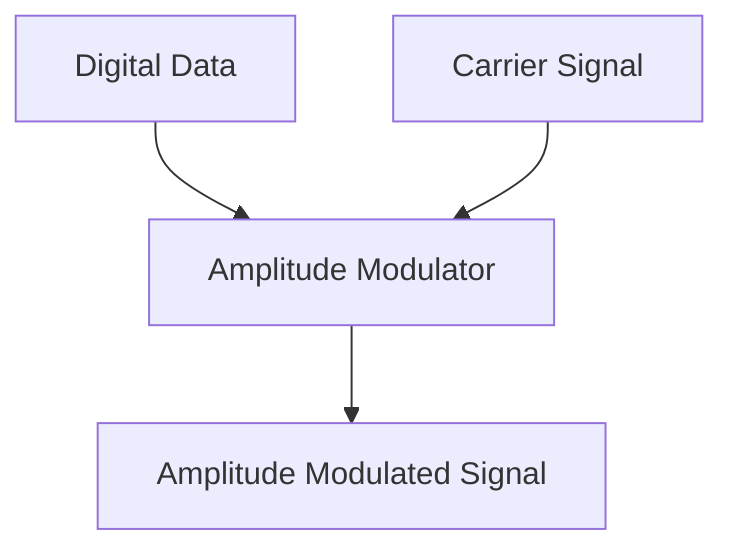
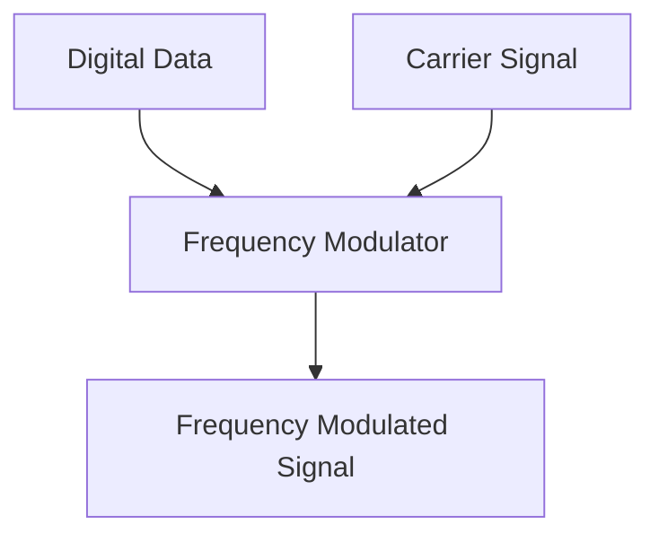
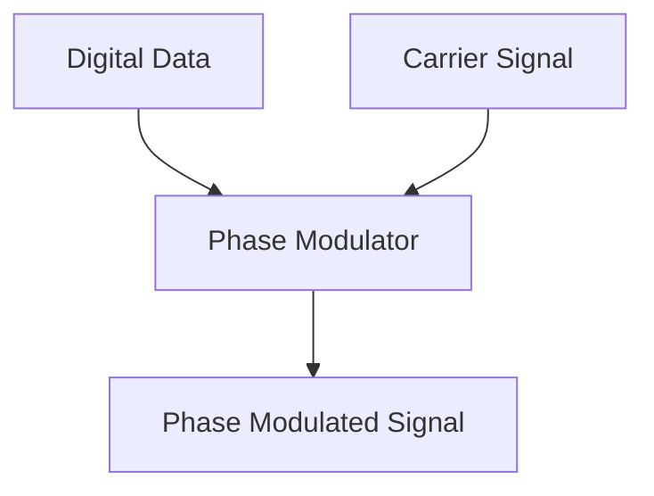
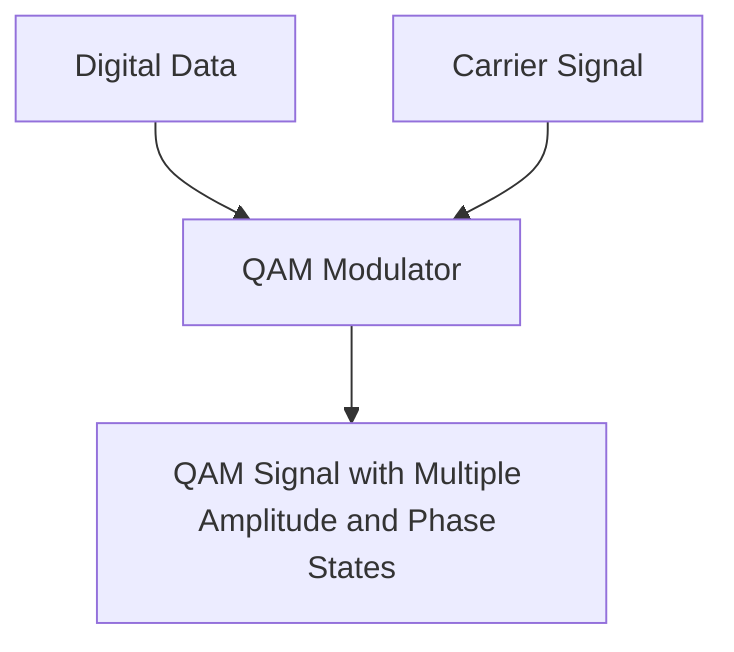
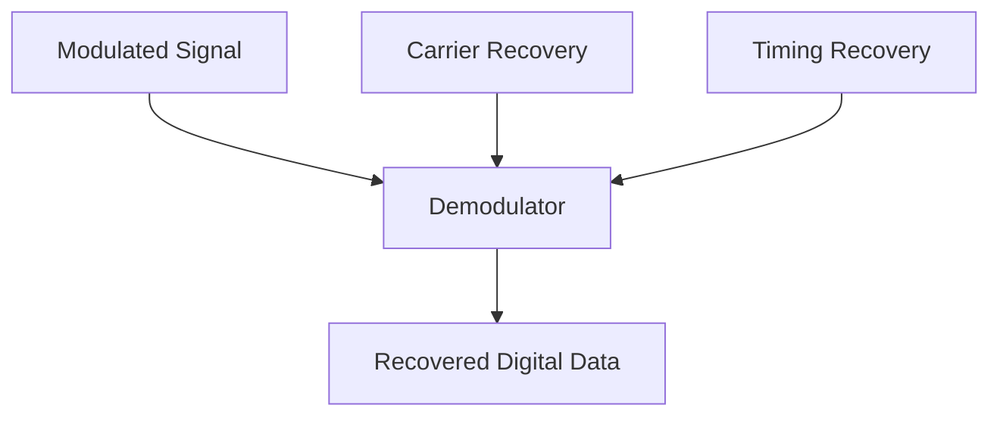

# Networks Modulation

## Introduction

Modulation is a fundamental concept in network communications that forms the backbone of how digital data travels across physical media. In the simplest terms, modulation is the process of converting digital data (1s and 0s) into signals that can be transmitted over a communication channel, like a wire, fiber optic cable, or wireless medium.

Think of modulation as a translator between the digital world of computers and the analog world of physical transmission. Without modulation, our digital devices would be isolated islands, unable to communicate with each other across distances.

## Why Do We Need Modulation?

Before diving into the various modulation techniques, let's understand why modulation is necessary:

1. **Physical Limitations**: Digital signals (sharp transitions between 1 and 0) are susceptible to distortion over long distances.
2. **Efficient Transmission**: Modulation allows multiple signals to share the same physical medium through frequency division.
3. **Noise Resistance**: Certain modulation techniques make signals more resistant to noise and interference.
4. **Channel Adaptation**: Modulation can be optimized for specific channel characteristics.

## Basic Types of Modulation

Let's explore the three fundamental modulation techniques used in network communications:

### 1. Amplitude Modulation (AM)

Amplitude Modulation varies the **amplitude** (height) of a carrier signal to represent digital data.



In AM:
- A '1' bit might be represented by a high-amplitude wave
- A '0' bit might be represented by a low-amplitude wave

The frequency and phase remain constant while only the amplitude changes.

Example representation:

```
Digital Data:   1     0     1     1     0
               _|_    _     _|_   _|_    _
              | | |  | |   | | |  | | |  | |
AM Signal:    | | |  | |   | | |  | | |  | |
              |_|_|  |_|   |_|_|  |_|_|  |_|
              High   Low   High   High   Low
```

### 2. Frequency Modulation (FM)

Frequency Modulation varies the **frequency** (rate of oscillation) of a carrier signal to represent digital data.



In FM:
- A '1' bit might be represented by a high-frequency wave
- A '0' bit might be represented by a low-frequency wave

The amplitude and phase remain constant while only the frequency changes.

Example representation:

```
Digital Data:    1         0         1         1         0
               _____     _____     _____     _____     _____
              /|/|/|    /~~~\     /|/|/|    /|/|/|    /~~~\
FM Signal:   / | | |   /     \   / | | |   / | | |   /     \
            /__|_|_|  /_______\ /__|_|_|  /__|_|_|  /_______\
              High      Low       High      High      Low
              Freq      Freq      Freq      Freq      Freq
```

### 3. Phase Modulation (PM)

Phase Modulation varies the **phase** (timing of oscillations) of a carrier signal to represent digital data.



In PM:
- A '1' bit might be represented by a 180-degree phase shift
- A '0' bit might be represented by no phase shift

The amplitude and frequency remain constant while only the phase changes.

Example representation:

```
Digital Data:    1     0     1     1     0
               _____  ___   _____  _____  ___
              /     \|   | /     \|     \|   |
PM Signal:   /       \   |/       \      \   |
            /         \  /         \      \  |
           /           \/           \      \ |
          |             |            |      \|
          Phase shift   No shift     Shift  Shift  No shift
```

## Digital Modulation Techniques

In modern networks, we primarily use digital modulation techniques, which are more complex variations and combinations of the basic modulation types. Let's explore some common digital modulation schemes:

### Amplitude Shift Keying (ASK)

ASK is the digital version of AM, where the amplitude of the carrier signal is varied to represent binary data.

```js
// Simplified ASK modulation in JavaScript
function generateASKSignal(digitalData, carrierFreq, samplingRate) {
  const result = [];
  const samplesPerBit = samplingRate / bitRate;
  
  for (let i = 0; i < digitalData.length; i++) {
    const amplitude = digitalData[i] === 1 ? 1.0 : 0.5; // High amplitude for 1, low for 0
    
    for (let j = 0; j < samplesPerBit; j++) {
      const time = (i * samplesPerBit + j) / samplingRate;
      result.push(amplitude * Math.sin(2 * Math.PI * carrierFreq * time));
    }
  }
  
  return result;
}

// Example usage:
const binaryData = [1, 0, 1, 1, 0];
const modulatedSignal = generateASKSignal(binaryData, 1000, 8000);
```

**Advantages of ASK:**
- Simple to implement
- Requires less bandwidth

**Disadvantages of ASK:**
- Very susceptible to noise and interference
- Less power-efficient

### Frequency Shift Keying (FSK)

FSK is the digital version of FM, where different frequencies represent different binary values.

```js
// Simplified FSK modulation in JavaScript
function generateFSKSignal(digitalData, carrierFreq1, carrierFreq2, samplingRate) {
  const result = [];
  const samplesPerBit = samplingRate / bitRate;
  
  for (let i = 0; i < digitalData.length; i++) {
    const frequency = digitalData[i] === 1 ? carrierFreq1 : carrierFreq2;
    
    for (let j = 0; j < samplesPerBit; j++) {
      const time = (i * samplesPerBit + j) / samplingRate;
      result.push(Math.sin(2 * Math.PI * frequency * time));
    }
  }
  
  return result;
}

// Example usage:
const binaryData = [1, 0, 1, 1, 0];
const modulatedSignal = generateFSKSignal(binaryData, 1200, 2200, 8000);
```

**Advantages of FSK:**
- More noise-resistant than ASK
- Better performance in poor signal conditions

**Disadvantages of FSK:**
- Requires greater bandwidth
- More complex to implement

### Phase Shift Keying (PSK)

PSK is the digital version of PM, where the phase of the carrier signal is varied to represent digital data.

Binary PSK (BPSK) uses two phases (usually 0° and 180°) to represent the two binary digits.

```js
// Simplified BPSK modulation in JavaScript
function generateBPSKSignal(digitalData, carrierFreq, samplingRate) {
  const result = [];
  const samplesPerBit = samplingRate / bitRate;
  
  for (let i = 0; i < digitalData.length; i++) {
    const phaseShift = digitalData[i] === 1 ? 0 : Math.PI; // 0 or 180 degrees
    
    for (let j = 0; j < samplesPerBit; j++) {
      const time = (i * samplesPerBit + j) / samplingRate;
      result.push(Math.sin(2 * Math.PI * carrierFreq * time + phaseShift));
    }
  }
  
  return result;
}

// Example usage:
const binaryData = [1, 0, 1, 1, 0];
const modulatedSignal = generateBPSKSignal(binaryData, 1000, 8000);
```

**Advantages of PSK:**
- More power-efficient than ASK and FSK
- Good noise immunity
- Better bandwidth efficiency

**Disadvantages of PSK:**
- More complex to implement and detect
- Requires coherent detection

### Quadrature Amplitude Modulation (QAM)

QAM combines both amplitude and phase modulation to transmit two digital bit streams or to transmit digital data over an analog channel.



QAM allows for more bits to be transmitted per symbol by using multiple amplitude levels and multiple phases. For example, 16-QAM uses 16 different combinations of amplitude and phase, allowing 4 bits (2^4 = 16) to be transmitted per symbol.

**Advantages of QAM:**
- Very high spectral efficiency
- Allows for high data rates
- Forms the basis for many modern communication systems (Wi-Fi, cable modems, etc.)

**Disadvantages of QAM:**
- Complex to implement
- More susceptible to noise at higher orders (like 64-QAM, 256-QAM)
- Requires more sophisticated hardware

## Real-World Applications of Modulation

Let's explore how these modulation techniques are used in practical networking scenarios:

### 1. Dial-up Modems

The original modems (MOdulator-DEModulator) used FSK to send digital data over analog telephone lines:
- The term "baud rate" refers to the symbol rate in modulation
- Early modems used 300 bauds with FSK
- Later modems achieved 56 Kbps using more complex QAM techniques

### 2. DSL (Digital Subscriber Line)

DSL uses complex modulation techniques to transmit digital data over the copper telephone wires:
- Uses Discrete Multi-Tone (DMT) modulation, a form of multicarrier modulation
- Different frequencies carry different data streams simultaneously
- ADSL splits the channel into upstream and downstream portions

### 3. Wi-Fi Networks

Modern Wi-Fi standards use sophisticated modulation schemes:
- 802.11b uses DSSS (Direct Sequence Spread Spectrum) with variants of PSK
- 802.11a/g/n/ac use OFDM (Orthogonal Frequency Division Multiplexing) with combinations of PSK and QAM
- Higher-order modulation (like 256-QAM) is used in newer standards for higher data rates under good signal conditions

### 4. Mobile Networks

Cellular networks employ adaptive modulation techniques:
- GSM used GMSK (Gaussian Minimum Shift Keying), a type of FSK
- 3G/4G/5G networks use adaptive modulation that switches between QPSK, 16-QAM, 64-QAM, and even 256-QAM based on signal quality
- The system automatically selects the most efficient modulation scheme that the channel can support

## Demodulation: The Reverse Process

Demodulation is the process of extracting the original digital data from the modulated signal at the receiver.



The demodulation process involves:
1. **Carrier Recovery**: Extracting or regenerating the carrier signal
2. **Timing Recovery**: Determining the correct timing for sampling the signal
3. **Decision Making**: Determining which symbol or bit was most likely transmitted
4. **Error Correction**: Applying error correction techniques if available

## Practical Example: Implementing a Simple Modulator

Let's create a simple FSK modulator in Python to demonstrate how bits can be converted to an audio signal:

```python
import numpy as np
import matplotlib.pyplot as plt
from scipy.io import wavfile

def generate_fsk_signal(bits, sample_rate=44100, bit_duration=0.1, freq_0=1000, freq_1=2000):
    """Generate an FSK signal from a bit sequence."""
    t = np.linspace(0, bit_duration, int(sample_rate * bit_duration), endpoint=False)
    
    # Create the carrier waves for 0 and 1
    carrier_0 = np.sin(2 * np.pi * freq_0 * t)
    carrier_1 = np.sin(2 * np.pi * freq_1 * t)
    
    # Generate the signal by concatenating the appropriate carrier for each bit
    signal = np.array([])
    for bit in bits:
        if bit == 0:
            signal = np.append(signal, carrier_0)
        else:
            signal = np.append(signal, carrier_1)
    
    return signal

# Example usage
bits = [1, 0, 1, 1, 0, 0, 1]
signal = generate_fsk_signal(bits)

# Plot the signal
t = np.linspace(0, len(bits) * 0.1, len(signal), endpoint=False)
plt.figure(figsize=(12, 4))
plt.plot(t, signal)
plt.title('FSK Modulated Signal')
plt.xlabel('Time (s)')
plt.ylabel('Amplitude')
plt.grid(True)
plt.tight_layout()

# Save as a WAV file
wavfile.write('fsk_signal.wav', 44100, signal.astype(np.float32))
```

This code creates an FSK modulated audio signal where a frequency of 1000 Hz represents a '0' bit and 2000 Hz represents a '1' bit. You can play the resulting WAV file to hear the modulated data!

## Advanced Concepts in Modulation

As you advance in your networking studies, you'll encounter these more complex modulation concepts:

### 1. Spread Spectrum Techniques

These techniques spread a signal over a wider frequency band, providing better security and resistance to interference:

- **DSSS (Direct Sequence Spread Spectrum)**: Multiplies the data by a high-rate pseudorandom sequence
- **FHSS (Frequency Hopping Spread Spectrum)**: Rapidly switches carrier frequency according to a pseudorandom sequence

### 2. OFDM (Orthogonal Frequency Division Multiplexing)

OFDM divides a channel into multiple subcarriers, each modulated with a conventional modulation scheme:

- Used in Wi-Fi, 4G/5G, digital TV broadcasting
- Highly efficient for high-speed data transmission
- Better handles multipath interference

### 3. Adaptive Modulation

Modern systems can change their modulation scheme based on channel conditions:

- In good conditions, higher-order modulation (64-QAM, 256-QAM) for faster data rates
- In poor conditions, simpler modulation (QPSK, BPSK) for more reliable transmission

## Summary

Modulation is the critical process that allows digital data to traverse physical media in networks. We've explored:

- The basic principles of modulation: changing a carrier signal's amplitude, frequency, or phase
- Common digital modulation techniques: ASK, FSK, PSK, and QAM
- Real-world applications of modulation in various networking technologies
- A simplified implementation of an FSK modulator
- Advanced modulation concepts you'll encounter as you progress

Understanding modulation helps you grasp how bits and bytes move through the physical layer of networks, forming the foundation for all higher-level networking protocols and applications.

## Exercises

1. **Conceptual Exercise**: Explain why higher-order modulation schemes (like 256-QAM) can deliver higher data rates but are more susceptible to noise compared to simpler schemes like BPSK.

2. **Calculation Exercise**: If a system uses QPSK modulation (2 bits per symbol) with a symbol rate of 1000 symbols per second, what is the data rate in bits per second? How would this change if 16-QAM (4 bits per symbol) were used instead?

3. **Programming Exercise**: Modify the Python FSK example to implement ASK modulation. Use an amplitude of 1.0 for bit '1' and 0.5 for bit '0'.

4. **Research Exercise**: Investigate how 5G networks use adaptive modulation and coding. What modulation schemes are employed, and how does the system decide which to use?

## Additional Resources

- **Books**: 
  - "Digital Communications" by John Proakis
  - "Wireless Communications: Principles and Practice" by Theodore Rappaport

- **Online Resources**:
  - Signal Processing Stack Exchange
  - IEEE Communications Society resources
  - YouTube channels like "Signal Processing 101"

- **Tools**:
  - GNU Radio: Open-source software for implementing software-defined radios
  - MATLAB/Octave: Excellent for simulating modulation techniques