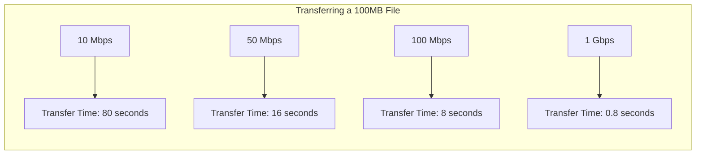
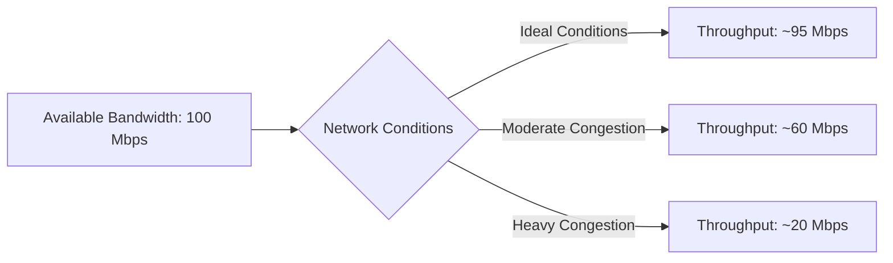

# Networks Bandwidth

## Introduction

Bandwidth is one of the most fundamental concepts in networking, yet it's often misunderstood. In this article, we'll explore what bandwidth actually means, how it's measured, and why it's critical to network performance. Whether you're setting up a home network or learning about enterprise infrastructure, understanding bandwidth will help you make better decisions about network design and troubleshooting.

## What is Bandwidth?

In networking, **bandwidth** refers to the maximum rate of data transfer across a given path. Think of it as the capacity of a pipe - the wider the pipe, the more water can flow through it at once. Similarly, the higher the bandwidth, the more data can be transmitted over a network connection in a given amount of time.

It's important to distinguish between bandwidth and these related concepts:

- **Bandwidth**: The maximum data transfer capacity
- **Throughput**: The actual amount of data successfully transferred
- **Latency**: The time it takes for data to travel from source to destination
- **Speed**: Often used interchangeably with bandwidth, but technically different

## Measuring Bandwidth

Bandwidth is typically measured in bits per second (bps) and its multiples:

- Kilobits per second (Kbps) = 1,000 bps
- Megabits per second (Mbps) = 1,000,000 bps
- Gigabits per second (Gbps) = 1,000,000,000 bps
- Terabits per second (Tbps) = 1,000,000,000,000 bps

It's worth noting that bits (b) are different from bytes (B). Since a byte consists of 8 bits, a 100 Mbps connection can transfer approximately 12.5 megabytes per second (MBps).

Let's visualize different bandwidth scenarios with a simple diagram:



## How Bandwidth Works at the Physical Layer

At the physical layer of the OSI model, bandwidth is determined by several factors:

### 1. Physical Medium

Different types of transmission media offer different bandwidth capacities:

- **Copper wire** (e.g., Cat5e, Cat6): Up to 1 Gbps (Cat5e) or 10 Gbps (Cat6)
- **Fiber optic cable**: From 10 Gbps to multiple Tbps
- **Wireless (Wi-Fi)**: Up to 9.6 Gbps (Wi-Fi 6)
- **Coaxial cable**: Up to 1 Gbps

### 2. Signal Encoding

How data is encoded into physical signals affects the maximum bandwidth:

```
Digital Data → [Encoding Method] → Physical Signal
```

Common encoding methods include:
- Manchester encoding
- NRZ (Non-Return to Zero)
- 4B/5B encoding
- QAM (Quadrature Amplitude Modulation)

### 3. Frequency Range

In telecommunications, bandwidth also refers to the range of frequencies used for transmitting signals. A wider frequency range typically allows for higher data transfer rates.

## Calculating Bandwidth Requirements

To estimate the bandwidth needed for a specific application, you can use the following formula:

```
Required Bandwidth = Data Size / Acceptable Transfer Time
```

For example, if you need to transfer a 1 GB file in 2 minutes:

```
1 GB = 8 Gb (gigabits)
2 minutes = 120 seconds
Required Bandwidth = 8 Gb / 120 s = 0.067 Gbps or 67 Mbps
```

Here's a simple JavaScript function to calculate bandwidth requirements:

```javascript
function calculateBandwidth(dataSizeInGB, transferTimeInMinutes) {
  // Convert GB to Gb (gigabits)
  const dataSizeInGb = dataSizeInGB * 8;
  
  // Convert minutes to seconds
  const transferTimeInSeconds = transferTimeInMinutes * 60;
  
  // Calculate bandwidth in Gbps
  const bandwidthInGbps = dataSizeInGb / transferTimeInSeconds;
  
  // Convert to Mbps if less than 1 Gbps
  if (bandwidthInGbps < 1) {
    return `${(bandwidthInGbps * 1000).toFixed(2)} Mbps`;
  }
  
  return `${bandwidthInGbps.toFixed(2)} Gbps`;
}

// Example usage
console.log(calculateBandwidth(1, 2)); // Output: "67.00 Mbps"
```

## Bandwidth vs. Throughput

While bandwidth represents the maximum capacity, throughput is the actual rate of successful data transfer. Throughput is always less than or equal to bandwidth due to various factors:

- **Network congestion**: When too many devices share the same bandwidth
- **Protocol overhead**: Headers and error-checking data that consume bandwidth
- **Packet loss**: When data packets need to be retransmitted
- **Hardware limitations**: Routers, switches, and network cards have processing limits

Let's represent the relationship with a simple diagram:



## Bandwidth in Different Contexts

### Internet Service Providers (ISPs)

When an ISP advertises "up to 100 Mbps," they're referring to the maximum bandwidth they provide. Your actual throughput may vary based on:

- Time of day (peak vs. off-peak hours)
- Number of users on the same network segment
- Quality of your connection
- Distance from the provider's equipment

### Local Area Networks (LANs)

In a LAN, bandwidth is determined by:

- Network hardware (switches, routers)
- Cabling type and quality
- Network interface cards (NICs)
- Network configuration

## Practical Example: Measuring Your Network's Bandwidth

You can measure your network's bandwidth using various online tools or command-line utilities.

Here's how you can use the `iperf` tool to measure bandwidth between two points on a network:

1. On the server side:

```bash
# Start an iperf server
iperf -s
```

2. On the client side:

```bash
# Connect to the server and run a bandwidth test
iperf -c server_ip_address
```

Sample output:

```
------------------------------------------------------------
Client connecting to 192.168.1.5, TCP port 5001
TCP window size: 85.3 KByte (default)
------------------------------------------------------------
[ 3] local 192.168.1.10 port 51124 connected with 192.168.1.5 port 5001
[ ID] Interval       Transfer     Bandwidth
[ 3]  0.0-10.0 sec   112 MBytes   94.1 Mbits/sec
```

## Bandwidth Limitations and Bottlenecks

Network performance is only as good as its weakest link. Common bandwidth bottlenecks include:

1. **Last-mile connection**: The final leg of the connection to your home or office
2. **Oversubscription**: When an ISP sells more bandwidth than they can provide
3. **Hardware limitations**: Outdated routers, switches, or network cards
4. **Wireless interference**: Signal degradation in Wi-Fi networks
5. **Network congestion**: High traffic during peak usage times

## Managing Bandwidth

Several techniques can help optimize bandwidth usage:

### 1. Quality of Service (QoS)

QoS allows network administrators to prioritize certain types of traffic:

```javascript
// Pseudo-code for QoS configuration
const qosRules = [
  { application: "VoIP", priority: "high" },
  { application: "VideoStreaming", priority: "medium" },
  { application: "FileDownload", priority: "low" }
];
```

### 2. Bandwidth Throttling

Limiting bandwidth for specific applications or users:

```javascript
// Pseudo-code for bandwidth throttling
function limitBandwidth(user, applicationtype, maxBandwidth) {
  if (applicationtype === "video" && user.type === "free") {
    return Math.min(userCurrentBandwidth, maxBandwidth);
  }
  return userCurrentBandwidth;
}
```

### 3. Caching

Storing frequently accessed content locally to reduce bandwidth usage:

```javascript
// Pseudo-code for a simple cache
const cache = new Map();

function fetchResource(url) {
  if (cache.has(url)) {
    return cache.get(url); // Return cached version
  }
  
  const resource = downloadResource(url);
  cache.set(url, resource); // Cache for future use
  return resource;
}
```

## Real-World Applications

### Streaming Services

Streaming platforms like Netflix and YouTube adjust video quality based on available bandwidth:

| Available Bandwidth | Video Quality |
|---------------------|---------------|
| < 0.5 Mbps          | Cannot stream |
| 0.5 - 2.5 Mbps      | SD (480p)     |
| 2.5 - 5 Mbps        | HD (720p)     |
| 5 - 15 Mbps         | Full HD (1080p) |
| > 15 Mbps           | 4K UHD        |

### Video Conferencing

Video conferencing applications require sufficient bandwidth for smooth communication:

- Audio only: ~100 Kbps
- Standard quality video: 300-500 Kbps
- HD video: 1.5-3 Mbps
- Group video conference: 3-5 Mbps

### Cloud Computing

Cloud services rely heavily on high-bandwidth connections, especially for:

- Data backup and recovery
- Infrastructure as a Service (IaaS)
- Software as a Service (SaaS)
- Big data processing

## Summary

Bandwidth is a fundamental concept in networking that describes the maximum data transfer capacity of a connection. It's influenced by physical media, signal encoding techniques, and network configurations. While bandwidth represents theoretical capacity, actual throughput is affected by various factors including congestion, protocol overhead, and hardware limitations.

Understanding bandwidth helps in designing efficient networks, troubleshooting performance issues, and making informed decisions about network infrastructure. As technology continues to evolve, bandwidth requirements grow correspondingly, making this knowledge increasingly valuable.

## Further Resources and Exercises

### Resources
- RFC 2544: Benchmarking Methodology for Network Interconnect Devices
- Cisco Networking Academy courses on network fundamentals
- "Computer Networks" by Andrew S. Tanenbaum

### Exercises

1. **Bandwidth Calculator**: Develop a simple web tool that calculates required bandwidth based on file size and desired transfer time.

2. **Network Analysis**: Use tools like Wireshark to capture and analyze network traffic on your local network, observing how bandwidth is utilized by different applications.

3. **Simulated Network**: Using virtual machines or network simulation software, create a network with artificial bandwidth limitations and observe how different applications perform.

4. **Bandwidth Monitoring**: Set up a bandwidth monitoring system on your home network using open-source tools like LibreNMS or Zabbix.

5. **Research Project**: Compare the bandwidth requirements of different streaming services and analyze how they adapt to varying network conditions.