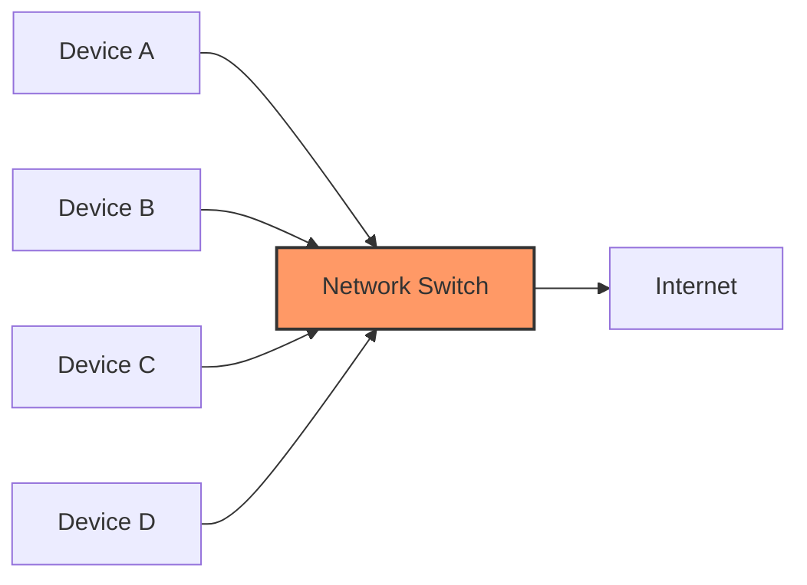
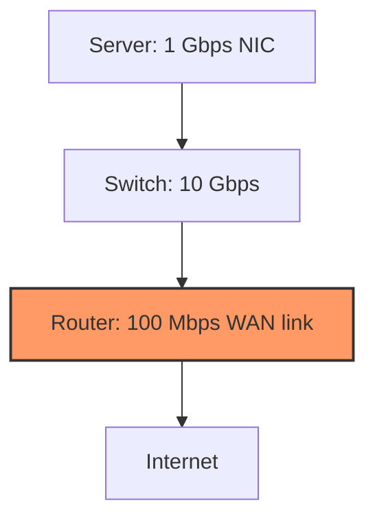

# Networks Throughput

## Introduction

Network throughput is one of the most important metrics for evaluating network performance. It measures how much data can be successfully transferred from one point to another in a given amount of time. For beginners learning about computer networks, understanding throughput is essential as it directly impacts how quickly data moves across a network.

In this article, we'll explore what network throughput is, the factors that affect it, how to measure it, and practical applications in real-world scenarios.

## What is Network Throughput?

Network throughput refers to the actual amount of data that is successfully transmitted over a communication channel within a given timeframe. It is typically measured in bits per second (bps), with common units including:

- Kilobits per second (Kbps)
- Megabits per second (Mbps)
- Gigabits per second (Gbps)

It's important to distinguish throughput from other similar networking terms:

| Term | Definition |
|------|------------|
| Throughput | Actual amount of data transferred successfully |
| Bandwidth | Maximum theoretical data transfer capacity |
| Goodput | Actual usable data received (excluding protocol overhead) |
| Latency | Time delay between sending and receiving data |

## Factors Affecting Network Throughput

Several factors can impact network throughput:

### 1. Physical Medium Limitations

The physical medium used for network transmission has inherent limitations:

- **Copper cables**: Subject to attenuation and electromagnetic interference
- **Fiber optic cables**: Higher bandwidth but more expensive
- **Wireless**: Subject to interference, distance limitations, and signal degradation

### 2. Network Protocols and Overhead

Every network protocol adds some overhead:

```
+-----------------+-------------+-------------------+
|   Data Header   |  User Data  |   Data Trailer   |
| (Protocol Info) | (Payload)   | (Error Checking) |
+-----------------+-------------+-------------------+
```

For example, in TCP/IP communications, the headers can consume significant bandwidth:

```javascript
// Simplified representation of overhead calculation
const packetSize = 1500; // bytes (typical MTU)
const tcpHeaderSize = 20; // bytes
const ipHeaderSize = 20; // bytes
const payload = packetSize - tcpHeaderSize - ipHeaderSize;
const efficiency = (payload / packetSize) * 100;

console.log(`Payload size: ${payload} bytes`);
console.log(`Protocol efficiency: ${efficiency.toFixed(2)}%`);
// Output:
// Payload size: 1460 bytes
// Protocol efficiency: 97.33%
```

### 3. Network Congestion

When too many devices compete for the same network resources, congestion occurs:



### 4. Hardware Limitations

Network throughput can be bottlenecked by:

- Router/switch processing capacity
- Network interface card (NIC) capabilities
- End device processing power

### 5. Network Design and Configuration

- Distance between nodes
- Number of hops (routers/switches) between source and destination
- Quality of Service (QoS) settings

## Measuring Network Throughput

### Theoretical Maximum Throughput

The theoretical maximum throughput can be calculated using the following formula:

```
Theoretical Throughput = Bandwidth × (1 - Overhead)
```

Where:
- Bandwidth is the maximum data rate of the channel
- Overhead represents protocol headers, error correction, etc.

### Practical Measurement

In practice, we use tools to measure actual throughput:

```bash
# Using iperf3 to measure network throughput
# On server side
iperf3 -s

# On client side
iperf3 -c server_ip
```

Sample output:
```
[ ID] Interval       Transfer     Bandwidth
[  4]  0.00-10.00 sec  112 MBytes  94.1 Mbits/sec
```

## Shannon's Capacity Theorem

For theoretical understanding, Claude Shannon's capacity theorem helps determine the maximum data rate for a given channel:

```
C = B × log₂(1 + S/N)
```

Where:
- C is the channel capacity in bits per second
- B is the bandwidth of the channel in Hz
- S/N is the signal-to-noise ratio

## Real-World Examples

### Example 1: Home Internet Connection

Consider a typical home internet connection:

```javascript
// Calculating actual throughput with overhead
const advertisedSpeed = 100; // Mbps
const overheadPercentage = 5; // %
const actualThroughput = advertisedSpeed * (1 - (overheadPercentage/100));

console.log(`Advertised speed: ${advertisedSpeed} Mbps`);
console.log(`Actual expected throughput: ${actualThroughput} Mbps`);
// Output:
// Advertised speed: 100 Mbps
// Actual expected throughput: 95 Mbps
```

### Example 2: File Transfer Time

Calculating how long it will take to transfer a file:

```javascript
// Calculate file transfer time
function calculateTransferTime(fileSize, throughput) {
    // fileSize in MB, throughput in Mbps
    const fileSizeInBits = fileSize * 8 * 1024 * 1024;
    const timeInSeconds = fileSizeInBits / (throughput * 1000000);
    return timeInSeconds;
}

const fileSize = 1000; // MB
const throughput = 75; // Mbps

const transferTime = calculateTransferTime(fileSize, throughput);
console.log(`Time to transfer a ${fileSize} MB file at ${throughput} Mbps: ${transferTime.toFixed(2)} seconds`);
// Output:
// Time to transfer a 1000 MB file at 75 Mbps: 111.51 seconds
```

### Example 3: Network Bottleneck Analysis



In this scenario, even though the server and switch support high throughput, the actual throughput is limited to 100 Mbps by the router's WAN connection.

## Improving Network Throughput

Several strategies can help improve network throughput:

1. **Upgrade physical infrastructure**:
   - Use higher-capacity cables (Cat 6, fiber optic)
   - Upgrade network devices (switches, routers)

2. **Optimize protocols**:
   - Use more efficient protocols
   - Tune TCP window sizes
   
3. **Implement QoS**:
   - Prioritize critical traffic
   - Control bandwidth allocation

4. **Reduce congestion**:
   - Segment networks
   - Schedule bandwidth-intensive tasks
   
5. **Minimize interference**:
   - For wireless networks, choose less congested channels
   - Position access points strategically

## Summary

Network throughput is a critical measure of how much data can actually be transferred across a network in a given time. Unlike bandwidth, which represents theoretical capacity, throughput measures actual performance.

Multiple factors affect throughput, including physical medium limitations, protocol overhead, network congestion, hardware capabilities, and network design. By understanding these factors, network administrators can diagnose bottlenecks and optimize network performance.

## Additional Resources

- Try measuring your own network's throughput using tools like:
  - iperf3 (command-line tool)
  - Wireshark (packet analyzer)
  - Online speed tests

## Exercises

1. Calculate the theoretical maximum throughput of a 1 Gbps Ethernet connection with 2% protocol overhead.

2. Design a small network diagram that shows potential throughput bottlenecks.

3. Research and compare the maximum throughput capabilities of different Wi-Fi standards (802.11n, 802.11ac, 802.11ax).

4. Measure the actual throughput of your home or school network using an online speed test, and compare it to the advertised bandwidth.

5. Calculate how long it would take to transfer a 4K movie (approximately 100 GB) over networks with different throughput rates.