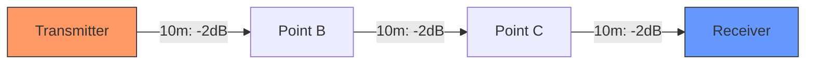
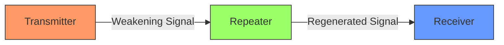

# Networks Attenuation

## Introduction

When data travels through a network, it doesn't maintain its original strength throughout the journey. Instead, the signal gradually weakens as it moves through the transmission medium. This degradation of signal strength is known as **attenuation**.

Attenuation is a fundamental concept in networking that directly impacts the maximum effective distance of our network connections. In this guide, we'll explore what causes attenuation, how it's measured, and techniques to overcome this physical limitation.

## What is Attenuation?

Attenuation refers to the loss of signal strength as data transmits from one point to another through a medium. As signals travel, they naturally lose power due to resistance in the transmission medium and other factors.

Think of attenuation like talking to someone across a field:
- Standing close to each other, you can hear clearly
- As you move farther apart, the voice becomes fainter
- Eventually, the voice becomes too weak to understand

In networks, this same principle applies to electrical signals in copper cables, light pulses in fiber optics, or radio waves in wireless communications.

## Measuring Attenuation

Attenuation is typically measured in **decibels (dB)**, which is a logarithmic unit that expresses the ratio of two values. The higher the dB value, the greater the attenuation or signal loss.

The basic formula for calculating attenuation is:

```
Attenuation (dB) = 10 × log₁₀(Output Power / Input Power)
```

For example, if the input power is 100mW and the output power is 25mW:

```
Attenuation = 10 × log₁₀(25/100) = 10 × log₁₀(0.25) = 10 × (-0.602) = -6.02 dB
```

The negative value indicates a loss in signal strength. Sometimes you'll see this expressed as a positive value (6.02 dB) with the loss being implied.

## Causes of Attenuation

Several factors contribute to signal attenuation in networks:

### 1. Distance

The most obvious cause of attenuation is simply the distance the signal must travel. The longer the cable or the further the wireless signal must go, the more the signal will attenuate.



### 2. Transmission Medium

Different media have different attenuation characteristics:

- **Copper Cables**: Experience attenuation due to electrical resistance
- **Fiber Optic Cables**: Experience less attenuation than copper but still lose light intensity over distance
- **Wireless**: Radio waves attenuate significantly due to absorption, reflection, and dispersion

### 3. Frequency of the Signal

Higher frequency signals typically experience more attenuation than lower frequency ones. This is why:

- Long-distance telephone lines use lower frequencies
- High-frequency WiFi (5GHz) has shorter range than lower frequency WiFi (2.4GHz)

### 4. Environmental Factors

- **Temperature**: Higher temperatures increase resistance in copper cables
- **Electromagnetic Interference (EMI)**: Nearby electrical equipment can degrade signal quality
- **Physical Damage**: Bent fiber optic cables or damaged copper wires increase attenuation

## Attenuation in Different Network Media

Let's examine how attenuation affects various types of network media:

### Copper Cables (Twisted Pair)

Twisted pair cables (like Cat5e, Cat6) experience attenuation based on:
- Cable length
- Signal frequency
- Cable quality and category

Standard Category 5e cable has these approximate attenuation rates at different frequencies:

| Frequency | Attenuation Rate |
|-----------|------------------|
| 10 MHz    | 6.5 dB/100m      |
| 100 MHz   | 22.0 dB/100m     |
| 350 MHz   | 45.3 dB/100m     |

This shows why higher frequency signals (which allow higher data rates) are limited to shorter distances.

### Fiber Optic Cables

Fiber optic cables have significantly lower attenuation compared to copper, which is why they're used for long-distance connections.

Typical attenuation rates:

| Fiber Type                | Wavelength | Attenuation Rate |
|---------------------------|------------|------------------|
| Multimode (OM3/OM4)       | 850 nm     | 3.0 dB/km        |
| Single-mode (OS1/OS2)     | 1310 nm    | 0.4 dB/km        |
| Single-mode (OS1/OS2)     | 1550 nm    | 0.3 dB/km        |

### Wireless Communications

Wireless signals attenuate rapidly and are affected by:
- Distance
- Physical obstacles (walls, furniture)
- Interference from other devices
- Weather conditions (for outdoor links)

## Practical Example: Calculating Maximum Cable Length

Let's calculate the maximum length for a Cat5e cable that needs to transmit a 100MHz signal:

Given:
- Cat5e attenuation is about 22.0 dB/100m at 100MHz
- Network devices typically require a signal-to-noise ratio of at least 10 dB
- Let's assume the initial signal strength is 30 dB
- The minimum acceptable signal strength is 10 dB

Calculation:
```
Maximum Attenuation Allowed = Initial Signal - Minimum Acceptable Signal
Maximum Attenuation Allowed = 30 dB - 10 dB = 20 dB

Maximum Length = Maximum Attenuation Allowed ÷ Attenuation Rate
Maximum Length = 20 dB ÷ (22.0 dB/100m) = 20 dB ÷ 0.22 dB/m = 90.9 meters
```

Therefore, the maximum recommendable cable length in this scenario would be approximately 90 meters.

## Overcoming Attenuation

### 1. Signal Repeaters and Amplifiers

Repeaters receive a weak signal, regenerate it to its original strength, and retransmit it. This effectively extends the network's reach.



### 2. Using Higher Quality Cables

Higher category cables (Cat6, Cat6a, Cat7) have better attenuation characteristics than lower categories, allowing for:
- Longer distances
- Higher frequencies
- Better noise resistance

### 3. Choosing the Right Medium for the Distance

Use the appropriate medium based on distance requirements:
- Short distances (< 100m): Twisted pair copper cables
- Medium distances (< 550m): Multimode fiber optic
- Long distances (up to 80km): Single-mode fiber optic

### 4. Signal Boosters for Wireless Networks

- WiFi Range Extenders
- Directional Antennas
- Mesh Network Systems

## Code Example: Simple Attenuation Calculator

Here's a JavaScript function that calculates signal attenuation over distance:

```javascript
function calculateAttenuation(initialPower, distance, attenuationRate) {
  // initialPower in dBm (decibel-milliwatts)
  // distance in meters
  // attenuationRate in dB per meter
  
  const attenuation = distance * attenuationRate;
  const finalPower = initialPower - attenuation;
  
  return {
    attenuation: attenuation.toFixed(2) + ' dB',
    finalPower: finalPower.toFixed(2) + ' dBm',
    isViable: finalPower > -70 ? 'Signal is viable' : 'Signal too weak'
  };
}

// Example usage
const initialSignal = 20; // 20 dBm
const cableLength = 80; // 80 meters
const cat5eAttenuationRate = 0.22; // 0.22 dB/m for Cat5e at 100MHz

const result = calculateAttenuation(initialSignal, cableLength, cat5eAttenuationRate);

console.log('Initial Signal Strength:', initialSignal, 'dBm');
console.log('Cable Length:', cableLength, 'm');
console.log('Attenuation Rate:', cat5eAttenuationRate, 'dB/m');
console.log('Total Attenuation:', result.attenuation);
console.log('Final Signal Strength:', result.finalPower);
console.log('Status:', result.isViable);
```

**Output:**
```
Initial Signal Strength: 20 dBm
Cable Length: 80 m
Attenuation Rate: 0.22 dB/m
Total Attenuation: 17.60 dB
Final Signal Strength: 2.40 dBm
Status: Signal is viable
```

## Real-World Applications

### 1. Network Design in Office Buildings

When designing a network for a multi-floor office building, network engineers must consider attenuation to determine:
- Placement of switches and repeaters
- Type of cabling to use between floors
- Where to use fiber vs. copper connections

### 2. ISP Infrastructure Planning

Internet Service Providers must carefully calculate attenuation when planning:
- Distances between amplifiers on long-haul fiber routes
- Cell tower placement for wireless service
- Last-mile connection technologies (fiber, coaxial, DSL)

### 3. Home Network Troubleshooting

Understanding attenuation helps when troubleshooting home network issues:
- WiFi dead zones may require repeaters or mesh systems
- Long cable runs might need intermediate switches
- Determining if a weak internet connection is due to external issues or internal wiring

## Common Attenuation-Related Problems and Solutions

| Problem | Symptoms | Solution |
|---------|----------|----------|
| Cable too long | Intermittent connection, slow speeds | Add a repeater or switch to break up the distance |
| High interference area | Unstable connection, high error rates | Use shielded cables or change to fiber optic |
| WiFi dead zones | Weak or no signal in certain areas | Add mesh nodes or access points |
| Old/damaged cables | Decreasing performance over time | Replace cables with newer, higher quality ones |

## Summary

Attenuation is an unavoidable physical reality in network communications that causes signals to weaken as they travel through any medium. Understanding attenuation helps us:

1. Design networks with appropriate cable types and lengths
2. Properly place network equipment like repeaters and switches
3. Select the right transmission medium for different distance requirements
4. Troubleshoot connectivity and performance issues

While we cannot eliminate attenuation entirely, we can account for it in our network designs and implement solutions to minimize its impact, ensuring reliable data transmission across our networks.

## Exercises

1. Calculate the maximum distance a Cat6 cable can run if it has an attenuation rate of 19.8 dB/100m at 100MHz, assuming you need a minimum signal strength of 15 dB from an initial 35 dB signal.

2. Compare the maximum effective distances of WiFi networks operating at 2.4GHz versus 5GHz. Research actual attenuation rates and explain the difference.

3. Design a network layout for a three-floor office building, considering attenuation limitations and suggesting appropriate equipment placement.

4. Write a simple program that visualizes signal strength degradation over distance using any programming language of your choice.

## Additional Resources

- The IEEE 802.3 standards define specific attenuation requirements for different cable categories
- TIA/EIA-568 provides commercial building telecommunications cabling standards
- Network+ certification materials contain excellent practical information about dealing with attenuation in real-world scenarios