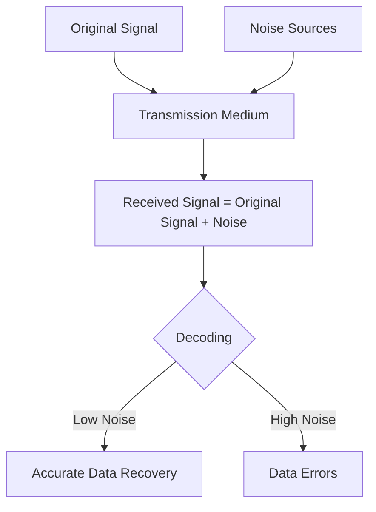

# Networks Noise

## Introduction

When data travels across networks, it rarely arrives in exactly the same condition as it was sent. One of the main culprits for this degradation is **noise** - unwanted electrical or electromagnetic energy that interferes with the original signal. Understanding network noise is crucial for designing robust communication systems that can deliver data reliably despite these challenges.

In this guide, we'll explore the concept of noise in network communications, how it affects data transmission at the physical layer, and techniques used to minimize its impact.

## What is Network Noise?

Noise in networking refers to any unwanted signal that combines with the useful signal and potentially distorts it. Unlike the data being transmitted (which carries meaningful information), noise is random and unpredictable, making it difficult to separate from the original signal.

Consider this analogy: Imagine trying to have a conversation in a crowded restaurant. The meaningful information (your conversation) competes with background noise (other conversations, kitchen sounds, music). The louder the background noise, the harder it is to understand what the other person is saying.

In network communications, this same principle applies to electrical signals traveling through cables or wireless transmissions through the air.

## Types of Network Noise

There are several types of noise that affect network communications:

### 1. Thermal Noise

**Thermal noise** (also known as Johnson-Nyquist noise) is caused by the random motion of electrons in a conductor due to temperature. This type of noise:

- Is present in all electronic systems
- Increases with temperature
- Has a uniform frequency spectrum (white noise)
- Cannot be eliminated completely, only minimized

### 2. Impulse Noise

**Impulse noise** consists of irregular pulses or spikes of short duration but relatively high amplitude. Sources include:

- Power line spikes
- Lightning
- Electrical switches
- Faulty equipment

This type of noise is particularly problematic for digital transmissions as it can cause burst errors - multiple consecutive bits being corrupted.

### 3. Crosstalk

**Crosstalk** occurs when signals from one circuit or channel create undesired effects in another circuit or channel. It happens when:

- Wires or cables are bundled closely together
- Electromagnetic interference occurs between adjacent channels
- Signal from one wire is induced into another through electromagnetic coupling

### 4. Intermodulation Noise

**Intermodulation noise** occurs when signals of different frequencies share the same transmission medium and create additional signals at frequencies that are mathematical combinations of the original frequencies.

### 5. Environmental Noise

**Environmental noise** comes from external sources in the environment, such as:

- Radio frequency interference (RFI)
- Electromagnetic interference (EMI) from motors, generators, power lines
- Solar flares and other cosmic sources
- Microwave ovens and other electronic appliances

## Measuring Noise: Signal-to-Noise Ratio

The most common way to quantify noise in network communications is through the **Signal-to-Noise Ratio (SNR)**, which compares the level of the desired signal to the level of background noise.

SNR is typically expressed in decibels (dB) and calculated as:

```
SNR (dB) = 10 × log₁₀(Signal Power / Noise Power)
```

The higher the SNR, the better the quality of the communication channel:
- High SNR (e.g., 30+ dB): Excellent signal quality
- Medium SNR (e.g., 15-30 dB): Good signal quality
- Low SNR (e.g., below 15 dB): Poor signal quality, likely to have transmission errors

Let's see a practical example of calculating SNR:

```python
import math

# Example values in watts
signal_power = 1.0
noise_power = 0.01

# Calculate SNR
snr = signal_power / noise_power
snr_db = 10 * math.log10(snr)

print(f"Signal Power: {signal_power} W")
print(f"Noise Power: {noise_power} W")
print(f"SNR: {snr}")
print(f"SNR (dB): {snr_db} dB")
```

Output:
```
Signal Power: 1.0 W
Noise Power: 0.01 W
SNR: 100.0
SNR (dB): 20.0 dB
```

In this example, the SNR of 20 dB indicates a good-quality signal where the signal power is 100 times stronger than the noise power.

## Effects of Noise on Data Transmission

Noise can have several detrimental effects on network communications:

### 1. Bit Errors

In digital communications, noise can cause bits to be misinterpreted - a 0 might be read as a 1 or vice versa. The **Bit Error Rate (BER)** measures how frequently this occurs:

```
BER = Number of error bits / Total number of transmitted bits
```

A typical acceptable BER for many systems is 10⁻⁹ to 10⁻¹², meaning only 1 bit error for every billion to trillion bits transmitted.

### 2. Reduced Data Rate

As noise increases, systems often need to decrease their data transmission rate to maintain reliability. This is why your Wi-Fi might slow down significantly in areas with high interference.

### 3. Increased Latency

Error-correction mechanisms used to combat noise often introduce additional processing time, increasing the overall latency of the network connection.

### 4. Signal Attenuation

Noise can effectively reduce the usable range of network connections, as the signal-to-noise ratio decreases with distance from the source.

## Visualizing Noise in Network Communications

Let's visualize how noise affects a signal:



## Noise Mitigation Techniques

Network engineers use several techniques to combat noise:

### 1. Shielding

**Shielding** involves surrounding cables or components with conductive or magnetic materials to block external electromagnetic interference. Common shielded cable types include:

- STP (Shielded Twisted Pair)
- Coaxial cables
- Fiber optic cables (which are inherently immune to EMI)

### 2. Twisted Pair Cabling

In **twisted pair cables**, wires are twisted together to reduce electromagnetic interference. The twists ensure that both wires are equally exposed to any external noise sources, allowing the receiver to identify and cancel out common-mode noise.

### 3. Error Detection and Correction

Various **error detection and correction codes** allow receivers to identify and sometimes fix errors caused by noise:

- **Parity checking**: Adds an extra bit to detect single-bit errors
- **Cyclic Redundancy Check (CRC)**: Detects changes to raw data
- **Forward Error Correction (FEC)**: Allows receivers to correct errors without retransmission

Here's a simple example of parity checking:

```python
def calculate_even_parity(data_bits):
    # Count the number of 1s in the data
    count_of_ones = sum(data_bits)
    
    # For even parity, add a bit to make the total number of 1s even
    parity_bit = 0 if count_of_ones % 2 == 0 else 1
    
    return data_bits + [parity_bit]

def check_parity(received_bits):
    # Count the number of 1s including the parity bit
    count_of_ones = sum(received_bits)
    
    # For even parity, the total should be even
    return count_of_ones % 2 == 0

# Example
data = [1, 0, 1, 1, 0, 1]
transmitted = calculate_even_parity(data)
print(f"Original data: {data}")
print(f"Transmitted with parity bit: {transmitted}")

# Simulate receiving without errors
received_correct = transmitted.copy()
is_valid = check_parity(received_correct)
print(f"Received data (no errors): {received_correct}")
print(f"Parity check passed: {is_valid}")

# Simulate receiving with a single-bit error
received_error = transmitted.copy()
received_error[2] = 0  # Flip a bit to simulate noise
is_valid = check_parity(received_error)
print(f"Received data (with error): {received_error}")
print(f"Parity check passed: {is_valid}")
```

Output:
```
Original data: [1, 0, 1, 1, 0, 1]
Transmitted with parity bit: [1, 0, 1, 1, 0, 1, 0]
Received data (no errors): [1, 0, 1, 1, 0, 1, 0]
Parity check passed: True
Received data (with error): [1, 0, 0, 1, 0, 1, 0]
Parity check passed: False
```

### 4. Signal Processing Techniques

Advanced **signal processing techniques** can help extract signals from noisy environments:

- **Filtering**: Removes noise in specific frequency ranges
- **Equalization**: Compensates for channel distortions
- **Spread spectrum**: Distributes signal energy across a wider frequency band to minimize the impact of narrowband interference

### 5. Adaptive Modulation and Coding

**Adaptive systems** monitor channel conditions and adjust their parameters in real-time:

- Decrease data rates when noise increases
- Use more robust modulation schemes in noisy environments
- Apply stronger error correction when needed

## Real-World Applications and Examples

### Example 1: Wi-Fi Network Troubleshooting

When your Wi-Fi connection is slow or unreliable, noise is often the culprit. Here's a practical approach to diagnose and fix noise-related issues:

1. **Identify Sources of Interference**: Microwave ovens, cordless phones, and Bluetooth devices often operate in the same 2.4 GHz band as Wi-Fi.

2. **Use Wi-Fi Analyzer Tools**: Applications like Wi-Fi Analyzer can show you the signal strength and noise levels on different channels.

3. **Channel Selection**: Switch to less congested channels to improve SNR.

4. **Band Selection**: 5 GHz bands typically have less interference than 2.4 GHz bands.

### Example 2: Digital Subscriber Line (DSL) Technology

DSL technology transmits digital data over telephone lines, which are susceptible to various noise sources:

```javascript
// Simplified model of how DSL deals with noise
function simulateDSLConnection(distance, noiseLevel) {
  // Base rate for very short distances (in Mbps)
  const maxRate = 100;
  
  // Signal attenuates with distance
  const signalStrength = maxRate * Math.exp(-0.1 * distance);
  
  // Calculate SNR
  const snr = signalStrength / noiseLevel;
  
  // Shannon's capacity formula (simplified)
  const achievableRate = 5 * Math.log2(1 + snr);
  
  return {
    distance: distance,
    signalStrength: signalStrength,
    noiseLevel: noiseLevel,
    snr: snr,
    achievableRate: achievableRate
  };
}

// Example: How noise affects DSL performance at different distances
const distances = [1, 2, 3, 4, 5]; // in kilometers
const lowNoise = 0.01;
const highNoise = 0.1;

console.log("DSL Performance with Low Noise:");
distances.forEach(dist => {
  const result = simulateDSLConnection(dist, lowNoise);
  console.log(`Distance: ${dist} km, Rate: ${result.achievableRate.toFixed(2)} Mbps`);
});

console.log("
DSL Performance with High Noise:");
distances.forEach(dist => {
  const result = simulateDSLConnection(dist, highNoise);
  console.log(`Distance: ${dist} km, Rate: ${result.achievableRate.toFixed(2)} Mbps`);
});
```

Output:
```
DSL Performance with Low Noise:
Distance: 1 km, Rate: 24.15 Mbps
Distance: 2 km, Rate: 19.31 Mbps
Distance: 3 km, Rate: 15.46 Mbps
Distance: 4 km, Rate: 12.39 Mbps
Distance: 5 km, Rate: 9.93 Mbps

DSL Performance with High Noise:
Distance: 1 km, Rate: 15.46 Mbps
Distance: 2 km, Rate: 12.39 Mbps
Distance: 3 km, Rate: 9.93 Mbps
Distance: 4 km, Rate: 7.97 Mbps
Distance: 5 km, Rate: 6.40 Mbps
```

This example demonstrates how increasing noise levels can significantly reduce achievable data rates, especially at longer distances.

## Summary

Noise is an unavoidable challenge in network communications, particularly at the physical layer. It comes from various sources, including thermal effects, electromagnetic interference, and environmental factors.

Key takeaways:

1. **Noise types** include thermal noise, impulse noise, crosstalk, intermodulation noise, and environmental noise.

2. **Signal-to-Noise Ratio (SNR)** is the primary measure of channel quality and directly affects data transmission reliability.

3. **Noise effects** include increased bit error rates, reduced data rates, higher latency, and signal attenuation.

4. **Mitigation techniques** include shielding, twisted pair cabling, error detection and correction codes, signal processing, and adaptive transmission parameters.

Understanding network noise is essential for networking professionals as it affects everything from cable selection to protocol design. By implementing appropriate noise reduction and error handling techniques, we can build more reliable and efficient network systems.

## Exercises

1. Calculate the SNR (in dB) for a system with a signal power of 200 mW and a noise power of 5 mW.

2. Research and compare the noise immunity characteristics of different types of network cables (Cat5e, Cat6, fiber optic, etc.).

3. Design a simple simulation that shows how increasing noise levels affect the bit error rate in a digital communication system.

4. Investigate how Wi-Fi routers use adaptive modulation techniques to maintain reliable connections in noisy environments.

5. Implement a simple error detection algorithm (like parity checking or CRC) and test its effectiveness against different noise patterns.