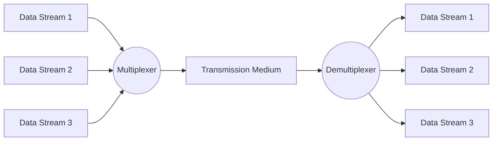
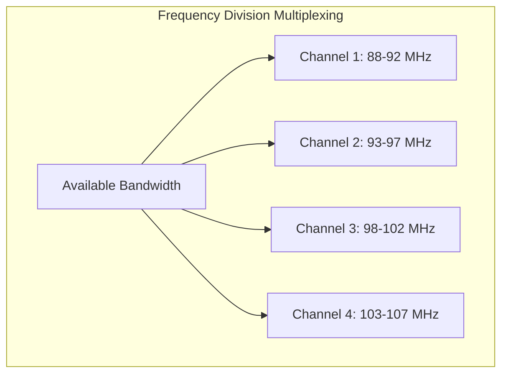
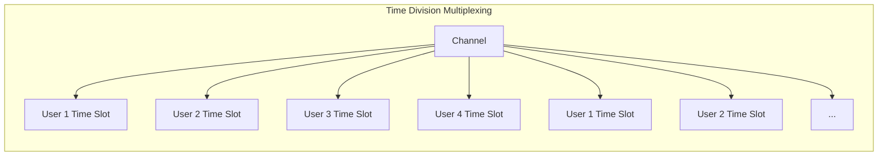

# Networks Multiplexing

## Introduction

Multiplexing is a fundamental technique in network communications that allows multiple signals or data streams to share a single communication channel or medium. Think of it like a highway with multiple lanes - instead of building separate roads for each vehicle, we use a single highway with organized lanes to allow many vehicles to travel efficiently.

In networking, multiplexing optimizes the use of available bandwidth, reduces costs, and increases the efficiency of communication systems. This concept is particularly important in the physical layer of the OSI model, where it deals with the actual transmission of data across physical media.

## What is Multiplexing?

Multiplexing (often abbreviated as "mux") is the process of combining multiple signals or data streams into a single signal that can be transmitted over a shared medium. At the receiving end, a complementary process called demultiplexing (or "demux") separates the combined signal back into its original components.



## Types of Multiplexing Techniques

There are several multiplexing techniques used in networking, each with its own strengths and applications. Let's explore the main types:

### 1. Frequency Division Multiplexing (FDM)

In Frequency Division Multiplexing, the available bandwidth of a communication channel is divided into multiple frequency bands. Each user or signal is assigned its own frequency band for transmission.

**Key Characteristics:**
- Each signal is modulated onto a different carrier frequency
- Signals are transmitted simultaneously but on different frequencies
- Requires guard bands between channels to prevent interference
- Commonly used in radio and television broadcasting, cable systems



**Real-world Example:**
FM radio broadcasting uses FDM, with each station assigned a specific frequency band (e.g., 88.5 MHz, 96.9 MHz, 102.1 MHz). This allows multiple radio stations to broadcast simultaneously without interfering with each other.

### 2. Time Division Multiplexing (TDM)

Time Division Multiplexing divides the available time on a channel into multiple time slots. Each user or signal is assigned specific time slots for transmission.

**Key Characteristics:**
- Each signal gets the full channel bandwidth but only for a short time slot
- Signals take turns using the channel
- Requires precise synchronization between sender and receiver
- Can be synchronous (fixed time slots) or asynchronous (dynamic allocation)
- Commonly used in digital telephone networks and digital cell phones



**Real-world Example:**
In a T1 line (a digital transmission system), 24 telephone calls are multiplexed by assigning each call a specific time slot. The system cycles through all 24 channels, sampling each for a brief moment, 8,000 times per second.

### 3. Wavelength Division Multiplexing (WDM)

Wavelength Division Multiplexing is similar to FDM but operates in the optical domain. It combines multiple light signals on optical fiber by using different wavelengths (colors) of laser light.

**Key Characteristics:**
- Each signal is carried on a different wavelength of light
- Allows for very high capacity on a single fiber
- Used primarily in fiber optic communications
- Can be Dense WDM (DWDM) with many closely spaced channels or Coarse WDM (CWDM) with fewer, more widely spaced channels

**Real-world Example:**
Modern long-distance fiber optic networks use DWDM to transmit 100+ channels of data on a single fiber, with each channel carrying 100+ Gbps, resulting in total capacities of over 10 Tbps per fiber.

### 4. Code Division Multiplexing (CDM)

Code Division Multiplexing allows multiple users to share the same frequency band and time slots by assigning unique codes to each user's data.

**Key Characteristics:**
- Each data stream is encoded using a unique code sequence
- All signals occupy the same time and frequency space
- Receivers extract specific signals by knowing the proper code
- Provides security and resistance to interference
- Used in cellular communications, especially 3G networks (CDMA)

**Real-world Example:**
In CDMA cellular networks, multiple phone calls share the same frequency band simultaneously. Each call is encoded with a unique spreading code that makes it appear as random noise to receivers that don't have the correct code.

### 5. Statistical Time Division Multiplexing (Statistical TDM)

Statistical TDM improves upon traditional TDM by dynamically allocating bandwidth based on need rather than fixed assignments.

**Key Characteristics:**
- Time slots are allocated dynamically based on activity
- Improves efficiency for bursty traffic
- Requires addressing information with each data unit
- Commonly used in packet-switched networks

**Real-world Example:**
In a home network, your router uses statistical multiplexing to share your internet connection among multiple devices. When you're streaming video, your device gets more bandwidth; when you pause, that bandwidth is automatically reallocated to other active devices.

## Implementation Examples

### Example 1: Frequency Division Multiplexing in Python (Conceptual)

Here's a simplified conceptual example of how FDM might be implemented:

```python
import numpy as np
import matplotlib.pyplot as plt

# Create sample signals
time = np.linspace(0, 1, 1000)
signal1 = 0.5 * np.sin(2 * np.pi * 3 * time)  # 3 Hz signal
signal2 = 0.3 * np.sin(2 * np.pi * 10 * time)  # 10 Hz signal
signal3 = 0.8 * np.sin(2 * np.pi * 20 * time)  # 20 Hz signal

# Carrier frequencies
carrier1 = np.sin(2 * np.pi * 50 * time)  # 50 Hz carrier
carrier2 = np.sin(2 * np.pi * 100 * time)  # 100 Hz carrier
carrier3 = np.sin(2 * np.pi * 150 * time)  # 150 Hz carrier

# Modulate each signal onto its carrier
modulated1 = signal1 * carrier1
modulated2 = signal2 * carrier2
modulated3 = signal3 * carrier3

# Combine signals (multiplexing)
multiplexed_signal = modulated1 + modulated2 + modulated3

# Plot the original and multiplexed signals
plt.figure(figsize=(12, 8))

plt.subplot(5, 1, 1)
plt.plot(time, signal1)
plt.title('Original Signal 1 (3 Hz)')

plt.subplot(5, 1, 2)
plt.plot(time, signal2)
plt.title('Original Signal 2 (10 Hz)')

plt.subplot(5, 1, 3)
plt.plot(time, signal3)
plt.title('Original Signal 3 (20 Hz)')

plt.subplot(5, 1, 4)
plt.plot(time, modulated1)
plt.title('Modulated Signal 1 (50 Hz carrier)')

plt.subplot(5, 1, 5)
plt.plot(time, multiplexed_signal)
plt.title('Multiplexed Signal (Combined)')

plt.tight_layout()
plt.show()

# The receiver would use band-pass filters to separate these signals
```

### Example 2: Time Division Multiplexing Simulation

```python
def tdm_multiplexer(streams, frame_size):
    """
    Simulate Time Division Multiplexing
    
    Args:
        streams: List of data streams (lists)
        frame_size: Number of elements from each stream in a frame
        
    Returns:
        Multiplexed stream
    """
    result = []
    
    # Find maximum stream length
    max_length = max(len(stream) for stream in streams)
    
    # Pad shorter streams
    padded_streams = []
    for stream in streams:
        if len(stream) < max_length:
            padded_streams.append(stream + [None] * (max_length - len(stream)))
        else:
            padded_streams.append(stream)
    
    # Create multiplexed stream using TDM
    for i in range(0, max_length, frame_size):
        for stream in padded_streams:
            result.extend(stream[i:i+frame_size])
    
    return result

def tdm_demultiplexer(multiplexed_stream, num_streams, frame_size):
    """
    Simulate Time Division Demultiplexing
    
    Args:
        multiplexed_stream: The combined TDM stream
        num_streams: Number of original streams
        frame_size: Number of elements from each stream in a frame
        
    Returns:
        List of demultiplexed streams
    """
    result = [[] for _ in range(num_streams)]
    frame_length = num_streams * frame_size
    
    for i in range(0, len(multiplexed_stream), frame_length):
        frame = multiplexed_stream[i:i+frame_length]
        
        # Extract data for each stream
        for stream_idx in range(num_streams):
            start = stream_idx * frame_size
            end = start + frame_size
            if start < len(frame):
                data = frame[start:end]
                result[stream_idx].extend(data)
    
    return result

# Example usage
stream1 = ["A1", "A2", "A3", "A4", "A5", "A6"]
stream2 = ["B1", "B2", "B3", "B4", "B5", "B6"]
stream3 = ["C1", "C2", "C3", "C4", "C5", "C6"]

# Multiplex the streams with frame size 2
multiplexed = tdm_multiplexer([stream1, stream2, stream3], 2)
print("Multiplexed Stream:", multiplexed)

# Demultiplex the combined stream
demultiplexed = tdm_demultiplexer(multiplexed, 3, 2)
print("Demultiplexed Streams:")
for i, stream in enumerate(demultiplexed):
    print(f"Stream {i+1}:", stream)
```

**Output:**
```
Multiplexed Stream: ['A1', 'A2', 'B1', 'B2', 'C1', 'C2', 'A3', 'A4', 'B3', 'B4', 'C3', 'C4', 'A5', 'A6', 'B5', 'B6', 'C5', 'C6']
Demultiplexed Streams:
Stream 1: ['A1', 'A2', 'A3', 'A4', 'A5', 'A6']
Stream 2: ['B1', 'B2', 'B3', 'B4', 'B5', 'B6']
Stream 3: ['C1', 'C2', 'C3', 'C4', 'C5', 'C6']
```

## Practical Applications and Benefits

### Real-World Applications

1. **Telecommunications**
   - Telephone networks use TDM to carry multiple conversations on a single line
   - Cellular networks use various multiplexing techniques (FDMA, TDMA, CDMA)
   - Cable TV uses FDM to transmit multiple channels over a single coaxial cable

2. **Internet Infrastructure**
   - ISPs use multiplexing to share backbone connections among many customers
   - Ethernet switches use statistical TDM to share bandwidth among connected devices
   - Fiber optic backbones use WDM to achieve enormous capacities

3. **Wireless Communications**
   - Wi-Fi uses frequency division multiplexing in the form of OFDM (Orthogonal Frequency Division Multiplexing)
   - Bluetooth uses frequency-hopping spread spectrum, a form of frequency division multiplexing
   - Satellite communications use various multiplexing techniques to maximize capacity

### Benefits of Multiplexing

1. **Cost Efficiency**: Sharing a single communication medium among multiple users reduces infrastructure costs.

2. **Bandwidth Optimization**: Makes efficient use of available bandwidth, allowing more data to be transmitted.

3. **Scalability**: Easier to add more users to an existing system compared to building separate channels for each.

4. **Reduced Complexity**: Simplifies network infrastructure by requiring fewer physical connections.

5. **Reliability**: Some multiplexing techniques (like CDMA) offer increased resistance to interference and better security.

## Challenges and Considerations

1. **Synchronization**: TDM systems require precise timing and synchronization between sender and receiver.

2. **Interference**: FDM systems must maintain adequate separation between frequency bands to prevent interference.

3. **Overhead**: Adding multiplexing information adds some overhead to the transmission.

4. **Complexity**: More sophisticated multiplexing systems require more complex hardware and software.

5. **Latency**: Some multiplexing techniques may introduce additional delays in communication.

## Summary

Multiplexing is a critical concept in networking that enables efficient sharing of communication channels. By allowing multiple signals or data streams to share a single medium, multiplexing technology has made modern telecommunications and networking systems economically viable and technically efficient.

The choice of multiplexing technique depends on the specific requirements of the communication system, including:
- Available bandwidth
- Number of users
- Required data rates
- Need for security
- Cost constraints
- Physical transmission medium

Understanding multiplexing is essential for comprehending how modern networks manage to transmit vast amounts of data efficiently across limited physical infrastructure.

## Exercises

1. **Conceptual Understanding**: Explain the primary difference between FDM and TDM. Under what conditions would you choose one over the other?

2. **Application Analysis**: Identify and explain which multiplexing technique is being used in each of the following:
   - FM radio broadcasting
   - Digital telephone system (T1 line)
   - 3G CDMA cellular phone
   - Fiber optic internet backbone

3. **Calculation**: If a communication channel has a total bandwidth of 4800 Hz and you need to create 12 separate channels using FDM, what is the maximum bandwidth for each channel, assuming a 200 Hz guard band between channels?

4. **Programming**: Extend the TDM simulation code provided above to include error detection for dropped frames during transmission.

5. **Research**: Investigate how 5G networks use advanced multiplexing techniques to achieve higher data rates than previous generations of cellular technology.