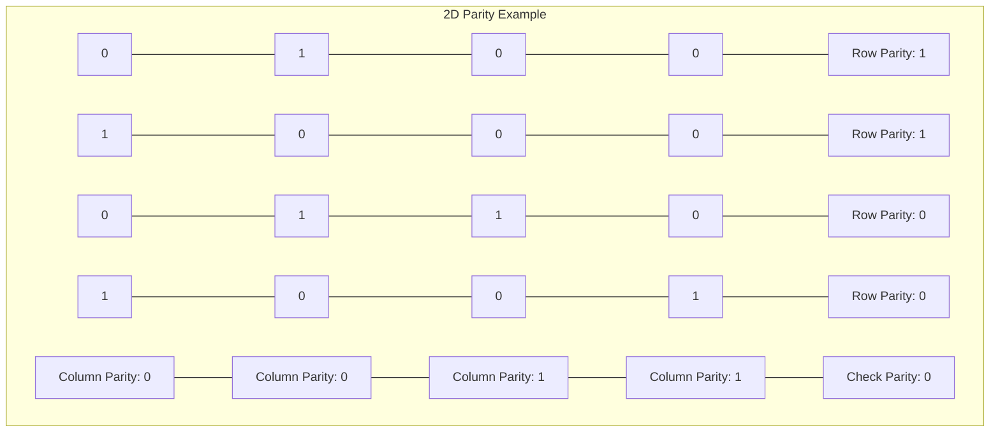
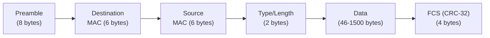
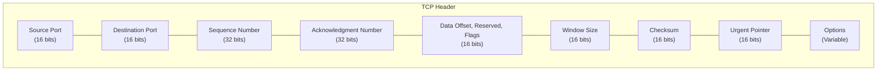

# Networks Error Detection

## Introduction

When data travels across a network, it's susceptible to various forms of corruption. Electrical interference, signal attenuation, hardware failures, and other factors can cause bits to flip, leading to errors in the transmitted data. The Data Link Layer of the OSI model includes mechanisms to detect (and sometimes correct) these errors.

Error detection is a critical function in networking that ensures data integrity. Without it, applications would receive corrupted data and might make incorrect decisions based on that data. This could lead to serious consequences in critical systems like financial transactions, medical devices, or industrial control systems.

In this article, we'll explore the most common error detection techniques used in computer networks, understand how they work, and implement some basic examples.

## Basic Concepts of Error Detection

Before diving into specific techniques, let's understand a few fundamental concepts:

1. **Error**: Any change to data during transmission
2. **Error Detection**: The process of identifying if transmitted data has been corrupted
3. **Redundancy**: Adding extra information to data to facilitate error detection
4. **Overhead**: The extra bits added for error detection purposes

Most error detection methods follow a similar pattern:

1. The sender computes additional bits (redundant data) based on the original data
2. These extra bits are sent along with the original data
3. The receiver performs the same calculation and compares its result with the received redundant data
4. If they match, the data is likely correct; if not, an error has occurred

Now, let's explore specific error detection techniques.

## Parity Checking

Parity checking is one of the simplest error detection methods. It works by adding a single bit (called the parity bit) to each data unit.

### How Parity Checking Works

There are two types of parity:

1. **Even Parity**: The parity bit is chosen so that the total number of 1s in the data (including the parity bit) is even
2. **Odd Parity**: The parity bit is chosen so that the total number of 1s in the data (including the parity bit) is odd

### Example of Parity Checking

Let's say we want to send the ASCII character 'A', which has the binary representation `01000001`.

#### Even Parity Example:
- Original data: `01000001`
- Count of 1s: 2 (which is already even)
- Parity bit (for even parity): 0
- Transmitted data: `010000010` (original data + parity bit)

#### Odd Parity Example:
- Original data: `01000001`
- Count of 1s: 2 (which is even)
- Parity bit (for odd parity): 1
- Transmitted data: `010000011` (original data + parity bit)

### Implementing Parity Calculation

Here's a JavaScript function to calculate the parity bit:

```javascript
function calculateParityBit(data, useEvenParity = true) {
  // Count the number of '1' bits
  const count = data.split('').filter(bit => bit === '1').length;
  
  // For even parity, return 0 if count is even, 1 if odd
  // For odd parity, return 1 if count is even, 0 if odd
  if (useEvenParity) {
    return count % 2 === 0 ? '0' : '1';
  } else {
    return count % 2 === 0 ? '1' : '0';
  }
}

// Example usage
const data = '01000001'; // ASCII 'A'
console.log(`Data: ${data}`);
console.log(`Even parity bit: ${calculateParityBit(data, true)}`);
console.log(`Odd parity bit: ${calculateParityBit(data, false)}`);
```

### Limitations of Parity Checking

Parity checking can detect single-bit errors, but it has significant limitations:
- It cannot detect an even number of bit errors (if two bits flip, the parity remains the same)
- It cannot indicate which bit is in error
- It cannot correct errors

For these reasons, parity checking is typically used only in situations where errors are rare or where more robust error detection is applied at higher layers.

## Two-Dimensional Parity

To overcome some limitations of simple parity checking, we can use two-dimensional parity, which arranges data in a grid and calculates parity bits for each row and column.

### How 2D Parity Works

1. Data is arranged in a grid (rows and columns)
2. Parity bits are calculated for each row
3. Parity bits are calculated for each column
4. All parity bits are transmitted along with the data

This approach can detect all 1-bit and 2-bit errors, and some errors involving more bits.

### Example of 2D Parity

Let's represent the ASCII characters "Hi" (`01001000 01101001`) in a 4×4 grid with even parity:



If any single bit or even two bits are flipped during transmission, at least one row and one column parity check will fail, allowing not just detection but also location of the error.

## Checksums

Checksums provide a more robust method of error detection than simple parity. A checksum is a value derived from the data that is transmitted along with the data.

### How Checksums Work

1. The data is divided into fixed-size segments (often 16 bits each)
2. These segments are added together
3. The sum (or sometimes its complement) is transmitted with the data
4. The receiver performs the same calculation and compares the results

### Internet Checksum Example

The Internet Checksum, used in protocols like IP, TCP, and UDP, works as follows:
1. Data is divided into 16-bit words
2. These words are added together using 1's complement arithmetic
3. The 1's complement of the sum is taken as the checksum
4. The receiver adds all words including the checksum; if no errors occurred, the result should be all 1s

### Implementing a Basic Checksum

Here's a simple JavaScript implementation of a basic checksum:

```javascript
function calculateChecksum(data) {
  // Convert string of bits to array of 16-bit integers
  const words = [];
  for (let i = 0; i < data.length; i += 16) {
    // Get 16 bits at a time, padding with 0s if necessary
    const word = data.slice(i, Math.min(i + 16, data.length)).padEnd(16, '0');
    // Convert binary string to integer
    words.push(parseInt(word, 2));
  }
  
  // Sum all words
  let sum = words.reduce((acc, val) => acc + val, 0);
  
  // Handle overflow beyond 16 bits (for 1's complement addition)
  while (sum > 0xFFFF) {
    sum = (sum & 0xFFFF) + (sum >> 16);
  }
  
  // Return 1's complement of sum
  return (~sum & 0xFFFF).toString(2).padStart(16, '0');
}

// Example usage
const message = '0100100001101001'; // "Hi" in ASCII
console.log(`Original data: ${message}`);
console.log(`Checksum: ${calculateChecksum(message)}`);
```

### Limitations of Checksums

While checksums are better than simple parity, they still have limitations:
- They can miss some patterns of errors
- They provide detection but not correction
- The probability of detecting errors decreases as the message length increases

## Cyclic Redundancy Check (CRC)

CRC is one of the most powerful and widely used error detection techniques in networking. It's based on polynomial division in a finite field.

### How CRC Works

1. Data is treated as a polynomial with binary coefficients
2. This polynomial is divided by a predetermined generator polynomial
3. The remainder of this division is the CRC
4. The data and CRC are transmitted together
5. The receiver performs the same division and checks if the remainder is zero

### CRC Example

Let's calculate a CRC-4 (4-bit CRC) for a simple message.

Given:
- Message: `1101011011` (represented as polynomial: x^9 + x^8 + x^6 + x^4 + x^3 + x)
- Generator: `10011` (represented as polynomial: x^4 + x + 1)

Steps:
1. Append 4 zeros to the message (degree of generator - 1): `1101011011 0000`
2. Divide using polynomial division (XOR operation):

```
     1101110110  (Quotient, not used)
   ___________________
10011 ) 11010110110000
        10011
        -----
         10000
         10011
         -----
          00110
          00000
          -----
           1101
           1001
           ----
            1001
            1001
            ----
             0000  (Remainder = CRC)
```

3. The remainder is `0000`, so our CRC is `0000`
4. Transmitted data: `1101011011 0000` (original data + CRC)

### Implementing CRC

Here's a JavaScript implementation of CRC calculation:

```javascript
function calculateCRC(data, polynomial) {
  // Convert polynomial to number (removing the most significant bit)
  const divisor = parseInt(polynomial.substring(1), 2);
  
  // Length of the CRC (polynomial length - 1)
  const crcLength = polynomial.length - 1;
  
  // Append zeros to the data
  let paddedData = data + '0'.repeat(crcLength);
  
  // Convert to array for easier manipulation
  const bits = paddedData.split('').map(bit => parseInt(bit));
  
  // Perform polynomial division using XOR
  for (let i = 0; i < data.length; i++) {
    if (bits[i] === 1) {
      for (let j = 0; j < polynomial.length; j++) {
        bits[i + j] ^= parseInt(polynomial[j]);
      }
    }
  }
  
  // The last crcLength bits are the remainder
  return bits.slice(-crcLength).join('');
}

// Example usage
const message = '1101011011';
const polynomial = '10011'; // CRC-4
console.log(`Original data: ${message}`);
console.log(`CRC: ${calculateCRC(message, polynomial)}`);
console.log(`Transmitted data: ${message}${calculateCRC(message, polynomial)}`);
```

### Common CRC Polynomials

Several standard CRC polynomials are used in different applications:

1. **CRC-8**: x^8 + x^2 + x + 1 (used in ATM header error detection)
2. **CRC-16**: x^16 + x^15 + x^2 + 1 (used in HDLC, XMODEM)
3. **CRC-32**: x^32 + x^26 + x^23 + ... + x^2 + x + 1 (used in Ethernet, ZIP, PNG)

### Advantages of CRC

CRC offers several advantages over other error detection methods:
- It can detect all single-bit errors
- It can detect all double-bit errors
- It can detect any odd number of errors
- It can detect most burst errors (where multiple consecutive bits are corrupted)
- It's computationally efficient with hardware implementations

## Real-World Applications

### Ethernet Frame Check Sequence (FCS)

Ethernet uses a 32-bit CRC for error detection. The CRC is placed in the Frame Check Sequence (FCS) field of every Ethernet frame.



### TCP/IP Checksums

TCP and IP headers include a 16-bit checksum field that helps detect errors in the header. This is calculated using the Internet Checksum algorithm mentioned earlier.



### USB Error Detection

USB uses a 16-bit CRC to detect errors in data packets, helping ensure reliable data transfer between devices.

## Practical Considerations

### Detection vs. Correction

Error detection methods only identify that an error has occurred. To correct errors, you need additional techniques like:
- **Forward Error Correction (FEC)**: Adds enough redundancy to correct errors without retransmission
- **Automatic Repeat Request (ARQ)**: Requests retransmission when errors are detected

### Choosing the Right Method

When selecting an error detection method, consider:
- **Error characteristics**: What kinds of errors are likely in your environment?
- **Overhead tolerance**: How much extra bandwidth can you afford?
- **Computational resources**: How much processing power is available?
- **Reliability requirements**: How critical is data integrity?

For most modern networking applications, CRC provides the best balance of efficiency and reliable error detection.

## Summary

Error detection is a crucial function in network communications that helps ensure data integrity. We've explored several techniques:

1. **Parity Checking**: Simple but limited to detecting odd numbers of errors
2. **Two-Dimensional Parity**: Improved detection and can locate errors
3. **Checksums**: Moderate protection, commonly used in Internet protocols
4. **Cyclic Redundancy Check (CRC)**: Powerful detection for various error patterns, widely used in modern networks

Each technique has its own strengths, weaknesses, and appropriate applications. Understanding these methods helps you design more reliable network protocols and troubleshoot network issues.

## Practice Exercises

1. Calculate the even parity bit for the binary data: `10101100`
2. Implement a function to verify received data using a checksum
3. Calculate a CRC-8 for the message `10011010` using the polynomial x^8 + x^2 + x + 1
4. Create a program that simulates sending data across a noisy channel and detects errors using CRC
5. Research how Reed-Solomon codes are used for error correction in storage media

## Additional Resources

- RFC 1071: Computing the Internet Checksum
- [Online CRC Calculator](https://crccalc.com/)
- Books: "Computer Networks" by Andrew S. Tanenbaum
- The Mathematics of CRC: [Understanding Cyclic Redundancy Check](https://www.cs.jhu.edu/~scheideler/courses/600.344_S02/CRC.html)