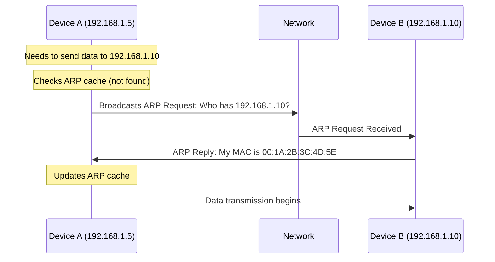
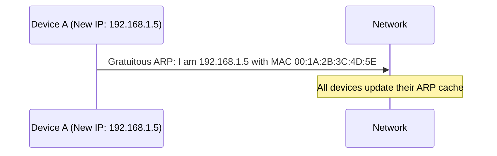

# Networks ARP Protocol

## Introduction

The Address Resolution Protocol (ARP) is a fundamental networking protocol that operates at the Data Link Layer (Layer 2) of the OSI model. Its primary function is to map IP addresses (network layer addresses) to MAC addresses (data link layer addresses) in a local network. 

Think of ARP as a translator that helps devices communicate within a LAN. When a device wants to send data to another device on the same network, it needs both the logical address (IP) and the physical address (MAC) of the destination. While the IP address is known, the MAC address is not. ARP bridges this gap by discovering the corresponding MAC address.

## How ARP Works

### Basic Functionality

The ARP protocol operates with a simple request-response mechanism:

1. **ARP Request**: When a device needs to send data to another device on the same network, it first checks its ARP cache for the MAC address. If not found, it broadcasts an ARP request packet asking, "Who has this IP address?"
2. **ARP Response**: The device with the matching IP address responds with its MAC address.
3. **ARP Cache Update**: The requesting device updates its ARP cache with this IP-to-MAC mapping.

Let's visualize this process:



### ARP Packet Structure

An ARP packet contains several fields:

```
+------------------+------------------+
| Hardware Type    | Protocol Type    |
+------------------+------------------+
| Hardware Length  | Protocol Length  |
+------------------+------------------+
| Operation        |                  |
+------------------+------------------+
| Sender MAC Address                  |
+---------------------------------------+
| Sender IP Address                    |
+---------------------------------------+
| Target MAC Address                   |
+---------------------------------------+
| Target IP Address                    |
+---------------------------------------+
```

- **Hardware Type**: Specifies the network link protocol type (1 for Ethernet)
- **Protocol Type**: Specifies the internetwork protocol (0x0800 for IPv4)
- **Hardware Length**: Length of hardware addresses (6 bytes for MAC)
- **Protocol Length**: Length of protocol addresses (4 bytes for IPv4)
- **Operation**: Specifies the operation (1 for request, 2 for reply)
- **Sender MAC/IP**: MAC and IP addresses of the sender
- **Target MAC/IP**: MAC and IP addresses of the target (MAC is all zeros in a request)

## Code Example: Capturing ARP Packets

Let's look at how to capture and analyze ARP packets using Python with the Scapy library:

```python
from scapy.all import *

def arp_monitor_callback(pkt):
    if ARP in pkt and pkt[ARP].op in (1, 2):  # 1 for request, 2 for reply
        operation = "Request" if pkt[ARP].op == 1 else "Reply"
        print(f"ARP {operation}:")
        print(f"  Sender MAC: {pkt[ARP].hwsrc}")
        print(f"  Sender IP: {pkt[ARP].psrc}")
        print(f"  Target MAC: {pkt[ARP].hwdst}")
        print(f"  Target IP: {pkt[ARP].pdst}")
        print("-" * 40)

# Start sniffing for ARP packets
print("Monitoring ARP packets... Press Ctrl+C to stop.")
sniff(prn=arp_monitor_callback, filter="arp", store=0)
```

Sample output:

```
Monitoring ARP packets... Press Ctrl+C to stop.
ARP Request:
  Sender MAC: 00:1A:2B:3C:4D:5E
  Sender IP: 192.168.1.5
  Target MAC: 00:00:00:00:00:00
  Target IP: 192.168.1.10
----------------------------------------
ARP Reply:
  Sender MAC: 5E:4D:3C:2B:1A:00
  Sender IP: 192.168.1.10
  Target MAC: 00:1A:2B:3C:4D:5E
  Target IP: 192.168.1.5
----------------------------------------
```

## ARP Cache Management

The ARP cache (or ARP table) is a temporary database in a device's memory that stores recently used mappings of IP addresses to MAC addresses. This helps avoid repeated ARP requests for the same destination.

### Viewing the ARP Cache

On most operating systems, you can view the ARP cache with terminal commands:

**Windows:**
```
arp -a
```

**Linux/macOS:**
```
arp -n
```

Sample output:

```
Address          HWtype  HWaddress           Flags Mask    Iface
192.168.1.1      ether   00:11:22:33:44:55   C             eth0
192.168.1.10     ether   5E:4D:3C:2B:1A:00   C             eth0
```

### ARP Cache Timeouts

ARP cache entries are not permanent:
- **Dynamic entries**: Created through ARP requests/replies and expire after a timeout (typically 5-20 minutes)
- **Static entries**: Manually added and remain until system reboot or manual removal

## ARP Types and Variations

### Proxy ARP

Proxy ARP allows a router to answer ARP requests on behalf of another device, typically used when:
- Connecting subnets with different network addresses
- Supporting devices that cannot respond to ARP requests
- Implementing certain types of network virtualization

### Gratuitous ARP

A Gratuitous ARP is a special type of ARP packet where:
- The sender and target IP addresses are identical
- It's broadcast without being prompted by an ARP request
- Used to announce changes in MAC addresses or detect IP conflicts



### Reverse ARP (RARP)

RARP is a legacy protocol that does the opposite of ARP:
- Maps MAC addresses to IP addresses
- Largely replaced by DHCP
- Was used by diskless workstations to discover their IP address

## Common ARP Issues and Security Concerns

### ARP Spoofing/Poisoning

ARP spoofing is a security attack where an attacker sends falsified ARP messages:
- Creates incorrect mappings in the ARP caches of target machines
- Can redirect traffic through the attacker's machine (man-in-the-middle attack)
- May be used for denial-of-service attacks

Example of a simple ARP spoofing detection script:

```python
from scapy.all import *

def detect_arp_spoofing():
    arp_cache = {}
    
    def process_packet(pkt):
        if ARP in pkt and pkt[ARP].op == 2:  # ARP Reply
            sender_ip = pkt[ARP].psrc
            sender_mac = pkt[ARP].hwsrc
            
            if sender_ip in arp_cache:
                if arp_cache[sender_ip] != sender_mac:
                    print(f"[!] POTENTIAL ARP SPOOFING DETECTED")
                    print(f"    IP: {sender_ip}")
                    print(f"    Original MAC: {arp_cache[sender_ip]}")
                    print(f"    New MAC: {sender_mac}")
            else:
                print(f"[+] New ARP entry: {sender_ip} -> {sender_mac}")
                arp_cache[sender_ip] = sender_mac
    
    print("Monitoring for ARP spoofing... Press Ctrl+C to stop.")
    sniff(prn=process_packet, filter="arp", store=0)

detect_arp_spoofing()
```

### ARP Storm

An ARP storm occurs when excessive ARP traffic floods a network:
- Often caused by misconfigured devices or certain network failures
- Can severely impact network performance
- Resolved by identifying and fixing the source of the problem

## Real-World Applications

### 1. Network Troubleshooting

ARP is essential for diagnosing network connectivity issues:
- Confirming device presence on a network
- Identifying IP address conflicts
- Detecting network configuration problems

Example troubleshooting sequence:

```bash
# Check if the gateway is reachable
ping 192.168.1.1

# If ping fails, check if the MAC address can be resolved
arp -n

# If no ARP entry exists, it might indicate a network issue
# Force an ARP request
ping -c 1 192.168.1.1
arp -n  # Check again
```

### 2. Network Security Monitoring

Security professionals monitor ARP activity to:
- Detect unauthorized devices on the network
- Identify potential ARP poisoning attacks
- Monitor for IP address conflicts

### 3. Network Management Tools

Network management systems use ARP to:
- Discover network topology
- Track device connections and movements
- Maintain accurate network inventory

## Summary

The Address Resolution Protocol (ARP) is a crucial component of the Data Link Layer that enables communication between devices on a local network by mapping IP addresses to MAC addresses. Its simple yet efficient request-response mechanism allows devices to discover each other's physical addresses before direct communication can occur.

Key takeaways:
- ARP maps IP addresses (network layer) to MAC addresses (data link layer)
- It uses a request-response mechanism with broadcasts
- ARP caches store recent mappings to improve efficiency
- Various ARP variations serve specialized networking needs
- ARP can be exploited in security attacks like ARP spoofing

Understanding ARP is fundamental to networking knowledge and essential for troubleshooting, security, and network management.

## Exercises

1. **Basic ARP Investigation**: Use the appropriate command to view your system's ARP cache. How many entries do you see?

2. **ARP Packet Capture**: If you have access to a packet analyzer like Wireshark, capture ARP packets on your network during normal browsing. Analyze the request-response patterns.

3. **Programming Challenge**: Write a simple Python script (using Scapy or a similar library) that sends a gratuitous ARP packet.

4. **ARP Security**: Research and document three methods to protect against ARP spoofing attacks.

5. **Network Simulation**: Using a network simulator, create a small network and observe how ARP operates when new devices join the network.

## Additional Resources

- [RFC 826](https://tools.ietf.org/html/rfc826) - The original ARP specification
- [Wireshark](https://www.wireshark.org/) - A powerful network protocol analyzer
- [Scapy Documentation](https://scapy.readthedocs.io/) - For Python network packet manipulation
- "Computer Networks: A Systems Approach" by Larry Peterson and Bruce Davie
- Network+ and CCNA certification materials (for more structured learning)