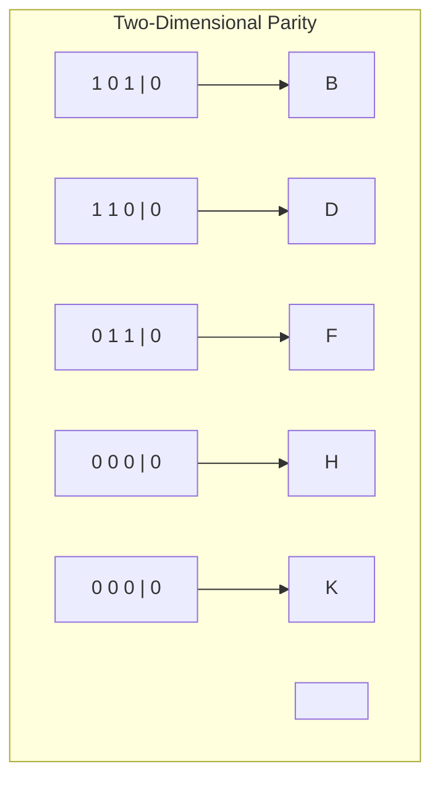
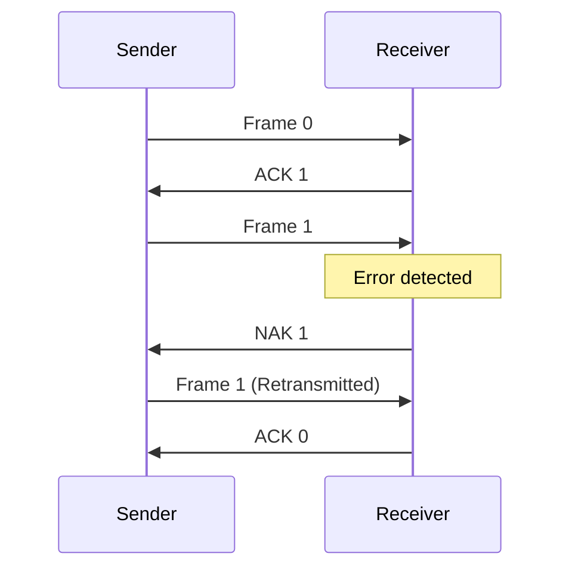

# Networks Error Correction

## Introduction

When data travels across networks, it doesn't always arrive perfectly intact. Environmental interference, hardware limitations, and various forms of noise can corrupt the data being transmitted. In the Data Link Layer of the OSI model, error detection and correction mechanisms play a crucial role in maintaining data integrity.

This guide explores how networks identify when errors occur during transmission and the methods used to either correct these errors automatically or request retransmission.

## Why Error Correction Matters

Imagine you're downloading a program or viewing a webpage. If even a single bit gets flipped during transmission (changing from 0 to 1 or vice versa), it could:

- Cause a program to crash
- Display incorrect information
- Result in security vulnerabilities
- Lead to data corruption

Error detection and correction techniques help prevent these problems, ensuring the data you receive is the same data that was sent.

## Types of Errors in Network Transmission

Before diving into correction techniques, let's understand what kinds of errors can occur:

### 1. Single-bit Errors

A single-bit error occurs when just one bit in a data unit changes from 0 to 1 or from 1 to 0.

```
Original: 1 0 1 1 0 0 1 0
Received: 1 0 1 1 1 0 1 0
                 ^
                Error
```

### 2. Burst Errors

Burst errors happen when multiple consecutive bits get corrupted. These are more common than single-bit errors in most communication channels.

```
Original: 1 0 1 1 0 0 1 0
Received: 1 0 0 0 1 1 1 0
             ^ ^ ^ ^
              Errors
```

## Error Detection Techniques

### Parity Checking

#### Simple Parity Check

This is one of the simplest error detection methods. It works by adding an extra bit (called the parity bit) to make the total number of 1s either even or odd.

- **Even Parity**: The parity bit is set so the total number of 1s in the data (including the parity bit) is even.
- **Odd Parity**: The parity bit ensures the total number of 1s is odd.

**Example:**

```
Data: 1 0 1 1 0 1 0
Count of 1s: 4 (even)

With even parity: 
Parity bit = 0 (already even)
Transmitted: 0 1 0 1 1 0 1 0

With odd parity:
Parity bit = 1 (to make it odd)
Transmitted: 1 1 0 1 1 0 1 0
```

**Limitation:** Simple parity can only detect an odd number of bit errors. If two bits are flipped, the parity will still match, and the error goes undetected.

#### Two-Dimensional Parity

To overcome the limitations of simple parity, two-dimensional parity arranges data in a grid and applies parity checks to both rows and columns.



This technique can detect and correct single-bit errors and detect (but not correct) multiple errors.

### Cyclic Redundancy Check (CRC)

CRC is a powerful error detection technique widely used in networks and storage devices. It treats binary data as coefficients of a polynomial and performs polynomial division by a predetermined divisor (generator polynomial).

#### How CRC Works:

1. Sender and receiver agree on a generator polynomial (G)
2. Sender appends r zero bits to the message (where r is the degree of G)
3. Sender divides the result by G using modulo-2 division
4. The remainder replaces the appended zeros, creating the transmitted data
5. Receiver divides the received data by G
6. If the remainder is zero, no error is detected; otherwise, there's an error

**Example with a simple 3-bit CRC:**

Let's use a generator polynomial G(x) = x³ + x + 1 (binary representation: 1011)

```
Data: 10110 (message bits)
Append 3 zeros: 10110000 (because degree of G is 3)

Modulo-2 Division:
1011 ) 10110000
       1011
       -----
        0000000
        0000
        ----
         0000
         0000
         ----
          0000
          0000
          ----
           000
           
Remainder: 000

Transmitted frame: 10110000 (original data + remainder)
```

CRC is extremely effective at detecting common error patterns and is used in Ethernet, Wi-Fi, Bluetooth, and many other protocols.

### Checksum

Checksum is another common error detection method:

1. The data is divided into fixed-sized segments (typically 16 or 32 bits)
2. All segments are added together
3. The sum is complemented (1s become 0s and vice versa) to get the checksum
4. The checksum is transmitted with the data
5. The receiver performs the same calculation and verifies the result

```javascript
function calculateChecksum(data) {
  let sum = 0;
  
  // Assuming data is an array of 16-bit integers
  for (let i = 0; i < data.length; i++) {
    sum += data[i];
    
    // Keep the sum 16 bits by wrapping around any carry bits
    if (sum > 0xFFFF) {
      sum = (sum & 0xFFFF) + 1;
    }
  }
  
  // One's complement (invert all bits)
  return (~sum) & 0xFFFF;
}
```

## Error Correction Techniques

Detection is only half the battle. Once an error is detected, we need to either correct it or request retransmission.

### Automatic Repeat Request (ARQ)

ARQ is a technique where the receiver requests the sender to retransmit data when errors are detected.

There are three main ARQ methods:

#### 1. Stop-and-Wait ARQ



In Stop-and-Wait ARQ:
- The sender transmits a frame and waits for acknowledgment (ACK)
- If a negative acknowledgment (NAK) is received, the frame is retransmitted
- If no ACK/NAK is received before timeout, the frame is retransmitted

#### 2. Go-Back-N ARQ

In Go-Back-N ARQ, the sender can transmit multiple frames within a window without waiting for individual acknowledgments. If an error is detected in frame n, the receiver requests retransmission of all frames from n onwards.

#### 3. Selective Repeat ARQ

This improves on Go-Back-N by only retransmitting the specific frames that had errors, rather than all subsequent frames.

### Forward Error Correction (FEC)

Unlike ARQ, Forward Error Correction adds enough redundant information to the transmitted data that the receiver can not only detect errors but also correct them without requesting retransmission.

#### Hamming Code

Hamming code is a popular FEC technique that can correct single-bit errors and detect double-bit errors.

**Example: Hamming(7,4)**

This code uses 3 parity bits (positions 1, 2, and 4) to protect 4 data bits, forming a 7-bit message.

```
Data bits: 1 0 1 1 (4 bits)
Positions: d3 d2 d1 d0

Encoding to Hamming(7,4):
Position: 1 2 3 4 5 6 7
          p1 p2 d3 p3 d2 d1 d0
```

Calculating parity bits:
- p1 covers bits 1,3,5,7: p1 = d3 ⊕ d2 ⊕ d0
- p2 covers bits 2,3,6,7: p2 = d3 ⊕ d1 ⊕ d0
- p3 covers bits 4,5,6,7: p3 = d2 ⊕ d1 ⊕ d0

For our example data (1011):
- p1 = 1 ⊕ 0 ⊕ 1 = 0
- p2 = 1 ⊕ 1 ⊕ 1 = 1
- p3 = 0 ⊕ 1 ⊕ 1 = 0

So our encoded data is 0110101 (p1,p2,d3,p3,d2,d1,d0).

If a bit is flipped during transmission, the receiver can identify which bit was affected and correct it.

## Real-World Applications

### 1. TCP/IP Checksum

The Internet Protocol suite uses checksums to verify the integrity of packet headers and data:

```javascript
// Simplified TCP checksum calculation
function tcpChecksum(packet) {
  // Create a pseudo-header
  const pseudoHeader = createPseudoHeader(packet);
  
  // Calculate checksum over pseudo-header + TCP header + data
  const sum = calculateSum(pseudoHeader.concat(packet.header, packet.data));
  
  // Return one's complement
  return ~sum & 0xFFFF;
}
```

### 2. RAID (Redundant Array of Independent Disks)

RAID systems use parity-based error correction to recover data when a disk fails:

- RAID 5 distributes parity information across all disks
- If one disk fails, the missing data can be reconstructed using the parity information and the data from the remaining disks

### 3. QR Codes

QR codes incorporate Reed-Solomon error correction, allowing them to be read correctly even when partially damaged or obscured:

```
QR Code levels of error correction:
- Level L: ~7% of codewords can be restored
- Level M: ~15% of codewords can be restored
- Level Q: ~25% of codewords can be restored
- Level H: ~30% of codewords can be restored
```

## Error Correction in Practice

Let's implement a simple even parity checker in JavaScript:

```javascript
function addEvenParity(data) {
  // Count the number of 1s in the data
  let count = 0;
  for (let i = 0; i < data.length; i++) {
    if (data[i] === '1') {
      count++;
    }
  }
  
  // Add parity bit to make the total number of 1s even
  if (count % 2 === 0) {
    return '0' + data; // Even number of 1s, add 0
  } else {
    return '1' + data; // Odd number of 1s, add 1
  }
}

function checkEvenParity(data) {
  // Count the number of 1s including the parity bit
  let count = 0;
  for (let i = 0; i < data.length; i++) {
    if (data[i] === '1') {
      count++;
    }
  }
  
  // If even, no error detected; if odd, error detected
  return count % 2 === 0;
}

// Example usage
const originalData = '10110';
const withParity = addEvenParity(originalData);
console.log(`Original data: ${originalData}`);
console.log(`With parity bit: ${withParity}`);
console.log(`No error check: ${checkEvenParity(withParity)}`);

// Simulate error by flipping a bit
const withError = withParity.substring(0, 2) + 
                  (withParity[2] === '0' ? '1' : '0') + 
                  withParity.substring(3);
console.log(`With error: ${withError}`);
console.log(`Error check: ${checkEvenParity(withError)}`);
```

**Output:**
```
Original data: 10110
With parity bit: 110110
No error check: true
With error: 100110
Error check: false
```

## Summary

Error detection and correction are fundamental aspects of reliable network communication. The key takeaways are:

1. **Error Detection** techniques like parity checking, CRC, and checksums help identify when data has been corrupted during transmission.

2. **Error Correction** can be handled through:
   - **ARQ methods** (Stop-and-Wait, Go-Back-N, Selective Repeat) that request retransmission of corrupted data
   - **Forward Error Correction** techniques like Hamming codes that add redundancy to automatically correct errors

3. Different scenarios call for different approaches:
   - High-reliability environments might use FEC to avoid retransmission delays
   - Applications with strict timing requirements might prioritize throughput over perfect accuracy
   - Critical systems often use multiple layers of error protection

The choice of error detection and correction mechanism depends on:
- The expected error rate of the channel
- Available bandwidth
- Acceptable latency
- Processing power at sender and receiver
- Criticality of the data

## Exercises

1. Implement a CRC-32 error detection algorithm in your preferred programming language.

2. Create a program that simulates a noisy channel by randomly flipping bits in transmitted messages, then use Hamming codes to detect and correct the errors.

3. Compare the efficiency of Stop-and-Wait ARQ versus Go-Back-N ARQ for different error rates using a simulation.

4. Research how modern Wi-Fi protocols handle error correction and write a brief summary of their techniques.

5. Design a two-dimensional parity scheme and test its ability to detect and correct various error patterns.

## Additional Resources

- RFC 1071: Computing the Internet Checksum
- "Error Detecting and Error Correcting Codes" by Richard Hamming
- "Computer Networks" by Andrew S. Tanenbaum
- "Data Communications and Networking" by Behrouz A. Forouzan