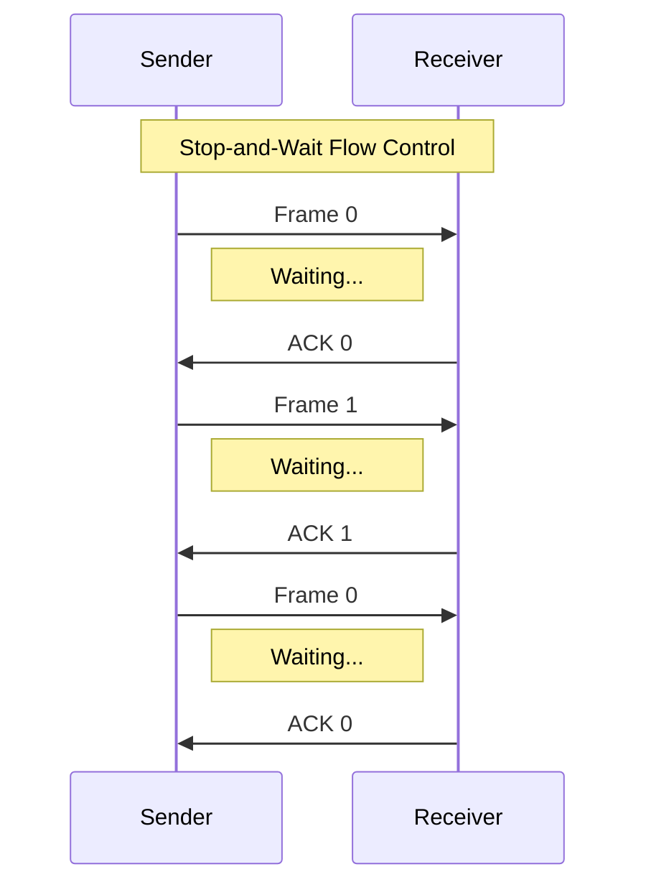
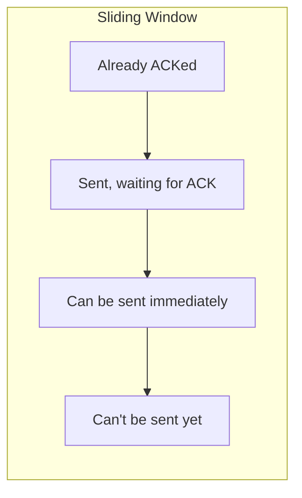

# Networks Flow Control

## Introduction

Flow control is a critical mechanism in the data link layer that prevents a sender from overwhelming a receiver with data. Imagine you're talking to someone who speaks much slower than you do - if you don't pause occasionally, they'll miss parts of the conversation. Similarly, in computer networks, devices often operate at different speeds or have limited buffer space. Flow control ensures reliable communication by regulating the rate at which data is transmitted.

This guide will explore how flow control works, its various implementation techniques, and practical applications in real-world networking scenarios.

## What is Flow Control?

Flow control is a set of procedures that manages the rate of data transmission between two nodes to prevent the sender from overwhelming the receiver. It's particularly important when devices with different processing capabilities communicate.

The primary goals of flow control include:

- Preventing data loss due to buffer overflow
- Ensuring efficient use of network resources
- Maintaining reliable communication between devices
- Accommodating devices with varying processing capabilities

## Flow Control Mechanisms

The data link layer implements several flow control mechanisms, with the most common being:

1. Stop-and-Wait
2. Sliding Window
3. Rate-based Flow Control

Let's explore each of these mechanisms in detail.

### Stop-and-Wait Flow Control

The Stop-and-Wait protocol is the simplest form of flow control. In this approach:

1. The sender transmits a single frame
2. The sender waits for an acknowledgment (ACK)
3. Upon receiving the ACK, the sender transmits the next frame

If the sender doesn't receive an ACK within a specified time (timeout), it retransmits the frame.



#### Code Example: Stop-and-Wait Implementation

```python
def stop_and_wait_sender(frames):
    next_frame_to_send = 0
    
    for frame in frames:
        print(f"Sending frame {next_frame_to_send}: {frame}")
        
        # Simulate sending the frame
        # In reality, this would use sockets or other network APIs
        
        # Wait for acknowledgment (simulated)
        ack_received = False
        while not ack_received:
            print(f"Waiting for ACK {next_frame_to_send}...")
            
            # Simulate timeout and potential retransmission
            print(f"ACK {next_frame_to_send} received!")
            ack_received = True
            
        # Toggle sequence number (0 or 1 in this simple case)
        next_frame_to_send = 1 - next_frame_to_send
        
    print("All frames sent successfully!")

def stop_and_wait_receiver():
    expected_frame = 0
    
    while True:
        # Simulate receiving a frame
        received_frame = receive_frame()  # (simulated function)
        
        if received_frame.sequence_number == expected_frame:
            # Process the valid frame
            print(f"Received frame {expected_frame}")
            
            # Send acknowledgment
            send_ack(expected_frame)  # (simulated function)
            
            # Toggle expected sequence number
            expected_frame = 1 - expected_frame
        else:
            # Duplicate frame received, acknowledge but don't process
            send_ack(1 - expected_frame)  # (simulated function)
```

**Advantages:**
- Simple to implement
- Works well for small, reliable networks

**Disadvantages:**
- Inefficient for large data transfers or networks with high latency
- Poor channel utilization, as the sender is idle during waiting periods

### Sliding Window Flow Control

The Sliding Window protocol significantly improves efficiency by allowing the sender to transmit multiple frames before receiving acknowledgments. Key features include:

1. A "window" of frames that can be sent without acknowledgment
2. A sender and receiver maintain their own windows
3. Acknowledgments can be individual or cumulative
4. The window "slides" as frames are acknowledged



#### Code Example: Sliding Window Implementation

```python
class SlidingWindowSender:
    def __init__(self, window_size):
        self.window_size = window_size
        self.base = 0  # First unacknowledged frame
        self.next_seq_num = 0  # Next frame to send
        
    def can_send(self):
        return self.next_seq_num < self.base + self.window_size
        
    def send(self, data):
        if not self.can_send():
            return False
            
        print(f"Sending frame {self.next_seq_num}: {data}")
        # Actual sending would happen here
        
        self.next_seq_num += 1
        return True
        
    def receive_ack(self, ack_num):
        print(f"Received ACK {ack_num}")
        if ack_num >= self.base:
            # Slide window forward
            self.base = ack_num + 1
            print(f"Window now: base={self.base}, next={self.next_seq_num}")

class SlidingWindowReceiver:
    def __init__(self, window_size):
        self.window_size = window_size
        self.base = 0  # Expected sequence number
        self.received_buffer = {}
        
    def receive(self, frame, seq_num):
        if seq_num < self.base:
            # Duplicate frame, acknowledge but discard
            return self.base - 1
            
        if seq_num < self.base + self.window_size:
            # Store frame in buffer
            self.received_buffer[seq_num] = frame
            print(f"Received frame {seq_num}")
            
            # If this is the expected frame, deliver consecutive frames
            if seq_num == self.base:
                return self.deliver_frames()
                
        # Return last consecutive frame received
        return self.base - 1
        
    def deliver_frames(self):
        while self.base in self.received_buffer:
            print(f"Delivering frame {self.base}: {self.received_buffer[self.base]}")
            del self.received_buffer[self.base]
            self.base += 1
            
        return self.base - 1
```

**Example Usage:**

```python
# Example usage
sender = SlidingWindowSender(window_size=4)
receiver = SlidingWindowReceiver(window_size=4)

# Simulate sending frames
sender.send("Data1")  # seq_num = 0
sender.send("Data2")  # seq_num = 1 
sender.send("Data3")  # seq_num = 2

# Receiver gets frames (possibly out of order)
ack = receiver.receive("Data1", 0)
sender.receive_ack(ack)  # Updates window

ack = receiver.receive("Data3", 2)  # Out of order
sender.receive_ack(ack)  # ACK still at 0

ack = receiver.receive("Data2", 1)  # Now in order up to 2
sender.receive_ack(ack)  # Window slides to 3
```

**Output:**
```
Sending frame 0: Data1
Sending frame 1: Data2
Sending frame 2: Data3
Received frame 0
Delivering frame 0: Data1
Received ACK 0
Window now: base=1, next=3
Received frame 2
Received ACK 0
Received frame 1
Delivering frame 1: Data2
Delivering frame 2: Data3
Received ACK 2
Window now: base=3, next=3
```

**Advantages:**
- Significantly improved efficiency over Stop-and-Wait
- Better utilization of network bandwidth
- Accommodates varying network conditions

**Disadvantages:**
- More complex to implement
- Requires more memory for buffering frames

### Rate-based Flow Control

Rate-based flow control focuses on regulating the speed of transmission rather than using window-based methods. The sender adjusts its transmission rate based on network conditions and feedback.

Key aspects include:

1. The sender determines an appropriate sending rate
2. The receiver or network provides feedback on congestion
3. The sender adjusts its rate accordingly

This approach is often used in conjunction with congestion control mechanisms at higher layers.

## Real-world Applications

### Flow Control in Ethernet

Ethernet implements flow control through a mechanism called PAUSE frames. When a receiver becomes congested, it sends a PAUSE frame to the sender, requesting a temporary halt in transmission.

```python
# Pseudocode for Ethernet PAUSE frame handling
def ethernet_receiver():
    buffer_threshold = 80  # 80% full
    
    while True:
        current_buffer_level = get_buffer_usage_percentage()
        
        if current_buffer_level > buffer_threshold:
            # Buffer is getting full
            pause_time = calculate_pause_time(current_buffer_level)
            send_pause_frame(pause_time)
            print(f"Sent PAUSE frame, requesting {pause_time}ms pause")
```

### Flow Control in TCP

While TCP flow control is implemented at the transport layer, it builds upon the concepts established at the data link layer. TCP uses a sliding window approach where the receiver advertises its available buffer space in each acknowledgment.

```python
# TCP window advertisement (simplified)
def tcp_receiver():
    max_buffer_size = 65535  # Maximum window size
    
    while True:
        # Process incoming segments
        process_incoming_data()
        
        # Calculate remaining buffer space
        available_buffer = max_buffer_size - current_buffer_usage()
        
        # Advertise window size in ACK segments
        send_ack(available_buffer=available_buffer)
        print(f"Advertising window: {available_buffer} bytes")
```

### Flow Control in Low-Power IoT Networks

In resource-constrained environments like IoT networks, efficient flow control is critical. Many IoT protocols implement specialized flow control mechanisms:

```python
# Example: Flow control in MQTT-SN (for IoT devices)
def mqtt_sn_publisher(qos_level, message_rate):
    # QoS levels affect flow control strategy
    if qos_level == 0:  # At most once
        # No flow control, just send
        send_at_rate(message_rate)
    
    elif qos_level == 1:  # At least once
        # Basic flow control with acknowledgments
        for message in messages:
            send_message(message)
            wait_for_puback()
    
    elif qos_level == 2:  # Exactly once
        # Strict flow control with two-phase handshake
        for message in messages:
            send_publish(message)
            wait_for_pubrec()
            send_pubrel()
            wait_for_pubcomp()
```

## Common Flow Control Challenges

### Buffer Bloat

Buffer bloat occurs when excessive buffering causes increased latency. Flow control mechanisms must balance buffer sizes to prevent both overflow and bloat.

### Head-of-Line Blocking

This happens when a single delayed packet blocks the delivery of subsequent packets. Advanced flow control techniques like selective acknowledgment help mitigate this issue.

### Handling Bursty Traffic

Real-world network traffic is rarely constant, and flow control mechanisms must adapt to sudden bursts without compromising performance.

## Summary

Flow control is a fundamental mechanism in the data link layer that ensures reliable and efficient communication between network devices. The main techniques include:

1. **Stop-and-Wait**: Simple but inefficient, suitable for basic networks
2. **Sliding Window**: Offers improved efficiency by allowing multiple frames to be in transit
3. **Rate-based Control**: Adapts transmission speed based on network conditions

These mechanisms prevent buffer overflow, accommodate devices with different capabilities, and ensure optimal use of network resources. As networks continue to evolve, flow control remains an essential component for maintaining reliable communication.

## Exercises

1. Implement a simple Stop-and-Wait protocol in the programming language of your choice.
2. Calculate the efficiency of a Stop-and-Wait protocol versus a Sliding Window protocol with window size 4 on a network with 100ms round-trip time and 1Mbps bandwidth.
3. Design a flow control mechanism for a network where the receiver's processing power varies unpredictably.
4. Research how flow control is implemented in a modern wireless protocol like 5G or Wi-Fi 6.

## Additional Resources

- RFC 793: Transmission Control Protocol (describes TCP flow control)
- RFC 1323: TCP Extensions for High Performance
- "Computer Networks: A Systems Approach" by Larry Peterson and Bruce Davie
- "Computer Networking: A Top-Down Approach" by James Kurose and Keith Ross