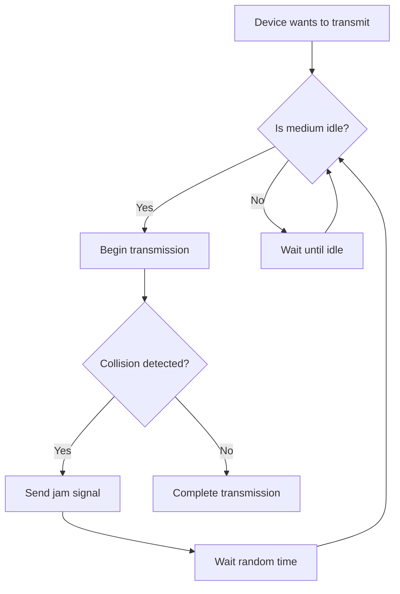
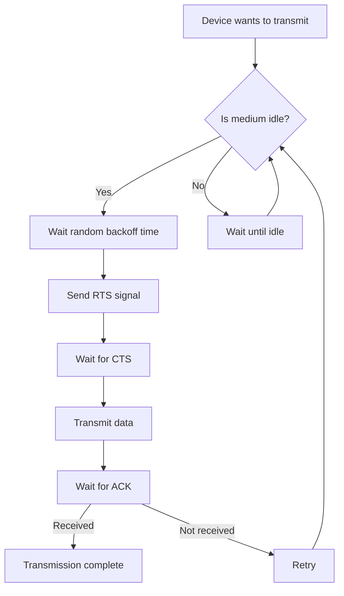
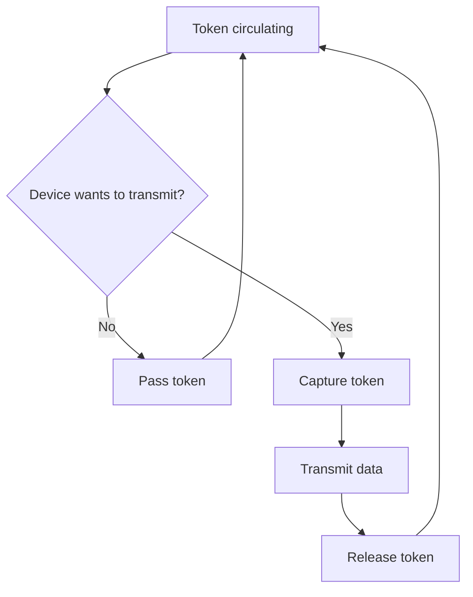

# Network Access Control

## Introduction

Network Access Control (NAC) is a fundamental concept in computer networking that governs how devices gain access to transmit data over a shared network medium. Operating primarily at the Data Link Layer (Layer 2) of the OSI model, NAC mechanisms ensure orderly and efficient communication by preventing collisions and managing access to the transmission medium.

Think of a network like a room full of people trying to have conversations. Without rules for who can speak when, everyone might talk at once, resulting in chaos where no one is understood. Network Access Control provides the "conversation rules" for networked devices.

## Core Concepts of Network Access Control

### The Challenge of Shared Media

In many network environments, multiple devices share the same transmission medium (like an Ethernet cable or wireless frequencies). This creates a fundamental challenge: if two devices transmit simultaneously, their signals can interfere with each other, resulting in **collisions**. These collisions corrupt data and require retransmission, reducing network efficiency.

Network Access Control schemes solve this problem by implementing rules and procedures to determine:
- When a device can transmit data
- How to handle collisions when they occur
- How to ensure fair access to the network medium

## Common Network Access Control Methods

Let's explore the main methods used to control network access at the Data Link Layer:

### 1. CSMA/CD (Carrier Sense Multiple Access with Collision Detection)

CSMA/CD is the access method traditionally used in Ethernet networks. It works like this:

1. **Listen Before Talking**: A device wanting to transmit first listens to the network medium to determine if it's idle.
2. **Transmit If Clear**: If the medium is free, the device begins transmitting.
3. **Detect Collisions**: While transmitting, the device continues to monitor the medium for collisions.
4. **Back Off If Collision**: If a collision is detected, the device stops transmitting, sends a jam signal to ensure all devices are aware of the collision, then waits a random amount of time before trying again.

This method is analogous to a polite conversation where people listen before speaking, but have a protocol for what to do if they accidentally start talking at the same time.



Here's a simple code representation of CSMA/CD logic:

```python
def csma_cd_transmit(data):
    while True:
        if medium_is_idle():
            begin_transmission(data)
            if collision_detected():
                send_jam_signal()
                wait_random_time()
                continue  # Try again
            else:
                # Transmission successful
                return True
        else:
            wait_until_idle()
```

### 2. CSMA/CA (Carrier Sense Multiple Access with Collision Avoidance)

CSMA/CA is used primarily in wireless networks (like Wi-Fi) where collision detection is difficult. Instead of detecting collisions, it tries to avoid them altogether:

1. **Listen Before Talking**: Like CSMA/CD, devices listen to see if the medium is free.
2. **Wait Even If Clear**: Even if the medium is clear, the device waits a random "backoff time."
3. **Request Permission**: The device may send a Request to Send (RTS) message.
4. **Receive Clearance**: The access point responds with a Clear to Send (CTS) message.
5. **Transmit**: After receiving clearance, the device transmits data.
6. **Acknowledgment**: The receiver sends an acknowledgment when data is successfully received.

CSMA/CA is more cautious than CSMA/CD, like waiting a moment before speaking even when no one seems to be talking, to reduce the chance of interrupting someone who was about to speak.



### 3. Token Passing

Token passing is used in token ring and FDDI networks. It works by circulating a special "token" message around the network:

1. **Token Circulation**: A special "token" frame circulates around the network.
2. **Capture Token**: A device wanting to transmit must first capture the token.
3. **Transmit**: With the token, the device can transmit for a limited time.
4. **Release Token**: After transmission, the device releases the token.

This method is like passing a talking stick in a meeting – only the person holding the stick can speak.



A simplified token passing algorithm might look like:

```python
def token_ring_node():
    while True:
        token = wait_for_token()
        if have_data_to_send():
            capture_token(token)
            transmit_data()
            release_token()
        else:
            pass_token()
```

### 4. Polling

In polling, a central controller (like a network server) asks each device in turn if it has data to transmit:

1. **Controller Polls**: The controller sends a message to a device asking if it has data to send.
2. **Device Responds**: The device either sends data or a "nothing to send" message.
3. **Controller Moves On**: The controller then polls the next device.

This is like a teacher calling on students one by one to see if they have a question.

```python
def polling_controller():
    while True:
        for device in network_devices:
            poll_device(device)
            if device_has_data():
                receive_data_from_device()
```

## Real-World Applications

### Ethernet Networks (CSMA/CD)

Traditional wired Ethernet networks use CSMA/CD, though modern switched Ethernet environments significantly reduce collisions through dedicated connections.

**Example**: In a small office with a shared Ethernet hub, when Computer A and Computer B try to send emails simultaneously, CSMA/CD prevents data corruption:

1. Computer A checks if the network is quiet, then starts sending
2. Computer B also checks, but starts sending a fraction of a second later
3. Both detect the collision, stop, and send jam signals
4. Each waits a random time (Computer A: 3ms, Computer B: 7ms)
5. Computer A tries again first and completes its transmission
6. Computer B then successfully sends its data

### Wi-Fi Networks (CSMA/CA)

Wireless networks rely on CSMA/CA to manage access to shared radio frequencies.

**Example**: In a coffee shop with multiple people using Wi-Fi:

1. Your laptop wants to send a file upload
2. It detects the channel is clear but waits a random time anyway
3. It sends an RTS to the access point
4. The access point responds with CTS
5. Your laptop transmits the data
6. The access point sends an ACK
7. Another user's phone, which was waiting to transmit, captures this exchange and knows not to transmit until your exchange is complete

### Industrial Networks (Token Passing)

Some industrial networks use token passing for predictable performance.

**Example**: In a factory automation system, critical control messages must be transmitted with guaranteed timing:

1. PLC 1 holds the token and sends a command to a robotic arm
2. PLC 1 passes the token to PLC 2
3. PLC 2 has no data to send, so passes to PLC 3
4. PLC 3 sends temperature readings, then passes the token
5. The token continues around the ring with deterministic timing

## Network Access Control Implementation Challenges

### Efficiency vs. Fairness

NAC methods must balance efficiency (maximizing throughput) with fairness (ensuring all devices get a turn).

### Overhead

Some NAC methods introduce overhead. For example, token passing ensures no collisions but adds delays as the token circulates.

### Scalability

Different NAC methods scale differently:
- CSMA/CD performance deteriorates as the network gets busier
- Token passing maintains performance under load but adds complexity

## Programming Considerations

When developing networked applications, you rarely need to implement NAC mechanisms directly, as they're handled by network hardware and lower-level protocols. However, understanding NAC can help you design more efficient applications:

```javascript
// Example of how understanding NAC affects application design
// Poor design - sending many small packets
function sendDataInefficiently(largeData) {
  for (let i = 0; i < largeData.length; i++) {
    sendPacket(largeData[i]);  // Many small transmissions
  }
}

// Better design - aggregating data to reduce contention
function sendDataEfficiently(largeData) {
  const chunks = splitIntoOptimalChunks(largeData);
  for (let chunk of chunks) {
    sendPacket(chunk);  // Fewer, optimally-sized transmissions
  }
}
```

## Summary

Network Access Control mechanisms are essential for ensuring orderly communication in shared network environments. The main methods include:

- **CSMA/CD**: Listen before talking, detect and recover from collisions
- **CSMA/CA**: Try to avoid collisions altogether with careful coordination
- **Token Passing**: Take turns using a special permission token
- **Polling**: Central coordination with a controller asking each device in turn

Each method offers different trade-offs between simplicity, efficiency, fairness, and determinism. Modern networks often use a combination of these techniques at different levels to optimize performance.

Understanding NAC helps in designing network-efficient applications and troubleshooting network problems related to congestion and collisions.

## Additional Resources and Exercises

### Exercises

1. **Collision Probability Calculation**: Calculate the probability of collisions in a CSMA/CD network with 10 devices, each transmitting 20% of the time.

2. **Simulation Exercise**: Write a simple simulation showing how CSMA/CD handles collisions between five devices trying to transmit data.

3. **Comparison Chart**: Create a table comparing the advantages and disadvantages of each NAC method for different network scenarios.

### Learn More

- Explore how modern switched Ethernet has evolved beyond traditional CSMA/CD
- Investigate how Quality of Service (QoS) mechanisms extend NAC concepts to prioritize certain types of traffic
- Research how Software-Defined Networking (SDN) approaches network access control