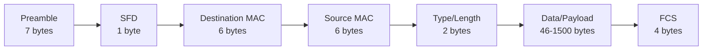
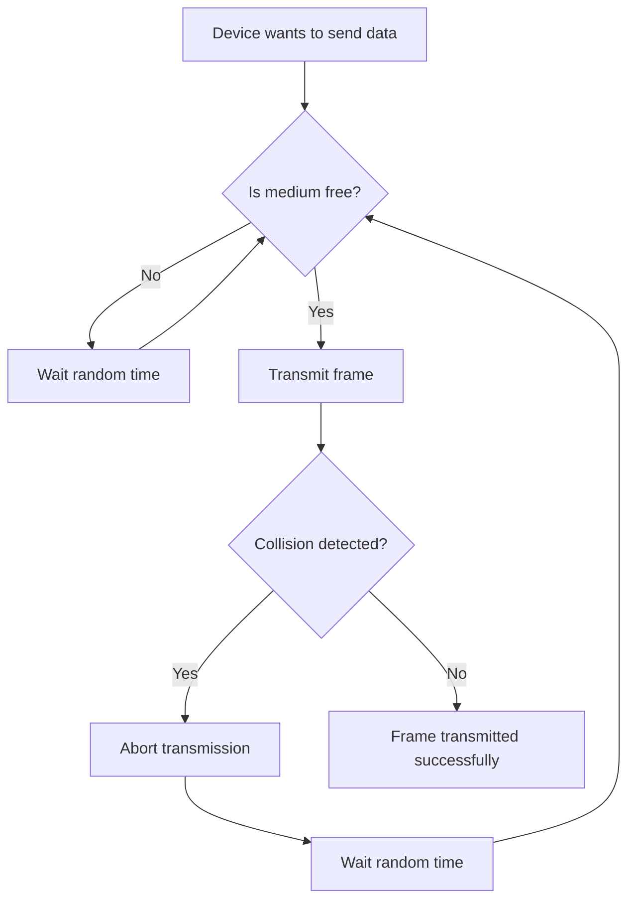
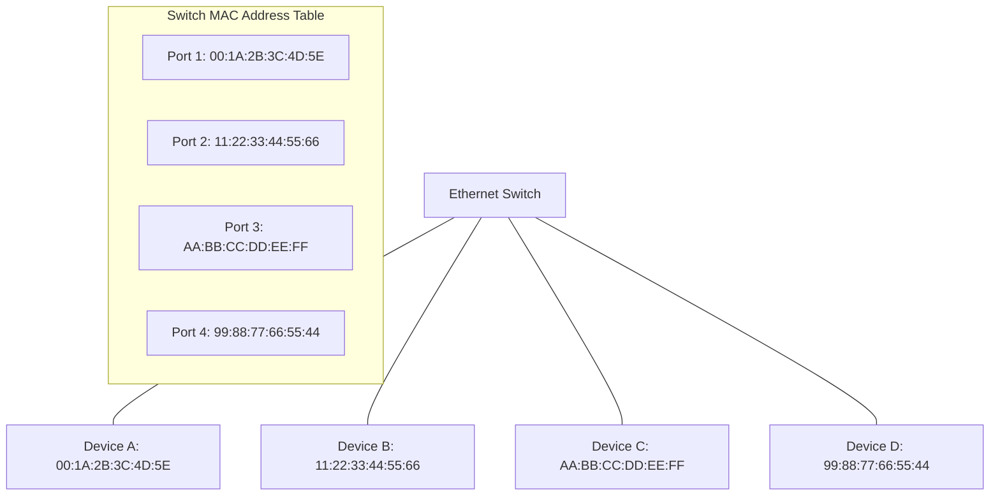
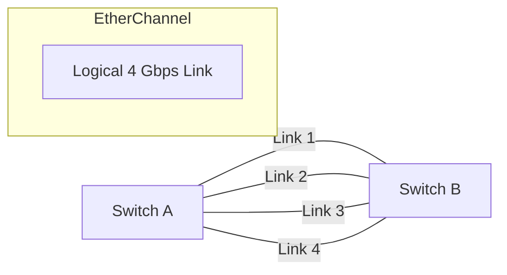

# Networks: Ethernet

## Introduction

Ethernet is the most widely used Local Area Network (LAN) technology in the world. Developed in the 1970s at Xerox PARC and later standardized as IEEE 802.3, Ethernet operates at the Data Link Layer of the OSI model, providing the foundation for most of our daily network communications.

In this guide, we'll explore how Ethernet works, its evolution from coaxial cables to today's fiber optics, and how it enables reliable communication between devices on a local network.

## What is Ethernet?

Ethernet is a family of networking technologies that defines how data is transmitted over various physical media. It provides:

- A standardized way for network devices to access shared media
- Methods for addressing network devices using MAC addresses
- Frame formatting rules for packaging data
- Error detection capabilities

When you connect your computer to a network using a cable or Wi-Fi, you're most likely using Ethernet technology at the Data Link Layer.

## Ethernet Standards and Evolution

Ethernet has evolved significantly since its creation:

| Ethernet Standard | Speed | Common Name | Typical Medium |
|-------------------|-------|-------------|----------------|
| 10BASE-T | 10 Mbps | Traditional Ethernet | Twisted pair copper |
| 100BASE-TX | 100 Mbps | Fast Ethernet | Twisted pair copper |
| 1000BASE-T | 1 Gbps | Gigabit Ethernet | Twisted pair copper |
| 10GBASE-T | 10 Gbps | 10 Gigabit Ethernet | Twisted pair copper/fiber |
| 40GBASE-T | 40 Gbps | 40 Gigabit Ethernet | Fiber optic |
| 100GBASE-T | 100 Gbps | 100 Gigabit Ethernet | Fiber optic |

The naming convention follows this pattern:
- First number: speed in Mbps or Gbps
- BASE: baseband transmission (meaning it uses the entire bandwidth for a single data channel)
- Final letter(s): cable type (T for twisted pair, F for fiber optic, etc.)

## Ethernet Frame Structure

Ethernet packages data into units called **frames**. An Ethernet frame has the following structure:



Let's break down each component:

1. **Preamble & SFD (Start Frame Delimiter)**: 8 bytes that signal the start of a frame and help receivers synchronize.

2. **Destination MAC Address**: 6-byte hardware address of the receiving device.

3. **Source MAC Address**: 6-byte hardware address of the sending device.

4. **Type/Length Field**: 2-byte field that either indicates the protocol of the encapsulated payload (for values ≥ 1536) or the length of the payload (for values ≤ 1500).

5. **Data Payload**: The actual data being transported (46-1500 bytes).

6. **FCS (Frame Check Sequence)**: 4-byte checksum used for error detection.

## MAC Addressing in Ethernet

Every Ethernet network interface has a unique 48-bit (6-byte) address called a Media Access Control (MAC) address. This address is:

- Physically burned into the network interface card (NIC)
- Written in hexadecimal notation (e.g., `00:1A:2B:3C:4D:5E`)
- Globally unique (in theory)

The first 3 bytes (24 bits) identify the manufacturer (OUI - Organizationally Unique Identifier) while the last 3 bytes are assigned by the manufacturer to each device.

### Types of MAC Addresses

- **Unicast**: Delivered to a single device (most common)
- **Broadcast**: Delivered to all devices (FF:FF:FF:FF:FF:FF)
- **Multicast**: Delivered to a group of devices

## CSMA/CD: Ethernet's Access Method

Traditional Ethernet uses Carrier Sense Multiple Access with Collision Detection (CSMA/CD) to manage access to the shared medium:

1. **Carrier Sense**: Before transmitting, a device checks if the medium is idle
2. **Multiple Access**: Multiple devices can access the network
3. **Collision Detection**: Devices can detect when transmissions collide

Here's how it works:



Modern switched Ethernet networks largely eliminate collisions using full-duplex communication, but CSMA/CD remains important in half-duplex environments.

## Practical Example: Capturing and Analyzing Ethernet Frames

Let's use the popular packet analyzer Wireshark to capture and examine Ethernet frames:

```bash
# Install Wireshark (on Ubuntu/Debian)
sudo apt-get install wireshark

# Install Wireshark (on macOS with Homebrew)
brew install wireshark

# Install Wireshark (on Windows)
# Download from https://www.wireshark.org/download.html
```

After capturing some traffic, you can examine the Ethernet frame details:

![Wireshark Ethernet frame analysis would be shown here]

### Programmatic Analysis of Ethernet Frames

You can also use Python with the `scapy` library to analyze Ethernet frames:

```python
# Install scapy first
# pip install scapy

from scapy.all import *

# Capture 10 packets
packets = sniff(count=10)

# Examine the first packet's Ethernet layer
first_packet = packets[0]
eth = first_packet.getlayer(Ether)

print(f"Source MAC: {eth.src}")
print(f"Destination MAC: {eth.dst}")
print(f"Ethernet Type: {hex(eth.type)}")

# Output might look like:
# Source MAC: 00:1a:2b:3c:4d:5e
# Destination MAC: ff:ff:ff:ff:ff:ff
# Ethernet Type: 0x800  (IPv4)
```

## Ethernet Switch Operation

Modern Ethernet networks use switches rather than hubs. Here's how a switch improves network performance:

1. **MAC Address Learning**: The switch builds a table mapping MAC addresses to physical ports
2. **Frame Forwarding**: Sends frames only to the port where the destination device is connected
3. **Full-Duplex Communication**: Allows simultaneous sending and receiving
4. **VLAN Support**: Can segment a network into isolated broadcast domains



## Ethernet Cabling and Connectors

Different Ethernet standards use different physical media:

### Twisted Pair Cabling

Most common in offices and homes:
- **Cat 5e**: Supports up to 1 Gbps (1000BASE-T)
- **Cat 6**: Supports up to 10 Gbps (10GBASE-T) for shorter distances
- **Cat 6a/7**: Supports 10 Gbps with better noise rejection

### Fiber Optic Cabling

Used for longer distances and higher speeds:
- **Single-mode fiber (SMF)**: Longer distances (up to tens of kilometers)
- **Multi-mode fiber (MMF)**: Shorter distances (up to a few hundred meters)

### Connector Types

- **RJ-45**: Standard connector for twisted pair Ethernet
- **LC, SC, ST**: Common fiber optic connectors

## Troubleshooting Ethernet Connections

### Common Problems and Solutions

1. **No Link Light**
   - Check cable connections
   - Verify switch port is enabled
   - Test with a different cable

2. **Link but No Connectivity**
   - Check IP configuration
   - Look for duplicate IP addresses
   - Test with ping to default gateway

3. **Slow Performance**
   - Check for half-duplex operation
   - Look for excessive collisions
   - Test cable quality

### Basic Diagnostic Commands

```bash
# Show network interface details (Linux/macOS)
ifconfig

# Windows equivalent
ipconfig /all

# Check connectivity to another device
ping 192.168.1.1

# Show network statistics
netstat -i
```

## Practical Applications

### Building a Small Office Network

For a small office with 20 computers, you might:

1. Choose a 24-port Gigabit Ethernet switch
2. Use Cat 6 cabling throughout
3. Label all cables and ports
4. Document MAC addresses for key devices
5. Set up VLANs to separate departments

### Home Network Setup

For a typical home:

1. Connect your ISP modem to a home router
2. Use built-in switch ports on the router for wired devices
3. Consider a separate switch if you need more ports
4. Use at least Cat 5e cables for Gigabit speeds
5. Position wireless access points strategically

## Advanced Ethernet Concepts

### Power over Ethernet (PoE)

PoE allows devices like IP cameras, VoIP phones, and wireless access points to receive power through the Ethernet cable:

- **802.3af (PoE)**: Provides up to 15.4W
- **802.3at (PoE+)**: Provides up to 30W
- **802.3bt (PoE++)**: Provides up to 100W

### Jumbo Frames

Standard Ethernet frames have a maximum payload of 1500 bytes. Jumbo frames can carry payloads of up to 9000 bytes, improving efficiency for large data transfers.

### EtherChannel/Link Aggregation

Multiple physical Ethernet links can be combined into a single logical link for increased bandwidth and redundancy:



## Summary

Ethernet has become the dominant LAN technology due to its reliability, scalability, and adaptability. From its humble beginnings at 10 Mbps to today's 400 Gbps speeds, Ethernet continues to evolve while maintaining backward compatibility.

Key takeaways:
- Ethernet operates at the Data Link Layer, providing addressing and framing
- MAC addresses uniquely identify network interfaces
- Modern switched Ethernet eliminates most collisions and improves performance
- Various physical media support different speeds and distances
- Advanced features like PoE, jumbo frames, and link aggregation extend Ethernet's capabilities

## Exercises and Projects

1. **Basic Exercise**: Use the `ifconfig` or `ipconfig` command to find your computer's MAC address.

2. **Intermediate Exercise**: Install Wireshark and capture Ethernet frames during a web browsing session. Identify the different types of frames.

3. **Advanced Project**: Set up a small network with two computers and a switch. Use Wireshark to observe the ARP process when the computers communicate for the first time.

4. **Research Activity**: Compare and contrast Ethernet with other Data Link Layer technologies like Wi-Fi (802.11) and Bluetooth.

## Additional Resources

- IEEE 802.3 Working Group: The official standardization body for Ethernet
- "Computer Networks" by Andrew S. Tanenbaum: Excellent coverage of Ethernet principles
- NetworkLessons.com: Detailed tutorials on Ethernet configuration
- Wireshark.org: Documentation and tutorials for packet analysis

Remember that Ethernet is just one piece of the networking puzzle, but mastering its concepts provides a solid foundation for understanding higher-layer protocols and network applications.