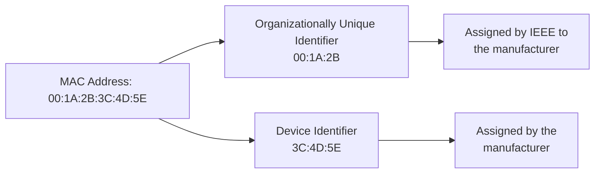
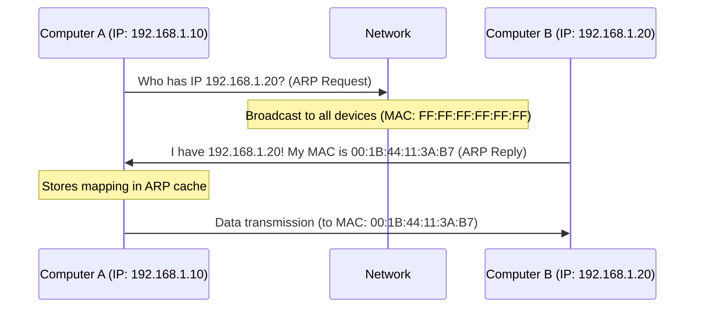

# Networks MAC Addressing

## Introduction

Media Access Control (MAC) addressing is a fundamental concept in networking that operates at the Data Link Layer (Layer 2) of the OSI model. MAC addresses are unique identifiers assigned to network interfaces for communications on a physical network segment. Unlike IP addresses that can change based on network configuration, MAC addresses are generally permanent and burned into the network interface hardware by manufacturers.

In this tutorial, we'll explore what MAC addresses are, how they're structured, their purpose in network communications, and how they function within the broader context of the Data Link Layer.

## What is a MAC Address?

A MAC address (also known as a physical address or hardware address) is a unique identifier assigned to a Network Interface Controller (NIC) for use as a network address in communications within a network segment.

Key characteristics of MAC addresses:

- 48 bits (6 bytes) in length, typically represented as 12 hexadecimal digits
- Usually written in one of these formats:
  - `MM:MM:MM:SS:SS:SS`
  - `MM-MM-MM-SS-SS-SS`
  - `MMMM.MMMM.SSSS`
- First 3 bytes (MM) represent the Organizationally Unique Identifier (OUI) assigned to the manufacturer
- Last 3 bytes (SS) represent a serial number assigned by the manufacturer

## MAC Address Structure

Let's break down a MAC address to understand its components:



### Example MAC Address

Let's take the MAC address `00:1A:2B:3C:4D:5E`:

- `00:1A:2B` - OUI portion (assigned to a specific manufacturer)
- `3C:4D:5E` - Device-specific portion (unique to the specific device)

## Special MAC Addresses

There are several special MAC addresses used for specific purposes:

1. **Broadcast Address**: `FF:FF:FF:FF:FF:FF` - Used to send data to all devices on a network segment
2. **Multicast Addresses**: Addresses with the least significant bit of the first byte set to 1 (e.g., `01:00:5E:XX:XX:XX` for IPv4 multicast)
3. **Locally Administered Addresses**: Addresses with the second least significant bit of the first byte set to 1 (e.g., `02:XX:XX:XX:XX:XX`)

## Role of MAC Addresses in Network Communications

MAC addresses play a crucial role in how data moves across a network at the Data Link Layer:

### Address Resolution

When a device wants to communicate with another device on the same network, it needs to know the MAC address of the destination. This is where the Address Resolution Protocol (ARP) comes into play:



### Frame Forwarding

Switches use MAC addresses to forward frames efficiently:

1. When a switch receives a frame, it examines the source MAC address
2. The switch records the source MAC address and the port it came from in its MAC address table
3. The switch looks up the destination MAC address in its table
4. If found, it forwards the frame only to the specific port
5. If not found, it forwards the frame to all ports (except the incoming port)

## Working with MAC Addresses in Programming

### Finding MAC Addresses Programmatically

Here's how you can find MAC addresses on different operating systems:

#### Python Example

```python
import uuid

def get_mac_address():
    # Get the MAC address of the first network interface
    mac = ':'.join(['{:02x}'.format((uuid.getnode() >> elements) & 0xff) 
                    for elements in range(0, 48, 8)][::-1])
    return mac

print(f"MAC Address: {get_mac_address()}")
```

Output:
```
MAC Address: 00:1a:2b:3c:4d:5e
```

#### Using OS-specific Commands

On Windows (Command Prompt):
```
ipconfig /all
```

On macOS/Linux (Terminal):
```
ifconfig -a
```
or
```
ip link show
```

### Parsing MAC Addresses in Python

Here's a simple function to validate a MAC address format:

```python
import re

def is_valid_mac(mac_address):
    # Regex patterns for different MAC address formats
    patterns = [
        r'^([0-9A-Fa-f]{2}[:-]){5}([0-9A-Fa-f]{2})$',  # XX:XX:XX:XX:XX:XX or XX-XX-XX-XX-XX-XX
        r'^([0-9A-Fa-f]{4}\.){2}([0-9A-Fa-f]{4})$'      # XXXX.XXXX.XXXX
    ]
    
    return any(re.match(pattern, mac_address) for pattern in patterns)

# Test with different formats
mac_addresses = [
    "00:1A:2B:3C:4D:5E",
    "00-1A-2B-3C-4D-5E",
    "001A.2B3C.4D5E",
    "00:1A:2B:3C:4D",   # Invalid (too short)
    "00:1A:2B:3C:4D:5E:6F", # Invalid (too long)
    "00:1A:2B:3C:4D:5Z"  # Invalid (non-hex character)
]

for mac in mac_addresses:
    print(f"{mac}: {'Valid' if is_valid_mac(mac) else 'Invalid'}")
```

Output:
```
00:1A:2B:3C:4D:5E: Valid
00-1A-2B-3C-4D-5E: Valid
001A.2B3C.4D5E: Valid
00:1A:2B:3C:4D: Invalid
00:1A:2B:3C:4D:5E:6F: Invalid
00:1A:2B:3C:4D:5Z: Invalid
```

## Real-world Applications of MAC Addressing

### 1. Network Access Control

MAC filtering allows network administrators to create access control lists based on MAC addresses:

```python
# Pseudocode for MAC-based access control
allowed_macs = [
    "00:1A:2B:3C:4D:5E", 
    "AA:BB:CC:DD:EE:FF",
    "11:22:33:44:55:66"
]

def check_device_access(mac_address):
    if mac_address.upper() in allowed_macs:
        return "Access granted"
    else:
        return "Access denied"

# Example usage
print(check_device_access("00:1A:2B:3C:4D:5E"))  # Access granted
print(check_device_access("FF:FF:FF:FF:FF:FF"))  # Access denied
```

### 2. Device Tracking and Inventory

Network management systems use MAC addresses to track devices:

```python
# Simplified device inventory system
device_inventory = {
    "00:1A:2B:3C:4D:5E": {
        "device_type": "Laptop",
        "owner": "John Doe",
        "department": "Engineering"
    },
    "AA:BB:CC:DD:EE:FF": {
        "device_type": "Printer",
        "location": "2nd Floor",
        "model": "HP LaserJet Pro"
    }
}

def get_device_info(mac_address):
    return device_inventory.get(mac_address, {"error": "Device not found"})

# Example usage
print(get_device_info("00:1A:2B:3C:4D:5E"))
```

### 3. Network Troubleshooting

MAC addresses are essential for diagnosing network issues:

- Identifying duplicate IP addresses (both devices will respond to ARP requests)
- Tracing network paths
- Identifying unauthorized devices

## MAC Address vs. IP Address

Let's compare these two important addressing schemes:

| Feature | MAC Address | IP Address |
|---------|------------|------------|
| Layer | Data Link Layer (Layer 2) | Network Layer (Layer 3) |
| Length | 48 bits (6 bytes) | 32 bits (IPv4) or 128 bits (IPv6) |
| Format | Hexadecimal notation | Decimal notation (IPv4) or hexadecimal (IPv6) |
| Assignment | Assigned by manufacturer | Assigned by network admin or DHCP |
| Purpose | Identifies physical devices | Identifies logical network locations |
| Scope | Local network segment | Internetwork routing |
| Changeability | Generally fixed (but can be spoofed) | Can change when moving between networks |

## MAC Address Spoofing

MAC address spoofing involves changing a device's MAC address to impersonate another device. While there are legitimate uses (testing, privacy), it's also used in security attacks.

Here's how to change a MAC address programmatically in Linux using Python:

```python
import subprocess

def change_mac(interface, new_mac):
    # Disable the interface
    subprocess.call(["ifconfig", interface, "down"])
    
    # Change the MAC address
    subprocess.call(["ifconfig", interface, "hw", "ether", new_mac])
    
    # Enable the interface
    subprocess.call(["ifconfig", interface, "up"])
    
    print(f"MAC address for {interface} changed to {new_mac}")

# Example usage (requires root privileges)
# change_mac("eth0", "00:11:22:33:44:55")
```

**Note:** Changing MAC addresses may be against network policies in some organizations and networks. Always ensure you have permission before performing such operations.

## MAC Address Limitations

While MAC addresses are fundamental to networking, they have limitations:

1. **No Hierarchical Structure**: Unlike IP addresses, MAC addresses don't provide information about network topology
2. **Limited Scalability**: Not suitable for large-scale routing across the internet
3. **Security Concerns**: Can be spoofed relatively easily
4. **Privacy Issues**: Can be used to track devices across networks

## Summary

MAC addresses are 48-bit unique identifiers assigned to network interfaces, functioning at the Data Link Layer. They enable direct communication between devices on the same network segment and play a critical role in frame forwarding, address resolution, and network security.

Key takeaways:
- MAC addresses are globally unique identifiers assigned by manufacturers
- They consist of a manufacturer prefix (OUI) and a device-specific suffix
- They enable devices to communicate at the Data Link Layer
- MAC addresses work with ARP to map between Layer 2 (MAC) and Layer 3 (IP) addresses
- Switches use MAC addresses to intelligently forward frames

## Additional Resources and Exercises

### Exercises

1. **MAC Address Scavenger Hunt**: Identify and record the MAC addresses of various devices on your network using appropriate command-line tools.

2. **ARP Table Analysis**: Run the command `arp -a` (Windows/Linux) or `arp -an` (macOS) and analyze the output. Identify which devices on your network correspond to which IP and MAC address pairs.

3. **MAC Address Format Converter**: Write a program that converts between different MAC address formats (e.g., from `00:1A:2B:3C:4D:5E` to `001A.2B3C.4D5E`).

4. **OUI Lookup Tool**: Create a script that takes a MAC address as input and identifies the manufacturer based on the OUI.

### Further Learning

- **IEEE Standards Association**: Learn more about how MAC addresses are assigned and regulated
- **Network Packet Analysis**: Use tools like Wireshark to observe MAC addresses in real network traffic
- **Network Security**: Explore how MAC addresses are used in network security mechanisms
- **Software-Defined Networking (SDN)**: Understand how SDN technologies interact with traditional MAC-based forwarding