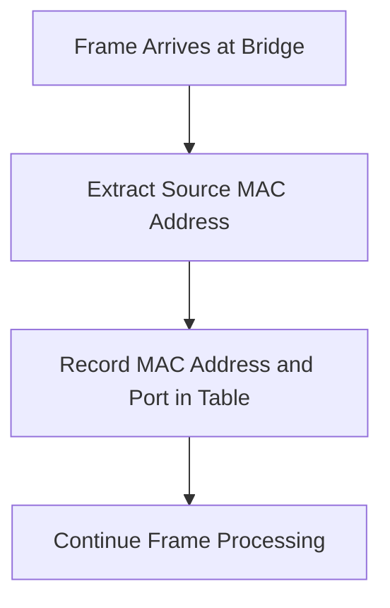
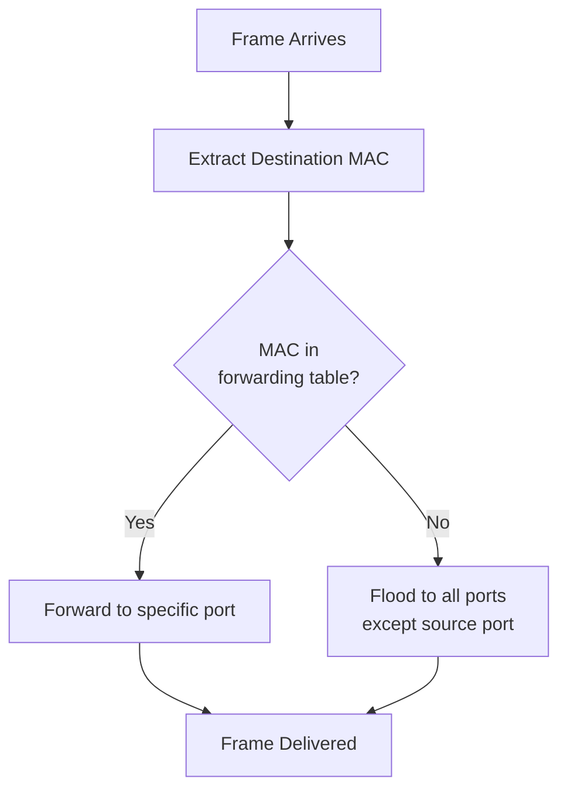
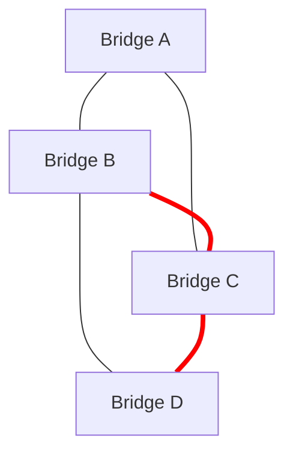

# Network Bridges

## Introduction

A network bridge is a crucial device that operates at the data link layer (Layer 2) of the OSI model. Its primary function is to connect and filter traffic between different network segments, creating a single aggregate network. Unlike hubs that blindly forward all traffic, bridges make intelligent forwarding decisions based on MAC addresses, which helps reduce unnecessary traffic and improve overall network performance.

Bridges were among the first devices used to extend networks beyond a single segment, paving the way for more complex modern networks. Today, while switches have largely replaced traditional bridges in many scenarios, understanding bridge functionality remains important as the core principles continue to be applied in various network technologies.

## What is a Network Bridge?

A network bridge is a networking device that connects multiple network segments at the data link layer (Layer 2) of the OSI model. It performs two primary functions:

1. **Connecting network segments**: Bridges join different physical network segments into a single logical network
2. **Filtering traffic**: They selectively forward frames between segments based on MAC addresses

## How Network Bridges Work

Let's break down the operation of a bridge step-by-step:

### 1. MAC Address Learning

When a bridge is first powered on, its forwarding table (also called a MAC address table) is empty. As frames pass through the bridge, it builds this table by:

1. Examining the source MAC address of each incoming frame
2. Recording which port the frame arrived on
3. Adding this MAC-to-port mapping to its forwarding table



### 2. Frame Forwarding Decision

When a frame arrives at the bridge, it uses the following logic to decide what to do with it:

1. Extract the destination MAC address from the frame
2. Check if the destination MAC address exists in the forwarding table
   a. If found, forward the frame to the specific port associated with that MAC
   b. If not found, forward the frame to all ports except the one it came from (flooding)
3. If the destination is on the same segment as the source, discard the frame



### 3. Loop Avoidance

One critical concern with bridges is the potential for broadcast storms caused by loops in the network topology. Modern bridging technologies implement the Spanning Tree Protocol (STP) to prevent such loops by:

1. Electing a root bridge
2. Calculating the shortest path to the root
3. Blocking redundant paths to prevent loops

## Types of Network Bridges

There are several types of bridges, each with specific characteristics:

### Transparent Bridges

These are the most common type of bridges and operate invisibly to other network devices. They automatically learn MAC addresses and make forwarding decisions without requiring configuration by network administrators.

### Source-Route Bridges

Primarily used in Token Ring networks, these bridges rely on the sending device to determine the entire route a frame should take through the network.

### Translational Bridges

These bridges can connect different types of networks, such as Ethernet to Token Ring, by translating between different frame formats.

## Bridge vs. Switch vs. Router

Let's compare bridges with other common networking devices:

| Feature | Bridge | Switch | Router |
|---------|--------|--------|--------|
| OSI Layer | Data Link (Layer 2) | Data Link (Layer 2) | Network (Layer 3) |
| Forwarding Based On | MAC Address | MAC Address | IP Address |
| Ports | Few (2-16 typically) | Many (24+ common) | Few (2-24 typically) |
| Traffic Isolation | Basic segmentation | VLANs, better isolation | Complete network separation |
| Broadcast Domain | Forwards broadcasts | Forwards broadcasts | Blocks broadcasts |

A simple way to think about it: a switch is essentially a multi-port bridge with more advanced features.

## Practical Example: Setting Up a Simple Bridge

Let's look at how you might set up a basic software bridge in Linux. This can be useful for connecting virtual machines or different network segments:

```bash
# Install bridge utilities
sudo apt-get install bridge-utils

# Create a bridge interface
sudo brctl addbr br0

# Add physical interfaces to the bridge
sudo brctl addif br0 eth0
sudo brctl addif br0 eth1

# Activate the bridge
sudo ip link set dev br0 up
```

This creates a bridge named `br0` and connects two network interfaces (`eth0` and `eth1`) to it. Any traffic between these interfaces will now be bridged according to MAC addresses.

## Network Bridge Simulation Example

Let's simulate a simple network bridge operation with Python. This basic example shows the conceptual operation of a bridge's MAC learning and forwarding functionality:

```python
class SimpleBridge:
    def __init__(self):
        # Initialize empty MAC address table
        self.mac_table = {}
        
    def learn_mac_address(self, mac_address, port):
        """Learn a MAC address by adding it to the table."""
        self.mac_table[mac_address] = port
        print(f"Learned: MAC {mac_address} is on port {port}")
        
    def forward_frame(self, source_mac, destination_mac, source_port):
        """Decide how to forward a frame."""
        # First, learn the source MAC
        self.learn_mac_address(source_mac, source_port)
        
        # Decide where to forward
        if destination_mac in self.mac_table:
            destination_port = self.mac_table[destination_mac]
            if destination_port == source_port:
                print(f"Frame from {source_mac} to {destination_mac} dropped (same segment)")
                return None
            else:
                print(f"Frame from {source_mac} to {destination_mac} forwarded to port {destination_port}")
                return destination_port
        else:
            print(f"Frame from {source_mac} to {destination_mac} flooded to all ports except {source_port}")
            return "ALL_EXCEPT_SOURCE"

# Sample usage
bridge = SimpleBridge()

# Frame 1: Device A sending to Device B for the first time
print("
Frame 1:")
bridge.forward_frame("AA:BB:CC:DD:EE:01", "AA:BB:CC:DD:EE:02", 1)

# Frame 2: Device B sending to Device A
print("
Frame 2:")
bridge.forward_frame("AA:BB:CC:DD:EE:02", "AA:BB:CC:DD:EE:01", 2)

# Frame 3: Device A sending to Device B again
print("
Frame 3:")
bridge.forward_frame("AA:BB:CC:DD:EE:01", "AA:BB:CC:DD:EE:02", 1)
```

**Output:**
```
Frame 1:
Learned: MAC AA:BB:CC:DD:EE:01 is on port 1
Frame from AA:BB:CC:DD:EE:01 to AA:BB:CC:DD:EE:02 flooded to all ports except 1

Frame 2:
Learned: MAC AA:BB:CC:DD:EE:02 is on port 2
Frame from AA:BB:CC:DD:EE:02 to AA:BB:CC:DD:EE:01 forwarded to port 1

Frame 3:
Learned: MAC AA:BB:CC:DD:EE:01 is on port 1
Frame from AA:BB:CC:DD:EE:01 to AA:BB:CC:DD:EE:02 forwarded to port 2
```

This example demonstrates how a bridge learns MAC addresses and makes forwarding decisions based on its MAC address table.

## Real-World Applications of Network Bridges

Network bridges are used in various scenarios, including:

### 1. Connecting Legacy Systems

Bridges can connect older network technologies with newer ones, allowing organizations to preserve investments in legacy equipment while gradually upgrading.

### 2. Network Segmentation for Security

By selectively forwarding traffic, bridges can isolate sensitive parts of a network from general traffic, enhancing security.

### 3. Wireless Access Points

Many wireless access points function as bridges, connecting wireless devices to the wired network infrastructure.

### 4. Testing and Development Environments

Bridges are useful for creating isolated network segments for testing and development without impacting the production network.

## Common Bridge Protocols

Several protocols have been developed to enhance bridge functionality:

### Spanning Tree Protocol (STP)

STP prevents loops in networks with redundant paths by creating a tree structure where only one active path exists between any two network nodes.



In the diagram above, the red links would be disabled by STP to prevent loops while maintaining connectivity.

### Rapid Spanning Tree Protocol (RSTP)

RSTP is an evolution of STP that provides faster convergence when the network topology changes.

### Multiple Spanning Tree Protocol (MSTP)

MSTP allows different VLANs to use different spanning trees, enabling more efficient use of redundant links.

## Limitations of Network Bridges

Despite their usefulness, bridges have several limitations:

1. **Broadcast Storms**: Without proper protocols like STP, network loops can cause broadcast storms
2. **Scalability Issues**: Traditional bridges don't scale well for large networks
3. **Limited Filtering Capabilities**: They only filter based on MAC addresses, not higher-layer information
4. **No VLAN Support**: Basic bridges don't support VLANs (though modern switches do)

## Summary

Network bridges play a fundamental role in network infrastructure by:

- Connecting different network segments at the data link layer
- Learning MAC addresses to build forwarding tables
- Making intelligent forwarding decisions
- Improving network efficiency by filtering unnecessary traffic
- Providing the foundation for more advanced network devices like switches

Understanding bridges is essential for grasping how modern networks function, especially as the core principles of bridging continue to be applied in various network technologies, from traditional LANs to software-defined networking.

## Further Learning

To deepen your understanding of network bridges, consider exploring:

1. **Spanning Tree Protocol (STP)** and its variants in detail
2. **Software-defined networking (SDN)** concepts that build upon bridging principles
3. **Network virtualization** technologies that use bridging concepts
4. **Bridge configuration** in different operating systems

## Exercises

1. Draw a network diagram with 4 devices connected by a bridge, and trace how the bridge's MAC table would populate as devices communicate.

2. Compare and contrast the forwarding behavior of a hub, a bridge, and a router when handling:
   - A unicast frame to a known destination
   - A broadcast frame
   - A frame to an unknown destination

3. Research and explain how the Spanning Tree Protocol prevents loops in a network with redundant bridges.

4. Using a virtualization platform like VirtualBox or VMware, create a virtual network with a software bridge connecting multiple virtual machines.