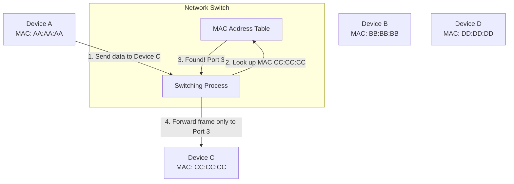
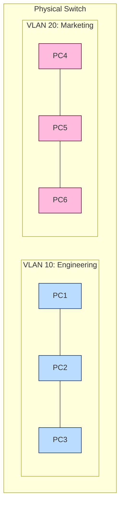
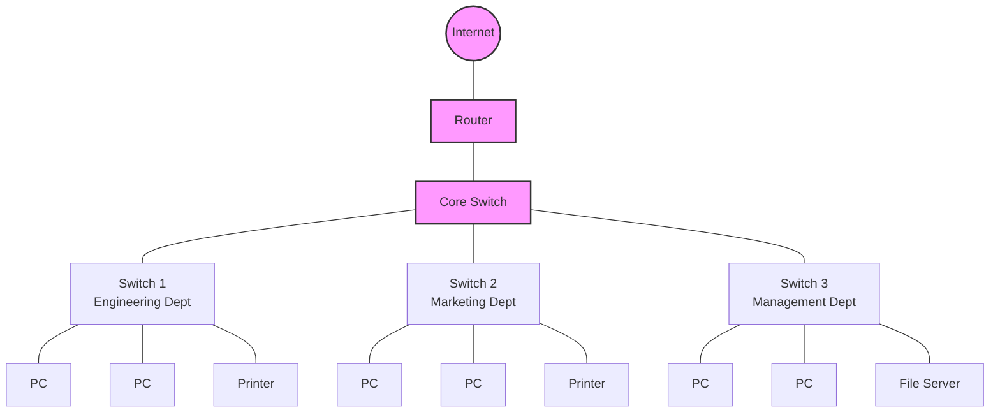

# Network Switches

## Introduction

Network switches are crucial devices that operate at the Data Link Layer (Layer 2) of the OSI model. They serve as the central connection points for devices in a local area network (LAN), intelligently forwarding data packets between connected devices. Unlike their predecessor, the hub, switches examine each packet's destination MAC address and forward it only to the intended recipient, significantly improving network efficiency and security.

## What is a Network Switch?

A network switch is a hardware device that connects multiple devices within a single local network. It processes and routes data at the Data Link Layer using MAC (Media Access Control) addresses. Think of a switch as a traffic controller that creates temporary direct connections between sending and receiving devices.

### Key Features of Switches

- **Intelligent Packet Forwarding**: Only sends data to the intended recipient
- **MAC Address Learning**: Builds and maintains MAC address tables
- **Full-Duplex Communication**: Allows simultaneous sending and receiving of data
- **Low Latency**: Provides high-speed connections between devices
- **Network Segmentation**: Can divide networks into separate collision domains

## How Network Switches Work

Switches operate through a process called "switching," which includes:

1. **Learning**: The switch learns which devices are connected to which ports by examining the source MAC addresses of incoming frames
2. **Forwarding Decision**: When a frame arrives, the switch examines its destination MAC address
3. **Forwarding**: The switch forwards the frame only to the port where the destination device is connected
4. **Flooding**: If the destination is unknown, the switch floods the frame to all ports except the one it came from
5. **Aging**: The switch removes MAC addresses from its table after a period of inactivity

Let's visualize how a basic switch operates:



## Types of Network Switches

Switches come in various types, each designed for specific network requirements:

### 1. Unmanaged Switches

These are plug-and-play devices with no configuration options. They're suitable for basic home or small office networks.

**Characteristics:**
- Fixed configuration
- No setup required
- Limited features
- Lower cost

### 2. Managed Switches

These offer configuration options and advanced features for network optimization and monitoring.

**Characteristics:**
- VLAN support
- Quality of Service (QoS) settings
- Port mirroring
- Remote management
- SNMP support

### 3. Smart/Web-Managed Switches

These are hybrid devices that offer some managed features with simpler interfaces.

**Characteristics:**
- Web interface for configuration
- Basic VLAN support
- Limited QoS capabilities
- More affordable than fully managed switches

### 4. PoE (Power over Ethernet) Switches

These can provide electrical power along with data over Ethernet cables.

**Characteristics:**
- Power delivery to devices like IP cameras, VoIP phones, and wireless access points
- Eliminates need for separate power cables
- Available in both managed and unmanaged versions

## Switch Configuration Basics

While unmanaged switches don't require configuration, managed switches offer many configuration options. Here's a simple example of configuring a Cisco switch:

```
// Connect to the switch via console
// Enter privileged EXEC mode
Switch> enable
Switch#

// Enter global configuration mode
Switch# configure terminal
Switch(config)#

// Configure a hostname
Switch(config)# hostname DataCenterSwitch
DataCenterSwitch(config)#

// Configure an interface
DataCenterSwitch(config)# interface GigabitEthernet0/1
DataCenterSwitch(config-if)# description Connection to Server1
DataCenterSwitch(config-if)# speed 1000
DataCenterSwitch(config-if)# duplex full
DataCenterSwitch(config-if)# exit

// Save the configuration
DataCenterSwitch# copy running-config startup-config
```

## VLANs: Virtual Local Area Networks

VLANs are one of the most powerful features of managed switches, allowing you to segment a physical network into multiple logical networks.

### Benefits of VLANs

- **Improved security**: Traffic is isolated between VLANs
- **Reduced broadcast traffic**: Broadcasts only occur within the same VLAN
- **Better organization**: Group devices by function, not physical location
- **Simplified management**: Apply policies to entire VLANs

### Basic VLAN Configuration Example

```
// Enter global configuration mode
Switch# configure terminal

// Create a VLAN
Switch(config)# vlan 10
Switch(config-vlan)# name Engineering
Switch(config-vlan)# exit

Switch(config)# vlan 20
Switch(config-vlan)# name Marketing
Switch(config-vlan)# exit

// Assign ports to VLANs
Switch(config)# interface range GigabitEthernet0/1-5
Switch(config-if-range)# switchport mode access
Switch(config-if-range)# switchport access vlan 10
Switch(config-if-range)# exit

Switch(config)# interface range GigabitEthernet0/6-10
Switch(config-if-range)# switchport mode access
Switch(config-if-range)# switchport access vlan 20
Switch(config-if-range)# exit
```

Here's a visualization of VLANs:



## Switch Performance Metrics

When selecting a switch, consider these important performance metrics:

### 1. Throughput

The maximum rate at which a switch can process data, typically measured in packets per second (pps).

### 2. Latency

The delay as packets travel through the switch, measured in microseconds.

### 3. Backplane Speed

The total capacity of the switch to handle data across all ports simultaneously, measured in gigabits per second (Gbps).

### 4. Port Density

The number of ports available on the switch.

### 5. Forwarding Rate

The number of packets a switch can process per second, which impacts overall performance.

## Practical Example: Building a Small Office Network

Let's design a small office network with approximately 30 devices:



In this setup:
- The core switch connects to departmental switches
- Each department has its own switch, creating separate collision domains
- The network can be further segmented using VLANs for enhanced security
- Managed switches would allow for traffic prioritization (QoS)

### Implementation Considerations:

1. **Switch Selection**:
   - Core switch: A managed Layer 3 switch with high backplane capacity
   - Department switches: Managed Layer 2 switches with adequate port counts

2. **VLAN Configuration**:
   - VLAN 10: Engineering
   - VLAN 20: Marketing
   - VLAN 30: Management
   - VLAN 100: Management interfaces

3. **Security Measures**:
   - Port security to limit MAC addresses per port
   - Unused ports disabled
   - Management interfaces in a separate VLAN

## Switches vs. Other Network Devices

Understanding how switches differ from other networking devices helps clarify their role:

| Device | OSI Layer | Function | Addressing Method |
| ------ | --------- | -------- | ----------------- |
| Hub | Physical (Layer 1) | Repeats signals to all ports | None |
| Switch | Data Link (Layer 2) | Forwards frames based on MAC address | MAC Address |
| Router | Network (Layer 3) | Routes packets between networks | IP Address |
| Layer 3 Switch | Data Link & Network (Layers 2-3) | Combines switching and basic routing | MAC & IP Addresses |

## Common Switch Issues and Troubleshooting

Even well-configured switches can experience problems. Here are some common issues and solutions:

### 1. Port Errors

**Symptoms**: High error rates, packet loss  
**Possible Causes**: Damaged cables, electromagnetic interference, faulty NIC  
**Solutions**: Replace cables, move cables away from interference sources, check port statistics

### 2. Broadcast Storms

**Symptoms**: Network slowdown, high CPU usage on switches  
**Possible Causes**: Network loops, malfunctioning devices  
**Solutions**: Implement Spanning Tree Protocol (STP), isolate problematic devices

### 3. MAC Address Table Overflow

**Symptoms**: Unpredictable connectivity issues  
**Possible Causes**: Too many devices, MAC spoofing attack  
**Solutions**: Implement port security, segment network with more switches

### 4. VLAN Misconfiguration

**Symptoms**: Devices can't communicate when they should, or can communicate when they shouldn't  
**Possible Causes**: Incorrect VLAN assignments, trunk configuration issues  
**Solutions**: Verify VLAN configurations, check trunk port settings

## Summary

Network switches are fundamental components of modern networks, operating at the Data Link Layer to intelligently direct traffic between connected devices. They offer significant advantages over older technologies like hubs by creating separate collision domains, providing full-duplex communication, and enabling advanced features like VLANs and QoS.

Key points to remember:
- Switches forward frames based on MAC addresses
- They maintain a MAC address table to make intelligent forwarding decisions
- Managed switches offer configuration options for optimizing network performance
- VLANs allow logical segmentation of physical networks
- Switches significantly improve network efficiency, security, and manageability

## Additional Resources and Exercises

### Further Learning Resources

- Cisco Networking Academy courses on switching technologies
- CompTIA Network+ certification materials
- "Computer Networking: A Top-Down Approach" by Kurose and Ross

### Practice Exercises

1. **MAC Address Table Analysis**: Examine a switch's MAC address table and explain the forwarding decisions for various destination addresses.

2. **VLAN Planning Exercise**: Design a VLAN structure for a company with 4 departments and 100 users, considering security and efficiency.

3. **Switch Selection Challenge**: Compare specifications of three different switches and recommend the best option for a specific network scenario.

4. **Troubleshooting Scenario**: Given symptoms of network issues, identify potential switch-related causes and propose solutions.

5. **Network Diagram Creation**: Draw a network topology for a small business, including appropriate switch placement and connections.