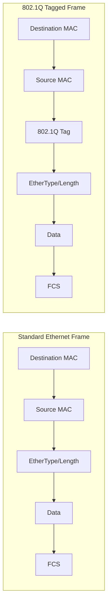
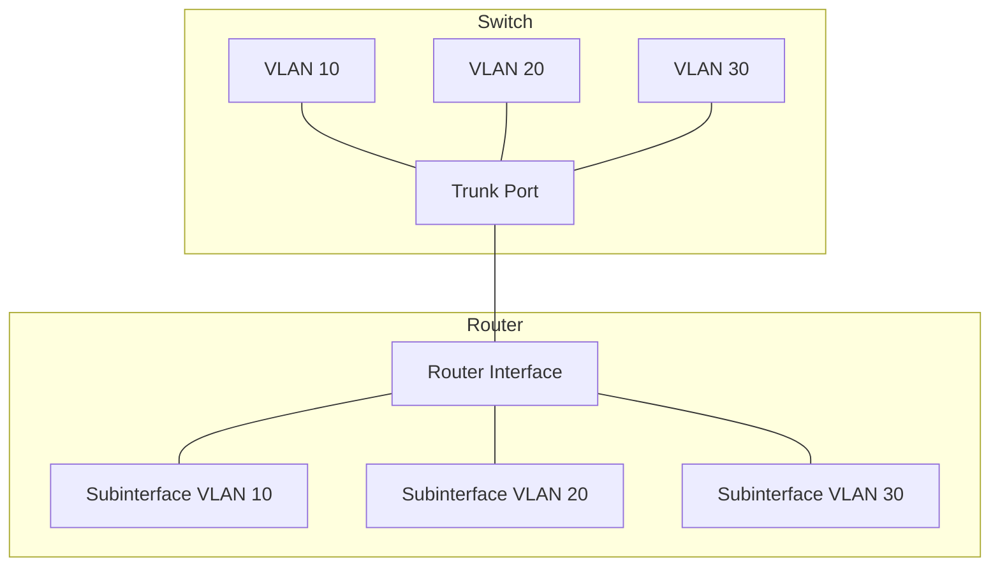
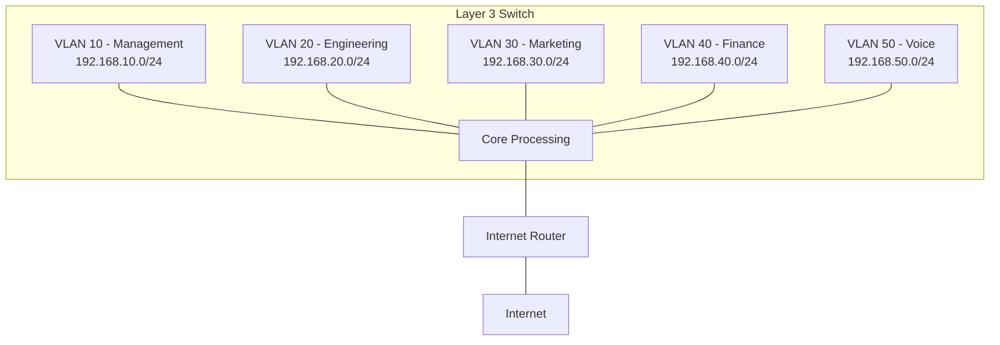

# Networks VLANs

## Introduction

Virtual Local Area Networks (VLANs) are one of the most important concepts in modern network design. They allow network administrators to create multiple isolated network segments within a single physical network infrastructure. VLANs operate at the Data Link Layer (Layer 2) of the OSI model and provide logical segmentation of networks without requiring separate physical hardware for each network.

Think of VLANs as creating "virtual switches" within a physical switch, where each virtual switch operates independently and can't communicate directly with the others without the help of a router.

## Why Do We Need VLANs?

Before diving into the technical details, let's understand why VLANs were developed:

1. **Network Segmentation**: Divide a large network into smaller, manageable segments
2. **Security**: Isolate sensitive systems from the rest of the network
3. **Broadcast Control**: Reduce broadcast traffic by confining it to specific VLANs
4. **Resource Optimization**: More efficient use of network infrastructure
5. **Flexible Network Design**: Create logical networks based on function rather than physical location

## VLAN Fundamentals

### Basic Concepts

VLANs modify how switches handle Ethernet frames by adding tags to identify which VLAN a frame belongs to. This is defined in the IEEE 802.1Q standard.

Here's how a standard Ethernet frame compares to an 802.1Q-tagged frame:



The 802.1Q tag consists of:

- Tag Protocol Identifier (TPID): 2 bytes set to 0x8100 to identify the frame as an 802.1Q frame
- Tag Control Information (TCI): 2 bytes containing:
  - Priority Code Point (PCP): 3 bits for QoS prioritization
  - Canonical Format Indicator (CFI): 1 bit
  - VLAN Identifier (VID): 12 bits allowing for up to 4,094 unique VLANs (0 and 4095 are reserved)

### VLAN Types

VLANs can be categorized in several ways:

1. **Port-Based VLANs**: The most common type, where switch ports are assigned to specific VLANs
2. **Protocol-Based VLANs**: Grouped by the network protocol used (IPv4, IPv6, etc.)
3. **MAC-Based VLANs**: Grouped by MAC addresses of devices
4. **Voice VLANs**: Specially configured for Voice over IP (VoIP) traffic

## VLAN Configuration

### Switch Port Types

When configuring VLANs, you need to understand two types of switch ports:

1. **Access Ports**: Connected to end devices and belong to a single VLAN
2. **Trunk Ports**: Carry traffic for multiple VLANs between switches or to devices that understand VLAN tags

### Basic VLAN Configuration

Here's how to configure VLANs on a Cisco switch through the command-line interface:

```
! Create a VLAN
Switch# configure terminal
Switch(config)# vlan 10
Switch(config-vlan)# name Engineering
Switch(config-vlan)# exit

! Assign a port to a VLAN (Access port)
Switch(config)# interface fastethernet 0/1
Switch(config-if)# switchport mode access
Switch(config-if)# switchport access vlan 10
Switch(config-if)# exit

! Configure a trunk port
Switch(config)# interface gigabitethernet 0/1
Switch(config-if)# switchport mode trunk
Switch(config-if)# switchport trunk allowed vlan 10,20,30
Switch(config-if)# exit
```

The output of `show vlan brief` would look something like:

```
VLAN Name                             Status    Ports
---- -------------------------------- --------- -------------------------------
1    default                          active    Fa0/2, Fa0/3, Fa0/4, Fa0/5
10   Engineering                      active    Fa0/1
20   Marketing                        active    
30   Accounting                       active    
```

## Inter-VLAN Routing

Devices on different VLANs cannot communicate directly with each other - they need a Layer 3 device (router or Layer 3 switch) to route traffic between VLANs.

### Router-on-a-Stick

A traditional method for inter-VLAN routing is "Router-on-a-Stick," where a single router interface is connected to a switch trunk port and configured with subinterfaces - one for each VLAN.



Configuration example:

```
! Router configuration
Router# configure terminal
Router(config)# interface gigabitethernet 0/0
Router(config-if)# no shutdown
Router(config-if)# exit

Router(config)# interface gigabitethernet 0/0.10
Router(config-subif)# encapsulation dot1q 10
Router(config-subif)# ip address 192.168.10.1 255.255.255.0
Router(config-subif)# exit

Router(config)# interface gigabitethernet 0/0.20
Router(config-subif)# encapsulation dot1q 20
Router(config-subif)# ip address 192.168.20.1 255.255.255.0
Router(config-subif)# exit
```

### Layer 3 Switching

Modern networks often use Layer 3 switches, which can perform routing between VLANs much faster than a router:

```
! Configure Layer 3 switch for inter-VLAN routing
Switch(config)# ip routing

! Create VLAN interfaces
Switch(config)# interface vlan 10
Switch(config-if)# ip address 192.168.10.1 255.255.255.0
Switch(config-if)# no shutdown
Switch(config-if)# exit

Switch(config)# interface vlan 20
Switch(config-if)# ip address 192.168.20.1 255.255.255.0
Switch(config-if)# no shutdown
Switch(config-if)# exit
```

## VLAN Security Considerations

VLANs can enhance security but aren't security features themselves. Consider these security best practices:

1. **VLAN Hopping Prevention**:
   - Disable DTP (Dynamic Trunking Protocol)
   - Explicitly configure trunk ports
   - Use a dedicated VLAN for trunks
   
2. **Native VLAN Security**:
   - Change the native VLAN from the default (VLAN 1)
   - Don't use the native VLAN for user traffic

3. **Management VLAN**:
   - Place management interfaces in a separate, dedicated VLAN

## Real-World VLAN Application Example

Let's look at a practical example for a small business network with 50 employees:



In this setup:

- **VLAN 10**: Limited to IT staff devices and network management
- **VLAN 20**: Engineering department with development servers
- **VLAN 30**: Marketing department with web and design resources
- **VLAN 40**: Finance department with sensitive financial data
- **VLAN 50**: Dedicated for VoIP phones with QoS prioritization

The Layer 3 switch handles routing between VLANs, with access control lists (ACLs) configured to:
- Allow Marketing to access Engineering resources but not Finance
- Restrict Finance data to Finance department personnel only
- Give IT management access to all VLANs

## Troubleshooting VLANs

Common VLAN issues and their solutions:

| Problem | Possible Causes | Troubleshooting Steps |
|---------|----------------|----------------------|
| Devices in same VLAN can't communicate | Port assignment incorrect | Verify port VLAN assignments with `show vlan` |
| | Switch misconfiguration | Check port status with `show interfaces status` |
| Inter-VLAN routing not working | Subinterface misconfiguration | Verify subinterface settings |
| | Missing routes | Check routing table with `show ip route` |
| Trunk link not passing VLAN traffic | Allowed VLANs restricted | Check trunk config with `show interfaces trunk` |

Key troubleshooting commands:

```
! Verify VLAN existence and port assignments
Switch# show vlan [brief]

! Check trunk configuration
Switch# show interfaces trunk

! Verify port status and VLAN assignment
Switch# show interfaces status

! Verify interface configuration
Switch# show running-config interface {interface-id}
```

## Best Practices for VLAN Design

1. **Plan Before Implementing**:
   - Document your VLAN design
   - Use a consistent VLAN numbering scheme
   
2. **VLAN Layout**:
   - Keep the total number of VLANs manageable
   - Group devices by function rather than location
   
3. **Performance Considerations**:
   - Balance traffic across VLANs
   - Use dedicated VLANs for high-bandwidth applications
   
4. **Documentation**:
   - Maintain documentation of VLAN assignments
   - Document the purpose of each VLAN

## Summary

VLANs are a powerful tool in network design that provide logical segmentation of networks at the Data Link Layer. They offer:

- Enhanced security through network isolation
- Better broadcast control and performance
- Flexibility in network design regardless of physical topology
- Cost-effectiveness by maximizing existing infrastructure

Whether you're managing a small office network or a large enterprise infrastructure, understanding VLANs is essential for creating efficient, secure, and manageable networks.

## Practice Exercises

1. **Basic VLAN Configuration**:
   - Create three VLANs (10, 20, 30) on a switch
   - Assign ports 1-8 to VLAN 10, 9-16 to VLAN 20, and 17-24 to VLAN 30
   - Configure port 24 as a trunk port

2. **Inter-VLAN Routing Exercise**:
   - Configure a router to route between three VLANs
   - Set up appropriate IP addressing for each VLAN
   - Test connectivity between devices in different VLANs

3. **VLAN Security Challenge**:
   - Identify potential VLAN security vulnerabilities in a given network diagram
   - Implement configurations to address these vulnerabilities

## Additional Resources

- IEEE 802.1Q standard documentation
- Networking certification guides (CCNA, Network+)
- Online network simulators for practicing VLAN configuration
- Vendor documentation for specific switch models