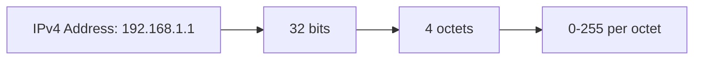
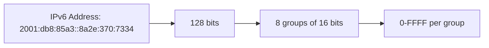
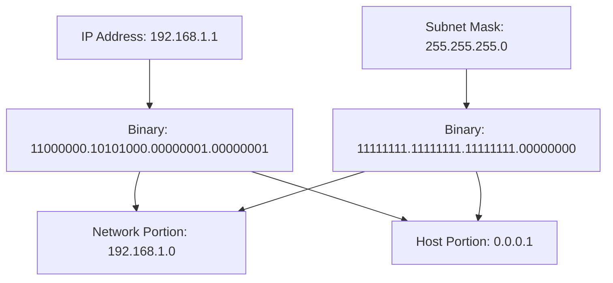

# Networks IP Addressing

## Introduction

IP (Internet Protocol) addressing is one of the fundamental concepts in computer networking. It serves as the digital equivalent of a postal address, allowing data packets to be routed across networks and ultimately reach their intended destination. Without IP addressing, the internet as we know it wouldn't function.

In this guide, we'll explore the core concepts of IP addressing, including IPv4 and IPv6 formats, subnetting, special addresses, and practical applications. By the end, you'll have a solid understanding of how devices identify and communicate with each other across networks.

## IP Addressing Basics

### What is an IP Address?

An IP address is a unique numerical identifier assigned to each device connected to a computer network that uses the Internet Protocol for communication. It serves two main purposes:

1. **Host or Network Interface Identification**: Identifies a specific device or network interface
2. **Location Addressing**: Provides the network location of the device, allowing for routing

Think of an IP address like your home address - it tells others exactly where to find you and deliver information.

### IPv4 vs IPv6

There are two main versions of IP addressing in use today:

#### IPv4 (Internet Protocol version 4)

IPv4 is the older and still widely used addressing scheme:

- 32-bit address length
- Written as four octets (bytes) separated by dots
- Example: `192.168.1.1`
- Supports approximately 4.3 billion unique addresses
- Address space is largely exhausted



#### IPv6 (Internet Protocol version 6)

IPv6 is the newer addressing scheme designed to replace IPv4:

- 128-bit address length
- Written as eight groups of four hexadecimal digits separated by colons
- Example: `2001:0db8:85a3:0000:0000:8a2e:0370:7334`
- Supports approximately 340 undecillion (3.4 × 10^38) unique addresses
- Allows for simplified notation with leading zeros removed
- Consecutive zero groups can be abbreviated with a double colon (::) once per address
- Example with abbreviation: `2001:db8:85a3::8a2e:370:7334`



## IPv4 Addressing in Depth

### Address Structure

An IPv4 address consists of two parts:

1. **Network ID**: Identifies the specific network
2. **Host ID**: Identifies a specific device on that network

The boundary between these parts is determined by the subnet mask.

### Subnet Masks and CIDR Notation

A subnet mask is a 32-bit number that masks an IP address, dividing the IP address into network and host addresses. It's represented in the same format as an IPv4 address.

Example:
- IP Address: `192.168.1.1`
- Subnet Mask: `255.255.255.0`

This can also be written in CIDR (Classless Inter-Domain Routing) notation as: `192.168.1.1/24`

The number after the slash indicates how many bits are used for the network portion. In this case, 24 bits are used for the network, leaving 8 bits for host addresses.



### Subnetting

Subnetting is the practice of dividing a network into two or more networks. This helps with:

- Reducing network traffic
- Improving security
- Making address management easier

#### Subnetting Example

Let's say we have a network with address `192.168.1.0/24`. This gives us 256 total addresses (2^8), with usable addresses from `192.168.1.1` to `192.168.1.254`.

If we want to divide this into four equal subnets, we would use 2 more bits for the network portion, making it `/26`:

1. `192.168.1.0/26` (Addresses 0-63)
2. `192.168.1.64/26` (Addresses 64-127)
3. `192.168.1.128/26` (Addresses 128-191)
4. `192.168.1.192/26` (Addresses 192-255)

Each subnet can have 62 usable host addresses (64 total minus the network address and broadcast address).

### Special IPv4 Addresses

- **Network Address**: The first address in a subnet (e.g., `192.168.1.0` in a `/24` network)
- **Broadcast Address**: The last address in a subnet (e.g., `192.168.1.255` in a `/24` network)
- **Loopback Address**: `127.0.0.1` - Used to refer to the local device
- **Private Addresses**:
  - `10.0.0.0/8` (10.0.0.0 to 10.255.255.255)
  - `172.16.0.0/12` (172.16.0.0 to 172.31.255.255)
  - `192.168.0.0/16` (192.168.0.0 to 192.168.255.255)
- **APIPA Address**: `169.254.0.0/16` - Assigned when DHCP fails

## IPv6 Addressing in Depth

### Address Structure

IPv6 addresses are 128 bits long and written in hexadecimal format. They are divided into eight 16-bit groups separated by colons.

IPv6 addresses have three types of addresses:

1. **Unicast**: Identifies a single interface
2. **Multicast**: Identifies a group of interfaces
3. **Anycast**: Delivered to one of a group of interfaces

### IPv6 Address Types

- **Global Unicast Addresses**: Public addresses routable on the internet (similar to IPv4 public addresses)
- **Link-Local Addresses**: Start with `fe80::` and are only valid on the local network segment
- **Unique Local Addresses**: Start with `fc00::/7` and are similar to IPv4 private addresses
- **Loopback Address**: `::1` - equivalent to 127.0.0.1 in IPv4

### IPv6 Subnetting

IPv6 subnetting is simpler than IPv4:
- Standard allocation for organizations is a `/48` prefix
- Standard allocation for a subnet is a `/64` prefix
- This means there are 2^16 (65,536) possible subnets in a typical organization

## Practical IP Addressing Examples

### Setting a Static IP Address

#### On Linux:

```bash
# Using the ip command
sudo ip addr add 192.168.1.100/24 dev eth0

# Making it persistent by editing /etc/network/interfaces
auto eth0
iface eth0 inet static
    address 192.168.1.100
    netmask 255.255.255.0
    gateway 192.168.1.1
```

#### On Windows (using PowerShell):

```powershell
# View current IP configuration
Get-NetIPAddress

# Set static IP address
New-NetIPAddress -InterfaceAlias "Ethernet" -IPAddress 192.168.1.100 -PrefixLength 24 -DefaultGateway 192.168.1.1
```

### Checking IP Configuration

#### On Linux:

```bash
# View IP configuration
ip addr show

# Or the older command
ifconfig

# Check routing table
route -n
```

#### On Windows:

```batch
# View IP configuration
ipconfig /all

# Check routing table
route print
```

### IP Address Planning Exercise

Let's say you're setting up a small business network with the following requirements:
- Up to 100 workstations
- Up to 20 servers
- Up to 50 IoT devices
- Guest network for visitors

You have the private range `192.168.0.0/16` to work with. How would you divide it?

Solution:
1. Workstations: `192.168.1.0/24` (Supports up to 254 hosts)
2. Servers: `192.168.2.0/25` (Supports up to 126 hosts)
3. IoT devices: `192.168.2.128/25` (Supports up to 126 hosts)
4. Guest network: `192.168.3.0/24` (Supports up to 254 hosts)

### Subnet Calculator Script

Here's a simple Python script to calculate subnet information:

```python
def calculate_subnet_info(ip_address, cidr):
    # Convert IP to binary
    ip_octets = ip_address.split('.')
    ip_binary = ''
    for octet in ip_octets:
        ip_binary += bin(int(octet))[2:].zfill(8)
    
    # Calculate subnet mask
    subnet_mask_binary = '1' * int(cidr) + '0' * (32 - int(cidr))
    subnet_mask = []
    for i in range(0, 32, 8):
        subnet_mask.append(str(int(subnet_mask_binary[i:i+8], 2)))
    subnet_mask = '.'.join(subnet_mask)
    
    # Calculate network address
    network_binary = ''
    for i in range(32):
        network_binary += str(int(ip_binary[i]) & int(subnet_mask_binary[i]))
    network_address = []
    for i in range(0, 32, 8):
        network_address.append(str(int(network_binary[i:i+8], 2)))
    network_address = '.'.join(network_address)
    
    # Calculate number of hosts
    num_hosts = 2 ** (32 - int(cidr)) - 2
    
    # Calculate broadcast address
    broadcast_binary = network_binary[:int(cidr)] + '1' * (32 - int(cidr))
    broadcast_address = []
    for i in range(0, 32, 8):
        broadcast_address.append(str(int(broadcast_binary[i:i+8], 2)))
    broadcast_address = '.'.join(broadcast_address)
    
    return {
        'Network Address': network_address,
        'Subnet Mask': subnet_mask,
        'Broadcast Address': broadcast_address,
        'Number of Usable Hosts': num_hosts,
        'First Usable Host': get_first_usable_host(network_address),
        'Last Usable Host': get_last_usable_host(broadcast_address)
    }

def get_first_usable_host(network_address):
    octets = network_address.split('.')
    octets[3] = str(int(octets[3]) + 1)
    return '.'.join(octets)

def get_last_usable_host(broadcast_address):
    octets = broadcast_address.split('.')
    octets[3] = str(int(octets[3]) - 1)
    return '.'.join(octets)

# Example usage
ip = "192.168.1.1"
cidr = 24
subnet_info = calculate_subnet_info(ip, cidr)

for key, value in subnet_info.items():
    print(f"{key}: {value}")
```

Output:
```
Network Address: 192.168.1.0
Subnet Mask: 255.255.255.0
Broadcast Address: 192.168.1.255
Number of Usable Hosts: 254
First Usable Host: 192.168.1.1
Last Usable Host: 192.168.1.254
```

## IP Address Management Considerations

### DHCP (Dynamic Host Configuration Protocol)

DHCP automates the assignment of IP addresses within a network:

- Eliminates manual configuration
- Prevents address conflicts
- Centralizes management
- Facilitates address reuse

A typical DHCP process follows four steps (DORA):
1. **Discover**: Client broadcasts to find a DHCP server
2. **Offer**: Server offers an IP address to the client
3. **Request**: Client requests the offered IP address
4. **Acknowledge**: Server confirms and provides additional information

### NAT (Network Address Translation)

NAT allows multiple devices on a private network to share a single public IP address:

- Conserves IPv4 addresses
- Adds a layer of security by hiding internal addresses
- Common in home and business networks

Types of NAT:
- **Static NAT**: One-to-one mapping between private and public addresses
- **Dynamic NAT**: Many-to-many mapping from a pool of addresses
- **PAT (Port Address Translation)**: Many-to-one mapping using different ports

## Summary

IP addressing forms the backbone of network communications. In this guide, we've covered:

- The purpose and structure of IP addresses
- The differences between IPv4 and IPv6
- Subnet masks and CIDR notation
- Subnetting techniques
- Special IP addresses and their uses
- Practical examples and considerations for IP address management

Understanding IP addressing is crucial for anyone working with networks, whether you're setting up a home network, configuring servers, or designing enterprise networks. As the internet continues to grow, IPv6 will become increasingly important, though IPv4 will remain in use for many years to come.

## Exercises

1. Calculate the subnet mask, network address, and broadcast address for the IP address `172.16.45.14/20`.
2. How many usable host addresses are available in a `/23` network?
3. Convert the following IPv4 address to binary: `10.168.0.5`.
4. Abbreviate the following IPv6 address: `2001:0db8:0000:0000:0000:ff00:0042:8329`.
5. Divide the network `192.168.10.0/24` into four equal subnets. List the network address, broadcast address, and range of usable addresses for each subnet.

## Additional Resources

- RFC 791: Internet Protocol (IPv4 specification)
- RFC 8200: Internet Protocol, Version 6 (IPv6) Specification
- "TCP/IP Illustrated, Volume 1: The Protocols" by W. Richard Stevens
- "Computer Networking: A Top-Down Approach" by James F. Kurose and Keith W. Ross
- Online subnet calculators like ipcalc or IP Subnet Calculator