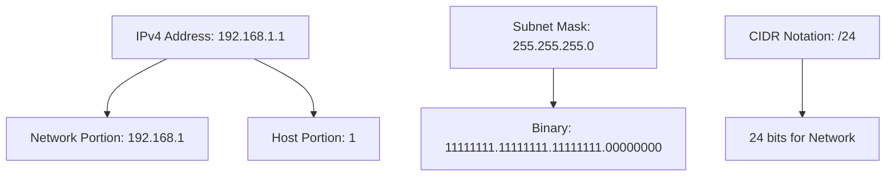
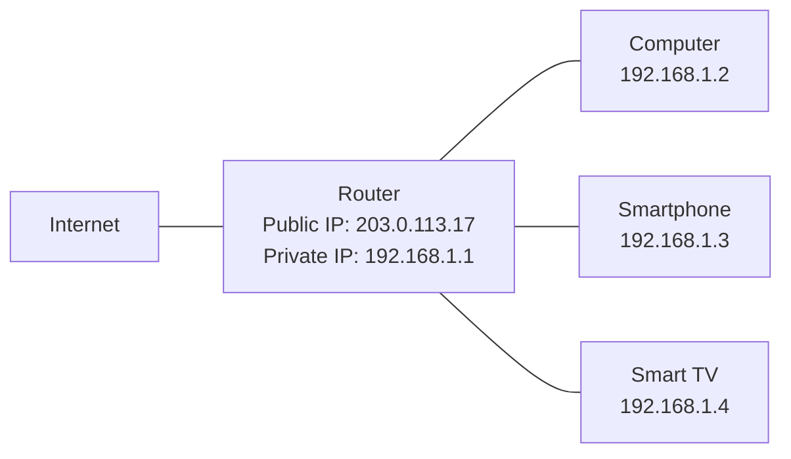

# Networks IPv4

## Introduction

Internet Protocol version 4 (IPv4) is one of the core protocols of the Internet and has been the dominant network layer protocol since its deployment in the early 1980s. It's responsible for identifying devices on a network and providing a logical addressing scheme that allows data packets to be routed between networks.

IPv4 addresses are 32-bit numerical labels, usually represented in human-readable format as four decimal numbers separated by dots (e.g., `192.168.1.1`). Despite the ongoing transition to IPv6 due to IPv4 address exhaustion, understanding IPv4 remains essential for anyone working with networks.

## IPv4 Address Structure

### Basic Format

An IPv4 address consists of 32 bits, divided into four 8-bit sections (octets). Each octet is represented as a decimal number ranging from 0 to 255, separated by periods.

```
32 bits = 4 bytes = 4 octets
```

For example:
- Binary: `11000000.10101000.00000001.00000001`
- Decimal: `192.168.1.1`

### Network and Host Portions

Each IPv4 address has two components:
1. **Network Identifier**: Specifies which network the device belongs to
2. **Host Identifier**: Uniquely identifies a device within that network

The division between these portions is determined by the subnet mask.

## Subnet Masks and CIDR Notation

A subnet mask is a 32-bit number that masks an IP address, dividing it into network and host addresses. It's typically represented in one of two ways:

### Traditional Subnet Mask
```
255.255.255.0
```

### CIDR (Classless Inter-Domain Routing) Notation
```
192.168.1.0/24
```

The `/24` indicates that the first 24 bits (3 octets) represent the network portion.

Let's visualize this with a diagram:



## IPv4 Address Classes

Traditionally, IPv4 addresses were divided into five classes:

| Class | First Bits | First Byte Range | Default Subnet Mask | Purpose |
|-------|------------|------------------|---------------------|---------|
| A     | 0          | 1-127            | 255.0.0.0 (/8)      | Large networks |
| B     | 10         | 128-191          | 255.255.0.0 (/16)   | Medium-sized networks |
| C     | 110        | 192-223          | 255.255.255.0 (/24) | Small networks |
| D     | 1110       | 224-239          | N/A                 | Multicast |
| E     | 1111       | 240-255          | N/A                 | Experimental |

Though classful addressing has been largely replaced by CIDR, understanding these classes helps with recognizing common subnet masks and network sizes.

## Special IPv4 Addresses

Several IPv4 address ranges are reserved for special purposes:

- **Private Addresses**: Used for local networks
  - 10.0.0.0/8 (Class A)
  - 172.16.0.0/12 (Class B)
  - 192.168.0.0/16 (Class C)
- **Loopback**: 127.0.0.0/8 (usually 127.0.0.1) - refers to the local device
- **Link-Local**: 169.254.0.0/16 - automatic private addressing
- **Broadcast**: Typically the last address in a subnet (e.g., 192.168.1.255 for 192.168.1.0/24)

## Practical IPv4 Usage

### Subnetting

Subnetting allows network administrators to divide a large network into smaller, more manageable subnetworks. This improves security, reduces network congestion, and optimizes address allocation.

Let's look at a practical example:

Suppose you have a network with address space `192.168.1.0/24` and you want to create 4 subnets.

1. You'll need 2 additional bits for the subnet portion (since 2² = 4)
2. Your new subnet mask becomes `/26` (24 + 2)
3. This gives you 4 subnets:
   - 192.168.1.0/26 (hosts: 192.168.1.1 - 192.168.1.62)
   - 192.168.1.64/26 (hosts: 192.168.1.65 - 192.168.1.126)
   - 192.168.1.128/26 (hosts: 192.168.1.129 - 192.168.1.190)
   - 192.168.1.192/26 (hosts: 192.168.1.193 - 192.168.1.254)

### Code Example: IP Address Validation in JavaScript

Here's a simple JavaScript function to validate if a string is a valid IPv4 address:

```javascript
function isValidIPv4(ip) {
  // Regular expression to match IPv4 pattern
  const ipv4Pattern = /^(25[0-5]|2[0-4][0-9]|[01]?[0-9][0-9]?)\.(25[0-5]|2[0-4][0-9]|[01]?[0-9][0-9]?)\.(25[0-5]|2[0-4][0-9]|[01]?[0-9][0-9]?)\.(25[0-5]|2[0-4][0-9]|[01]?[0-9][0-9]?)$/;
  
  return ipv4Pattern.test(ip);
}

// Example usage
console.log(isValidIPv4("192.168.1.1")); // Output: true
console.log(isValidIPv4("256.0.0.1"));   // Output: false (256 is out of range)
console.log(isValidIPv4("192.168.1"));   // Output: false (missing octet)
```

### Code Example: Finding Network Address in Python

```python
def get_network_address(ip_address, subnet_mask):
    # Split IP and subnet mask into octets
    ip_octets = ip_address.split('.')
    mask_octets = subnet_mask.split('.')
    
    # Convert to integers and calculate network address
    network_octets = []
    for i in range(4):
        ip_octet = int(ip_octets[i])
        mask_octet = int(mask_octets[i])
        # Bitwise AND operation
        network_octets.append(str(ip_octet & mask_octet))
    
    # Join octets with periods
    return '.'.join(network_octets)

# Example usage
ip = "192.168.5.10"
mask = "255.255.255.0"
network = get_network_address(ip, mask)
print(f"IP Address: {ip}")
print(f"Subnet Mask: {mask}")
print(f"Network Address: {network}")

# Output:
# IP Address: 192.168.5.10
# Subnet Mask: 255.255.255.0
# Network Address: 192.168.5.0
```

## Real-World Applications

### Home Networks

Most home routers use IPv4 addressing, typically assigning private addresses in the 192.168.0.0/16 range to devices. The router performs Network Address Translation (NAT) to allow multiple devices to share a single public IPv4 address.



### Corporate Networks

Large organizations typically implement complex subnetting schemes to organize departments, control traffic flow, and enhance security.

Example of a corporate network structure:
- Marketing: 10.1.0.0/24
- Engineering: 10.2.0.0/24
- Finance: 10.3.0.0/24
- HR: 10.4.0.0/24

### Cloud Infrastructure

Cloud providers use sophisticated IPv4 management for virtual machines, containers, and other resources. They often implement:
- Virtual Private Clouds (VPCs)
- Elastic IP addresses
- Software-defined networking with flexible subnetting

## IPv4 Limitations and IPv6 Transition

Despite its widespread use, IPv4 has significant limitations:

1. **Address Exhaustion**: The 32-bit addressing scheme allows for only ~4.3 billion addresses, which is insufficient for the modern internet.
2. **Fragmentation**: Inefficient routing due to address block fragmentation.
3. **Security**: Limited built-in security features.

This has led to the development of IPv6, which uses 128-bit addressing and provides many other improvements. However, IPv4 remains in wide use through technologies like:

- Network Address Translation (NAT)
- Carrier-Grade NAT (CGN)
- IPv4/IPv6 dual-stack implementations
- Tunneling and translation mechanisms

## Summary

IPv4 remains a fundamental technology for internet connectivity despite its limitations. Key takeaways include:

- IPv4 uses 32-bit addresses represented in dotted-decimal notation (e.g., 192.168.1.1)
- Addresses are divided into network and host portions via subnet masks
- CIDR notation provides a compact way to represent networks (e.g., 192.168.1.0/24)
- Subnetting allows for efficient network organization and management
- Special address ranges exist for private networks, loopback testing, and other purposes
- The transition to IPv6 is ongoing but IPv4 will remain relevant for years to come

## Exercises

1. Convert the following IPv4 addresses from decimal to binary format:
   - 10.0.0.1
   - 172.16.254.1
   - 192.168.10.10

2. Determine the network address for each of the following IP addresses and subnet masks:
   - IP: 192.168.5.37, Subnet Mask: 255.255.255.0
   - IP: 10.10.10.10, Subnet Mask: 255.255.0.0
   - IP: 172.16.28.15, Subnet Mask: 255.255.240.0

3. How many host addresses are available in a /27 network? List the network address, broadcast address, and range of valid host addresses for 192.168.1.0/27.

4. Write a program in your preferred language that takes an IP address and subnet mask as input and outputs the network address, broadcast address, and number of valid hosts.

## Additional Resources

- RFC 791: Internet Protocol Specification
- RFC 1918: Address Allocation for Private Internets
- RFC 4632: Classless Inter-domain Routing (CIDR)
- Books:
  - "TCP/IP Illustrated, Volume 1: The Protocols" by W. Richard Stevens
  - "Computer Networking: A Top-Down Approach" by Kurose and Ross