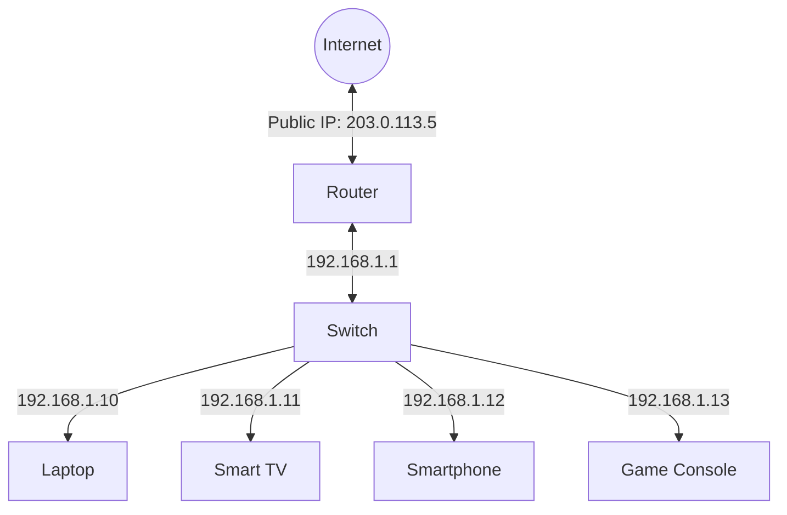

# Network Address Translation (NAT)

## Introduction

Network Address Translation (NAT) is a fundamental technology that has helped extend the lifespan of IPv4 addressing while providing additional security benefits. NAT allows a single device, usually a router, to act as an agent between the public internet and a local network. This means that only a single unique IP address is required to represent an entire group of computers to the outside world.

In this tutorial, we'll explore how NAT works, the different types of NAT implementations, their advantages and limitations, and how NAT fits into the bigger picture of networking.

## What is NAT and Why Do We Need It?

### The IPv4 Address Shortage Problem

The original IPv4 addressing scheme provides approximately 4.3 billion unique addresses (2^32). While this seemed sufficient in the early days of the internet, the explosive growth of connected devices worldwide created a critical shortage of available addresses.

NAT was developed as a practical solution to extend the usability of IPv4 addresses until IPv6 could be fully implemented. By allowing multiple devices to share a single public IP address, NAT effectively conserves the limited IPv4 address space.

### Basic NAT Concept

At its core, NAT works by modifying network address information in the IP header of packets while they are in transit across a routing device. The router maintains a translation table that tracks the mapping between:

- Private IP addresses (used within your local network)
- The public IP address (visible to the outside world)
- Port numbers (to distinguish between different connections)

Let's visualize a simplified NAT operation:


## Types of NAT

There are several types of NAT implementations, each with different characteristics:

### 1. Static NAT

Static NAT creates a one-to-one mapping between a private and public IP address. This mapping remains constant and is typically used when a device on the private network needs to be accessible from the internet.

**Example configuration (on a Cisco router):**

```
Router(config)# ip nat inside source static 192.168.1.10 203.0.113.5
Router(config)# interface GigabitEthernet0/0
Router(config-if)# ip nat inside
Router(config)# interface GigabitEthernet0/1
Router(config-if)# ip nat outside
```

### 2. Dynamic NAT

Dynamic NAT maps private IP addresses to a pool of public IP addresses. When a device needs internet access, it gets assigned the next available public IP from the pool.

**Example configuration:**

```
Router(config)# ip nat pool PUBLIC_POOL 203.0.113.5 203.0.113.10 netmask 255.255.255.248
Router(config)# access-list 1 permit 192.168.1.0 0.0.0.255
Router(config)# ip nat inside source list 1 pool PUBLIC_POOL
```

### 3. Port Address Translation (PAT) / NAT Overload

PAT, also known as NAT Overload, is the most common form of NAT used in home and small business networks. It maps multiple private IP addresses to a single public IP address by using different port numbers.

**Example configuration:**

```
Router(config)# access-list 1 permit 192.168.1.0 0.0.0.255
Router(config)# ip nat inside source list 1 interface GigabitEthernet0/1 overload
```

Let's see how PAT works with a practical example:

| Device | Private IP | Private Port | Public IP | Public Port |
|--------|------------|--------------|-----------|-------------|
| Laptop | 192.168.1.10 | 12345 | 203.0.113.5 | 33333 |
| Phone | 192.168.1.11 | 12345 | 203.0.113.5 | 33334 |
| Tablet | 192.168.1.12 | 12345 | 203.0.113.5 | 33335 |

In this example, all three devices can communicate with the same web server using the same port internally (12345), but NAT assigns different external ports to differentiate between connections.

## How NAT Works: Step by Step

Let's break down the NAT process when a device on your local network requests a webpage:

1. Your computer (192.168.1.10) sends a request to www.example.com
2. The packet reaches your NAT router with:
   - Source IP: 192.168.1.10
   - Source Port: 12345
   - Destination IP: 93.184.216.34 (www.example.com)
   - Destination Port: 80 (HTTP)

3. The NAT router modifies the packet:
   - Source IP: 203.0.113.5 (router's public IP)
   - Source Port: 33333 (mapped port)
   - Destination IP: 93.184.216.34 (unchanged)
   - Destination Port: 80 (unchanged)

4. The NAT router records this translation in its NAT table:
   ```
   Inside Local        Inside Global      Outside Global     Outside Local
   192.168.1.10:12345  203.0.113.5:33333  93.184.216.34:80  93.184.216.34:80
   ```

5. The server receives the request and responds to 203.0.113.5:33333

6. When the response arrives at the router, it checks its NAT table, translates the destination back to 192.168.1.10:12345, and forwards the packet to your computer

This entire process is transparent to both your computer and the web server.

## NAT and Private IP Address Ranges

NAT typically uses private IP addresses as defined in RFC 1918:

- Class A: 10.0.0.0 to 10.255.255.255 (10.0.0.0/8)
- Class B: 172.16.0.0 to 172.31.255.255 (172.16.0.0/12)
- Class C: 192.168.0.0 to 192.168.255.255 (192.168.0.0/16)

These address ranges are reserved for private networks and are not routable on the internet, making NAT necessary for devices with these addresses to access the internet.

## Advantages of NAT

NAT provides several benefits beyond just address conservation:

### 1. Security Through Obscurity

NAT provides a form of firewall by hiding your internal network structure. Devices on the internet can't initiate connections to your internal devices unless you specifically configure port forwarding.

### 2. Address Conservation

A single public IP address can be shared by hundreds or thousands of internal devices.

### 3. Network Flexibility

You can change your internal network addressing without affecting how external systems communicate with you.

### 4. ISP Independence

You can change your ISP (and thus your public IP address) without reconfiguring internal devices.

## Limitations and Challenges with NAT

Despite its benefits, NAT also introduces some complications:

### 1. End-to-End Connectivity Issues

Some applications expect direct end-to-end connectivity and may not work properly through NAT. This is particularly true for:
- VoIP applications
- Peer-to-peer applications
- Some online games

### 2. Performance Impact

Translation of IP addresses and ports adds processing overhead, potentially affecting router performance.

### 3. Complicates Certain Protocols

Protocols that embed IP addresses in the application layer (like FTP in active mode) may require special handling via Application Layer Gateways (ALGs).

### 4. IPv6 Transition Complexity

NAT can complicate the transition to IPv6 as it masks the need for native IPv6 addressing.

## Real-World Applications

### Example 1: Home Network

Let's examine a typical home network setup:



In this setup, all devices share the single public IP (203.0.113.5) provided by your ISP. NAT allows simultaneous internet access for all devices by tracking connections using port numbers.

### Example 2: Implementing a Basic NAT using Linux

Linux can serve as a NAT router with just a few commands. Here's how to set up a simple NAT on a Linux machine with two network interfaces (`eth0` connected to the internet and `eth1` connected to the local network):

```bash
# Enable IP forwarding
echo 1 > /proc/sys/net/ipv4/ip_forward

# Configure NAT using iptables
iptables -t nat -A POSTROUTING -o eth0 -j MASQUERADE
iptables -A FORWARD -i eth1 -o eth0 -j ACCEPT
iptables -A FORWARD -i eth0 -o eth1 -m state --state RELATED,ESTABLISHED -j ACCEPT
```

This configuration:
1. Enables IP forwarding to allow the Linux machine to route packets
2. Sets up masquerading (a form of dynamic NAT) for all outgoing packets
3. Allows forwarding of packets from the internal network to the internet
4. Allows return traffic that belongs to established connections

## NAT and IPv6

With IPv6's vast address space (2^128 addresses), the primary motivation for NAT disappears. However, some forms of NAT for IPv6 exist:

1. **NAT64**: Translates between IPv6 and IPv4 networks
2. **NPT (Network Prefix Translation)**: Maps one IPv6 prefix to another, similar to how NAT maps private IPv4 addresses to public ones

While IPv6 was designed to eliminate the need for NAT, many organizations still implement NAT-like features for security and network management reasons.

## Summary

Network Address Translation (NAT) has been a crucial technology in extending the life of IPv4 addressing while providing additional security benefits. NAT works by modifying IP address information in packet headers, allowing multiple private devices to share a single public IP address.

The key points covered in this tutorial include:

- NAT was developed to address IPv4 address exhaustion
- Different types of NAT exist: Static NAT, Dynamic NAT, and PAT/NAT Overload
- NAT provides security benefits by hiding internal network structure
- NAT can complicate certain applications and protocols
- While IPv6 reduces the need for NAT, some NAT-like features remain useful

Understanding NAT is essential for anyone working with networks, as it remains a fundamental component of most internet connections today.

## Exercises

1. **Basic NAT Table Analysis**: Given a NAT translation table, determine which internal IP is communicating with which external service.

2. **Router Configuration**: Practice configuring PAT on a virtual router using a network simulation tool like Packet Tracer or GNS3.

3. **Troubleshooting**: Identify common issues that might occur when an application doesn't work properly through NAT, and suggest potential solutions.

4. **Research Project**: Investigate how NAT traversal techniques like STUN, TURN, and ICE help applications work through NAT.

## Additional Resources

- [RFC 3022: Traditional IP Network Address Translator (Traditional NAT)](https://tools.ietf.org/html/rfc3022)
- [RFC 1918: Address Allocation for Private Internets](https://tools.ietf.org/html/rfc1918)
- [RFC 4787: Network Address Translation (NAT) Behavioral Requirements for Unicast UDP](https://tools.ietf.org/html/rfc4787)

For a deeper understanding of how NAT interacts with the broader networking stack, review the materials in our Network Layer and Transport Layer sections.