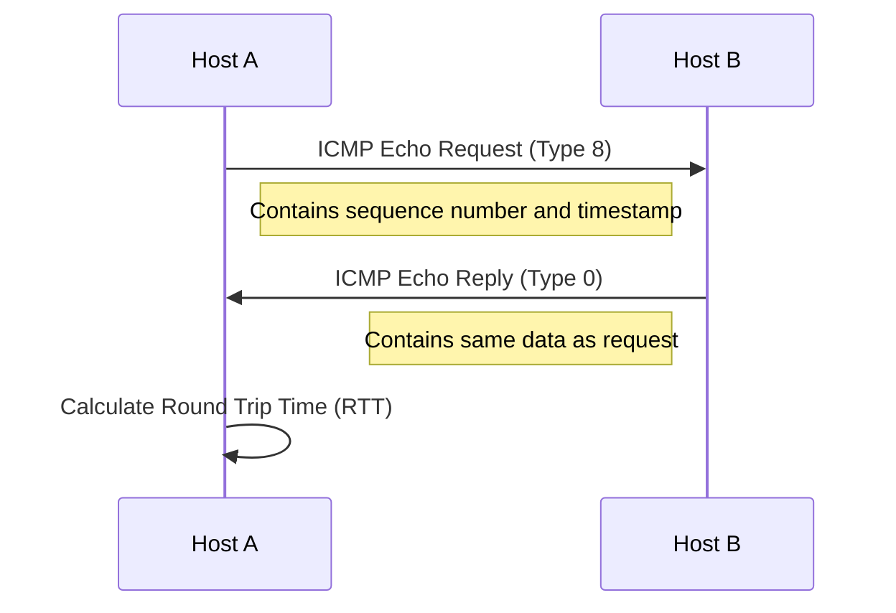
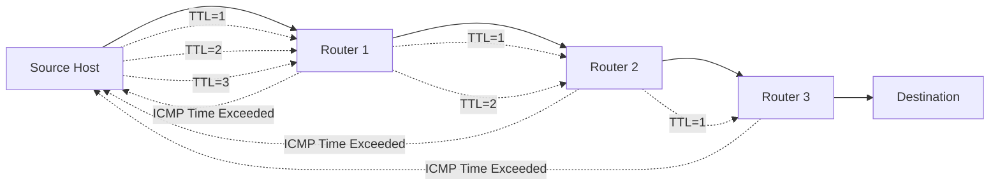
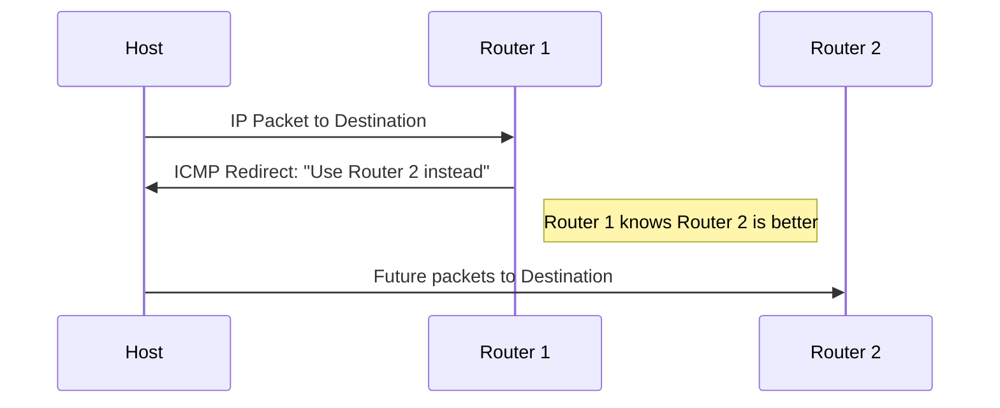

# Internet Control Message Protocol (ICMP)

## Introduction

The Internet Control Message Protocol (ICMP) is a crucial component of the TCP/IP suite that operates at the network layer. Unlike protocols such as TCP and UDP, ICMP doesn't transport user data between systems. Instead, it serves as the network's "messenger," providing feedback about network conditions, reporting errors, and helping diagnose network problems.

Think of ICMP as the network's way of communicating status updates and error messages. When something goes wrong with packet delivery, ICMP helps systems understand what happened and why.

## ICMP Basics

### Purpose and Function

ICMP performs several vital functions in a network:

1. **Error Reporting**: ICMP reports errors that occur during IP packet processing
2. **Network Diagnostics**: It enables tools like ping and traceroute to function
3. **Flow Control**: Some ICMP messages help manage network congestion
4. **Path Discovery**: ICMP facilitates discovering optimal packet routes

### Protocol Characteristics

- ICMP operates at the **Network Layer** (Layer 3) of the OSI model
- It is considered part of the IP protocol but uses different message formats
- ICMP messages are encapsulated within IP datagrams
- Protocol number: 1 (in the IP header)

## ICMP Message Format

ICMP messages have a standard header format followed by message-specific content:

```
 0                   1                   2                   3
 0 1 2 3 4 5 6 7 8 9 0 1 2 3 4 5 6 7 8 9 0 1 2 3 4 5 6 7 8 9 0 1
+-+-+-+-+-+-+-+-+-+-+-+-+-+-+-+-+-+-+-+-+-+-+-+-+-+-+-+-+-+-+-+-+
|     Type      |     Code      |          Checksum             |
+-+-+-+-+-+-+-+-+-+-+-+-+-+-+-+-+-+-+-+-+-+-+-+-+-+-+-+-+-+-+-+-+
|                        Message Contents                        |
+-+-+-+-+-+-+-+-+-+-+-+-+-+-+-+-+-+-+-+-+-+-+-+-+-+-+-+-+-+-+-+-+
```

- **Type**: Identifies the ICMP message type (8 bits)
- **Code**: Provides further information about the message type (8 bits)
- **Checksum**: Used for error checking (16 bits)
- **Message Contents**: Varies depending on the Type and Code fields

## Common ICMP Message Types

ICMP defines numerous message types, each identified by a unique Type value. Here are some of the most important ones:

| Type | Name | Description |
|------|------|-------------|
| 0 | Echo Reply | Response to an Echo Request (ping) |
| 3 | Destination Unreachable | Packet couldn't reach destination |
| 5 | Redirect | Informs host of a better route |
| 8 | Echo Request | Request for an Echo Reply (ping) |
| 11 | Time Exceeded | TTL expired during transit |
| 30 | Traceroute | Used by traceroute applications |

### Type 3: Destination Unreachable

This ICMP message indicates that a packet couldn't reach its destination. The Code field specifies the reason:

| Code | Meaning |
|------|---------|
| 0 | Network Unreachable |
| 1 | Host Unreachable |
| 2 | Protocol Unreachable |
| 3 | Port Unreachable |
| 4 | Fragmentation Needed but DF Set |
| 5 | Source Route Failed |

## ICMP in Action: Network Diagnostics

### Ping: Testing Connectivity

Ping is one of the most common network utilities that uses ICMP. It sends Echo Request (Type 8) messages to a target host, which should respond with Echo Reply (Type 0) messages.

Here's how ping works:



#### Example Ping Command and Output

```bash
$ ping google.com
PING google.com (142.250.190.78): 56 data bytes
64 bytes from 142.250.190.78: icmp_seq=0 ttl=116 time=14.330 ms
64 bytes from 142.250.190.78: icmp_seq=1 ttl=116 time=13.982 ms
64 bytes from 142.250.190.78: icmp_seq=2 ttl=116 time=14.032 ms
64 bytes from 142.250.190.78: icmp_seq=3 ttl=116 time=13.848 ms

--- google.com ping statistics ---
4 packets transmitted, 4 packets received, 0.0% packet loss
round-trip min/avg/max/stddev = 13.848/14.048/14.330/0.175 ms
```

From this output, we can see:
- The target's IP address is 142.250.190.78
- Each round trip took ~14 ms
- All packets were successfully delivered (0% packet loss)
- The Time-To-Live (TTL) value was 116

### Traceroute: Path Discovery

Traceroute uses ICMP Time Exceeded messages (Type 11) to discover the path packets take to reach a destination.

Here's how it works:

1. Sends packets with incrementing TTL values starting from 1
2. When a router receives a packet with TTL=1, it decrements it to 0, drops the packet, and sends an ICMP Time Exceeded message
3. This reveals the first hop in the path
4. The process repeats with TTL=2, 3, etc., revealing each hop in the path



#### Example Traceroute Command and Output

```bash
$ traceroute google.com
traceroute to google.com (142.250.190.78), 64 hops max, 52 byte packets
 1  192.168.1.1 (192.168.1.1)  1.359 ms  1.276 ms  1.175 ms
 2  10.10.124.1 (10.10.124.1)  12.616 ms  8.006 ms  7.884 ms
 3  72.14.215.85 (72.14.215.85)  8.609 ms  8.454 ms  8.303 ms
 4  142.250.46.245 (142.250.46.245)  9.228 ms  8.170 ms  8.022 ms
 5  142.251.51.187 (142.251.51.187)  12.034 ms  11.467 ms  13.332 ms
 6  142.250.190.78 (142.250.190.78)  14.030 ms  14.473 ms  13.580 ms
```

This output shows:
- The complete path from your computer to google.com
- Each router's IP address
- The time taken to reach each hop
- A total of 6 hops to reach the destination

## ICMP Error Messages

### Destination Unreachable (Type 3)

This message indicates that a packet couldn't reach its destination. Common scenarios include:

- **Network Unreachable (Code 0)**: The network doesn't exist or isn't accessible
- **Host Unreachable (Code 1)**: The host exists, but isn't responding
- **Port Unreachable (Code 3)**: The destination port isn't open or available

### Time Exceeded (Type 11)

There are two common causes for this message:

- **TTL Exceeded in Transit (Code 0)**: The packet's Time-To-Live reached zero before arriving at the destination
- **Fragment Reassembly Time Exceeded (Code 1)**: Not all fragments of a packet arrived within the time limit

## Practical Uses of ICMP

### Network Troubleshooting

ICMP is essential for diagnosing network issues:

1. **Connectivity Testing**: Using ping to verify basic connectivity
2. **Path Analysis**: Using traceroute to identify where packets are being dropped
3. **MTU Discovery**: Determining the maximum packet size a path can handle

### Network Scanning and Security

ICMP is also used in network scanning tools, though many firewalls restrict ICMP for security reasons:

```bash
$ nmap -sn 192.168.1.0/24  # Ping scan of a network
```

This performs an ICMP scan of all hosts in the 192.168.1.0/24 subnet.

### ICMP Redirect

Routers use ICMP Redirect (Type 5) messages to inform hosts of better routes:



## ICMP Implementation with Python

Here's a simple Python script that demonstrates how to send and receive ICMP Echo (ping) packets:

```python
import socket
import struct
import time
import select

def create_icmp_socket():
    """Create a raw socket for ICMP"""
    try:
        s = socket.socket(socket.AF_INET, socket.SOCK_RAW, socket.IPPROTO_ICMP)
        return s
    except socket.error as e:
        print(f"Socket error: {e}")
        if e.errno == 1:
            print("Operation not permitted - Note that ICMP messages can only be sent from processes running as root.")
        raise

def calculate_checksum(data):
    """Calculate the checksum for the ICMP packet"""
    checksum = 0
    # Process the data in 16-bit chunks
    for i in range(0, len(data), 2):
        if i + 1 < len(data):
            checksum += (data[i] + (data[i+1] << 8))
        else:
            checksum += data[i]
    # Add the carry
    checksum = (checksum >> 16) + (checksum & 0xffff)
    checksum += (checksum >> 16)
    # Take the one's complement
    return ~checksum & 0xffff

def create_icmp_packet(id_num=1, seq_num=1):
    """Create an ICMP Echo Request packet"""
    # ICMP type 8 (Echo Request), code 0
    icmp_type = 8
    icmp_code = 0
    icmp_checksum = 0
    icmp_id = id_num  # Identifier
    icmp_seq = seq_num  # Sequence number
    
    # Create the ICMP header without checksum
    header = struct.pack("!BBHHH", icmp_type, icmp_code, icmp_checksum, icmp_id, icmp_seq)
    
    # Add some data to the packet
    data = b"abcdefghijklmnopqrstuvwxyz"
    
    # Calculate the checksum including the data
    icmp_checksum = calculate_checksum(header + data)
    
    # Pack the header again, now with the correct checksum
    header = struct.pack("!BBHHH", icmp_type, icmp_code, socket.htons(icmp_checksum), icmp_id, icmp_seq)
    
    # Return the complete packet
    return header + data

def ping(dest_addr, count=4, timeout=1):
    """Send ICMP Echo Request and receive Echo Reply"""
    try:
        # Create a socket
        sock = create_icmp_socket()
        sock.settimeout(timeout)
        
        print(f"PING {dest_addr}")
        
        for seq in range(1, count + 1):
            # Create and send the packet
            packet = create_icmp_packet(id_num=1, seq_num=seq)
            start_time = time.time()
            sock.sendto(packet, (dest_addr, 0))
            
            # Wait for a response
            ready = select.select([sock], [], [], timeout)
            if ready[0]:
                recv_packet, addr = sock.recvfrom(1024)
                end_time = time.time()
                
                # Process the response
                icmp_header = recv_packet[20:28]  # Skip the IP header
                icmp_type, icmp_code, _, _, icmp_seq = struct.unpack("!BBHHH", icmp_header)
                
                if icmp_type == 0:  # ICMP Echo Reply
                    rtt = (end_time - start_time) * 1000  # Convert to milliseconds
                    print(f"64 bytes from {addr[0]}: icmp_seq={icmp_seq} time={rtt:.3f} ms")
                else:
                    print(f"Received ICMP type {icmp_type}, code {icmp_code}")
            else:
                print(f"Request timeout for icmp_seq {seq}")
            
            time.sleep(1)  # Wait between pings
            
        sock.close()
        
    except socket.error as e:
        print(f"Socket error: {e}")
    except Exception as e:
        print(f"Error: {e}")

# Example usage
if __name__ == "__main__":
    ping("8.8.8.8")  # Ping Google's DNS server
```

Sample output:

```
PING 8.8.8.8
64 bytes from 8.8.8.8: icmp_seq=1 time=15.123 ms
64 bytes from 8.8.8.8: icmp_seq=2 time=14.876 ms
64 bytes from 8.8.8.8: icmp_seq=3 time=15.221 ms
64 bytes from 8.8.8.8: icmp_seq=4 time=14.998 ms
```

## ICMPv6: ICMP for IPv6

IPv6 uses an updated version of ICMP called ICMPv6 (defined in RFC 4443) that combines and enhances the functionality of ICMP, IGMP, and ARP for IPv6 networks.

Key differences between ICMP and ICMPv6:

1. **Protocol Number**: ICMPv6 uses protocol number 58 (instead of 1)
2. **New Message Types**: ICMPv6 includes new message types for Neighbor Discovery
3. **Extended Functionality**: ICMPv6 handles address resolution and multicast group management

ICMPv6 is critical for IPv6 operation, so IPv6 networks cannot block ICMPv6 messages entirely.

## Limitations and Security Considerations

### ICMP Filtering

Many networks filter ICMP messages to prevent:

- Network mapping through ping sweeps
- Denial of Service attacks using ICMP floods
- Information leakage through ICMP error messages

Common filtering practices include:

- Blocking incoming Echo Requests at the network perimeter
- Allowing outgoing Echo Requests and incoming Echo Replies
- Rate-limiting ICMP traffic to prevent flooding

### ICMP-Based Attacks

Several attacks leverage ICMP:

1. **Ping of Death**: Oversized ICMP packets that crash systems
2. **ICMP Flood**: Overwhelming a target with ICMP requests
3. **ICMP Tunneling**: Hiding data within ICMP packets to bypass firewalls

## Summary

ICMP is an essential protocol in the TCP/IP suite that enables error reporting, network diagnostics, and troubleshooting. Key points to remember:

- ICMP is a control protocol that operates at the Network Layer
- It does not transport user data but provides network status information
- Common applications include ping and traceroute
- ICMP messages have various types and codes for different purposes
- Security considerations include appropriate filtering to prevent attacks

Understanding ICMP is crucial for network administrators and anyone involved in network troubleshooting, as it provides invaluable insights into network operation and problems.

## Exercises

1. Use the `ping` command to test connectivity to five different websites and compare their response times.
2. Run a `traceroute` to a website and identify how many hops it takes to reach the destination.
3. Modify the Python script provided to add a summary at the end (like the standard ping utility) with statistics about packet loss and min/max/avg times.
4. Research how to use `tcpdump` or Wireshark to capture and analyze ICMP packets.
5. Investigate how different operating systems handle ICMP messages differently.

## Additional Resources

- [RFC 792](https://tools.ietf.org/html/rfc792) - Internet Control Message Protocol
- [RFC 4443](https://tools.ietf.org/html/rfc4443) - Internet Control Message Protocol (ICMPv6)
- [Wireshark Documentation](https://www.wireshark.org/docs/) - For packet analysis
- Network analysis tools: ping, traceroute, pathping, mtr