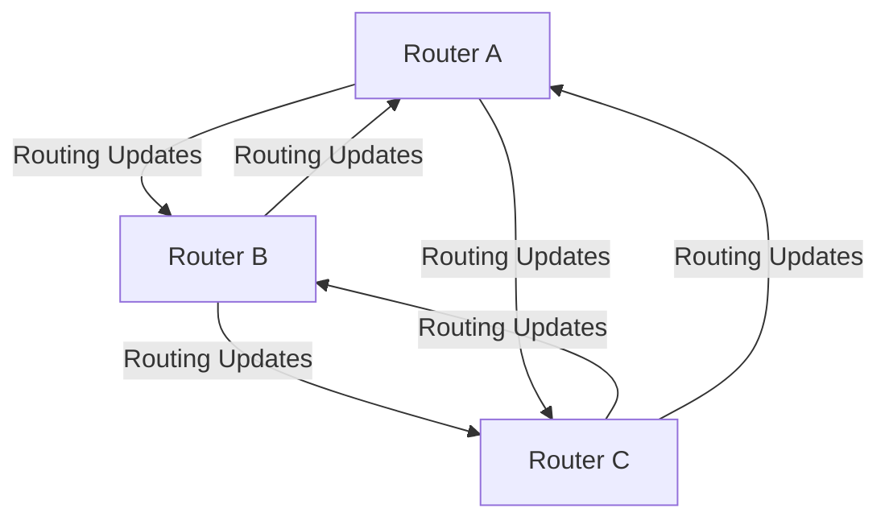
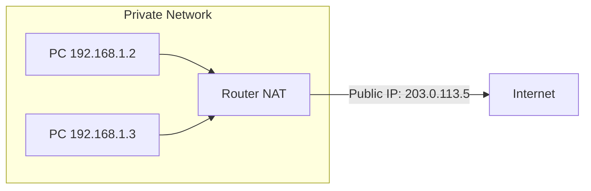
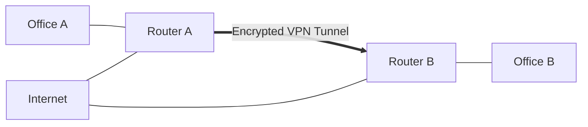

# Network Routers

## Introduction

Routers are fundamental devices in computer networks that operate at the network layer (Layer 3) of the OSI model. These specialized network devices connect multiple networks together and direct data packets between them, making communication possible across different network segments, local area networks (LANs), and the internet.

Unlike switches that operate at the data link layer and use MAC addresses to forward frames within a single network, routers work with logical addresses (IP addresses) to determine the optimal path for data packets to travel across different networks. This makes routers essential components for building scalable, interconnected networks.

## What is a Router?

A router is a networking device that:

1. Connects multiple networks together
2. Forwards data packets between networks
3. Determines the best path for data to travel
4. Maintains routing tables with network path information
5. Operates at the network layer (Layer 3) of the OSI model

## Router Architecture

Modern routers consist of several key components:

### Hardware Components

- **CPU**: Processes routing algorithms and manages the router
- **Memory**:
  - **RAM**: Stores routing tables and packet buffers
  - **NVRAM**: Stores startup configuration
  - **Flash**: Stores the router operating system
- **Interfaces**: Physical connections to different networks (Ethernet, serial, fiber, etc.)
- **System Bus**: Connects all internal components

### Conceptual Components

- **Input Ports**: Receive and process incoming packets
- **Switching Fabric**: Transfers packets from input to output ports
- **Output Ports**: Queue and transmit packets to the next hop
- **Routing Processor**: Executes routing algorithms and updates routing tables

## How Routers Work

Routers forward packets between networks by performing the following operations:

### 1. Packet Reception

When a data packet arrives at one of the router's interfaces, the router:
- Examines the packet's destination IP address
- Removes the Layer 2 frame header
- Places the packet in an input queue for processing

### 2. Routing Table Lookup

The router consults its routing table to find the best next hop for the packet:

```
Router> show ip route
Codes: C - connected, S - static, I - IGRP, R - RIP, M - mobile, B - BGP
       D - EIGRP, EX - EIGRP external, O - OSPF, IA - OSPF inter area
       N1 - OSPF NSSA external type 1, N2 - OSPF NSSA external type 2
       E1 - OSPF external type 1, E2 - OSPF external type 2, E - EGP
       i - IS-IS, L1 - IS-IS level-1, L2 - IS-IS level-2, * - candidate default

Gateway of last resort is 192.168.1.1 to network 0.0.0.0

C    192.168.1.0/24 is directly connected, GigabitEthernet0/0
C    192.168.2.0/24 is directly connected, GigabitEthernet0/1
S    10.0.0.0/8 [1/0] via 192.168.1.1
O    172.16.0.0/16 [110/2] via 192.168.2.1
S*   0.0.0.0/0 [1/0] via 192.168.1.1
```

### 3. Packet Forwarding Decision

Based on the routing table lookup:
- If the destination network is directly connected, the router forwards the packet to that network
- If the destination is on a remote network, the router sends the packet to the next-hop router
- If no route is found, the packet is typically dropped (unless a default route exists)

### 4. Packet Transmission

Before forwarding the packet:
- The router decrements the packet's Time-to-Live (TTL) field
- Updates the packet's header checksum
- Encapsulates the packet in a new Layer 2 frame with the appropriate MAC address
- Sends the frame out through the appropriate interface

## Routing Algorithms and Protocols

Routers use routing protocols to exchange network reachability information with other routers and build their routing tables.

### Static vs. Dynamic Routing

#### Static Routing

Static routes are manually configured by network administrators:

```
Router(config)# ip route 10.0.0.0 255.0.0.0 192.168.1.1
```

**Advantages**:
- No bandwidth usage for route updates
- Predictable paths
- More secure (no advertisement of routes)

**Disadvantages**:
- Must be manually updated when network changes
- Not scalable for large networks
- No automatic failover

#### Dynamic Routing

Dynamic routing protocols automatically exchange route information:



### Common Routing Protocols

1. **Distance Vector Protocols**
   - RIP (Routing Information Protocol)
   - EIGRP (Enhanced Interior Gateway Routing Protocol)
   
2. **Link State Protocols**
   - OSPF (Open Shortest Path First)
   - IS-IS (Intermediate System to Intermediate System)
   
3. **Path Vector Protocols**
   - BGP (Border Gateway Protocol) - Used for Internet routing

### Routing Metrics

Routers use various metrics to determine the best path:
- Hop count: Number of routers between source and destination
- Bandwidth: Data capacity of the links
- Delay: Time taken to traverse a path
- Reliability: Error rate of each network link
- Load: Amount of activity on network resources
- Cost: An arbitrary value assigned by administrators

## Router Configuration Example

Here's a basic example of configuring a Cisco router:

```
! Enter global configuration mode
Router> enable
Router# configure terminal

! Set the router hostname
Router(config)# hostname EdgeRouter

! Configure interface IP addresses
EdgeRouter(config)# interface GigabitEthernet0/0
EdgeRouter(config-if)# ip address 192.168.1.1 255.255.255.0
EdgeRouter(config-if)# no shutdown
EdgeRouter(config-if)# exit

EdgeRouter(config)# interface GigabitEthernet0/1
EdgeRouter(config-if)# ip address 10.0.0.1 255.255.255.0
EdgeRouter(config-if)# no shutdown
EdgeRouter(config-if)# exit

! Configure static routes
EdgeRouter(config)# ip route 172.16.0.0 255.255.0.0 10.0.0.2

! Configure OSPF dynamic routing
EdgeRouter(config)# router ospf 1
EdgeRouter(config-router)# network 192.168.1.0 0.0.0.255 area 0
EdgeRouter(config-router)# network 10.0.0.0 0.0.0.255 area 0
EdgeRouter(config-router)# exit

! Save the configuration
EdgeRouter(config)# exit
EdgeRouter# copy running-config startup-config
```

## Router Types and Applications

### Home/SOHO Routers

Small office/home office routers typically combine several functions:
- Router (Layer 3)
- Switch (Layer 2)
- Wireless Access Point
- Firewall
- DHCP server
- NAT (Network Address Translation)

### Enterprise Routers

Enterprise-grade routers offer:
- Higher performance
- More interfaces
- Enhanced security features
- Advanced routing capabilities
- Quality of Service (QoS) controls
- Virtual Private Network (VPN) support

### Core Routers

Core routers operate at the heart of the Internet:
- Handle massive volumes of traffic
- Focus on speed rather than features
- Connect large networks together
- Often cost hundreds of thousands of dollars

## Advanced Router Features

### Network Address Translation (NAT)

NAT allows multiple devices on a private network to share a single public IP address:



### Access Control Lists (ACLs)

ACLs filter traffic based on defined criteria:

```
EdgeRouter(config)# access-list 101 deny tcp any any eq 23
EdgeRouter(config)# access-list 101 permit ip any any
EdgeRouter(config)# interface GigabitEthernet0/0
EdgeRouter(config-if)# ip access-group 101 in
```

### Quality of Service (QoS)

QoS prioritizes critical traffic:

```
EdgeRouter(config)# class-map VOIP
EdgeRouter(config-cmap)# match protocol voip
EdgeRouter(config-cmap)# exit
EdgeRouter(config)# policy-map PRIORITY
EdgeRouter(config-pmap)# class VOIP
EdgeRouter(config-pmap-c)# priority 1000
EdgeRouter(config-pmap-c)# exit
EdgeRouter(config)# interface GigabitEthernet0/0
EdgeRouter(config-if)# service-policy output PRIORITY
```

### Virtual Private Networks (VPNs)

Routers can establish secure tunnels across public networks:



## Troubleshooting Router Issues

Common router troubleshooting commands:

### Checking Interface Status

```
Router# show interfaces
GigabitEthernet0/0 is up, line protocol is up
  Hardware is CN Gigabit Ethernet, address is 0000.0c00.0000
  Internet address is 192.168.1.1/24
  MTU 1500 bytes, BW 1000000 Kbit/sec, DLY 10 usec
  ...
```

### Verifying Connectivity

```
Router# ping 192.168.2.1
Type escape sequence to abort.
Sending 5, 100-byte ICMP Echos to 192.168.2.1, timeout is 2 seconds:
!!!!!
Success rate is 100 percent (5/5), round-trip min/avg/max = 1/2/4 ms
```

### Tracing Routes

```
Router# traceroute 8.8.8.8
Type escape sequence to abort.
Tracing the route to 8.8.8.8
VRF info: (vrf in name/id, vrf out name/id)
  1 192.168.1.1 1 msec 0 msec 1 msec
  2 10.0.0.1 5 msec 2 msec 3 msec
  3 * * *
  4 72.14.232.1 15 msec 13 msec 13 msec
  5 8.8.8.8 22 msec 19 msec 20 msec
```

### Examining Routing Table

```
Router# show ip route
[routing table output as shown earlier]
```

## Real-World Applications

### Internet Service Provider Networks

ISPs use routers to:
- Connect customers to the Internet
- Implement BGP for Internet routing
- Apply traffic shaping and QoS
- Filter malicious traffic
- Provide reliable connectivity

### Corporate Networks

Businesses use routers to:
- Connect multiple office locations
- Establish site-to-site VPNs
- Implement security policies
- Prioritize business-critical applications
- Connect to the Internet securely

### Data Centers

Data centers deploy routers to:
- Provide high-speed connectivity between server farms
- Implement network segmentation
- Balance traffic loads
- Offer redundant paths for fault tolerance
- Connect to multiple service providers

## Summary

Routers are essential networking devices that operate at the network layer to connect different networks and direct traffic between them. They make intelligent forwarding decisions based on IP addresses and routing tables, which can be built using static configuration or dynamic routing protocols.

Key points to remember:
- Routers connect different networks together
- They operate at Layer 3 (Network Layer) of the OSI model
- Routing tables determine the best path for packet forwarding
- Various routing protocols exist for different network needs
- Modern routers offer advanced features like NAT, QoS, and VPN capabilities
- Proper router configuration is crucial for efficient network operation

## Exercises

1. Configure a basic home router to connect to the Internet and set up a local wireless network.
2. Create a network diagram with at least three routers and determine the best paths between different networks.
3. Research the differences between popular routing protocols (OSPF, EIGRP, BGP) and identify scenarios where each would be most appropriate.
4. Using a network simulator like Packet Tracer or GNS3, configure static routes between multiple routers.
5. Explore how NAT works by tracing the path of a packet from your private network to a public website.

## Additional Resources

- Books:
  - "Computer Networking: A Top-Down Approach" by James Kurose and Keith Ross
  - "Routing TCP/IP, Volume 1" by Jeff Doyle and Jennifer DeHaven Carroll

- Online Resources:
  - Cisco's Networking Academy
  - Computer Networking: Principles, Protocols and Practice
  - Internet Engineering Task Force (IETF) RFCs on routing protocols