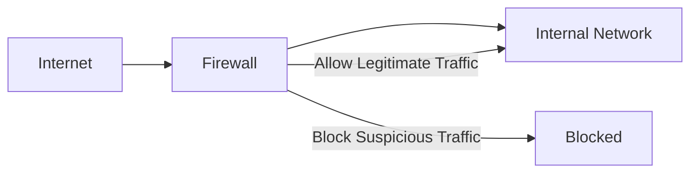
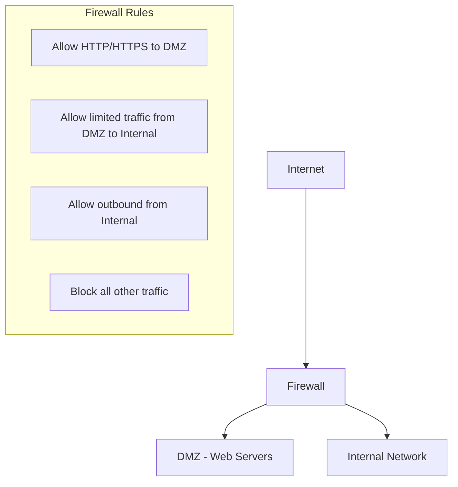

# Network Firewalls

## Introduction

Network firewalls are crucial security devices that act as barriers between trusted internal networks and untrusted external networks, such as the Internet. They monitor and control incoming and outgoing network traffic based on predetermined security rules, providing a first line of defense against unauthorized access and cyber threats.

In this article, we'll explore what firewalls are, how they work at the network layer, different types of firewalls, and how to implement basic firewall configurations.

## What is a Firewall?

A firewall is a network security device (hardware, software, or both) that monitors and filters traffic between networks based on established security policies. The term "firewall" comes from building construction, where a firewall is a wall designed to contain fire within a building section.

Similarly, in network security:

- Firewalls establish boundaries between networks
- They act as gatekeepers, deciding which traffic to allow or block
- They protect sensitive data from unauthorized access
- They help prevent malware spreading across networks

## How Firewalls Work at the Network Layer

Firewalls operate primarily at the Network Layer (Layer 3) of the OSI model, though modern firewalls can work across multiple layers. At the network layer, firewalls:

1. Examine packet headers
2. Make decisions based on source and destination IP addresses
3. Apply routing rules to forward or block traffic
4. Implement access control lists (ACLs)

Here's a simple representation of how a firewall works:



When a packet arrives at the firewall, it undergoes inspection against the configured ruleset. These rules typically include:

- Source IP address
- Destination IP address
- Port numbers
- Protocol type (TCP, UDP, ICMP, etc.)
- Direction of traffic (inbound/outbound)

## Types of Network Firewalls

### 1. Packet Filtering Firewalls

Packet filtering firewalls are the most basic type, operating at the network layer. They inspect packets and allow or deny them based on source and destination IP addresses, ports, and protocols.

**Advantages:**
- Low resource usage
- Minimal impact on network performance
- Simple to implement

**Disadvantages:**
- Limited inspection capabilities
- Cannot detect application-layer attacks
- No stateful inspection

**Example Rule:**
```
allow tcp from 192.168.1.0/24 to any port 80
deny tcp from any to 10.0.0.0/8 port 22
```

### 2. Stateful Inspection Firewalls

Stateful firewalls keep track of the state of active connections and make decisions based on the context of the traffic, not just individual packets.

**Advantages:**
- More secure than simple packet filtering
- Maintains a state table of connections
- Can detect if packets belong to an existing connection

**Disadvantages:**
- Higher resource requirements
- More complex configuration

**Example State Table Entry:**
```
TCP 192.168.1.5:45678 -> 203.0.113.10:80 ESTABLISHED
```

### 3. Proxy Firewalls

Proxy firewalls act as intermediaries between clients and servers, breaking the direct connection between internal and external networks.

**Advantages:**
- Complete isolation of internal network
- Deep packet inspection
- Application-level filtering

**Disadvantages:**
- Performance impact due to processing overhead
- Complex setup and maintenance

### 4. Next-Generation Firewalls (NGFW)

NGFWs combine traditional firewall technology with additional features like:
- Intrusion Prevention Systems (IPS)
- Deep packet inspection
- Application awareness
- User identity integration
- Threat intelligence

## Implementing Basic Firewall Rules

Let's look at how to implement basic firewall rules using `iptables`, a common Linux firewall tool:

```bash
# Allow established connections
iptables -A INPUT -m conntrack --ctstate ESTABLISHED,RELATED -j ACCEPT

# Allow SSH from specific network
iptables -A INPUT -p tcp -s 192.168.1.0/24 --dport 22 -j ACCEPT

# Allow HTTP and HTTPS from anywhere
iptables -A INPUT -p tcp --dport 80 -j ACCEPT
iptables -A INPUT -p tcp --dport 443 -j ACCEPT

# Block all other incoming traffic
iptables -A INPUT -j DROP
```

This creates a simple ruleset that:
1. Allows already established connections to continue
2. Permits SSH access only from the local network
3. Allows HTTP and HTTPS traffic from any source
4. Blocks all other incoming traffic

## Practical Examples

### Example 1: Configuring a Basic DMZ

A Demilitarized Zone (DMZ) is a network segment that contains public-facing services while isolating them from the internal network.



This setup:
- Exposes only necessary services to the internet
- Protects internal resources even if DMZ servers are compromised
- Creates security zones with different trust levels

### Example 2: Preventing IP Spoofing

IP spoofing is when attackers forge the source IP address in packets. A simple prevention rule with `iptables` would be:

```bash
# Block packets with internal source IP coming from external interface
iptables -A INPUT -i eth0 -s 192.168.1.0/24 -j DROP
```

This rule blocks any traffic coming from the external interface (`eth0`) that claims to be from your internal network (`192.168.1.0/24`), which should be impossible unless it's spoofed.

## Firewall Best Practices

1. **Default Deny Policy**: Block all traffic by default, then allow only what's necessary
2. **Least Privilege**: Grant minimal access required for systems to function
3. **Regular Updates**: Keep firewall software and rulesets updated
4. **Logging and Monitoring**: Monitor firewall logs for suspicious activity
5. **Egress Filtering**: Control outbound traffic to prevent data exfiltration
6. **Testing**: Regularly test firewall effectiveness with penetration testing
7. **Documentation**: Maintain documentation of all firewall rules and changes

## Configuring a Simple Firewall in Python

While not a replacement for dedicated firewalls, Python can be used to create simple firewall-like functionality using the `socket` and `scapy` libraries. Here's a basic example:

```python
from scapy.all import *

def packet_filter(packet):
    # Block packets going to a specific IP
    if IP in packet and packet[IP].dst == "192.168.1.100":
        print(f"Dropped packet to {packet[IP].dst}")
        return
    # Allow other packets
    return packet

# Apply filter to packets
sniff(prn=packet_filter, store=0)
```

This simple script:
1. Captures network packets
2. Inspects destination IP addresses
3. Drops packets destined for 192.168.1.100
4. Allows all other packets

## Summary

Network firewalls are essential security components that protect networks by controlling traffic flow based on predefined rules. They operate primarily at the network layer but can extend functionality to higher layers.

Key points to remember:
- Firewalls provide the first line of defense against network threats
- Different types of firewalls offer varying levels of protection and features
- Proper configuration follows the principle of least privilege
- Modern firewalls combine multiple security technologies
- Regular maintenance and monitoring are essential for effective protection

## Additional Resources

- **Books:**
  - "Network Security with pfSense"
  - "Practical Firewalls"
  - "Linux Firewalls: Attack Detection and Response"

- **Online Documentation:**
  - iptables manual pages
  - pfSense documentation
  - Cisco ASA configuration guides

## Exercises

1. Install a virtual machine with Linux and configure basic iptables rules to:
   - Allow SSH access only from your local subnet
   - Allow HTTP/HTTPS outbound
   - Block all other traffic

2. Use Wireshark to capture traffic and analyze how packets are filtered by your firewall rules.

3. Design a network diagram with proper firewall placement for a small business with:
   - Public web server
   - Internal file server
   - Employee workstations
   - Guest Wi-Fi network

4. Research and compare three different firewall solutions (hardware or software) and their features.