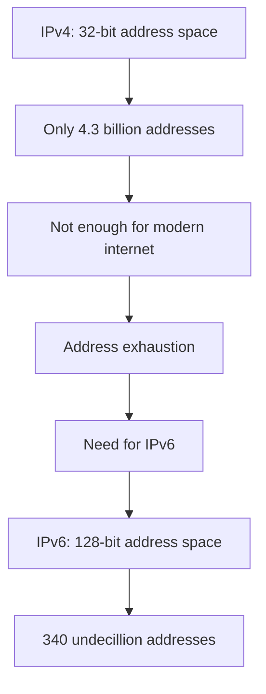
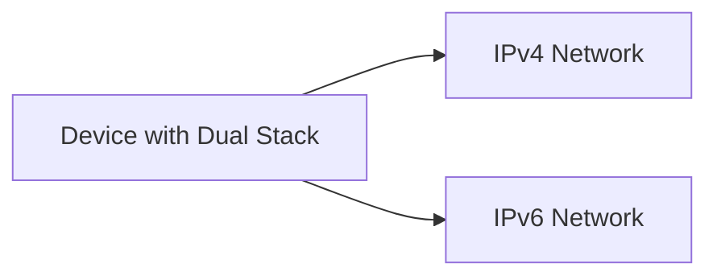
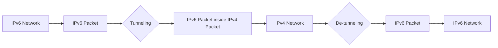

# IPv6: The Next Generation Internet Protocol

## Introduction

The Internet Protocol version 6 (IPv6) is the most recent version of the Internet Protocol (IP), designed to replace the older IPv4 which has been in use since 1983. As the backbone of internet communication, IP is responsible for identifying and locating devices on networks and routing data between them. IPv6 was developed primarily to address the exhaustion of IPv4 addresses, but it also brings numerous improvements in efficiency, security, and functionality.

In this guide, we'll explore what IPv6 is, why it was developed, how it differs from IPv4, and how it works in practical applications.

## Why IPv6 Was Created

### IPv4 Address Exhaustion

The primary motivation behind IPv6 was the anticipated exhaustion of IPv4 addresses. IPv4 uses a 32-bit addressing scheme, allowing for approximately 4.3 billion unique addresses (2³²). While this seemed sufficient in the early days of the internet, the explosive growth of internet-connected devices has depleted this address space.



### Temporary Solutions

Before IPv6 was widely implemented, several technologies were developed to extend the life of IPv4:

- **Network Address Translation (NAT)**: Allows multiple devices to share a single public IP address
- **Classless Inter-Domain Routing (CIDR)**: More efficient allocation of IP addresses
- **Dynamic Host Configuration Protocol (DHCP)**: Temporary assignment of IP addresses

While these technologies helped delay IPv4 exhaustion, they were not permanent solutions.

## Key Features of IPv6

IPv6 comes with several improvements over IPv4:

### 1. Expanded Address Space

IPv6 uses 128-bit addresses, providing approximately 3.4 × 10³⁸ addresses (2¹²⁸). This is often described as:

- Enough for every grain of sand on Earth to have multiple addresses
- More than 340 undecillion addresses (340,282,366,920,938,463,463,374,607,431,768,211,456)

### 2. Simplified Header Format

IPv6 has a simplified header compared to IPv4, making packet processing more efficient:

- Fixed header size of 40 bytes
- Elimination of unnecessary fields
- Extension headers for optional features
- No checksum at the IP level (relies on lower and upper layers)

### 3. Built-in Security

IPv6 includes IPsec (Internet Protocol Security) as a mandatory feature, providing:

- Authentication
- Data integrity
- Encryption capabilities

### 4. Improved Quality of Service (QoS)

IPv6 includes flow labeling capabilities that help identify packets belonging to a specific traffic flow, enabling better handling of real-time traffic.

### 5. No Broadcast

IPv6 eliminates broadcast addresses, replacing them with multicast and anycast addressing.

### 6. Auto-configuration

IPv6 supports stateful (DHCPv6) and stateless address auto-configuration (SLAAC), allowing devices to configure themselves automatically when connected to an IPv6 network.

## IPv6 Addressing

### Address Format

An IPv6 address is 128 bits, typically written as eight groups of four hexadecimal digits, separated by colons:

```
2001:0db8:85a3:0000:0000:8a2e:0370:7334
```

To make IPv6 addresses more manageable, two simplification rules are used:

1. **Leading zeros in a group can be omitted**:
   ```
   2001:db8:85a3:0:0:8a2e:370:7334
   ```

2. **A single consecutive group of zeros can be replaced with a double colon (::)**:
   ```
   2001:db8:85a3::8a2e:370:7334
   ```

Note: The double colon can only be used once in an address to avoid ambiguity.

### Address Types

IPv6 defines several types of addresses:

#### 1. Unicast Addresses

Identify a single interface. Packets sent to a unicast address are delivered to the specific interface.

Types of unicast addresses include:

- **Global Unicast Addresses**: Publicly routable addresses (similar to IPv4 public addresses)
- **Link-Local Addresses**: Used only on a single link (start with `fe80::/10`)
- **Unique Local Addresses**: Private addresses not meant to be routed on the internet (start with `fc00::/7`)

#### 2. Multicast Addresses

Identify multiple interfaces. Packets sent to a multicast address are delivered to all interfaces that have that address (start with `ff00::/8`).

#### 3. Anycast Addresses

Like multicast addresses but packets are delivered to the nearest interface (in terms of routing distance).

### Special IPv6 Addresses

- **::/128** - Unspecified address
- **::1/128** - Loopback address (equivalent to 127.0.0.1 in IPv4)
- **ff02::1** - All nodes on the local network segment
- **ff02::2** - All routers on the local network segment

## Practical Examples

### Example 1: Basic IPv6 Configuration in Linux

You can configure an IPv6 address on a Linux interface using the `ip` command:

```bash
# Add an IPv6 address to an interface
sudo ip -6 addr add 2001:db8:0:1::1/64 dev eth0

# Display IPv6 configuration
ip -6 addr show

# Set up a default route
sudo ip -6 route add default via 2001:db8:0:1::2
```

### Example 2: Checking IPv6 Connectivity

You can test IPv6 connectivity using the `ping6` command or `ping` with the `-6` option:

```bash
# Ping an IPv6 address
ping6 2001:db8:0:1::2

# Or using the ping command with -6 option
ping -6 2001:db8:0:1::2

# Test connectivity to a website with IPv6 support
ping6 ipv6.google.com
```

### Example 3: Tracing IPv6 Routes

You can trace the route to an IPv6 destination using `traceroute6` or `traceroute` with the `-6` option:

```bash
# Trace route to an IPv6 address
traceroute6 2001:db8:0:1::2

# Or using traceroute with -6 option
traceroute -6 2001:db8:0:1::2
```

### Example 4: Simple IPv6 Socket Programming in Python

Here's a basic example of a Python server and client using IPv6:

Server:
```python
import socket

# Create an IPv6 socket
server = socket.socket(socket.AF_INET6, socket.SOCK_STREAM)
server.bind(('::', 8080))  # '::' is the IPv6 equivalent of IPv4's '0.0.0.0'
server.listen(1)

print("IPv6 server running on port 8080...")

while True:
    connection, address = server.accept()
    print(f"Connection from: {address}")
    
    data = connection.recv(1024)
    if not data:
        break
        
    print(f"Received: {data.decode('utf-8')}")
    connection.send(b"Hello from IPv6 server!")
    connection.close()
```

Client:
```python
import socket

# Create an IPv6 socket
client = socket.socket(socket.AF_INET6, socket.SOCK_STREAM)
client.connect(('::1', 8080))  # '::1' is the IPv6 loopback address

client.send(b"Hello from IPv6 client!")
response = client.recv(1024)
print(f"Response: {response.decode('utf-8')}")
client.close()
```

## Transition from IPv4 to IPv6

The transition from IPv4 to IPv6 is a gradual process that has been ongoing for years. Several mechanisms have been developed to ease this transition:

### 1. Dual Stack

Devices run both IPv4 and IPv6 simultaneously, allowing them to communicate with both IPv4-only and IPv6-only services.



### 2. Tunneling

Encapsulating IPv6 packets within IPv4 packets to traverse IPv4-only networks.

Common tunneling technologies include:
- 6to4
- Teredo
- ISATAP (Intra-Site Automatic Tunnel Addressing Protocol)



### 3. Translation

Translating between IPv4 and IPv6 at the network edge to allow communication between IPv4-only and IPv6-only devices.

- NAT64/DNS64
- 464XLAT

## IPv6 Subnet Calculation

In IPv6, subnetting works similarly to IPv4 but with much larger address spaces. The standard subnet for most deployments is a /64, which provides 2⁶⁴ addresses (over 18 quintillion) on a single subnet!

### Subnet Mask Notation

Just like in IPv4, IPv6 uses Classless Inter-Domain Routing (CIDR) notation to represent subnet masks:

```
2001:db8::/32  # A /32 prefix length
```

To calculate the number of addresses in a subnet:
- Number of addresses = 2^(128-prefix_length)

For example:
- A /64 subnet has 2^(128-64) = 2^64 = 18,446,744,073,709,551,616 addresses
- A /48 subnet has 2^(128-48) = 2^80 = 1,208,925,819,614,629,174,706,176 addresses

### Typical Subnet Allocations

- **/48**: Typically allocated to a site (organization or home)
- **/56**: Often allocated to a small site or home network
- **/64**: Standard allocation for a single subnet
- **/128**: Used for a single device

## Advantages and Challenges of IPv6

### Advantages

1. **Virtually unlimited address space**: Eliminates the need for NAT
2. **Improved packet handling**: Streamlined headers for faster processing
3. **Built-in security**: IPsec integration for enhanced security
4. **Better multicast and QoS support**: Improved multimedia handling
5. **Auto-configuration**: Simplified network setup
6. **No more fragmentation in routers**: Improved efficiency

### Challenges

1. **Compatibility issues**: Not all systems and applications support IPv6
2. **Implementation complexity**: Requires training and expertise
3. **Deployment costs**: Updating infrastructure can be expensive
4. **Coexistence with IPv4**: Need for transition mechanisms
5. **Security considerations**: New attack vectors and security concerns

## Summary

IPv6 represents a significant evolution in internet technology, addressing the limitations of IPv4 while introducing numerous improvements. With its expanded address space, simplified header format, built-in security, and advanced features, IPv6 provides a robust foundation for the future of internet connectivity.

As the global adoption of IPv6 continues to grow, understanding this protocol becomes increasingly important for network administrators, developers, and IT professionals. The transition from IPv4 to IPv6 is a complex process that will continue for years to come, but the benefits of IPv6 make this transition worthwhile.

## Additional Resources

Here are some exercises to help you better understand IPv6:

1. **Configure IPv6 on your home router** if it supports it, and test your connectivity using an IPv6 test site.
2. **Set up a dual-stack network** on a virtual environment like VirtualBox.
3. **Write a simple client-server application** that uses IPv6 addressing.
4. **Practice IPv6 subnetting** by calculating address ranges for different prefix lengths.
5. **Analyze IPv6 traffic** using tools like Wireshark to understand how the protocol works in practice.

## Practice Exercises

1. Convert the following IPv6 address to its compressed form: `2001:0db8:0000:0000:0000:ff00:0042:8329`
2. Identify the type of the following IPv6 address: `fe80::1234:5678:abcd`
3. Calculate how many /64 subnets can be created from a /48 allocation.
4. Modify the Python client-server example to use a specific IPv6 address instead of the loopback address.
5. Research and explain how DHCPv6 differs from SLAAC for IPv6 address assignment.