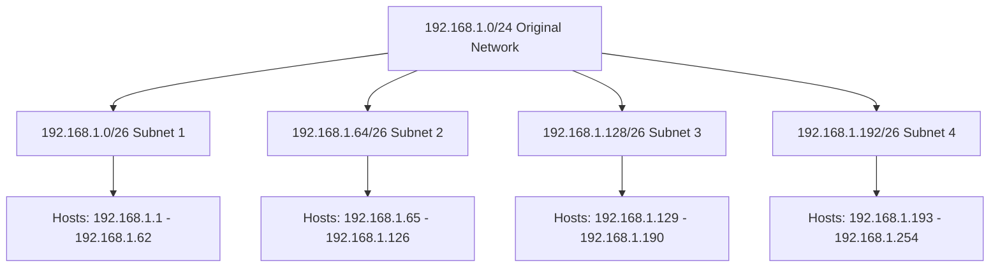
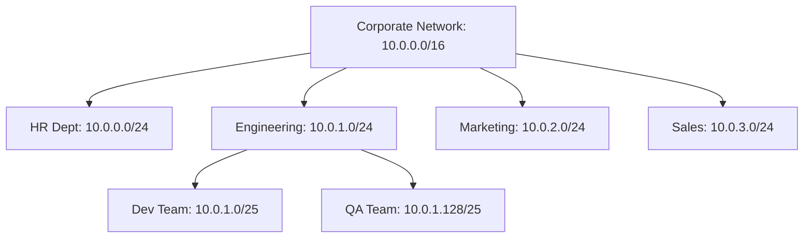

# Networks Subnetting

## Introduction

Subnetting is a fundamental networking technique that allows network administrators to divide a large IP network into smaller, more manageable sub-networks called subnets. This division helps optimize network performance, improve security, and efficiently utilize IP address space.

In this tutorial, we'll explore subnetting concepts, learn how to calculate subnet masks, determine available hosts, and apply these skills to real-world scenarios. By the end, you'll understand how to design and implement subnet schemes for various network requirements.

## Understanding IP Addresses and Network Classes

Before diving into subnetting, let's review some basics about IP addresses.

An IPv4 address is a 32-bit number divided into four octets (8 bits each), written in decimal format with dots separating each octet. For example: `192.168.1.1`.

Traditionally, IP addresses were divided into five classes:

| Class | First Octet Range | Default Subnet Mask | Purpose |
|-------|-------------------|---------------------|---------|
| A     | 1-126             | 255.0.0.0 (/8)      | Large networks |
| B     | 128-191           | 255.255.0.0 (/16)   | Medium networks |
| C     | 192-223           | 255.255.255.0 (/24) | Small networks |
| D     | 224-239           | N/A                 | Multicast |
| E     | 240-255           | N/A                 | Reserved for research |

> **Note**: 127.x.x.x addresses are reserved for loopback testing.

## Subnet Masks and CIDR Notation

A subnet mask is a 32-bit value that determines which portion of an IP address refers to the network and which portion refers to the host.

### Subnet Mask Representation

Subnet masks can be written in two ways:
1. **Dotted-decimal notation**: e.g., `255.255.255.0`
2. **CIDR (Classless Inter-Domain Routing) notation**: e.g., `/24`

CIDR notation indicates the number of bits used for the network portion. For example:
- `/24` means the first 24 bits are for the network
- `/16` means the first 16 bits are for the network
- `/8` means the first 8 bits are for the network

## How Subnetting Works

Subnetting works by "borrowing" bits from the host portion of an IP address and using them to create subnet identifiers. The more bits you borrow, the more subnets you can create, but with fewer hosts per subnet.

Let's look at this process step by step:

1. Determine the original network class and default subnet mask
2. Decide how many subnets you need
3. Calculate how many bits to borrow from the host portion
4. Calculate the new subnet mask
5. Identify the subnet addresses, broadcast addresses, and valid host ranges

## Subnetting Calculations

### Example 1: Creating Subnets in a Class C Network

Let's say we have the Class C network `192.168.1.0` with its default mask of `255.255.255.0` (/24), and we want to create 4 subnets.

#### Step 1: Determine how many bits to borrow

To create 4 subnets, we need to borrow 2 bits from the host portion (2² = 4).

#### Step 2: Calculate the new subnet mask

The default Class C mask is `/24` or `255.255.255.0` in binary: `11111111.11111111.11111111.00000000`

After borrowing 2 bits: `11111111.11111111.11111111.11000000`

This gives us a new subnet mask of `255.255.255.192` or `/26`.

#### Step 3: Calculate the subnet information

With 2 borrowed bits, our subnets will have a block size of 64 (256 ÷ 4).

| Subnet | Network Address | First Host | Last Host | Broadcast Address |
|--------|-----------------|------------|-----------|-------------------|
| 1      | 192.168.1.0     | 192.168.1.1 | 192.168.1.62 | 192.168.1.63 |
| 2      | 192.168.1.64    | 192.168.1.65 | 192.168.1.126 | 192.168.1.127 |
| 3      | 192.168.1.128   | 192.168.1.129 | 192.168.1.190 | 192.168.1.191 |
| 4      | 192.168.1.192   | 192.168.1.193 | 192.168.1.254 | 192.168.1.255 |

Each subnet has 62 usable host addresses (64 - 2, as we reserve one address for the network and one for broadcast).

## Subnet Visualization

Here's a visualization of our example subnet division:



## Practical Subnetting Step by Step

Let's work through a practical subnetting problem:

### Example 2: You need to create subnets for a small business with the following requirements:

- Network address: `172.16.0.0/16`
- Department A: 500 hosts
- Department B: 250 hosts
- Department C: 100 hosts
- Department D: 50 hosts

#### Solution:

1. **Determine the subnet sizes needed:**
   - Department A: 500 hosts → Need 9 host bits (2⁹ - 2 = 510 hosts)
   - Department B: 250 hosts → Need 8 host bits (2⁸ - 2 = 254 hosts)
   - Department C: 100 hosts → Need 7 host bits (2⁷ - 2 = 126 hosts)
   - Department D: 50 hosts → Need 6 host bits (2⁶ - 2 = 62 hosts)

2. **Calculate the subnet masks:**
   - Department A: `/16` + (32 - 16 - 9) = `/23` (borrowing 7 bits from original host portion)
   - Department B: `/16` + (32 - 16 - 8) = `/24` (borrowing 8 bits)
   - Department C: `/16` + (32 - 16 - 7) = `/25` (borrowing 9 bits)
   - Department D: `/16` + (32 - 16 - 6) = `/26` (borrowing 10 bits)

3. **Assign subnet addresses:**
   Starting with our original network `172.16.0.0/16`, we can allocate:
   - Department A: `172.16.0.0/23` (Provides 510 usable hosts)
   - Department B: `172.16.2.0/24` (Provides 254 usable hosts)
   - Department C: `172.16.3.0/25` (Provides 126 usable hosts)
   - Department D: `172.16.3.128/26` (Provides 62 usable hosts)

## VLSM (Variable Length Subnet Masking)

In our Example 2, we used a technique called VLSM, which allows us to create subnets of different sizes to efficiently allocate IP addresses according to specific needs. This approach minimizes IP address waste and offers greater flexibility.

The key to successful VLSM implementation is to:
1. Sort your subnet requirements from largest to smallest
2. Start with the largest subnet and work down
3. Keep track of which address ranges have been assigned

## Practical Tools for Subnetting

While understanding the manual calculations is crucial, several tools can help you with subnetting:

1. **ipcalc**: A command-line IP calculator

```bash
$ ipcalc 192.168.1.0/24
Address:   192.168.1.0          11000000.10101000.00000001.00000000
Netmask:   255.255.255.0 = 24   11111111.11111111.11111111.00000000
Wildcard:  0.0.0.255            00000000.00000000.00000000.11111111
=>
Network:   192.168.1.0/24       11000000.10101000.00000001.00000000
Broadcast: 192.168.1.255        11000000.10101000.00000001.11111111
```

2. **Binary-to-Decimal Conversion**

Here's a quick reference for binary-to-decimal conversion in the context of subnet masks:

| Binary Bits | Decimal Value | CIDR |
|-------------|---------------|------|
| 10000000    | 128           | /25  |
| 11000000    | 192           | /26  |
| 11100000    | 224           | /27  |
| 11110000    | 240           | /28  |
| 11111000    | 248           | /29  |
| 11111100    | 252           | /30  |
| 11111110    | 254           | /31  |
| 11111111    | 255           | /32  |

## Subnetting Practice Techniques

A helpful way to quickly calculate subnets is using the "magic number" method:

1. Identify the interesting octet (the one where the subnet mask is not 0 or 255)
2. Calculate the "magic number" = 256 - subnet mask value in the interesting octet
3. Count by the magic number to find subnet boundaries

**Example:** For a subnet mask of `255.255.255.192` (/26)
- Interesting octet: 4th octet
- Magic number: 256 - 192 = 64
- Subnet boundaries: 0, 64, 128, 192

## Real-world Applications

Subnetting is essential in various real-world scenarios:

### 1. Enterprise Network Design



### 2. Home Network Segmentation

You can segment your home network to separate:
- Primary devices (computers, phones)
- IoT devices (smart home gadgets)
- Guest network

### 3. Security Implementation

Subnetting helps implement security zones:
- DMZ (Demilitarized Zone) for public-facing servers
- Internal networks with different security levels
- Isolated segments for sensitive data

## Common Subnetting Challenges

### 1. Overlapping Subnets

When subnets use IP address ranges that overlap, routing conflicts occur. Always verify that your subnets don't overlap.

### 2. Insufficient Host Addresses

Underestimating growth can lead to subnet exhaustion. Plan for future expansion when designing subnets.

### 3. Excessive Fragmentation

Creating too many small subnets can make management difficult and waste addresses. Balance subnet size with administrative needs.

## IPv6 Subnetting

IPv6 uses 128-bit addresses and follows similar subnetting principles but with some differences:

- The standard subnet size is /64
- Site prefixes are typically /48
- ISPs typically assign a /56 to small organizations

Example IPv6 subnet allocation:
- Organization receives: `2001:db8:1234::/48`
- First subnet: `2001:db8:1234:0::/64`
- Second subnet: `2001:db8:1234:1::/64`
- And so on...

## Summary

Subnetting is a crucial skill for network administrators and IT professionals. We've covered:

- The fundamentals of IP addressing and subnet masks
- How to calculate subnets manually
- CIDR notation and its significance
- Variable Length Subnet Masking (VLSM)
- Real-world applications and common challenges
- Brief introduction to IPv6 subnetting

By mastering subnetting, you can design efficient, secure, and scalable networks that meet specific organizational needs while minimizing wasted IP addresses.

## Practice Exercises

1. Given the network `192.168.10.0/24`, create a subnetting scheme that supports:
   - Subnet A: 100 hosts
   - Subnet B: 60 hosts
   - Subnet C: 30 hosts
   - Subnet D: 10 hosts

2. You have been assigned the network `172.20.0.0/16`. Design a subnetting plan for an organization with 10 departments, each requiring between 100 and 500 hosts.

3. Calculate the subnet mask needed to create 30 subnets from a Class B network.

4. Given the IP address `10.5.118.45/22`, identify:
   - The network address
   - The broadcast address
   - The range of valid host addresses
   - The total number of usable hosts

## Additional Resources

- [RFC 1878: Variable Length Subnet Table For IPv4](https://tools.ietf.org/html/rfc1878)
- [Subnet Calculator](https://www.subnet-calculator.com/)
- Interactive Subnetting Practice Tools
- [IPv6 Addressing Architecture](https://tools.ietf.org/html/rfc4291)