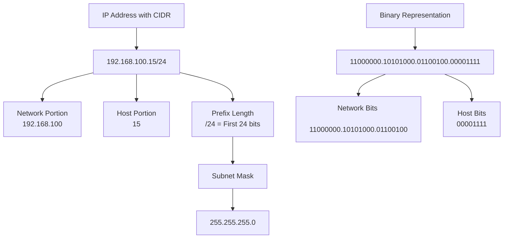

# Understanding CIDR Notation

## Introduction

Classless Inter-Domain Routing (CIDR, pronounced "cider") is a method for allocating IP addresses and routing IP packets. Developed in the early 1990s, CIDR was introduced to slow the rapid depletion of IPv4 addresses and improve the efficiency of routing by replacing the previous classful network addressing architecture.

Before diving into CIDR, let's understand why it was needed in the first place.

## The Problem: Classful Addressing

Originally, IPv4 addressing used a classful system that divided the IP address space into five classes (A, B, C, D, and E). Each class had a fixed boundary between the network and host portions of the address:

| Class | First Bits | Range | Default Subnet Mask | Networks | Hosts per Network |
|-------|------------|-------|---------------------|----------|-------------------|
| A | 0 | 0.0.0.0 - 127.255.255.255 | 255.0.0.0 (/8) | 128 | 16,777,214 |
| B | 10 | 128.0.0.0 - 191.255.255.255 | 255.255.0.0 (/16) | 16,384 | 65,534 |
| C | 110 | 192.0.0.0 - 223.255.255.255 | 255.255.255.0 (/24) | 2,097,152 | 254 |
| D (Multicast) | 1110 | 224.0.0.0 - 239.255.255.255 | N/A | N/A | N/A |
| E (Reserved) | 1111 | 240.0.0.0 - 255.255.255.255 | N/A | N/A | N/A |

This rigid system created significant problems:

1. **Inefficient allocation**: Organizations often received far more addresses than needed. For example, if you needed 1,000 addresses, you'd get a Class B network with 65,534 addresses.
2. **Rapid IPv4 exhaustion**: The inefficient allocation accelerated IPv4 address depletion.
3. **Routing table explosion**: The internet routing tables grew exponentially, causing performance and memory issues for routers.

## CIDR to the Rescue

CIDR was introduced to address these issues by eliminating the fixed classes and introducing variable-length subnet masking (VLSM).

### CIDR Notation Explained

CIDR notation uses a syntax of:

```
IP_address/prefix_length
```

Where:
- `IP_address` is a standard IPv4 or IPv6 address
- `prefix_length` is the number of bits in the network portion of the address

For example:
- `192.168.1.0/24` indicates that the first 24 bits (3 bytes) are used for the network portion
- `10.0.0.0/8` indicates that the first 8 bits (1 byte) are used for the network portion

### How to Interpret CIDR Notation

Let's break down a CIDR notation example: `192.168.100.0/22`

1. Convert the IP address to binary:
   
   ```
   192      .168      .100      .0
   11000000.10101000.01100100.00000000
   ```

2. The `/22` means the first 22 bits represent the network portion:
   
   ```
   11000000.10101000.0110xxxx.xxxxxxxx
   |-------- Network ID -----|-Host ID-|
   ```

3. This gives us:
   - Network ID: The first 22 bits
   - Host ID: The remaining 10 bits

4. The 10 bits for hosts allow for 2^10 - 2 = 1,022 usable host addresses (we subtract 2 for the network address and broadcast address)

## Calculating Network Information from CIDR

Let's work through some practical examples of calculating network information from CIDR notation.

### Example 1: Finding Network Range for 192.168.100.0/22

To find the range of addresses in a CIDR block:

1. Identify the network address (first address)
2. Calculate the subnet mask
3. Find the broadcast address (last address)

For `192.168.100.0/22`:

The subnet mask is:
```
/22 = 11111111.11111111.11111100.00000000 = 255.255.252.0
```

To find the network address range:

```javascript
// First address (network address)
192.168.100.0

// Last address (broadcast address)
// With /22, we have 10 host bits, meaning 2^10 = 1024 addresses
// So the range is 192.168.100.0 to 192.168.103.255
192.168.103.255

// Valid host range
192.168.100.1 to 192.168.103.254
```

### Example 2: Determining if an IP belongs to a network

To determine if `192.168.102.130` belongs to the `192.168.100.0/22` network:

```javascript
// Convert to binary and apply the subnet mask
192.168.102.130 = 11000000.10101000.01100110.10000010
Subnet mask     = 11111111.11111111.11111100.00000000
                  ------------------------------------ (bitwise AND)
Result          = 11000000.10101000.01100100.00000000 = 192.168.100.0

// Since the result equals the network address, the IP belongs to this network
```

## CIDR Subnetting

CIDR enables flexible subnetting, allowing networks to be divided into sub-networks of various sizes.

### Example: Subnetting a /24 Network

Let's say we have `192.168.1.0/24` and want to create 4 equal subnets:

1. We need 2 additional bits to create 4 subnets (2^2 = 4)
2. Our new prefix length is /24 + 2 = /26
3. This gives us 4 subnets with 64 addresses each:

```
Subnet 1: 192.168.1.0/26   (Range: 192.168.1.0 - 192.168.1.63)
Subnet 2: 192.168.1.64/26  (Range: 192.168.1.64 - 192.168.1.127)
Subnet 3: 192.168.1.128/26 (Range: 192.168.1.128 - 192.168.1.191)
Subnet 4: 192.168.1.192/26 (Range: 192.168.1.192 - 192.168.1.255)
```

## CIDR Aggregation (Supernetting)

CIDR also allows for the aggregation of multiple networks into a single routing table entry, reducing the size of routing tables.

### Example: Aggregating Routes

If an organization has the following four networks:
- 192.168.16.0/24
- 192.168.17.0/24
- 192.168.18.0/24
- 192.168.19.0/24

These can be aggregated as `192.168.16.0/22`, which covers all four networks with a single routing entry.

## Visualizing CIDR Notation

Here's a diagram showing how CIDR notation relates to IP address structure:



And here's how different CIDR prefix lengths affect network size:

```mermaid
graph LR
    A[CIDR Prefix Length] --> B[/8]
    A --> C[/16]
    A --> D[/24]
    A --> E[/30]
    
    B --> F[16,777,214 hosts]
    C --> G[65,534 hosts]
    D --> H[254 hosts]
    E --> I[2 hosts]
    
    J[Network Size] --> F
    J --> G
    J --> H
    J --> I
```

## Practical Applications

### Network Design

When designing a network infrastructure, CIDR enables efficient IP allocation:

```javascript
// Example: Company with different departments
Marketing:   10.1.0.0/20  (4,094 hosts)
Engineering: 10.2.0.0/21  (2,046 hosts)
Finance:     10.3.0.0/23  (510 hosts)
HR:          10.3.2.0/24  (254 hosts)
```

### Cloud Computing

Cloud providers use CIDR notation for defining Virtual Private Clouds (VPCs):

```javascript
// AWS VPC and subnet configuration
VPC:            10.0.0.0/16
Public Subnet:  10.0.1.0/24
Private Subnet: 10.0.2.0/24
Database Tier:  10.0.3.0/24
```

### Firewall Rules

Security teams use CIDR notation to specify ranges in firewall rules:

```javascript
// Allow traffic from corporate networks
allow from 203.0.113.0/24 to any port 443
allow from 198.51.100.0/24 to any port 443

// Block traffic from suspicious network ranges
deny from 185.143.0.0/16 to any
```

## Tools for Working with CIDR

Several tools and commands can help when working with CIDR notation:

### Using ipcalc (Linux)

```bash
$ ipcalc 192.168.100.0/22
Address:   192.168.100.0        11000000.10101000.01100100.00000000
Netmask:   255.255.252.0 = 22   11111111.11111111.11111100.00000000
Wildcard:  0.0.3.255            00000000.00000000.00000011.11111111
=>
Network:   192.168.100.0/22     11000000.10101000.01100100.00000000
HostMin:   192.168.100.1        11000000.10101000.01100100.00000001
HostMax:   192.168.103.254      11000000.10101000.01100111.11111110
Broadcast: 192.168.103.255      11000000.10101000.01100111.11111111
Hosts/Net: 1022
```

### Programming with CIDR

In Python, you can use the `ipaddress` module to work with CIDR notation:

```python
import ipaddress

# Create a network
net = ipaddress.ip_network('192.168.100.0/22')

# Print network information
print(f"Network: {net}")
print(f"Netmask: {net.netmask}")
print(f"Broadcast: {net.broadcast_address}")
print(f"Number of addresses: {net.num_addresses}")

# Check if an IP address is in the network
ip = ipaddress.ip_address('192.168.102.130')
print(f"Is {ip} in {net}? {ip in net}")

# List all subnets if we divide into /24 networks
for subnet in net.subnets(new_prefix=24):
    print(subnet)
```

Output:
```
Network: 192.168.100.0/22
Netmask: 255.255.252.0
Broadcast: 192.168.103.255
Number of addresses: 1024
Is 192.168.102.130 in 192.168.100.0/22? True
192.168.100.0/24
192.168.101.0/24
192.168.102.0/24
192.168.103.0/24
```

## CIDR and IPv6

CIDR notation is also used with IPv6 addresses. The principles are the same, but with a much larger address space:

```
2001:db8::/32
```

This represents an IPv6 network where the first 32 bits are the network portion.

## Common CIDR Blocks

Here are some commonly used CIDR blocks:

| CIDR Block | Subnet Mask | Number of Addresses |
|------------|-------------|---------------------|
| /8 | 255.0.0.0 | 16,777,216 |
| /16 | 255.255.0.0 | 65,536 |
| /24 | 255.255.255.0 | 256 |
| /27 | 255.255.255.224 | 32 |
| /29 | 255.255.255.248 | 8 |
| /30 | 255.255.255.252 | 4 |
| /31 | 255.255.255.254 | 2 (used for point-to-point links) |
| /32 | 255.255.255.255 | 1 (single host) |

## Summary

CIDR notation revolutionized IP addressing and routing by:

1. **Eliminating inefficient class-based allocation**
2. **Enabling variable-length subnet masks** for flexible network design
3. **Reducing routing table sizes** through aggregation
4. **Extending the lifetime of IPv4** by making address allocation more efficient

Understanding CIDR notation is essential for network engineers, system administrators, cloud architects, and anyone working with modern network infrastructures. It allows for efficient IP address management, simplified routing, and flexible network design.

## Exercises

1. Convert the following traditional subnet masks to CIDR notation:
   - 255.255.255.0
   - 255.255.252.0
   - 255.240.0.0

2. For the network 172.16.0.0/20:
   - How many host addresses are available?
   - What is the valid IP address range?
   - What is the broadcast address?

3. Divide the network 192.168.5.0/24 into four equal subnets. For each subnet, provide:
   - Network address with CIDR notation
   - First usable host address
   - Last usable host address
   - Broadcast address

4. Determine if the following IP addresses belong to the network 10.10.128.0/20:
   - 10.10.133.45
   - 10.10.144.2
   - 10.10.129.201

5. Aggregate the following networks into the smallest possible CIDR block:
   - 172.16.16.0/24
   - 172.16.17.0/24
   - 172.16.18.0/24
   - 172.16.19.0/24

## Additional Resources

- [RFC 1519](https://datatracker.ietf.org/doc/html/rfc1519) - The original CIDR specification
- [RFC 4632](https://datatracker.ietf.org/doc/html/rfc4632) - Updated CIDR specification
- Online CIDR calculators:
  - [CIDR.xyz](https://cidr.xyz/)
  - [IPAddressGuide](https://www.ipaddressguide.com/cidr)