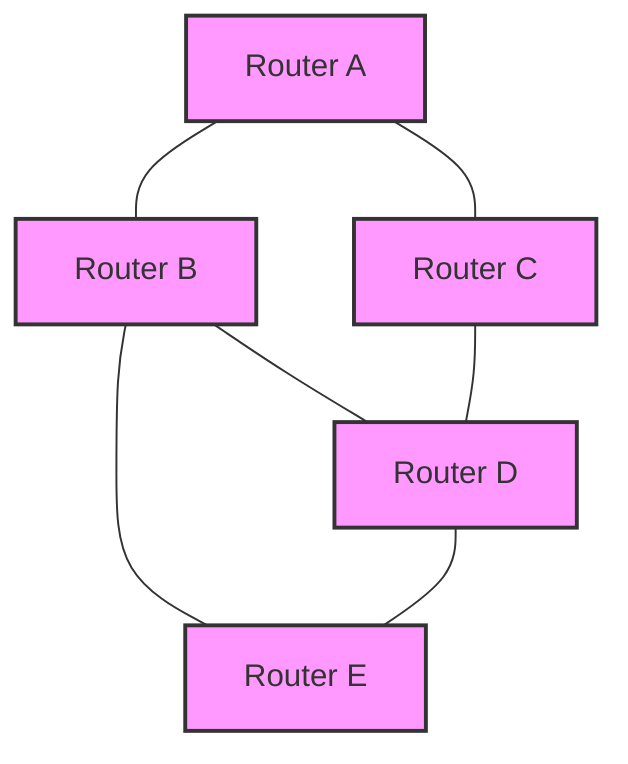
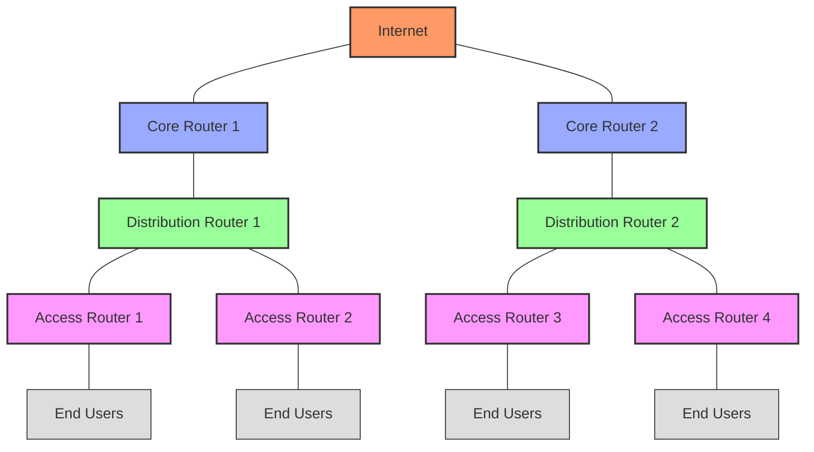

# Networks Routing

## Introduction

Routing is one of the most critical functions of the network layer in computer networks. It's the process that determines which path data should take through a network to reach its destination. Think of routing like a GPS for your data packets - it helps them navigate from the source to the destination across potentially complex network topologies.

In this guide, we'll explore how routing works, different routing algorithms, common protocols, and the real-world implications of these technologies.

## What is Routing?

Routing is the process of selecting paths in a network along which to send network traffic. Routing directs packet forwarding, the transit of logically addressed network packets from their source toward their destination through intermediate nodes.

### Key Routing Concepts

- **Router**: A specialized network device that forwards data packets between computer networks
- **Routing Table**: A data table stored in a router that lists the routes to particular network destinations
- **Hop**: Each passage of a data packet through an intermediate device (like a router)
- **Packet**: A unit of data transmitted over the network
- **Path**: The sequence of routers a packet traverses to reach its destination

## Routing vs. Forwarding

Before diving deeper, let's clarify two related but distinct concepts:

1. **Routing**: The process of determining the best path for data to travel (planning)
2. **Forwarding**: The actual movement of packets from input to output port (execution)

A router performs both functions - it decides where packets should go (routing) and then sends them along that path (forwarding).

## Routing Algorithms

Routing algorithms are methods used to determine the optimal path for data to travel. They can be classified in several ways:

### Static vs. Dynamic Routing

#### Static Routing

Static routing involves manually configuring routing tables. An administrator specifies exactly which route a packet should take.

```
# Example of static route configuration (Linux)
ip route add 192.168.2.0/24 via 192.168.1.254
```

**Advantages:**
- Simple to implement
- Predictable behavior
- Low processing overhead

**Disadvantages:**
- Doesn't adapt to network changes
- Requires manual reconfiguration
- Not scalable for large networks

#### Dynamic Routing

Dynamic routing uses protocols that automatically adjust to changes in network topology.

**Advantages:**
- Adapts to network changes automatically
- More scalable for large networks
- Reduces administrative overhead

**Disadvantages:**
- More complex
- Consumes more bandwidth and CPU resources
- Can potentially introduce security concerns

### Global vs. Decentralized Routing

#### Global (Centralized) Routing

In global routing, all routers have complete information about network topology.

**Example Algorithm: Link-State Routing**
- Each router builds a map of the entire network
- Uses Dijkstra's algorithm to calculate shortest paths
- OSPF (Open Shortest Path First) is a common implementation

#### Decentralized Routing

In decentralized routing, routers only have information about their neighbors.

**Example Algorithm: Distance-Vector Routing**
- Routers share information only with neighbors
- Uses Bellman-Ford algorithm
- RIP (Routing Information Protocol) is a common implementation

Let's visualize how these algorithms work with a simple diagram:



## Common Routing Metrics

Routing algorithms need a way to determine which path is "best." These are some common metrics used:

1. **Hop Count**: Number of routers a packet must pass through
2. **Bandwidth**: Available data capacity of the link
3. **Delay**: Time taken for a packet to travel from source to destination
4. **Cost**: An arbitrary value assigned by the administrator
5. **Reliability**: Rate of packet loss on the link
6. **Load**: Current utilization of the network resources

## Important Routing Protocols

### Interior Gateway Protocols (IGPs)

Used within an autonomous system (a network under a single administrative domain).

#### RIP (Routing Information Protocol)

A simple distance-vector protocol that uses hop count as its metric.

```
# Example RIP configuration (Cisco)
router rip
 network 192.168.1.0
 network 192.168.2.0
```

#### OSPF (Open Shortest Path First)

A link-state protocol that uses cost as its metric.

```
# Example OSPF configuration (Cisco)
router ospf 1
 network 192.168.1.0 0.0.0.255 area 0
 network 192.168.2.0 0.0.0.255 area 0
```

#### EIGRP (Enhanced Interior Gateway Routing Protocol)

A hybrid protocol that combines aspects of distance-vector and link-state protocols.

### Exterior Gateway Protocols (EGPs)

Used between autonomous systems.

#### BGP (Border Gateway Protocol)

The primary protocol for inter-domain routing on the internet.

```
# Example BGP configuration (Cisco)
router bgp 65000
 neighbor 203.0.113.1 remote-as 65001
 network 192.168.0.0
```

## Routing Tables

Routing tables store the information that routers use to make forwarding decisions. A typical routing table contains:

1. **Network Destination**: The target network address
2. **Subnet Mask**: Defines the network portion of the address
3. **Gateway**: The next hop to reach the destination
4. **Interface**: The local interface to use
5. **Metric**: The cost associated with this route

Here's what a routing table might look like:

```
$ route -n
Kernel IP routing table
Destination     Gateway         Genmask         Flags Metric Ref    Use Iface
0.0.0.0         192.168.1.1     0.0.0.0         UG    0      0        0 eth0
192.168.1.0     0.0.0.0         255.255.255.0   U     0      0        0 eth0
192.168.2.0     192.168.1.254   255.255.255.0   UG    0      0        0 eth0
```

## Routing Algorithm Examples

Let's implement a simple distance-vector routing algorithm in Python to better understand the concept:

```python
# Simple Distance Vector Routing Algorithm Implementation

def bellman_ford(graph, source):
    # Initialize distances
    distances = {node: float('infinity') for node in graph}
    distances[source] = 0
    
    # Relax edges repeatedly
    for _ in range(len(graph) - 1):
        for node in graph:
            for neighbor, weight in graph[node].items():
                if distances[node] + weight < distances[neighbor]:
                    distances[neighbor] = distances[node] + weight
    
    return distances

# Example network graph (adjacency list with weights)
network = {
    'A': {'B': 1, 'C': 4},
    'B': {'A': 1, 'C': 2, 'D': 5},
    'C': {'A': 4, 'B': 2, 'D': 1},
    'D': {'B': 5, 'C': 1}
}

# Calculate shortest paths from node A
routes = bellman_ford(network, 'A')
print("Shortest paths from Router A:")
for node, distance in routes.items():
    print(f"To Router {node}: {distance} hops")
```

**Output:**
```
Shortest paths from Router A:
To Router A: 0 hops
To Router B: 1 hops
To Router C: 3 hops
To Router D: 4 hops
```

## Real-World Routing Scenarios

### Internet Routing

The internet uses a hierarchical routing structure:
1. **Core Routers**: Handle high-volume traffic between major networks
2. **Distribution Routers**: Connect organizations to the internet
3. **Access Routers**: Connect end-users to an organization's network



### Enterprise Network Routing

Enterprise networks often use a combination of:
- **Static routes** for stable connections
- **OSPF or EIGRP** for internal routing
- **BGP** for connecting to the internet

### Home Network Routing

Even home networks perform routing:
- Your home router typically uses:
  - Static routes for the local network
  - A default route to send external traffic to your ISP

## Common Routing Issues

### Routing Loops

Packets circulate indefinitely between routers.

**Solutions:**
- **TTL (Time to Live)**: Limits packet lifetime
- **Split Horizon**: Prevents routes from being advertised back to their source
- **Route Poisoning**: Marks routes as unreachable during updates

### Count to Infinity Problem

In distance-vector protocols, routers can slowly increment route metrics during failures.

**Solutions:**
- Maximum hop count limits
- Hold-down timers
- Path-vector protocols (like BGP)

### Route Flapping

Routes repeatedly go up and down, causing instability.

**Solutions:**
- Route dampening
- Timers for route advertisement

## Specialized Routing Concepts

### Equal-Cost Multi-Path (ECMP)

A routing strategy where packet forwarding to a single destination can occur over multiple paths with equal routing metric values.

### Policy-Based Routing (PBR)

Forwarding decisions based on policies set by the network administrator rather than just the destination address.

### Source Routing

The sender specifies the route that a packet should take through the network.

## Summary

Routing is a fundamental network layer function that determines how data travels from source to destination across networks. It involves:

- **Algorithms** that calculate optimal paths (static or dynamic, global or decentralized)
- **Protocols** that implement these algorithms (RIP, OSPF, BGP, etc.)
- **Metrics** that define what "best path" means (hop count, bandwidth, delay, etc.)
- **Routing tables** that store the information needed for forwarding decisions

Understanding routing is essential for designing, implementing, and troubleshooting networks of all sizes, from small home networks to the global internet.

## Exercises

1. Draw a simple network topology with 5 routers and calculate the shortest path between each pair using Dijkstra's algorithm.
2. Compare and contrast OSPF and RIP routing protocols. When would you use each?
3. Implement a simple link-state routing algorithm in your preferred programming language.
4. Examine your home network's routing table and explain each entry.
5. Design a small enterprise network and decide which routing protocols to use where and why.

## Additional Resources

- **Books**:
  - "Computer Networks" by Andrew S. Tanenbaum
  - "Routing TCP/IP, Volume 1" by Jeff Doyle
  
- **Online Courses**:
  - Cisco Networking Academy courses
  - Computer Networks on Coursera or edX
  
- **Tools**:
  - Wireshark for packet analysis
  - GNS3 for network simulation
  
- **RFCs** (Request for Comments):
  - RFC 2328 (OSPF Version 2)
  - RFC 4271 (Border Gateway Protocol 4)