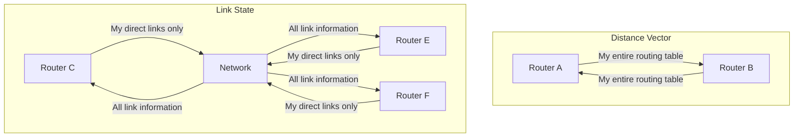
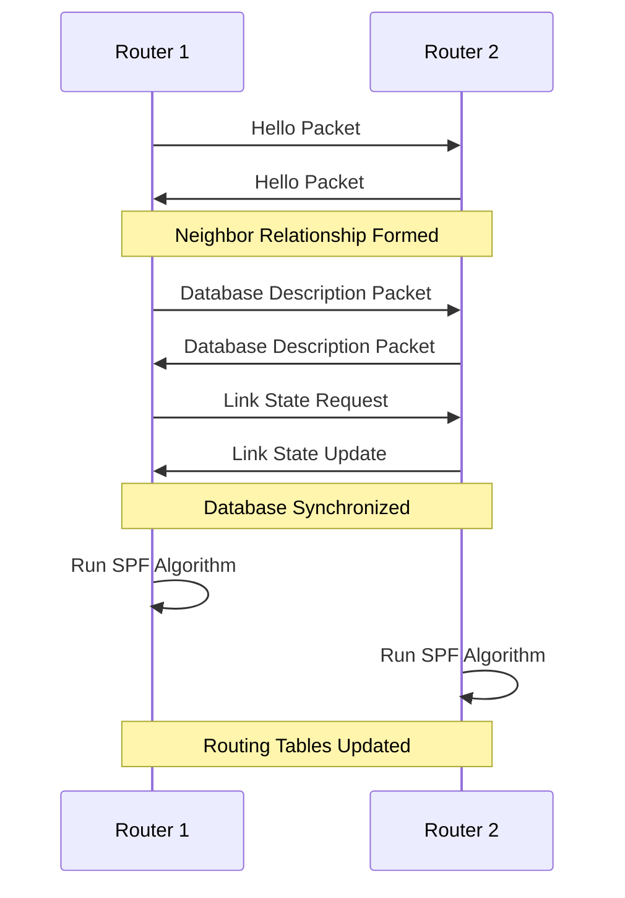
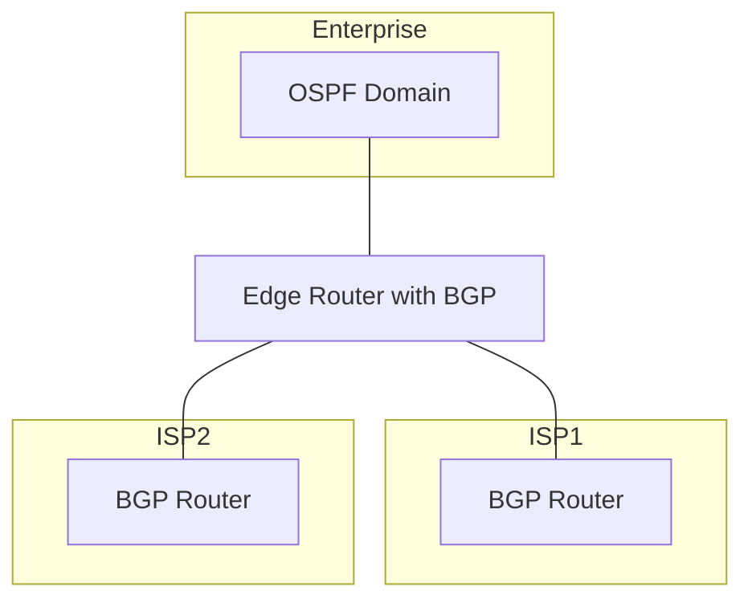

# Network Routing Protocols

## Introduction

Routing protocols are the traffic directors of the internet. They determine how data packets navigate from source to destination across multiple networks. When you send a message or request a webpage, routing protocols ensure your data finds the most efficient path across the vast web of interconnected devices.

In this guide, we'll explore how routing protocols work, examine different types of protocols, and understand their real-world applications. By the end, you'll have a solid grasp of how data finds its way through the complex maze of the internet.

## What are Routing Protocols?

Routing protocols are sets of rules that routers use to communicate with each other. They help routers:

1. **Discover network destinations**: Find out what networks exist
2. **Exchange routing information**: Share what they know about network paths
3. **Determine optimal paths**: Calculate the best routes for data
4. **Handle network changes**: Adapt when networks fail or change

Think of routing protocols as the GPS system for data packets. Just as you need directions to navigate unfamiliar roads, data packets need routing information to traverse the internet.

## Key Concepts in Routing

Before diving into specific protocols, let's understand some fundamental concepts:

### Routing Tables

Every router maintains a routing table - a database of network destinations and how to reach them.

```
Router> show ip route
Codes: C - connected, S - static, I - IGRP, R - RIP, M - mobile, B - BGP
       D - EIGRP, EX - EIGRP external, O - OSPF, IA - OSPF inter area
       N1 - OSPF NSSA external type 1, N2 - OSPF NSSA external type 2
       E1 - OSPF external type 1, E2 - OSPF external type 2, E - EGP
       i - IS-IS, L1 - IS-IS level-1, L2 - IS-IS level-2, * - candidate default

Gateway of last resort is 192.168.1.1 to network 0.0.0.0

C    192.168.1.0/24 is directly connected, FastEthernet0/0
S    172.16.0.0/16 [1/0] via 192.168.1.1
O    10.0.0.0/8 [110/2] via 192.168.1.1, 00:00:05, FastEthernet0/0
```

The routing table above shows:
- Connected networks (C)
- Static routes (S)
- Routes learned via OSPF (O)

### Metrics

Routing protocols use metrics to determine the best path. Common metrics include:

- **Hop count**: Number of routers a packet must traverse
- **Bandwidth**: Data-carrying capacity of the link
- **Delay**: Time taken to move the packet
- **Reliability**: Dependability of each network link
- **Cost**: An arbitrary value assigned by administrators

Different protocols use different metrics or combinations of metrics.

### Administrative Distance

When a router learns about the same destination from multiple protocols, it needs a way to decide which route to trust. Administrative distance is a value that indicates the "trustworthiness" of a routing protocol.

| Protocol | Administrative Distance |
|----------|-------------------------|
| Connected Interface | 0 |
| Static Route | 1 |
| EIGRP | 90 |
| OSPF | 110 |
| RIP | 120 |
| External EIGRP | 170 |
| Unknown | 255 |

Lower values indicate higher trustworthiness.

## Types of Routing Protocols

Routing protocols can be classified in several ways:

### 1. By Scope

#### Interior Gateway Protocols (IGPs)
Used within an autonomous system (a network under a single administrative domain):
- RIP (Routing Information Protocol)
- OSPF (Open Shortest Path First)
- EIGRP (Enhanced Interior Gateway Routing Protocol)
- IS-IS (Intermediate System to Intermediate System)

#### Exterior Gateway Protocols (EGPs)
Used between autonomous systems:
- BGP (Border Gateway Protocol)

### 2. By Algorithm Type

#### Distance Vector Protocols
These protocols share their routing tables with neighbors:
- RIP
- EIGRP (hybrid)

#### Link-State Protocols
These protocols share information about their connections:
- OSPF
- IS-IS

Let's visualize the difference:



## Common Routing Protocols

Let's examine some of the most widely used routing protocols:

### RIP (Routing Information Protocol)

RIP is one of the oldest routing protocols, based on the distance-vector algorithm.

**Key characteristics:**
- Uses hop count as its metric (maximum 15 hops)
- Simple to configure
- Not ideal for large networks
- Periodic updates every 30 seconds
- Slow to converge

**Example RIP configuration:**

```
router rip
 version 2
 network 192.168.1.0
 network 10.0.0.0
 no auto-summary
```

### OSPF (Open Shortest Path First)

OSPF is a link-state protocol that builds a complete map of the network.

**Key characteristics:**
- Uses cost based on bandwidth as its metric
- Forms neighbor relationships
- Uses areas to reduce computation
- Fast convergence
- Supports large networks

**Example OSPF configuration:**

```
router ospf 1
 network 192.168.1.0 0.0.0.255 area 0
 network 10.0.0.0 0.255.255.255 area 0
```

### BGP (Border Gateway Protocol)

BGP is the protocol that makes the internet work, connecting different autonomous systems.

**Key characteristics:**
- Path-vector protocol
- Uses complex attributes for path selection
- Designed for stability, not speed
- Policy-based routing
- Essential for internet service providers

**Example BGP configuration:**

```
router bgp 65000
 neighbor 192.168.1.2 remote-as 65001
 network 192.168.1.0 mask 255.255.255.0
```

## How Routing Protocols Work: Step by Step

Let's see how OSPF works to understand routing protocols better:

1. **Neighbor Discovery**:
   Routers send Hello packets to discover neighbors on the same network.

2. **Database Synchronization**:
   Routers exchange database description packets to synchronize their link-state databases.

3. **Network Map Creation**:
   Each router builds a complete map of the network using the link-state database.

4. **Shortest Path Calculation**:
   Routers use Dijkstra's algorithm to calculate the shortest path to each destination.

5. **Routing Table Population**:
   The best routes are installed in the routing table.

6. **Ongoing Updates**:
   When network changes occur, routers flood updates to maintain accurate information.



## Routing Protocol Selection

How do you choose the right routing protocol? Consider these factors:

1. **Network Size**:
   - Small networks: RIP or static routes
   - Medium networks: OSPF
   - Large networks: OSPF with areas or IS-IS
   - Internet: BGP

2. **Convergence Requirements**:
   - Fast convergence: OSPF, EIGRP
   - Less critical: RIP

3. **Administrative Complexity**:
   - Simple administration: RIP
   - More complex but powerful: OSPF, BGP

4. **Vendor Support**:
   - Multi-vendor: OSPF, RIP, BGP
   - Cisco only: EIGRP

## Real-World Applications

### Enterprise Networks

A typical enterprise might use:
- OSPF within their internal network
- BGP to connect to multiple ISPs for redundancy



### Service Provider Networks

Internet Service Providers use:
- IS-IS or OSPF within their network
- BGP to connect to other providers and customers

### Routing Protocol Implementation: A Python Example

While actual routing protocols are implemented in router firmware, we can demonstrate the concept of the Bellman-Ford algorithm (used by RIP) in Python:

```python
def bellman_ford(graph, source):
    # Initialize distances
    distance = {}
    predecessor = {}
    for node in graph:
        distance[node] = float('infinity')
        predecessor[node] = None
    distance[source] = 0
    
    # Relax edges repeatedly
    for _ in range(len(graph) - 1):
        for u in graph:
            for v, weight in graph[u].items():
                if distance[u] + weight < distance[v]:
                    distance[v] = distance[u] + weight
                    predecessor[v] = u
    
    # Check for negative weight cycles
    for u in graph:
        for v, weight in graph[u].items():
            if distance[u] + weight < distance[v]:
                return False  # Negative weight cycle found
    
    return distance, predecessor

# Example usage
graph = {
    'A': {'B': 1, 'C': 4},
    'B': {'A': 1, 'C': 2, 'D': 5},
    'C': {'A': 4, 'B': 2, 'D': 1},
    'D': {'B': 5, 'C': 1}
}

distance, predecessor = bellman_ford(graph, 'A')
print("Distances from source:", distance)
print("Predecessor nodes:", predecessor)
```

Output:
```
Distances from source: {'A': 0, 'B': 1, 'C': 3, 'D': 4}
Predecessor nodes: {'A': None, 'B': 'A', 'C': 'B', 'D': 'C'}
```

This demonstrates how a distance-vector algorithm calculates the shortest paths from a source node to all other nodes in a network.

## Common Routing Problems and Solutions

### Routing Loops

When routers have incorrect information, packets can loop indefinitely.

**Solution:**
- Time to Live (TTL) field in IP headers
- Split horizon: Don't advertise routes back to where they were learned
- Route poisoning: Mark failed routes with infinite metric

### Convergence Time

The time taken for all routers to update their routing tables after a change.

**Solution:**
- Use faster protocols like OSPF
- Implement triggered updates
- Configure timers appropriately

### Scalability Issues

Large networks can overwhelm routing protocols.

**Solution:**
- Use hierarchical design (OSPF areas)
- Implement route summarization
- Choose appropriate protocols for network size

## Summary

Routing protocols are essential for data communication across networks. They determine how packets move from source to destination through the complex web of interconnected devices. Key points to remember:

- **Distance-vector protocols** like RIP share entire routing tables with neighbors
- **Link-state protocols** like OSPF share information about direct connections
- **BGP** connects different autonomous systems across the internet
- Protocol selection depends on network size, convergence requirements, and administrative preferences
- Modern networks often use multiple protocols for different purposes

Understanding routing protocols is crucial for network design, troubleshooting, and optimization. As networks grow in complexity, the efficiency of routing becomes increasingly important.

## Practice Exercises

1. **Routing Protocol Analysis**:
   Configure a virtual network with multiple routers and implement different routing protocols. Compare convergence times and routing table sizes.

2. **Routing Simulation**:
   Implement the Dijkstra algorithm (used by OSPF) in your preferred programming language.

3. **Hybrid Network Design**:
   Design a network that uses both OSPF and BGP. Determine appropriate boundaries and redistribution points.

4. **Routing Protocol Security**:
   Research and document security vulnerabilities in common routing protocols and how to mitigate them.

## Additional Resources

- **Books**:
  - "Internet Routing Architectures" by Sam Halabi
  - "OSPF: Anatomy of an Internet Routing Protocol" by John T. Moy

- **Online Courses**:
  - Cisco's CCNA Routing and Switching
  - Network+ Certification materials

- **Tools**:
  - GNS3 for network simulation
  - Wireshark for packet analysis

- **RFCs**:
  - RFC 2328 for OSPF
  - RFC 4271 for BGP