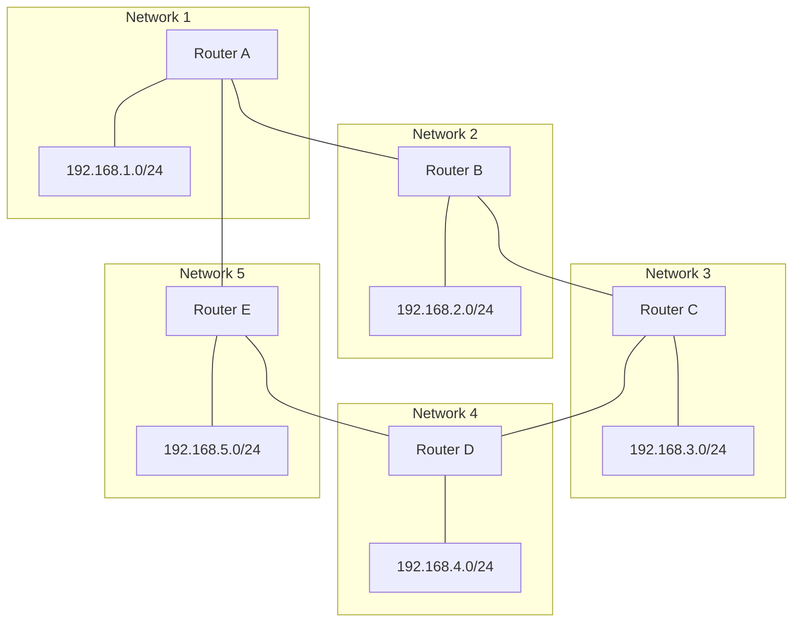

# RIP Protocol - Routing Information Protocol

## Introduction

The Routing Information Protocol (RIP) is one of the oldest and most widely implemented routing protocols in computer networks. As a crucial component of the Network Layer in the OSI model, RIP helps routers determine the best path for forwarding data packets across interconnected networks.

RIP belongs to a family of protocols known as **distance-vector routing protocols**. Unlike more complex protocols, RIP is relatively simple to configure and understand, making it an excellent starting point for beginners learning about network routing.

## What is RIP?

RIP is a standardized protocol that enables routers to exchange information about the networks they can reach and the "distance" or cost associated with reaching those networks. The primary metric used by RIP is **hop count** - the number of routers a packet must pass through to reach its destination.

### Key Characteristics of RIP

- **Distance-Vector Protocol**: Makes routing decisions based on distance (hop count) to destination
- **Maximum Hop Count**: Limited to 15 hops (16 or more is considered unreachable)
- **Update Interval**: Broadcasts its entire routing table every 30 seconds
- **Simple Implementation**: Easy to configure compared to other routing protocols
- **Convergence Time**: Relatively slow to adapt to network changes

## How RIP Works

RIP operates on a simple principle: routers share what they know about the network with their immediate neighbors, and through this sharing, all routers eventually build a complete picture of the network topology.

Let's break down the process:

1. Each router maintains a routing table containing entries for all known networks
2. Every 30 seconds, a router broadcasts its entire routing table to all neighbors
3. When a router receives an update, it:
   - Adds the sender's hop count to each entry (usually +1)
   - If it discovers a new network, adds it to its routing table
   - If it finds a better path (fewer hops) to a known network, updates its table
   - If it receives a route from the same router it learned the route from originally, and the hop count has increased, updates its table
4. This process continues until the network converges (all routers have accurate information)

### RIP Message Format

RIP uses a simple message format to exchange routing information:

```
+-----+-----+------+------+------+------+------+------+
|Cmd  |Ver  |Zero  |      Address Family Identifier   |
+-----+-----+------+------+------+------+------+------+
|                 IP Address                          |
+-----+-----+------+------+------+------+------+------+
|                 Subnet Mask                         |
+-----+-----+------+------+------+------+------+------+
|                 Next Hop                            |
+-----+-----+------+------+------+------+------+------+
|                 Metric (Hop Count)                  |
+-----+-----+------+------+------+------+------+------+
```

Where:
- **Cmd**: Command (1 for request, 2 for response)
- **Ver**: RIP version (1 or 2)
- **AFI**: Address Family Identifier (usually 2 for IP)
- **IP Address**: Network address
- **Subnet Mask**: Mask for the network (RIPv2 only)
- **Next Hop**: IP of the next router (RIPv2 only)
- **Metric**: Hop count (0-15)

## RIP Versions

RIP has evolved over time, with three main versions:

### RIP version 1 (RIPv1)

- Classful routing protocol (doesn't support subnets)
- Broadcasts updates to 255.255.255.255
- No authentication mechanism
- No subnet mask information in updates

### RIP version 2 (RIPv2)

- Classless routing protocol (supports CIDR and VLSM)
- Uses multicast address 224.0.0.9 for updates
- Supports simple password authentication
- Includes subnet mask information in updates

### RIPng (RIP next generation)

- Designed for IPv6 networks
- Uses multicast address FF02::9
- Supports IPv6 addressing features

## Practical Example: RIP Configuration

Let's look at a practical example of configuring RIP on a Cisco router:

```
Router> enable
Router# configure terminal
Router(config)# router rip
Router(config-router)# version 2
Router(config-router)# network 192.168.1.0
Router(config-router)# network 192.168.2.0
Router(config-router)# no auto-summary
Router(config-router)# exit
Router(config)# exit
Router# write memory
```

This configuration:
1. Enters global configuration mode
2. Enables RIP routing protocol
3. Specifies RIP version 2
4. Adds networks 192.168.1.0 and 192.168.2.0 to RIP advertisements
5. Disables automatic route summarization (important for classless routing)
6. Saves the configuration

## Visualizing RIP in Action

Let's visualize how RIP works with a simple network diagram:



Initially, each router only knows about directly connected networks. After exchanging RIP updates:

1. Router A learns about Networks 2-5 from its neighbors
2. Router B learns about Networks 1, 3-5 from its neighbors
3. And so on until all routers have complete routing tables

### Example Routing Table (Router A)

After convergence, Router A's routing table might look like:

```
Destination     Gateway         Metric
192.168.1.0/24  directly conn.  0
192.168.2.0/24  Router B        1
192.168.3.0/24  Router B        2
192.168.4.0/24  Router E        2
192.168.5.0/24  Router E        1
```

## RIP Timers and Stability Features

RIP uses several timers to maintain stability:

- **Update Timer**: 30 seconds - interval between regular routing updates
- **Invalid Timer**: 180 seconds - if no update is received for a route within this time, it's marked as invalid
- **Holddown Timer**: 180 seconds - period during which a route is "frozen" after being marked invalid
- **Flush Timer**: 240 seconds - time after which an invalid route is removed from the routing table

### Loop Prevention Mechanisms

RIP implements several mechanisms to prevent routing loops:

#### Split Horizon

Prevents a router from advertising routes back to the neighbor from which they were learned.

#### Route Poisoning and Poison Reverse

When a route fails, the router advertises it with an infinite metric (hop count of 16) to notify others quickly.

#### Triggered Updates

When a route changes significantly, a router sends immediate updates rather than waiting for the next scheduled update.

## Advantages and Disadvantages of RIP

### Advantages

- **Simple Configuration**: Easy to set up and manage
- **Universal Support**: Widely supported on almost all routing devices
- **Low Resource Requirements**: Minimal CPU and memory usage
- **Standardized Protocol**: Works across devices from different vendors

### Disadvantages

- **Limited Scalability**: Maximum 15 hops makes it unsuitable for large networks
- **Slow Convergence**: Can take minutes to update after network changes
- **Regular Updates**: Consumes bandwidth with full table updates every 30 seconds
- **No Load Balancing**: Doesn't consider bandwidth or reliability, only hop count
- **Limited Security**: Basic or no authentication (depending on version)

## Real-World Applications

Despite its limitations, RIP is still used in:

1. **Small to Medium Networks**: Where network diameter is less than 15 hops
2. **Branch Offices**: Simple connectivity with limited routes
3. **Academic Environments**: As a learning tool for understanding routing principles
4. **Legacy Systems**: Maintaining compatibility with older networking equipment

## Troubleshooting RIP

When troubleshooting RIP issues, these commands are helpful:

```
# Display RIP routing database
Router# show ip rip database

# Display current routing table
Router# show ip route rip

# Debug RIP update packets
Router# debug ip rip

# Display RIP interface configuration
Router# show ip protocols
```

## Practical Lab Exercise: Configuring a RIP Network

**Exercise**: Configure a simple network with three routers using RIP version 2.

**Requirements**:
1. Router A has networks 10.1.1.0/24 and 192.168.1.0/24
2. Router B has networks 192.168.1.0/24 and 192.168.2.0/24
3. Router C has networks 192.168.2.0/24 and 10.2.2.0/24
4. Configure RIPv2 on all routers
5. Verify that Router A can see Router C's networks and vice versa

**Solution Verification**:
- Use `ping` to test connectivity between networks
- Use `show ip route` to verify routing tables
- Use `debug ip rip` to watch routing updates

## Summary

The Routing Information Protocol (RIP) is a foundational distance-vector routing protocol that:

- Uses hop count as its sole metric
- Limits networks to 15 hops
- Updates routing tables every 30 seconds
- Is simple to configure and troubleshoot
- Works well for small to medium networks

While more advanced routing protocols like OSPF and EIGRP have largely replaced RIP in enterprise environments, understanding RIP provides an excellent foundation for learning more complex routing concepts.

## Additional Resources

To deepen your understanding of RIP, consider exploring:

- RFC 1058 (RIPv1) specification
- RFC 2453 (RIPv2) specification
- RFC 2080 (RIPng for IPv6) specification
- Comparison studies between RIP, OSPF, and EIGRP protocols
- Network simulation tools to practice configuring RIP networks

## Next Steps

After mastering RIP, consider learning about:

- OSPF (Open Shortest Path First) - a link-state routing protocol
- EIGRP (Enhanced Interior Gateway Routing Protocol) - an advanced distance-vector protocol
- BGP (Border Gateway Protocol) - the protocol that powers internet routing