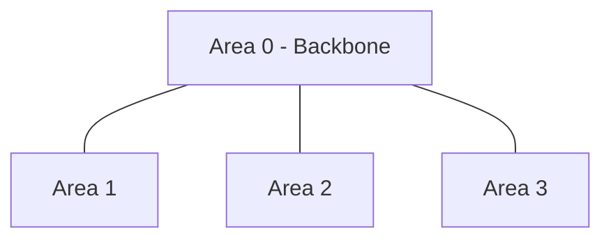
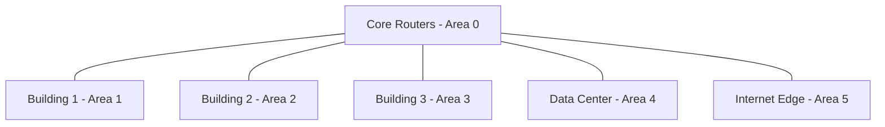

# OSPF Protocol

## Introduction

The Open Shortest Path First (OSPF) protocol is one of the most widely deployed interior gateway protocols (IGPs) used in large enterprise networks. As a link-state routing protocol, OSPF enables routers to build a complete and accurate map of the network topology, allowing them to calculate the shortest path to any destination.

Unlike simpler distance-vector protocols like RIP (Routing Information Protocol), OSPF is designed to scale efficiently in large networks, converge quickly after topology changes, and intelligently select optimal paths based on metrics like bandwidth and delay.

## OSPF Fundamentals

### Link-State Routing Basics

OSPF is a link-state routing protocol, which means:

1. Each router maintains a link-state database (LSDB) containing the entire network topology
2. Routers exchange information about the state of their direct links
3. All routers independently calculate the best paths using Dijkstra's Shortest Path First algorithm
4. The "cost" of each link determines the best path (lower cost is better)

### Key OSPF Concepts

#### Areas and Hierarchical Design

OSPF organizes networks into a two-level hierarchy:

- **Backbone Area (Area 0)**: The core of the OSPF network
- **Non-Backbone Areas**: Connected to Area 0, helping to reduce routing overhead



#### Router Types

OSPF defines several router types based on their position in the network:

- **Internal Routers**: All interfaces in a single area
- **Area Border Routers (ABRs)**: Connect multiple areas
- **Backbone Routers**: Have at least one interface in Area 0
- **Autonomous System Boundary Routers (ASBRs)**: Connect to other routing domains

#### Router ID

Each OSPF router has a unique 32-bit identifier (Router ID) used to identify it in the network. The Router ID is typically the highest IP address among the router's loopback interfaces or, if no loopback exists, the highest IP among active interfaces.

## OSPF Operation

### Establishing Neighbor Relationships

Before exchanging routing information, OSPF routers must form neighbor relationships:

1. **Hello Protocol**: Routers discover neighbors by sending Hello packets
2. **Two-Way State**: Routers recognize each other
3. **Adjacency Formation**: Neighbors synchronize their link-state databases

### OSPF Packet Types

OSPF uses five different types of packets:

1. **Hello**: Discovers neighbors and maintains relationships
2. **Database Description (DBD)**: Describes the contents of the LSDB
3. **Link State Request (LSR)**: Requests specific link-state records
4. **Link State Update (LSU)**: Responds to LSRs with Link State Advertisements
5. **Link State Acknowledgment (LSAck)**: Acknowledges receipt of LSUs

### Link State Advertisements (LSAs)

LSAs are the fundamental units of information in OSPF. Different types of LSAs contain different information:

- **Type 1 (Router LSA)**: Describes a router's interfaces within an area
- **Type 2 (Network LSA)**: Generated by designated routers for broadcast networks
- **Type 3 (Summary LSA)**: Advertises destinations in other areas
- **Type 4 (ASBR Summary LSA)**: Advertises routes to ASBRs
- **Type 5 (External LSA)**: Advertises routes imported from other routing protocols

### SPF Calculation

Once a router has built its LSDB, it uses Dijkstra's Shortest Path First algorithm to:

1. Create a shortest path tree with itself as the root
2. Calculate the best path to each destination
3. Install these routes in its routing table

## OSPF Configuration Example

Let's look at how to configure OSPF on Cisco routers:

### Basic OSPF Configuration

```
! Enable OSPF process with process ID 1
Router(config)# router ospf 1

! Set Router ID explicitly (recommended)
Router(config-router)# router-id 1.1.1.1

! Add networks to OSPF
Router(config-router)# network 192.168.1.0 0.0.0.255 area 0
Router(config-router)# network 192.168.2.0 0.0.0.255 area 0

! Configure interface cost (optional)
Router(config)# interface GigabitEthernet0/0
Router(config-if)# ip ospf cost 10
```

### Verifying OSPF Configuration

```
Router# show ip ospf neighbor
Router# show ip ospf database
Router# show ip route ospf
Router# show ip ospf interface
```

Example output:

```
Router# show ip ospf neighbor

Neighbor ID     Pri   State           Dead Time   Address         Interface
2.2.2.2         1     FULL/DR         00:00:35    192.168.1.2     GigabitEthernet0/0
3.3.3.3         1     FULL/BDR        00:00:32    192.168.1.3     GigabitEthernet0/0
```

## OSPF Link Cost Calculation

OSPF uses "cost" as its routing metric. Lower cost paths are preferred. By default, the cost is calculated based on bandwidth:

```
Cost = reference-bandwidth / interface-bandwidth
```

The default reference bandwidth in Cisco routers is 100 Mbps, which means:
- 100 Mbps link has cost 1
- 10 Mbps link has cost 10
- 1 Gbps link has cost 0.1 (rounded to 1)

Modern networks often use a higher reference bandwidth to differentiate between high-speed links:

```
Router(config)# router ospf 1
Router(config-router)# auto-cost reference-bandwidth 10000
```

This sets the reference bandwidth to 10 Gbps, allowing better differentiation between 1 Gbps and 10 Gbps links.

## Practical OSPF Network Design

### Area Design Best Practices

1. **Keep Area 0 (Backbone) Contiguous**: All other areas must connect to Area 0
2. **Limit the Number of Routers per Area**: 50-100 routers per area is generally recommended
3. **Minimize the Number of Areas per Router**: Ideally, a router should belong to 2-3 areas maximum

### OSPF in Different Network Types

OSPF operates in several network types:

1. **Broadcast (default for Ethernet)**: Uses DR/BDR election
2. **Point-to-Point**: Simplest OSPF operation, no DR election
3. **Non-Broadcast Multi-Access (NBMA)**: Requires manual neighbor configuration
4. **Point-to-Multipoint**: Treats NBMA networks as a collection of point-to-point links

```
! Configure OSPF network type on an interface
Router(config)# interface Serial0/0
Router(config-if)# ip ospf network point-to-point
```

### Designated Router and Backup Designated Router

On broadcast and NBMA networks, OSPF elects:
- **Designated Router (DR)**: Centralizes LSA exchange to reduce traffic
- **Backup Designated Router (BDR)**: Takes over if the DR fails

The router with the highest OSPF priority (or highest Router ID in case of a tie) becomes the DR:

```
! Set OSPF priority on an interface
Router(config)# interface GigabitEthernet0/0
Router(config-if)# ip ospf priority 100
```

## Advanced OSPF Features

### Route Summarization

OSPF supports route summarization to reduce the size of routing tables:

```
! Summary route at an Area Border Router
Router(config)# router ospf 1
Router(config-router)# area 1 range 192.168.16.0 255.255.240.0
```

### OSPF Virtual Links

Virtual links allow you to connect areas to Area 0 when a physical connection isn't possible:

```
! Configure a virtual link
Router(config)# router ospf 1
Router(config-router)# area 2 virtual-link 2.2.2.2
```

### Fast Convergence with LSA Throttling

Modern OSPF implementations include features to speed up convergence:

```
! Configure SPF timers
Router(config)# router ospf 1
Router(config-router)# timers throttle spf 50 200 5000
```

## OSPF vs. Other Routing Protocols

### OSPF vs. RIP

| Feature | OSPF | RIP |
|---------|------|-----|
| Algorithm | Link-state | Distance-vector |
| Metric | Cost (based on bandwidth) | Hop count |
| Scalability | High | Low |
| Convergence | Fast | Slow |
| VLSM Support | Yes | RIPv2 only |

### OSPF vs. EIGRP

| Feature | OSPF | EIGRP |
|---------|------|-------|
| Algorithm | Link-state | Advanced distance-vector |
| Metric | Cost | Composite (bandwidth, delay) |
| Standard | Open (RFC 2328) | Cisco proprietary (now partially open) |
| Hierarchical Design | Yes | No |
| Convergence | Fast | Very fast |

## Real-World OSPF Implementation

Let's consider a practical example of a campus network with multiple buildings:



In this design:
- **Area 0**: Contains core routers that interconnect all areas
- **Areas 1-3**: Building access networks with user devices
- **Area 4**: Data center with servers and applications
- **Area 5**: Internet edge with connections to external networks

This hierarchical design:
- Isolates failures within areas
- Reduces the size of topology databases in each area
- Allows for efficient route summarization between areas

## Troubleshooting OSPF

Common OSPF issues and their solutions:

### Neighbor Relationship Problems

If routers aren't becoming neighbors, check:
1. **Subnet and Mask**: Must match on the connecting interface
2. **Hello/Dead Timers**: Must match
3. **Area ID**: Must match on the connecting interface
4. **Authentication**: Must use the same authentication method and keys
5. **Stub Area Flags**: Must match

Example verification:
```
Router# show ip ospf interface GigabitEthernet0/0
```

### Route Advertisement Issues

If routes aren't being advertised:
1. Check if the network statement correctly matches interfaces
2. Verify that routes are being properly redistributed if from external sources
3. Check for filtering with distribute lists or route maps

Example troubleshooting:
```
Router# show ip ospf database
Router# debug ip ospf events
```

## Summary

The OSPF protocol is a powerful and flexible routing solution for modern IP networks. Its key advantages include:

1. **Scalability**: Hierarchical design allows OSPF to scale to large networks
2. **Speed of Convergence**: Link-state technology enables fast adaptation to network changes
3. **Efficient Path Selection**: Cost-based metrics optimize traffic flow
4. **Open Standard**: OSPF is vendor-neutral and widely supported

As networks continue to grow in size and complexity, OSPF remains one of the most important routing protocols for enterprise and service provider networks.

## Additional Resources and Exercises

### Further Reading

1. RFC 2328: OSPF Version 2
2. RFC 5340: OSPF for IPv6
3. "OSPF: Anatomy of an Internet Routing Protocol" by John T. Moy

### Practice Exercises

1. **Basic Configuration**: Configure OSPF on three routers connected in a triangle topology.
2. **Multi-Area Design**: Design a multi-area OSPF network with at least one ABR.
3. **Route Summarization**: Configure route summarization at an area border to reduce routing table size.
4. **Virtual Links**: Set up a virtual link to connect a remote area to Area 0.
5. **Troubleshooting**: Intentionally misconfigure parameters and practice troubleshooting OSPF neighbor relationships.