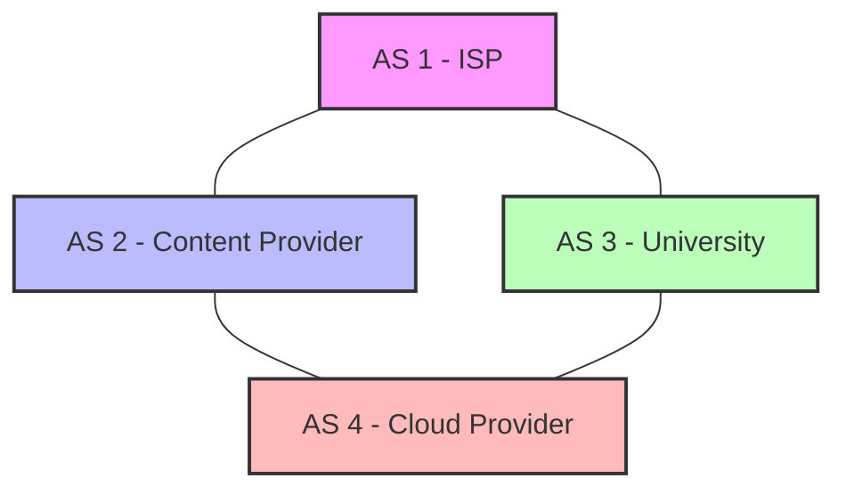
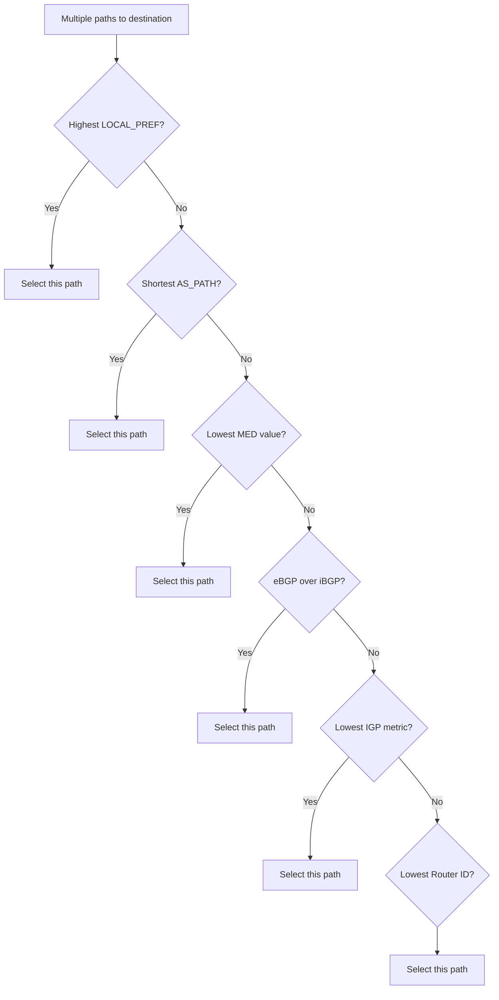
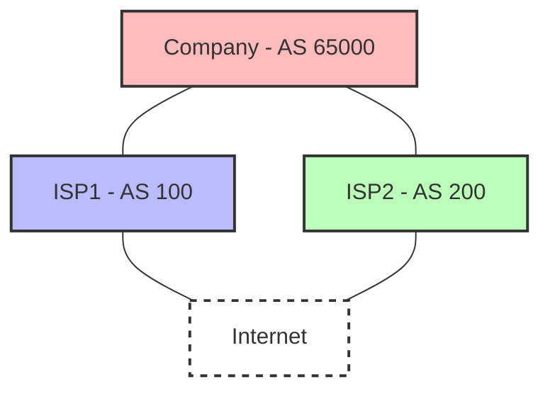

# BGP Protocol

## Introduction

The Border Gateway Protocol (BGP) is often referred to as the "protocol that makes the internet work." While this might sound like hyperbole, it's not far from the truth. BGP is the routing protocol that enables data to travel across the vast, interconnected networks that form the internet. Unlike interior gateway protocols that handle routing within a single organization's network, BGP is designed to exchange routing information between different autonomous systems (AS) — networks under separate administrative control.

When you send data across the internet, BGP is working behind the scenes to determine the optimal path for your packets to travel from your network to their destination, potentially crossing dozens of different networks along the way.

## Understanding Autonomous Systems

Before diving into BGP, we need to understand the concept of Autonomous Systems:

An **Autonomous System (AS)** is a collection of connected IP networks under the control of a single organization that presents a common routing policy to the internet. Each AS is assigned a unique Autonomous System Number (ASN).

Think of the internet as a collection of islands (autonomous systems) connected by bridges (BGP connections):



## BGP Basics

### Key Characteristics of BGP

1. **Path Vector Protocol**: BGP makes routing decisions based on paths, network policies, or rule-sets configured by network administrators.

2. **External vs. Internal BGP**:
   - **eBGP (External BGP)**: Used between different autonomous systems
   - **iBGP (Internal BGP)**: Used within a single autonomous system

3. **TCP-Based**: BGP operates over TCP port 179, ensuring reliable communication between BGP peers.

4. **Incremental Updates**: After initial exchange, only changes to routing information are sent.

5. **Policy-Based Routing**: Allows administrators to implement routing policies based on various attributes.

### BGP Message Types

BGP routers exchange information using four types of messages:

1. **OPEN**: Establishes a peering session between BGP routers
2. **UPDATE**: Advertises new routes or withdraws invalid routes
3. **KEEPALIVE**: Maintains the connection between BGP peers
4. **NOTIFICATION**: Sent when an error is detected, typically resulting in closing the BGP connection

## How BGP Works

### BGP Route Selection Process

When BGP receives multiple paths to the same destination, it uses the following process to select the best path:



### BGP Path Attributes

BGP uses various attributes to make routing decisions:

1. **NEXT_HOP**: IP address of the next router on the path
2. **AS_PATH**: List of AS numbers that the route traverses
3. **LOCAL_PREF**: Used within an AS to prefer one route over others
4. **MED (Multi-Exit Discriminator)**: Suggests to external ASes which path to use
5. **ORIGIN**: Indicates how the route was learned
6. **COMMUNITY**: Used for route filtering and policy application

## BGP Configuration Example

Let's look at a basic BGP configuration example using Cisco IOS:

```
! Configure router with ASN 65000
router bgp 65000

! Configure a BGP neighbor in AS 65001
neighbor 192.168.1.1 remote-as 65001

! Advertise networks
network 10.0.0.0 mask 255.255.255.0
network 10.0.1.0 mask 255.255.255.0

! Set local preference for routes from this neighbor
neighbor 192.168.1.1 route-map SET_LOCAL_PREF in

! Define the route map
route-map SET_LOCAL_PREF permit 10
 set local-preference 200
```

In this example:
- We configure a router in AS 65000
- We establish a BGP peering with a neighbor (192.168.1.1) in AS 65001
- We advertise two networks from our AS
- We apply a route map to increase the local preference for routes received from this neighbor

## BGP in Action: Real-World Examples

### Example 1: Internet Service Provider Connectivity

Internet Service Providers (ISPs) use BGP to connect with each other and exchange routes. This allows traffic from customers of one ISP to reach customers of another ISP.

Consider a simple scenario where a company connects to two ISPs for redundancy:



In this scenario, the company would use BGP to:
- Announce its IP prefixes to both ISPs
- Control inbound traffic by manipulating BGP attributes
- Implement failover if one ISP connection goes down

### Example 2: Content Delivery Networks

Content Delivery Networks (CDNs) use BGP to direct user requests to the nearest server:

```
# Example BGP configuration for CDN edge location
router bgp 13335  # Cloudflare's ASN
 bgp always-compare-med
 neighbor 192.0.2.1 remote-as 64500
 neighbor 192.0.2.1 prefix-list CUSTOMER_PREFIXES in
 neighbor 192.0.2.1 route-map PREPEND_PATH out

# Prepend AS path to make this route less preferred for certain prefixes
route-map PREPEND_PATH permit 10
 match ip address prefix-list DISTANT_USERS
 set as-path prepend 13335 13335
```

This configuration would make traffic from distant users prefer a different CDN edge location by making the AS path longer (and therefore less preferred).

## BGP Security Concerns

BGP was designed in an era when the internet was smaller and security was less of a concern. As a result, BGP has several security vulnerabilities:

1. **BGP Hijacking**: An AS can advertise IP prefixes it doesn't own, potentially redirecting traffic.

2. **Route Leaks**: Accidental advertisement of routes that shouldn't be shared, potentially causing traffic to take inefficient paths.

Solutions to these issues include:

- **Resource Public Key Infrastructure (RPKI)**: A cryptographic framework to verify route announcements
- **BGP Security (BGPSEC)**: Extensions to secure BGP update messages
- **Route Filtering**: Manually filtering invalid route announcements

Example RPKI validation code in a route-checking script:

```python
import rpki.routevalidator

validator = rpki.routevalidator.RouteValidator()
result = validator.validate(prefix='203.0.113.0/24', asn='64500')

if result.state == rpki.routevalidator.ValidationState.Valid:
    print("Route announcement is valid")
elif result.state == rpki.routevalidator.ValidationState.Invalid:
    print("Route announcement is invalid - potential hijack!")
else:
    print("Unable to validate route announcement")
```

## BGP Best Practices

For network engineers implementing BGP, here are some best practices:

1. **Use BGP Communities**: They provide a flexible way to control routing policies
   ```
   ! Tag routes with community values
   route-map SET_COMMUNITY permit 10
    set community 65000:100
   ```

2. **Filter BGP Advertisements**: Always filter what you announce and what you accept
   ```
   ! Only accept specific prefixes from peer
   ip prefix-list ALLOWED_PREFIXES permit 192.168.0.0/16 le 24
   neighbor 192.0.2.1 prefix-list ALLOWED_PREFIXES in
   ```

3. **Implement Route Dampening**: Reduces the impact of flapping routes
   ```
   ! Configure route dampening
   bgp dampening 15 750 2000 60
   ```

4. **Use Peer Groups**: Simplifies configuration for routers with similar policies
   ```
   ! Create a peer group
   neighbor TRANSIT peer-group
   neighbor TRANSIT remote-as 100
   neighbor TRANSIT route-map TRANSIT_IN in
   
   ! Apply to specific neighbors
   neighbor 192.0.2.1 peer-group TRANSIT
   neighbor 192.0.2.2 peer-group TRANSIT
   ```

## Summary

The Border Gateway Protocol is the backbone of internet routing. It enables autonomous systems to exchange routing information and make path selection decisions based on policies rather than just metrics like hop count. Key points to remember:

- BGP connects autonomous systems to form the global internet
- It's a path vector protocol that uses TCP for reliable communication
- BGP makes routing decisions based on policies and path attributes
- Security remains a concern, with solutions like RPKI being implemented
- Proper configuration of BGP is critical for network stability

While BGP may seem complex at first, understanding its fundamental concepts helps grasp how the global internet functions as a "network of networks."

## Further Learning

### Exercises

1. **Identify Autonomous Systems**:
   Use online tools like `whois` to identify the ASN of major websites and your own ISP.

2. **Analyze BGP Routes**:
   Visit looking glass servers (e.g., [Hurricane Electric's BGP Looking Glass](https://lg.he.net/)) to see real BGP routes.

3. **Simulate BGP Routing**:
   Use GNS3 or EVE-NG to create a virtual environment with multiple autonomous systems and practice BGP configuration.

### Additional Resources

- **Books**:
  - "Internet Routing Architectures" by Sam Halabi
  - "BGP Design and Implementation" by Randy Zhang and Micah Bartell

- **RFCs**:
  - RFC 4271: BGP-4 specification
  - RFC 7454: BGP Operations and Security

- **Online Courses**:
  - Cisco's BGP training
  - INE's BGP Deep Dive

Remember that mastering BGP takes practice and experience. Start with simple configurations and gradually work toward more complex scenarios to build your understanding of this critical protocol.