# Network Port Numbers

## Introduction

When data travels across a network, it needs to know not just which device to go to (that's what IP addresses are for), but also which specific application or service should receive the data on that device. This is where port numbers come in.

Port numbers are 16-bit numerical identifiers that designate specific services or processes running on a computer. Think of them as extension numbers in an office - the IP address gets you to the building, but the port number connects you to the specific desk or department you want to reach.

## Understanding Port Numbers

### What Are Port Numbers?

A port number is a 16-bit unsigned integer, ranging from 0 to 65535, that identifies a specific process to which an internet or other network message is to be forwarded when it arrives at a server.

Port numbers work with IP addresses to form a complete address for network communications:


In the diagram above, data travels from a source device using a temporary port (54321) to a destination device's web server listening on port 80.

### Port Number Format

When we refer to a complete socket address, we use the format:

`IP_ADDRESS:PORT_NUMBER`

For example:
- `192.168.1.1:80` refers to port 80 on the device with IP address 192.168.1.1
- `203.0.113.10:22` refers to port 22 on the device with IP address 203.0.113.10

## Port Number Categories

Port numbers are divided into three ranges:

### 1. Well-Known Ports (0-1023)

These ports are reserved for common, standard services and can typically only be used by system (or root) processes or programs executed by privileged users.

Some examples include:
- Port 20, 21: FTP (File Transfer Protocol)
- Port 22: SSH (Secure Shell)
- Port 25: SMTP (Simple Mail Transfer Protocol)
- Port 53: DNS (Domain Name System)
- Port 80: HTTP (Hypertext Transfer Protocol)
- Port 443: HTTPS (HTTP Secure)

### 2. Registered Ports (1024-49151)

These ports are registered by IANA (Internet Assigned Numbers Authority) for specific services but can be used by ordinary users for temporary purposes if needed.

Some examples include:
- Port 1521: Oracle database default listener
- Port 3306: MySQL database
- Port 8080: Alternative HTTP port, often used for web proxies and caching

### 3. Dynamic/Private Ports (49152-65535)

These ports are not registered with IANA and can be used by any application. They're typically used for client-side communications, where the specific port number doesn't matter as long as it's not already in use.

## Transport Protocols and Ports

Port numbers are used with two main transport protocols:

### TCP (Transmission Control Protocol)

- Connection-oriented protocol
- Guarantees delivery of data
- Ensures data arrives in the correct order
- Used for applications where reliability is crucial (web browsing, email, file transfers)

### UDP (User Datagram Protocol)

- Connectionless protocol
- No guarantee of delivery
- Faster but less reliable than TCP
- Used for applications where speed is more important than reliability (video streaming, online gaming, DNS lookups)

Each protocol has its own set of ports, so technically port 80 TCP and port 80 UDP are different ports, though conventionally the same port numbers are often used for both protocols when they provide related services.

## Practical Examples

### Example 1: Web Browsing

When you type a URL into your browser:

1. Your browser establishes a TCP connection to the server's IP address on port 80 (for HTTP) or port 443 (for HTTPS)
2. Your computer uses a random high-numbered port (e.g., 54321) as its source port
3. The web server receives the request and sends the website data back from its port 80/443 to your computer's port 54321

```mermaid
sequenceDiagram
    participant Browser as Your Browser
    participant WebServer as Web Server
    Browser->>WebServer: TCP Connection Request (Browser:54321 → Server:80)
    WebServer->>Browser: TCP Connection Accepted
    Browser->>WebServer: HTTP Request (GET /index.html)
    WebServer->>Browser: HTTP Response (Website Content)
```



### Example 2: Checking Open Ports

You can check which ports are open on your system using various tools:

On Linux/macOS, you can use the `netstat` command:

```bash
# Show all listening ports
netstat -tuln

# Sample output:
# Proto  Local Address          Foreign Address        State
# tcp    0.0.0.0:22             0.0.0.0:*              LISTEN
# tcp    0.0.0.0:80             0.0.0.0:*              LISTEN
# tcp    127.0.0.1:3306         0.0.0.0:*              LISTEN
```

On Windows, you can use:

```powershell
# Show all listening ports
netstat -an | find "LISTENING"

# Sample output:
# TCP    0.0.0.0:80             0.0.0.0:0              LISTENING
# TCP    0.0.0.0:135            0.0.0.0:0              LISTENING
# TCP    127.0.0.1:3306         0.0.0.0:0              LISTENING
```

### Example 3: Basic Socket Programming

Here's a simple example of a Python server listening on port 8080:

```python
import socket

# Create a socket object
server_socket = socket.socket(socket.AF_INET, socket.SOCK_STREAM)

# Define the server address and port
host = 'localhost'  # or '127.0.0.1'
port = 8080

# Bind the socket to the address and port
server_socket.bind((host, port))

# Listen for incoming connections (max 5 queued connections)
server_socket.listen(5)
print(f"Server listening on {host}:{port}")

# Accept a connection
client_socket, client_address = server_socket.accept()
print(f"Connection from {client_address}")

# Receive data from the client
data = client_socket.recv(1024)
print(f"Received: {data.decode()}")

# Send a response
client_socket.send("Hello from server!".encode())

# Close the connections
client_socket.close()
server_socket.close()
```

And a client connecting to that server:

```python
import socket

# Create a socket object
client_socket = socket.socket(socket.AF_INET, socket.SOCK_STREAM)

# Define the server address and port
host = 'localhost'  # or '127.0.0.1'
port = 8080

# Connect to the server
client_socket.connect((host, port))
print(f"Connected to {host}:{port}")

# Send data to the server
client_socket.send("Hello from client!".encode())

# Receive the response
response = client_socket.recv(1024)
print(f"Received: {response.decode()}")

# Close the connection
client_socket.close()
```

When you run the server script and then the client script, they communicate through the specified port.

## Common Port Numbers and Services

Here's a quick reference of commonly used ports:

| Port Number | Protocol | Service |
|-------------|----------|---------|
| 20, 21 | TCP | FTP (File Transfer Protocol) |
| 22 | TCP | SSH (Secure Shell) |
| 23 | TCP | Telnet |
| 25 | TCP | SMTP (Simple Mail Transfer Protocol) |
| 53 | TCP/UDP | DNS (Domain Name System) |
| 67, 68 | UDP | DHCP (Dynamic Host Configuration Protocol) |
| 80 | TCP | HTTP (Hypertext Transfer Protocol) |
| 110 | TCP | POP3 (Post Office Protocol version 3) |
| 143 | TCP | IMAP (Internet Message Access Protocol) |
| 443 | TCP | HTTPS (HTTP Secure) |
| 1521 | TCP | Oracle database |
| 3306 | TCP | MySQL database |
| 3389 | TCP | RDP (Remote Desktop Protocol) |
| 8080 | TCP | Alternative HTTP port, often for proxies |

## Port Security Considerations

Understanding port numbers is crucial for network security:

1. **Unnecessary open ports** create potential entry points for attackers
2. **Port scanning** is a technique used to discover which ports are open on a network
3. **Firewalls** control traffic based on port numbers and protocols
4. **Non-standard ports** are sometimes used to bypass security measures or hide services

Best practices include:
- Closing all unused ports
- Using firewalls to restrict access to necessary ports only
- Regularly scanning your network for unexpected open ports
- Being aware of services running on non-standard ports

## Summary

Port numbers are essential components of network communication that:
- Allow multiple services to run on a single device
- Range from 0 to 65535
- Are divided into well-known, registered, and dynamic ranges
- Work alongside IP addresses to form complete network endpoints
- Function with transport protocols (primarily TCP and UDP)

Understanding port numbers is critical for network administration, security, application development, and troubleshooting network issues.

## Practice Exercises

1. Use the `netstat` command on your computer to identify which ports are currently in use.
2. Write a simple client-server application (in a language of your choice) that communicates on port 9000.
3. Research which ports should typically be blocked by a firewall for optimal security.
4. Create a network diagram showing how port numbers are used when you connect to three different services (e.g., web, email, and file transfer).

## Additional Resources

- [IANA Service Name and Transport Protocol Port Number Registry](https://www.iana.org/assignments/service-names-port-numbers/service-names-port-numbers.xhtml)
- RFC 6335: Internet Assigned Numbers Authority (IANA) Procedures for the Management of the Service Name and Transport Protocol Port Number Registry
- Books: "Computer Networking: A Top-Down Approach" by Kurose and Ross