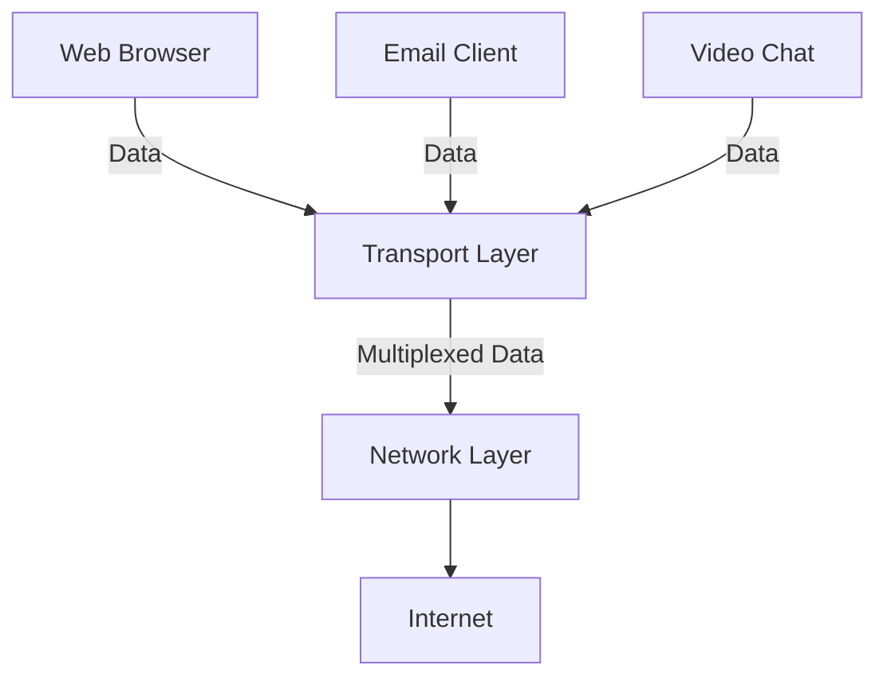
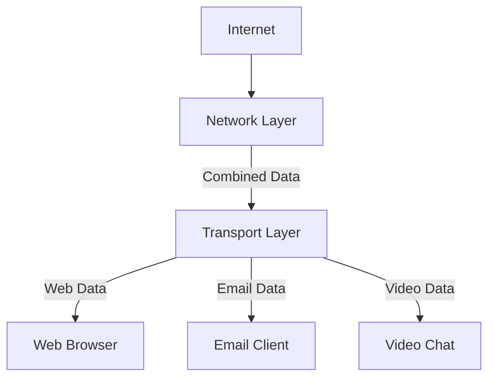

# Networks Multiplexing and Demultiplexing

## Introduction

Imagine you're in an apartment building where all residents receive mail through a single mailbox. How does each letter find its way to the correct apartment? This is similar to the challenge computer networks face. A single device may run multiple applications (like web browsers, email clients, and video conferencing tools) that all need to send and receive data over the network simultaneously.

**Multiplexing** and **demultiplexing** are the transport layer processes that solve this challenge. These mechanisms ensure data from different applications gets bundled for efficient transmission and then correctly delivered to the right application on the receiving end.

## Understanding Multiplexing

Multiplexing is the process of combining multiple data streams from different application processes into a single stream for transmission over the network. Think of it as bundling multiple letters into one package for delivery.

### How Multiplexing Works

1. Multiple application processes on a host want to send data
2. Each process passes its data to the transport layer
3. The transport layer attaches header information (including source and destination port numbers)
4. The transport layer combines these segments into a single stream
5. This combined data is passed to the network layer for routing



## Understanding Demultiplexing

Demultiplexing is the reverse process — breaking down the combined data stream and delivering each piece to the correct application process on the receiving host.

### How Demultiplexing Works

1. Transport layer receives data from the network layer
2. It examines the header information (particularly port numbers)
3. It directs each segment to the appropriate application socket
4. The application receives the data meant specifically for it



## Socket Addressing with Ports

For multiplexing and demultiplexing to work, we need a way to identify which application process should receive which data. This is accomplished through **ports** and **sockets**.

### Ports

A port is a 16-bit number that identifies a specific application process. Well-known applications use standard port numbers:
- HTTP (Web): Port 80
- HTTPS (Secure Web): Port 443
- FTP (File Transfer): Port 21
- SMTP (Email): Port 25
- DNS (Domain Name Service): Port 53

### Sockets

A socket is the combination of an IP address and a port number. It uniquely identifies an application process on a specific host.

Socket = (IP address, Port number)

For example:
- `192.168.1.5:80` identifies the web server application on the host with IP 192.168.1.5
- `10.0.0.2:3000` identifies a custom application running on port 3000 on host 10.0.0.2

## Practical Example: HTTP Request Handling

Let's look at how multiplexing and demultiplexing work in a real-world scenario where your computer is running multiple browser tabs.

### Scenario

- You have three browser tabs open to different websites: Google, YouTube, and GitHub
- Each tab is making HTTP requests to different web servers
- All these requests go through your single network connection

### Multiplexing Process

```javascript
// Conceptual code for how a browser might handle multiple HTTP requests

// Three different application processes (browser tabs)
const googleRequest = {
  data: "GET / HTTP/1.1\r
Host: www.google.com\r
\r
",
  sourcePort: 49152,
  destPort: 80,
  destIP: "142.250.190.78" // Google's IP
};

const youtubeRequest = {
  data: "GET / HTTP/1.1\r
Host: www.youtube.com\r
\r
",
  sourcePort: 49153,
  destPort: 80,
  destIP: "208.65.153.238" // YouTube's IP
};

const githubRequest = {
  data: "GET / HTTP/1.1\r
Host: www.github.com\r
\r
",
  sourcePort: 49154,
  destPort: 80,
  destIP: "140.82.121.3" // GitHub's IP
};

// Transport layer multiplexes these requests
function multiplexRequests(requests) {
  const multiplexedData = [];
  
  for (const request of requests) {
    // Create TCP segment with header containing port information
    const segment = {
      header: {
        sourcePort: request.sourcePort,
        destPort: request.destPort
      },
      payload: request.data
    };
    
    multiplexedData.push(segment);
  }
  
  // Pass to network layer (IP)
  return multiplexedData;
}

// These multiplexed requests all travel through your single Internet connection
const outgoingData = multiplexRequests([googleRequest, youtubeRequest, githubRequest]);
```

### Demultiplexing Process

When responses come back from the web servers:

```javascript
// Incoming data from network layer
function demultiplexResponses(segments) {
  // Map to store which socket (port) gets which response
  const responsesByPort = {};
  
  for (const segment of segments) {
    // Extract destination port from TCP header
    const destPort = segment.header.destPort;
    
    // Add response to the appropriate socket's queue
    if (!responsesByPort[destPort]) {
      responsesByPort[destPort] = [];
    }
    responsesByPort[destPort].push(segment.payload);
  }
  
  // Each application process can now retrieve its data
  return responsesByPort;
}

// Example incoming data with TCP headers
const incomingSegments = [
  {
    header: { sourcePort: 80, destPort: 49152 },
    payload: "HTTP/1.1 200 OK\r
..." // Google's response
  },
  {
    header: { sourcePort: 80, destPort: 49153 },
    payload: "HTTP/1.1 200 OK\r
..." // YouTube's response
  },
  {
    header: { sourcePort: 80, destPort: 49154 },
    payload: "HTTP/1.1 200 OK\r
..." // GitHub's response
  }
];

const demultiplexedResponses = demultiplexResponses(incomingSegments);

// Now each tab receives its own response
console.log(demultiplexedResponses[49152]); // Google response
console.log(demultiplexedResponses[49153]); // YouTube response
console.log(demultiplexedResponses[49154]); // GitHub response
```

## Connection-Oriented vs. Connectionless Demultiplexing

The transport layer protocols handle demultiplexing differently based on whether they're connection-oriented (TCP) or connectionless (UDP).

### UDP: Connectionless Demultiplexing

In UDP, demultiplexing is simpler. It only uses:
- Destination IP address
- Destination port number

This means multiple applications from different source hosts can send data to the same destination socket.

### TCP: Connection-Oriented Demultiplexing

TCP demultiplexing is more specific. It uses four values:
- Source IP address
- Source port number
- Destination IP address
- Destination port number

This means TCP can maintain multiple simultaneous connections to the same server port (like many browsers connecting to a web server on port 80).

## Implementing a Simple Multiplexer in Python

Here's a conceptual implementation of a simple multiplexer/demultiplexer:

```python
class TransportLayer:
    def __init__(self):
        self.sockets = {}  # Maps ports to application processes
    
    def create_socket(self, port, application):
        """Register an application to receive data on a specific port"""
        self.sockets[port] = application
    
    def multiplex(self, outgoing_data):
        """Combine data from multiple applications for transmission"""
        multiplexed_segments = []
        
        for app_port, app_data in outgoing_data.items():
            # Create segments with port information in header
            for data_chunk in app_data:
                segment = {
                    'header': {
                        'source_port': app_port,
                        'dest_port': data_chunk['dest_port'],
                        'length': len(data_chunk['data']),
                        'checksum': self._calculate_checksum(data_chunk['data'])
                    },
                    'payload': data_chunk['data']
                }
                multiplexed_segments.append(segment)
        
        return multiplexed_segments
    
    def demultiplex(self, incoming_segments):
        """Distribute incoming data to the correct applications"""
        for segment in incoming_segments:
            dest_port = segment['header']['dest_port']
            
            # Check if we have an application registered for this port
            if dest_port in self.sockets:
                application = self.sockets[dest_port]
                # Deliver the payload to the application
                application.receive_data(segment['payload'])
            else:
                print(f"No application registered for port {dest_port}")
    
    def _calculate_checksum(self, data):
        """Calculate a simple checksum for error detection"""
        return sum(bytearray(data, 'utf-8')) % 256


# Example usage
transport = TransportLayer()

class WebBrowser:
    def receive_data(self, data):
        print(f"Browser received: {data[:20]}...")

class EmailClient:
    def receive_data(self, data):
        print(f"Email client received: {data[:20]}...")

# Register applications
transport.create_socket(8080, WebBrowser())
transport.create_socket(25, EmailClient())

# Send outgoing data
outgoing_data = {
    8080: [
        {'dest_port': 80, 'data': 'GET / HTTP/1.1\r
Host: example.com\r
\r
'}
    ],
    25: [
        {'dest_port': 25, 'data': 'HELO client.example.com\r
'}
    ]
}

# Multiplex the data
multiplexed = transport.multiplex(outgoing_data)
print(f"Multiplexed {len(multiplexed)} segments")

# Simulate receiving response data
incoming_segments = [
    {
        'header': {'source_port': 80, 'dest_port': 8080, 'length': 25, 'checksum': 0},
        'payload': 'HTTP/1.1 200 OK\r
Content-Length: 12345\r
\r
'
    },
    {
        'header': {'source_port': 25, 'dest_port': 25, 'length': 15, 'checksum': 0},
        'payload': '250 Hello client.example.com\r
'
    }
]

# Demultiplex and deliver to applications
transport.demultiplex(incoming_segments)
```

## Common Challenges and Solutions

### Port Conflicts

**Challenge**: Multiple applications trying to use the same port.

**Solution**: 
- Well-known ports (0-1023) are reserved for standard services
- Registered ports (1024-49151) can be registered with IANA
- Dynamic/private ports (49152-65535) are used for temporary connections

### Network Address Translation (NAT)

**Challenge**: Multiple devices sharing a single public IP address.

**Solution**: NAT devices (like home routers) maintain a translation table mapping private IP:port combinations to connections on the public IP.

## Summary

Multiplexing and demultiplexing are essential transport layer functions that allow multiple applications to share network resources efficiently:

- **Multiplexing** combines data from multiple applications for efficient transmission
- **Demultiplexing** delivers incoming data to the correct application
- **Ports** identify specific applications (processes) on a host
- **Sockets** (IP:Port pairs) uniquely identify application endpoints
- **TCP and UDP** handle demultiplexing differently based on their connection models

These concepts are fundamental to understanding how the transport layer enables multiple network applications to coexist and communicate effectively.

## Exercises

1. **Basic Understanding**: Explain how a computer can run multiple networked applications simultaneously without data confusion.

2. **Port Analysis**: Write a simple script that lists all active network connections on your computer and their associated ports. (Hint: On Windows, use `netstat -an`. On Linux/macOS, use `netstat -tuln`.)

3. **Implementation Challenge**: Enhance the Python multiplexer example to include error handling for corrupted segments (using the checksum).

4. **Research Assignment**: Investigate how WebSockets handle multiplexing in the context of web applications.

## Additional Resources

- [RFC 793](https://tools.ietf.org/html/rfc793) - Original TCP specification
- [RFC 768](https://tools.ietf.org/html/rfc768) - Original UDP specification
- [IANA Port Number Registry](https://www.iana.org/assignments/service-names-port-numbers/service-names-port-numbers.xhtml) - Official list of well-known and registered ports
- [Computer Networking: A Top-Down Approach](https://gaia.cs.umass.edu/kurose_ross/index.html) - Excellent textbook covering transport layer topics in depth