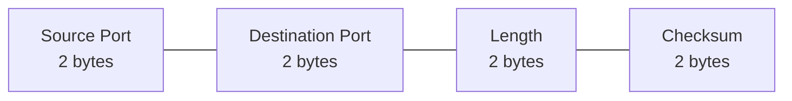

# User Datagram Protocol (UDP)

## Introduction

The User Datagram Protocol (UDP) is one of the core protocols within the Internet Protocol Suite used for the Transport Layer of network communications. Unlike its counterpart TCP (Transmission Control Protocol), UDP provides a simpler, connectionless communication model with minimal overhead. This simplicity comes with tradeoffs that make UDP particularly suitable for specific types of applications.

In this guide, we'll explore how UDP works, its key characteristics, when to use it, and how to implement UDP-based applications through practical code examples.

## What is UDP?

UDP (User Datagram Protocol) is a lightweight transport layer protocol that allows applications to send messages, called datagrams, to other hosts on an IP network without requiring prior communications to set up special transmission channels or data paths.

### Key Characteristics of UDP

- **Connectionless**: No connection establishment before communication
- **Unreliable**: No guarantee of packet delivery
- **No ordering of messages**: Packets may arrive in any order
- **No congestion control**: UDP doesn't slow down when the network is congested
- **Low overhead**: Minimal protocol mechanism (small header size)
- **Stateless**: No tracking of connections

## UDP Header Structure

The UDP header is remarkably simple, consisting of just 8 bytes:



- **Source Port**: Port number of the sending application (optional, can be zero)
- **Destination Port**: Port number of the destination application
- **Length**: Length of the UDP header and data in bytes
- **Checksum**: Used for error-checking of the header and data

## When to Use UDP

UDP is ideal for applications where:

1. **Speed is critical**: When reducing latency is more important than reliability
2. **Real-time applications**: Where dropping packets is preferable to waiting for retransmissions
3. **Simple request-response patterns**: Where application-level acknowledgments are sufficient
4. **Broadcast/Multicast**: When sending to multiple recipients simultaneously

### Common UDP Applications

- DNS (Domain Name System)
- Video streaming
- VoIP (Voice over IP)
- Online gaming
- IoT (Internet of Things) communications
- SNMP (Simple Network Management Protocol)

## TCP vs. UDP Comparison

| Feature | UDP | TCP |
|---------|-----|-----|
| Connection | Connectionless | Connection-oriented |
| Reliability | Unreliable | Reliable |
| Ordering | No order guarantee | Maintains order |
| Speed | Faster | Slower |
| Header Size | 8 bytes | 20 bytes (minimum) |
| Flow Control | No | Yes |
| Applications | Streaming, games, DNS | Web, email, file transfer |

## UDP Socket Programming

Let's explore how to implement UDP clients and servers using Python socket programming.

### Basic UDP Server

```python
import socket

def start_udp_server():
    # Create a UDP socket
    server_socket = socket.socket(socket.AF_INET, socket.SOCK_DGRAM)
    
    # Bind the socket to a specific address and port
    server_address = ('localhost', 10000)
    server_socket.bind(server_address)
    
    print(f"UDP Server up and listening on {server_address}")
    
    while True:
        # Wait to receive data
        data, client_address = server_socket.recvfrom(4096)
        
        print(f"Received {len(data)} bytes from {client_address}")
        print(f"Data: {data.decode()}")
        
        # Send a response back to the client
        response = f"Received your message: {data.decode()}"
        server_socket.sendto(response.encode(), client_address)

if __name__ == "__main__":
    start_udp_server()
```

### Basic UDP Client

```python
import socket

def udp_client():
    # Create a UDP socket
    client_socket = socket.socket(socket.AF_INET, socket.SOCK_DGRAM)
    
    # Server address and port
    server_address = ('localhost', 10000)
    
    try:
        # Send data
        message = "Hello, UDP Server!"
        print(f"Sending: {message}")
        client_socket.sendto(message.encode(), server_address)
        
        # Receive response
        data, server = client_socket.recvfrom(4096)
        print(f"Received: {data.decode()}")
        
    finally:
        print("Closing socket")
        client_socket.close()

if __name__ == "__main__":
    udp_client()
```

#### Example Output

When running the server and then the client, you'll see:

Server output:
```
UDP Server up and listening on ('localhost', 10000)
Received 18 bytes from ('127.0.0.1', 54321)
Data: Hello, UDP Server!
```

Client output:
```
Sending: Hello, UDP Server!
Received: Received your message: Hello, UDP Server!
Closing socket
```

## Practical Example: Simple UDP Chat

Let's build a more practical example - a simple chat application using UDP:

### UDP Chat Server

```python
import socket
import threading

def listen_for_messages(sock):
    clients = {}  # Dictionary to store client addresses
    
    while True:
        try:
            # Receive message and client address
            data, address = sock.recvfrom(1024)
            message = data.decode('utf-8')
            
            # If this is a new client, add to our dictionary
            if address not in clients:
                clients[address] = f"User-{len(clients) + 1}"
                print(f"New connection from {address}, assigned name: {clients[address]}")
            
            print(f"Message from {clients[address]}: {message}")
            
            # Broadcast message to all other clients
            for client_address in clients:
                if client_address != address:  # Don't send back to sender
                    # Format: "Username: Message"
                    formatted_message = f"{clients[address]}: {message}"
                    sock.sendto(formatted_message.encode('utf-8'), client_address)
                    
        except Exception as e:
            print(f"Error: {e}")

def start_chat_server():
    # Create a UDP socket
    server_socket = socket.socket(socket.AF_INET, socket.SOCK_DGRAM)
    
    # Bind the socket to an address and port
    server_socket.bind(('0.0.0.0', 12345))
    print("UDP Chat Server running on port 12345")
    
    # Start listening for messages
    listen_for_messages(server_socket)

if __name__ == "__main__":
    start_chat_server()
```

### UDP Chat Client

```python
import socket
import threading
import sys

def receive_messages(sock):
    while True:
        try:
            # Receive message from server
            data, _ = sock.recvfrom(1024)
            print(data.decode('utf-8'))
        except:
            break

def start_chat_client():
    # Create UDP socket
    client_socket = socket.socket(socket.AF_INET, socket.SOCK_DGRAM)
    
    # Server address
    server_address = ('localhost', 12345)
    
    # Start thread to listen for incoming messages
    receive_thread = threading.Thread(target=receive_messages, args=(client_socket,))
    receive_thread.daemon = True
    receive_thread.start()
    
    print("UDP Chat Client started. Type messages and press Enter to send.")
    print("Type 'exit' to quit.")
    
    try:
        while True:
            message = input()
            
            if message.lower() == 'exit':
                break
                
            # Send message to server
            client_socket.sendto(message.encode('utf-8'), server_address)
    finally:
        client_socket.close()

if __name__ == "__main__":
    start_chat_client()
```

This simple chat application demonstrates a few key UDP characteristics:

1. **Connectionless communication**: Clients just send messages without maintaining a connection
2. **No built-in reliability**: If a message gets lost, the chat application won't resend it
3. **Lightweight**: The server can handle many clients with minimal resources
4. **Stateless**: The server must maintain client information itself

## UDP Limitations and Solutions

While UDP's simplicity is its strength, its limitations can be challenging:

### Packet Loss

Since UDP doesn't guarantee delivery, applications must handle potential packet loss.

**Solutions:**
- Implement application-level acknowledgments
- Use sequence numbers to detect missing packets
- Implement your own retransmission logic

### Example: Simple Reliability Layer

```python
import socket
import time
import random

def reliable_send(sock, message, address, max_retries=5):
    """Send a message with reliability on top of UDP."""
    message_id = random.randint(1, 10000)
    full_message = f"{message_id}:{message}"
    
    for attempt in range(max_retries):
        # Send the message
        sock.sendto(full_message.encode(), address)
        
        # Wait for acknowledgment with timeout
        sock.settimeout(1.0)  # 1 second timeout
        try:
            response, addr = sock.recvfrom(1024)
            if response.decode().startswith(f"ACK:{message_id}"):
                print(f"Message delivered successfully on attempt {attempt+1}")
                return True
        except socket.timeout:
            print(f"Attempt {attempt+1} timed out, retrying...")
    
    print("Failed to deliver message after maximum retries")
    return False
```

### Out-of-Order Packets

UDP doesn't guarantee that packets arrive in the same order they were sent.

**Solutions:**
- Add sequence numbers to messages
- Buffer and reorder messages at the receiving end

### Example: Message Sequencing and Reordering

```python
class UdpMessageBuffer:
    def __init__(self, buffer_size=10):
        self.buffer = {}
        self.next_expected = 0
        self.buffer_size = buffer_size
        
    def add_message(self, seq_num, message):
        """Add a message to the buffer."""
        self.buffer[seq_num] = message
        
    def get_ordered_messages(self):
        """Get messages in order up to the first gap."""
        messages = []
        
        # Process sequential messages
        while self.next_expected in self.buffer:
            messages.append(self.buffer[self.next_expected])
            del self.buffer[self.next_expected]
            self.next_expected += 1
            
        # Remove old messages to prevent buffer overflow
        if len(self.buffer) > self.buffer_size:
            keys = sorted(self.buffer.keys())
            for old_key in keys[:len(keys) - self.buffer_size]:
                del self.buffer[old_key]
                
        return messages
```

## Monitoring and Debugging UDP

When working with UDP applications, these tools can help:

1. **Wireshark** - Packet analyzer for network troubleshooting
2. **tcpdump** - Command-line packet analyzer
3. **netstat** - Network statistics tool

### Basic tcpdump command for UDP traffic:

```bash
sudo tcpdump -i any udp port 12345
```

## UDP Security Considerations

UDP-based applications face several security challenges:

1. **IP Spoofing** - Easy to forge the source IP address
2. **No built-in encryption** - Data is sent in plaintext by default
3. **UDP Amplification Attacks** - Used in DDoS attacks

### Best Practices:

- Implement application-level authentication
- Use DTLS (Datagram Transport Layer Security) for encryption
- Validate input to prevent buffer overflow attacks
- Implement rate limiting to prevent DoS attacks

## Summary

UDP is a lightweight, connectionless transport protocol that prioritizes speed and simplicity over reliability. It's ideal for applications where low latency is critical, such as real-time communications, gaming, and streaming.

Key points to remember:
- UDP is connectionless and stateless
- It offers no guarantees of delivery, ordering, or congestion control
- The simplicity of UDP makes it faster than TCP but requires application-level handling of reliability if needed
- UDP is perfect for applications that can tolerate some packet loss but require minimal latency

By understanding UDP's strengths and limitations, developers can make informed decisions about when and how to use this protocol in their networked applications.

## Exercises

1. Modify the UDP chat client and server to handle usernames.
2. Implement a simple file transfer protocol using UDP with reliability mechanisms.
3. Create a UDP-based ping tool that measures round-trip time.
4. Implement a UDP broadcast application that discovers services on the local network.
5. Build a simple VoIP simulation using UDP to transmit audio packets.

## Additional Resources

- [RFC 768](https://tools.ietf.org/html/rfc768) - The official UDP specification
- [Python Socket Programming Documentation](https://docs.python.org/3/library/socket.html)
- Books:
  - "Computer Networking: A Top-Down Approach" by Kurose and Ross
  - "TCP/IP Illustrated, Volume 1" by Richard Stevens
- Online Courses:
  - Stanford's "Introduction to Computer Networking"
  - Coursera's "Computer Networks" by Princeton University