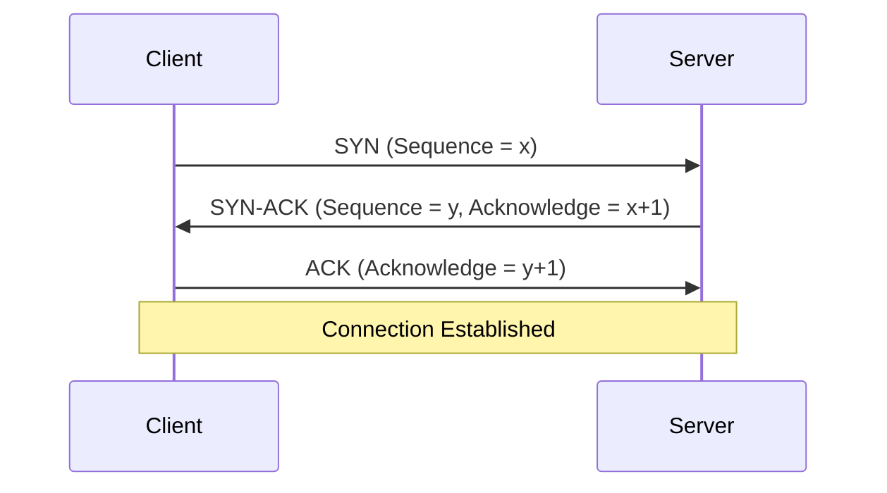
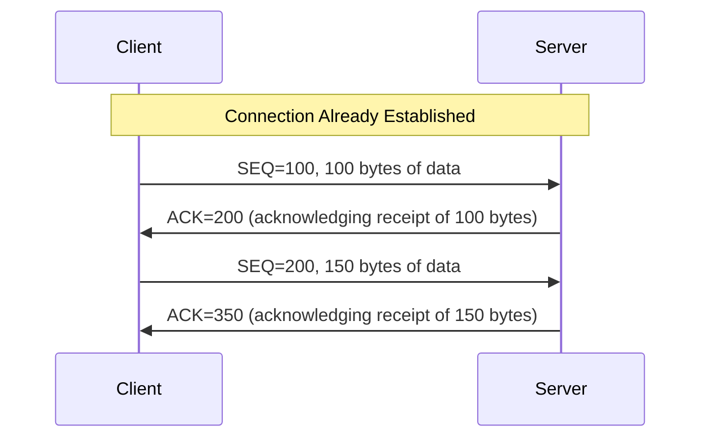
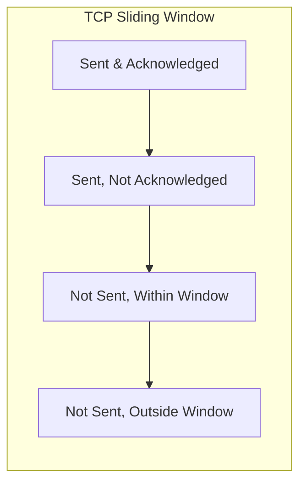
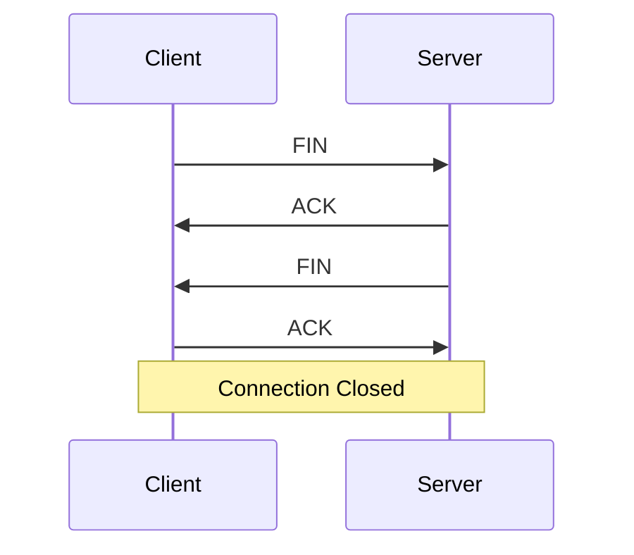

# Networks TCP Protocol

## Introduction

The Transmission Control Protocol (TCP) is one of the core protocols of the Internet Protocol (IP) suite and operates at the transport layer. It provides reliable, ordered, and error-checked delivery of data between applications running on hosts communicating over an IP network. If you've ever browsed a website, sent an email, or transferred a file, you've used TCP.

Think of TCP as the postal service of the internet. When you send a package, the postal service ensures it arrives at the correct address, in good condition, and will attempt redelivery if something goes wrong. Similarly, TCP ensures your data packets reach their destination correctly and in order.

## Key Features of TCP

TCP offers several important features that make it ideal for applications requiring reliable data transfer:

- **Connection-oriented**: Establishes a connection before data exchange begins
- **Reliable delivery**: Guarantees that data arrives without corruption
- **In-order delivery**: Ensures data is delivered in the same order it was sent
- **Flow control**: Prevents overwhelming receivers with too much data
- **Congestion control**: Adapts to network conditions to prevent congestion
- **Full-duplex communication**: Allows simultaneous data transfer in both directions

## TCP Header Structure

The TCP header contains crucial information for managing connections and data transfer:

```
    0                   1                   2                   3
    0 1 2 3 4 5 6 7 8 9 0 1 2 3 4 5 6 7 8 9 0 1 2 3 4 5 6 7 8 9 0 1
   +-+-+-+-+-+-+-+-+-+-+-+-+-+-+-+-+-+-+-+-+-+-+-+-+-+-+-+-+-+-+-+-+
   |          Source Port          |       Destination Port        |
   +-+-+-+-+-+-+-+-+-+-+-+-+-+-+-+-+-+-+-+-+-+-+-+-+-+-+-+-+-+-+-+-+
   |                        Sequence Number                        |
   +-+-+-+-+-+-+-+-+-+-+-+-+-+-+-+-+-+-+-+-+-+-+-+-+-+-+-+-+-+-+-+-+
   |                    Acknowledgment Number                      |
   +-+-+-+-+-+-+-+-+-+-+-+-+-+-+-+-+-+-+-+-+-+-+-+-+-+-+-+-+-+-+-+-+
   |  Data |           |U|A|P|R|S|F|                               |
   | Offset| Reserved  |R|C|S|S|Y|I|            Window             |
   |       |           |G|K|H|T|N|N|                               |
   +-+-+-+-+-+-+-+-+-+-+-+-+-+-+-+-+-+-+-+-+-+-+-+-+-+-+-+-+-+-+-+-+
   |           Checksum            |         Urgent Pointer        |
   +-+-+-+-+-+-+-+-+-+-+-+-+-+-+-+-+-+-+-+-+-+-+-+-+-+-+-+-+-+-+-+-+
   |                    Options                    |    Padding    |
   +-+-+-+-+-+-+-+-+-+-+-+-+-+-+-+-+-+-+-+-+-+-+-+-+-+-+-+-+-+-+-+-+
   |                             data                              |
   +-+-+-+-+-+-+-+-+-+-+-+-+-+-+-+-+-+-+-+-+-+-+-+-+-+-+-+-+-+-+-+-+
```

Key header fields include:

- **Source and Destination Ports**: Identify sending and receiving applications
- **Sequence Number**: Orders and tracks data bytes in a stream
- **Acknowledgment Number**: Indicates next expected byte from the other side
- **Flags**: Control bits that manage connection state (SYN, ACK, FIN, etc.)
- **Window Size**: Controls flow of data between sender and receiver
- **Checksum**: Verifies data integrity

## The Three-Way Handshake

Before transferring data, TCP establishes a connection using a three-way handshake:



Step-by-step explanation:

1. **SYN (Synchronize)**: Client sends a segment with the SYN flag set and an initial sequence number x
2. **SYN-ACK**: Server responds with SYN-ACK flags set, its own sequence number y, and acknowledgment x+1
3. **ACK (Acknowledge)**: Client sends an ACK with acknowledgment y+1
4. Connection is established and data transfer can begin

## Data Transfer Process

Once connected, TCP manages data transfer through:

1. **Segmentation**: Breaking large data into smaller segments
2. **Sequence Numbers**: Tracking each segment's position in the overall data stream
3. **Acknowledgments**: Confirming receipt of segments
4. **Retransmissions**: Resending lost or corrupted segments

### Example: Simple Data Transfer



## Flow Control

TCP uses a sliding window mechanism to control the flow of data:

- The receiver advertises a "window size" indicating how much data it can accept
- The sender limits data transmission to stay within this window
- As the receiver processes data, it updates the window size



## Congestion Control

TCP adapts to network conditions through several mechanisms:

- **Slow Start**: Begins with a small window and doubles it until congestion is detected
- **Congestion Avoidance**: Increases window size linearly to avoid congestion
- **Fast Retransmit/Fast Recovery**: Quickly recovers from packet loss

## Connection Termination

TCP uses a four-way handshake to close connections gracefully:



Each side must independently close its end of the connection.

## Socket Programming with TCP

Let's see how to implement a simple TCP client-server application in Python:

### TCP Server Example

```python
import socket

# Create a TCP socket
server_socket = socket.socket(socket.AF_INET, socket.SOCK_STREAM)

# Bind the socket to a specific address and port
server_socket.bind(('localhost', 8080))

# Listen for incoming connections (queue up to 5 requests)
server_socket.listen(5)
print("Server listening on port 8080...")

while True:
    # Accept a connection
    client_socket, client_address = server_socket.accept()
    print(f"Connection from {client_address}")
    
    # Receive data from the client
    data = client_socket.recv(1024)
    if data:
        print(f"Received: {data.decode('utf-8')}")
        
        # Send a response
        response = "Hello from the server!"
        client_socket.send(response.encode('utf-8'))
    
    # Close the connection
    client_socket.close()
```

### TCP Client Example

```python
import socket

# Create a TCP socket
client_socket = socket.socket(socket.AF_INET, socket.SOCK_STREAM)

# Connect to the server
client_socket.connect(('localhost', 8080))
print("Connected to server")

# Send data to the server
message = "Hello from the client!"
client_socket.send(message.encode('utf-8'))

# Receive the server's response
response = client_socket.recv(1024)
print(f"Received: {response.decode('utf-8')}")

# Close the connection
client_socket.close()
```

**Output:**
```
# Server output
Server listening on port 8080...
Connection from ('127.0.0.1', 52431)
Received: Hello from the client!

# Client output
Connected to server
Received: Hello from the server!
```

## Real-World Applications of TCP

TCP is used in numerous applications where reliable data transfer is critical:

1. **Web Browsing (HTTP/HTTPS)**: Ensures web pages load completely and correctly
2. **Email (SMTP, POP3, IMAP)**: Guarantees your messages are delivered without errors
3. **File Transfer (FTP, SFTP)**: Ensures files are transferred without corruption
4. **Remote Access (SSH, Telnet)**: Provides reliable terminal connections
5. **Database Access**: Ensures transaction integrity for applications communicating with databases

### Case Study: Web Browsing with TCP

When you visit a website, here's what happens at the TCP level:

1. Your browser initiates a TCP connection to the web server (three-way handshake)
2. HTTP requests are sent over the TCP connection
3. The server sends HTTP responses with website content
4. TCP ensures all packets arrive correctly and in order
5. Once the page is loaded, the TCP connection may be kept open for additional requests or closed

## TCP vs. UDP

While TCP and UDP both operate at the transport layer, they serve different purposes:

| Feature | TCP | UDP |
|---------|-----|-----|
| Connection | Connection-oriented | Connectionless |
| Reliability | Guaranteed delivery | Best-effort delivery |
| Ordering | Maintains order | No order guarantee |
| Error checking | Extensive | Basic checksum only |
| Speed | Slower due to overhead | Faster |
| Use cases | Web, email, file transfers | Streaming, gaming, DNS |

## Common TCP Issues and Troubleshooting

### 1. Connection Timeouts

```
# Check if a TCP port is open
$ telnet example.com 80
Trying 93.184.216.34...
Connected to example.com.
Escape character is '^]'.
```

### 2. Port Already in Use

```
# Find process using a specific port
$ netstat -tuln | grep 8080
tcp        0      0 127.0.0.1:8080          0.0.0.0:*               LISTEN
```

### 3. Packet Loss and Retransmission

```
# Check for retransmissions using tcpdump
$ sudo tcpdump -i eth0 'tcp[tcpflags] & (tcp-syn|tcp-fin|tcp-rst|tcp-push) != 0'
```

## Summary

TCP is a fundamental protocol that enables reliable communication across the internet. Key aspects include:

- Connection establishment via three-way handshake
- Reliable, ordered, and error-checked data delivery
- Flow control and congestion control mechanisms
- Widespread use in applications requiring data integrity

Understanding TCP is essential for network programming, troubleshooting, and developing internet applications.

## Exercises and Further Learning

1. **Basic Exercise**: Implement the TCP client-server example and modify it to transfer a text file.
2. **Intermediate Exercise**: Enhance the server to handle multiple clients concurrently using threads.
3. **Advanced Exercise**: Implement a simple HTTP server using the TCP socket programming concepts.

## Additional Resources

- [RFC 793](https://tools.ietf.org/html/rfc793) - The original TCP specification
- [TCP/IP Illustrated, Volume 1](https://en.wikipedia.org/wiki/TCP/IP_Illustrated) - Essential reference by W. Richard Stevens
- [Wireshark](https://www.wireshark.org/) - Tool for capturing and analyzing TCP packets