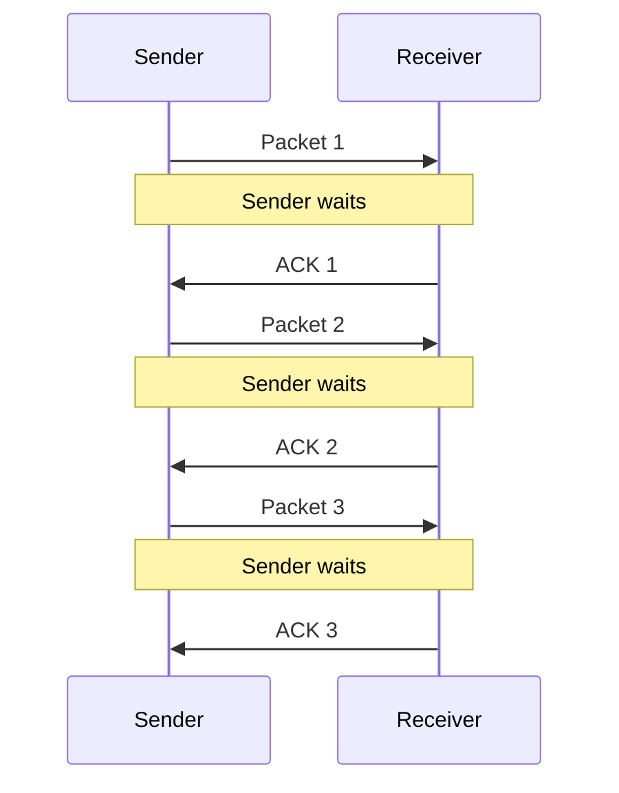
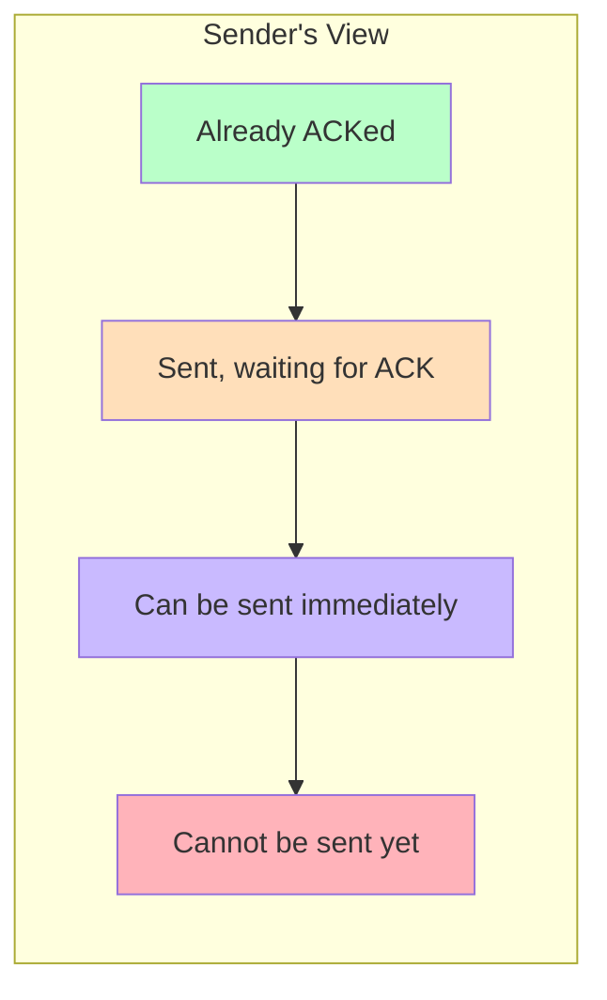

# Networks Flow Control

## Introduction

Flow control is a fundamental mechanism in computer networks that prevents a fast sender from overwhelming a slow receiver with too much data. It's like trying to pour water from a large jug into a small glass—without flow control, data would overflow and be lost. In the Transport Layer of network communications, flow control ensures that devices can communicate efficiently regardless of their processing capabilities or network conditions.

This concept is crucial for beginners to understand because it affects the performance and reliability of every networked application you'll ever build, from simple client-server applications to complex distributed systems.

## What is Flow Control?

Flow control coordinates the amount of data being transmitted between a sender and receiver. It answers a critical question: "How fast can we send data without overwhelming the recipient?"

Consider this scenario:

1. Your application is sending data at 100 Mbps
2. The receiving device can only process data at 10 Mbps
3. Without flow control, 90% of the data would be lost because the receiver can't handle it

Flow control mechanisms prevent this data loss by regulating transmission speeds and ensuring the receiver has enough buffer space to accept incoming data.

## Key Flow Control Mechanisms

### 1. Stop-and-Wait

The simplest flow control mechanism is stop-and-wait, where a sender transmits a packet and then waits for an acknowledgment (ACK) before sending the next one.



#### Stop-and-Wait Implementation Example

Here's a simple Python example demonstrating the stop-and-wait concept:

```python
def sender(data_packets):
    next_packet_to_send = 0
    while next_packet_to_send < len(data_packets):
        print(f"Sending packet {next_packet_to_send}: {data_packets[next_packet_to_send]}")
        # Send the packet
        send_packet(data_packets[next_packet_to_send])
        
        # Wait for acknowledgment
        ack = wait_for_ack()
        if ack == next_packet_to_send:
            print(f"Received ACK for packet {next_packet_to_send}")
            next_packet_to_send += 1
        else:
            print(f"Received incorrect ACK, expected {next_packet_to_send}, got {ack}")
            # Will resend the same packet

def receiver():
    expected_packet = 0
    while True:
        # Wait to receive a packet
        packet, data = receive_packet()
        
        if packet == expected_packet:
            print(f"Received expected packet {packet}: {data}")
            # Process the data...
            
            # Send acknowledgment
            send_ack(packet)
            expected_packet += 1
        else:
            print(f"Received unexpected packet, expected {expected_packet}, got {packet}")
            # Send acknowledgment for the last correctly received packet
            send_ack(expected_packet - 1)
```

**Advantages:**
- Simple to implement
- Works reliably for error detection

**Disadvantages:**
- Very inefficient, especially over high-latency connections
- Poor bandwidth utilization since the link is idle during waiting periods

### 2. Sliding Window Protocol

To overcome the inefficiency of stop-and-wait, the sliding window protocol allows multiple packets to be in transit without waiting for acknowledgments.

#### How it works:

1. The sender maintains a "window" of packets that can be sent without receiving an ACK
2. As ACKs arrive, the window "slides" forward to allow new packets to be sent
3. The receiver specifies how many packets it can accept (window size)



#### Sliding Window Implementation Example

```python
def sender(data_packets, window_size=4):
    base = 0  # First unacknowledged packet
    next_seq_num = 0  # Next packet to send
    
    while base < len(data_packets):
        # Send packets within the window
        while next_seq_num < base + window_size and next_seq_num < len(data_packets):
            print(f"Sending packet {next_seq_num}: {data_packets[next_seq_num]}")
            send_packet(next_seq_num, data_packets[next_seq_num])
            next_seq_num += 1
        
        # Receive acknowledgment
        ack = receive_ack()
        print(f"Received ACK {ack}")
        
        # Move the window
        base = ack + 1
        
        print(f"Window moved. Base: {base}, Next to send: {next_seq_num}")

def receiver(window_size=4):
    expected_seq_num = 0
    buffer = {}  # To store out-of-order packets
    
    while True:
        seq_num, data = receive_packet()
        
        if seq_num == expected_seq_num:
            print(f"Received in-order packet {seq_num}")
            process_data(data)
            expected_seq_num += 1
            
            # Process any buffered packets that are now in order
            while expected_seq_num in buffer:
                print(f"Processing buffered packet {expected_seq_num}")
                process_data(buffer[expected_seq_num])
                del buffer[expected_seq_num]
                expected_seq_num += 1
                
        elif seq_num > expected_seq_num and seq_num < expected_seq_num + window_size:
            print(f"Received out-of-order packet {seq_num}, buffering")
            buffer[seq_num] = data
        
        # Send acknowledgment for the highest in-order packet received
        send_ack(expected_seq_num - 1)
```

**Advantages:**
- Much better efficiency and throughput
- Can adapt to network conditions by adjusting window size
- Better utilization of available bandwidth

**Disadvantages:**
- More complex to implement
- Requires buffer management at both sender and receiver

## TCP Flow Control

In Transmission Control Protocol (TCP), flow control is implemented using a sliding window mechanism with a dynamic window size.

### TCP Window Size

The receiver advertises its buffer space in the TCP header's "Window Size" field, telling the sender how much data it can accept.

```
TCP Header:
+------------------+------------------+
| Source Port      | Destination Port |
+------------------+------------------+
| Sequence Number                     |
+----------------------------------------+
| Acknowledgment Number                  |
+----+--------+-----+-------------------+
|Head|Reserved|Flags| Window Size      |
+----+--------+-----+-------------------+
| Checksum          | Urgent Pointer   |
+------------------+------------------+
| Options (if any)                    |
+--------------------------------------+
```

### TCP Window Scale Option

Modern TCP implementations use the Window Scale option to support windows larger than 65,535 bytes, allowing for better performance on high-bandwidth networks.

```python
# Example of TCP window size calculation with scaling
def calculate_effective_window(window_size, scale_factor):
    return window_size * (2 ** scale_factor)

# Example usage
advertised_window = 64000  # bytes
scale_factor = 7  # From TCP options
effective_window = calculate_effective_window(advertised_window, scale_factor)
print(f"Effective window size: {effective_window} bytes")
```

Output:
```
Effective window size: 8192000 bytes
```

## Flow Control vs. Congestion Control

It's important to distinguish between flow control and congestion control:

- **Flow Control**: Prevents a sender from overwhelming a receiver (end-to-end issue)
- **Congestion Control**: Prevents senders from overwhelming the network itself (network-wide issue)

While they use similar mechanisms (like adjusting window sizes), they solve different problems.

## Real-World Applications

### Streaming Video Services

Video streaming platforms like Netflix and YouTube use sophisticated flow control to adapt to varying network conditions and device capabilities:

1. The server starts by sending video at a medium quality
2. If the client buffers quickly, the quality increases
3. If buffering is slow, the quality decreases
4. This dynamic adjustment prevents both buffer underflow (video pausing) and overwhelming the client device

### IoT Devices

In Internet of Things applications, flow control is critical because:

1. Sensors may generate data faster than low-power networks can transmit
2. Gateway devices might receive data from hundreds or thousands of sensors
3. Flow control prevents data loss while managing limited resources

```python
# Simplified IoT flow control example
class IoTGateway:
    def __init__(self, max_processing_rate=100):
        self.buffer = []
        self.max_processing_rate = max_processing_rate
        self.connected_sensors = {}
    
    def register_sensor(self, sensor_id, data_rate):
        """Register a sensor and assign its transmission rate"""
        allowed_rate = min(data_rate, self.max_processing_rate / len(self.connected_sensors))
        self.connected_sensors[sensor_id] = {"rate": allowed_rate}
        return allowed_rate
    
    def receive_data(self, sensor_id, data):
        """Receive data from a sensor"""
        if len(self.buffer) < 1000:  # Buffer has space
            self.buffer.append((sensor_id, data))
            return True
        else:
            # Buffer full - tell sensor to slow down
            current_rate = self.connected_sensors[sensor_id]["rate"]
            self.connected_sensors[sensor_id]["rate"] = current_rate * 0.8
            return False
```

## Practical Implementation Considerations

When implementing flow control in your applications, consider these factors:

### Buffer Management

Efficient buffer management is crucial for flow control:

```python
class FlowControlBuffer:
    def __init__(self, max_size):
        self.buffer = bytearray(max_size)
        self.max_size = max_size
        self.write_pointer = 0
        self.read_pointer = 0
    
    def available_space(self):
        """Return available space in the buffer"""
        if self.write_pointer >= self.read_pointer:
            return self.max_size - (self.write_pointer - self.read_pointer)
        else:
            return self.read_pointer - self.write_pointer
    
    def write(self, data):
        """Write data to buffer if space available"""
        space = self.available_space()
        if len(data) > space:
            return False  # Not enough space
        
        # Copy data to buffer
        for byte in data:
            self.buffer[self.write_pointer] = byte
            self.write_pointer = (self.write_pointer + 1) % self.max_size
        
        return True
    
    def read(self, size):
        """Read data from buffer"""
        available = self.max_size - self.available_space()
        read_size = min(size, available)
        
        result = bytearray(read_size)
        for i in range(read_size):
            result[i] = self.buffer[self.read_pointer]
            self.read_pointer = (self.read_pointer + 1) % self.max_size
        
        return result
```

### Timeout and Retransmission

Flow control mechanisms need to handle cases where acknowledgments are lost:

```python
def send_with_timeout(packet, timeout_seconds=5, max_retries=3):
    retries = 0
    while retries < max_retries:
        send_packet(packet)
        
        start_time = time.time()
        while time.time() - start_time < timeout_seconds:
            if check_for_ack():
                return True  # Success
            time.sleep(0.1)  # Small sleep to prevent CPU spinning
        
        print(f"Timeout occurred, retrying ({retries+1}/{max_retries})")
        retries += 1
    
    return False  # Failed after max retries
```

## Summary

Flow control is a critical mechanism in network communication that prevents data loss by regulating transmission speeds between senders and receivers. We've explored:

- The basic concept and importance of flow control
- Stop-and-wait as a simple but inefficient mechanism
- Sliding window protocols for improved efficiency
- TCP's implementation of flow control
- Real-world applications in streaming and IoT
- Practical implementation considerations

By understanding and implementing proper flow control in your networking applications, you'll create more reliable and efficient systems that perform well across varying network conditions.

## Exercises

1. Implement a simple stop-and-wait protocol in your preferred programming language, simulating packet loss and recovery.
2. Modify the sliding window example to handle out-of-order packet delivery.
3. Experiment with different window sizes in the sliding window protocol and measure the impact on throughput.
4. Create a visualization of TCP's dynamic window adjustment based on available buffer space.
5. Design a flow control mechanism for a hypothetical IoT system where sensor data rates vary widely.

## Additional Resources

- RFC 793: Transmission Control Protocol
- RFC 7323: TCP Extensions for High Performance
- Computer Networks: A Systems Approach by Larry Peterson and Bruce Davie
- TCP/IP Illustrated, Volume 1: The Protocols by W. Richard Stevens