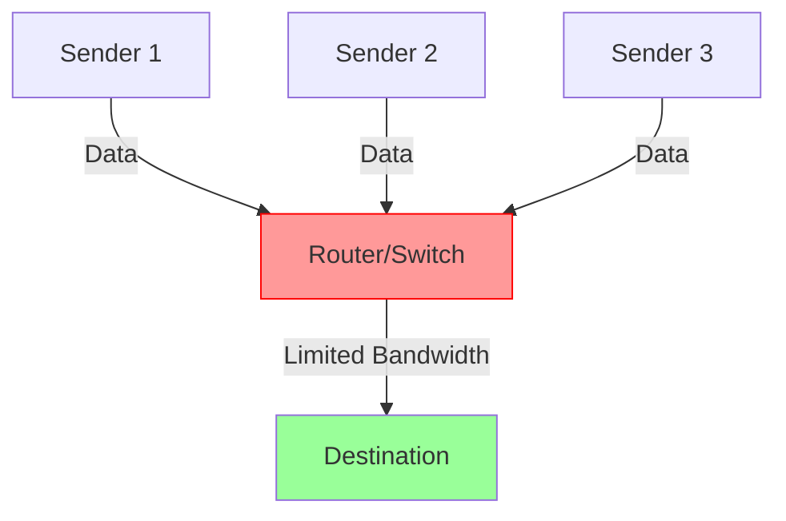
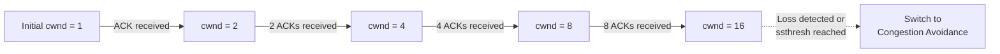

# Networks Congestion Control

## Introduction

When data travels across a network, it's similar to cars traveling on a highway. Just as highways can become congested with too many vehicles, networks can become overwhelmed with too much data. **Network congestion control** refers to mechanisms and techniques used to manage the flow of data packets across a network to prevent congestion, which could lead to packet loss, increased latency, and even network collapse.

Congestion control is primarily implemented at the transport layer of the network stack, with TCP (Transmission Control Protocol) being the most common protocol that implements these mechanisms. This article will explore how congestion control works, the problems it solves, and the different techniques used to maintain efficient network operation.

## Why Congestion Control Matters

Imagine what happens when too many people try to enter a door at once—nobody gets through efficiently! The same happens in networks:

1. **Packet Loss**: Routers and switches have finite buffer space; when overloaded, they drop packets
2. **Increased Latency**: Data packets spend more time waiting in queues
3. **Throughput Collapse**: In severe cases, the useful network capacity can drop dramatically
4. **Unfair Resource Allocation**: Without control, aggressive connections can starve others

## How Congestion Occurs

Let's understand how congestion typically occurs in networks:



In this diagram, multiple senders are transmitting data through a router with limited outgoing bandwidth. When the incoming data rate exceeds the outgoing capacity, the router's buffers fill up, leading to congestion.

## TCP Congestion Control Mechanisms

TCP implements several mechanisms to detect and control congestion:

### 1. Slow Start

TCP doesn't immediately transmit at full speed. Instead, it uses a technique called "Slow Start" to gradually increase the transmission rate until it finds the network's capacity.

Here's how Slow Start works:

1. Start with a small congestion window (cwnd), typically 1-10 Maximum Segment Size (MSS)
2. For each ACK received, increase cwnd by 1 MSS
3. This creates an exponential growth pattern until either:
   - A packet loss occurs
   - The slow start threshold (ssthresh) is reached

```javascript
// Pseudo-code for TCP Slow Start
function slowStart() {
  cwnd = INITIAL_WINDOW; // Usually 1-10 MSS
  
  while (cwnd < ssthresh && !packetLoss) {
    // Send packets according to current window size
    sendPackets(cwnd);
    
    // For each ACK received
    on_ack_received(() => {
      cwnd += 1;
    });
  }
  
  // Switch to congestion avoidance
  congestionAvoidance();
}
```

This exponential growth can be visualized as:



### 2. Congestion Avoidance

Once the connection has reached the slow start threshold or detected packet loss, it switches to a more conservative approach called "Congestion Avoidance":

1. Increase cwnd linearly: cwnd += 1/cwnd for each ACK received
2. This results in cwnd increasing by approximately 1 MSS per round-trip time (RTT)

```javascript
// Pseudo-code for TCP Congestion Avoidance
function congestionAvoidance() {
  while (!packetLoss) {
    // Send packets according to current window size
    sendPackets(cwnd);
    
    // For each ACK received, increase window size linearly
    on_ack_received(() => {
      cwnd += 1/cwnd; // Increase by 1 MSS per round-trip time
    });
  }
  
  // Handle packet loss
  handlePacketLoss();
}
```

### 3. Handling Packet Loss

TCP interprets packet loss as a sign of network congestion and responds by reducing its sending rate. There are two main ways TCP detects packet loss:

1. **Timeout**: When a sender doesn't receive an ACK within the expected time
2. **Duplicate ACKs**: Receiving multiple acknowledgments for the same segment

#### TCP Tahoe (Original Implementation)

When packet loss is detected:
1. Set ssthresh = cwnd/2
2. Reset cwnd to 1 MSS
3. Enter slow start again

#### TCP Reno (Improved Implementation)

TCP Reno distinguishes between two types of packet loss:

- **Timeout (severe congestion)**:
  1. Set ssthresh = cwnd/2
  2. Reset cwnd to 1 MSS
  3. Enter slow start

- **Triple duplicate ACKs (mild congestion)**:
  1. Set ssthresh = cwnd/2
  2. Set cwnd = ssthresh (halve the window size)
  3. Enter fast recovery

### 4. Fast Recovery (TCP Reno and newer)

After reducing the congestion window due to triple duplicate ACKs:

1. Retransmit the missing segment
2. Maintain the halved congestion window
3. Increase cwnd by 1 for each additional duplicate ACK
4. Resume congestion avoidance once a new ACK arrives

## Modern Congestion Control Algorithms

Modern TCP implementations use more sophisticated algorithms:

### TCP CUBIC

The default algorithm in Linux kernels, designed for high-bandwidth, high-latency networks:

- Uses a cubic function to grow the congestion window
- Less aggressive initial growth, but faster recovery after congestion
- Window growth becomes independent of RTT, solving fairness issues

### TCP BBR (Bottleneck Bandwidth and Round-trip propagation time)

Developed by Google, BBR takes a different approach:

- Estimates both available bandwidth and round-trip time
- Doesn't rely solely on packet loss as a congestion signal
- Maintains high throughput and low latency even when buffers are full

```javascript
// Simplified conceptual code for BBR algorithm
function BBR_congestion_control() {
  // Continuously estimate bottleneck bandwidth and RTT
  bottleneck_bandwidth = estimateBandwidth();
  min_rtt = estimateMinRTT();
  
  // Calculate optimal window size
  bdp = bottleneck_bandwidth * min_rtt; // Bandwidth-delay product
  cwnd = bdp * gain_factor;
  
  // Adjust sending rate based on network model
  adjustSendingRate(cwnd);
}
```

## Programming Example: Simple TCP Congestion Window Simulation

Let's implement a simple simulation of TCP's congestion window behavior:

```python
def simulate_tcp_congestion_control(total_packets, packet_loss_prob=0.01):
    cwnd = 1  # Start with congestion window of 1
    ssthresh = 16  # Initial slow start threshold
    packets_sent = 0
    congestion_events = 0
    window_sizes = []
    
    while packets_sent < total_packets:
        # Record current window size
        window_sizes.append(cwnd)
        
        # Send packets according to current window size
        for i in range(int(cwnd)):
            if packets_sent >= total_packets:
                break
            
            # Simulate random packet loss
            packet_lost = (random.random() < packet_loss_prob)
            packets_sent += 1
            
            if packet_lost:
                print(f"Packet loss detected at packet {packets_sent}, cwnd = {cwnd}")
                ssthresh = max(cwnd / 2, 2)  # Set slow start threshold to half the current window
                cwnd = 1  # Reset congestion window
                congestion_events += 1
                break
        
        # No packet loss in this window, adjust window size
        if not packet_lost:
            if cwnd < ssthresh:
                # Slow start - exponential growth
                cwnd = min(cwnd * 2, ssthresh)
            else:
                # Congestion avoidance - additive increase
                cwnd += 1 / cwnd  # Simplified - in real TCP this would be 1 MSS per RTT
    
    print(f"Simulation complete: {packets_sent} packets sent, {congestion_events} congestion events")
    return window_sizes

# Example usage:
window_sizes = simulate_tcp_congestion_control(1000)
```

**Example Output:**
```
Packet loss detected at packet 47, cwnd = 16
Packet loss detected at packet 189, cwnd = 12.83
Packet loss detected at packet 367, cwnd = 14.72
Simulation complete: 1000 packets sent, 3 congestion events
```

## Real-World Applications

### 1. Video Streaming Services

Streaming platforms like Netflix and YouTube rely heavily on congestion control to provide smooth playback:

- They monitor network conditions in real-time
- Adjust video quality based on available bandwidth
- Use adaptive bitrate streaming to prevent buffering

### 2. Cloud Services and Data Centers

In data centers, multiple applications compete for network resources:

- Congestion control prevents any single application from monopolizing bandwidth
- Custom algorithms like DCTCP (Data Center TCP) are designed specifically for data center environments
- QoS (Quality of Service) policies prioritize critical traffic

### 3. Mobile Networks

Mobile networks face unique congestion challenges:

- Limited bandwidth is shared among many users
- Network conditions change rapidly as users move
- Modern TCP variants like BBR help maintain good performance despite variable connectivity

## Common Issues and Solutions

### 1. Buffer Bloat

**Problem**: Excessively large buffers in network devices can lead to high latency even before packet loss occurs.

**Solution**: Active Queue Management (AQM) techniques like RED (Random Early Detection) and CoDel (Controlled Delay) drop packets preemptively before buffers are completely full.

### 2. TCP Incast

**Problem**: In data center environments, many servers may respond simultaneously to a request, overwhelming the receiver's buffer.

**Solution**: Application-level request scheduling, specialized congestion control algorithms, and increasing receiver buffer sizes.

### 3. TCP Fairness

**Problem**: Some TCP connections may receive unfair shares of the available bandwidth.

**Solution**: Advanced algorithms that consider round-trip time and other factors to ensure fair resource allocation.

## Summary

Network congestion control is a critical aspect of the transport layer that ensures networks operate efficiently and fairly. Key points to remember:

1. Congestion control prevents network collapse by managing data flow
2. TCP uses mechanisms like Slow Start, Congestion Avoidance, and Fast Recovery
3. Modern algorithms like CUBIC and BBR improve performance in contemporary networks
4. Real-world applications need to consider congestion control for reliable operation
5. Different network environments (data centers, mobile networks, etc.) may require specialized approaches

## Exercises

1. Calculate how many round-trip times it would take for a TCP connection using Slow Start to reach a congestion window of 64 MSS, starting from 1 MSS.

2. Implement a simple program that compares the congestion window growth of TCP Tahoe, TCP Reno, and TCP CUBIC under different network conditions.

3. Research and explain how the BBR algorithm differs fundamentally from loss-based congestion control algorithms.

4. Describe how a video conferencing application might implement its own congestion control at the application layer, and why it might choose to do so instead of relying solely on TCP.

## Additional Resources

- RFC 5681: TCP Congestion Control
- RFC 6582: The NewReno Modification to TCP's Fast Recovery Algorithm
- RFC 8312: CUBIC for Fast Long-Distance Networks
- "Computer Networking: A Top-Down Approach" by Kurose and Ross (Chapter on Transport Layer)
- "TCP/IP Illustrated, Volume 1: The Protocols" by W. Richard Stevens