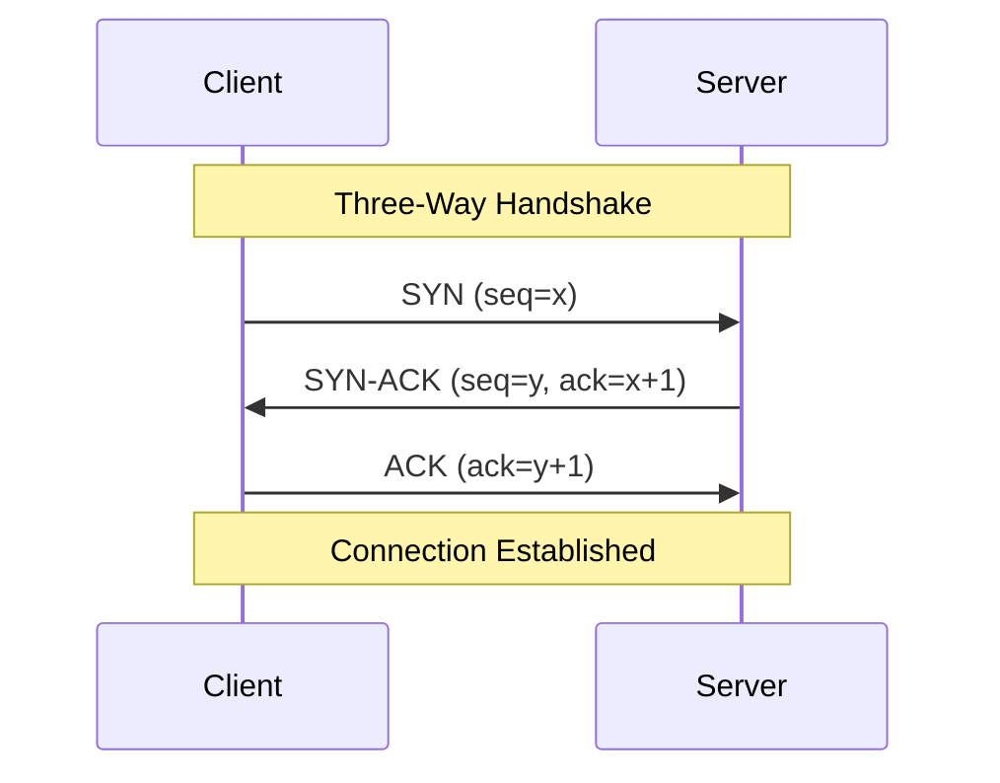
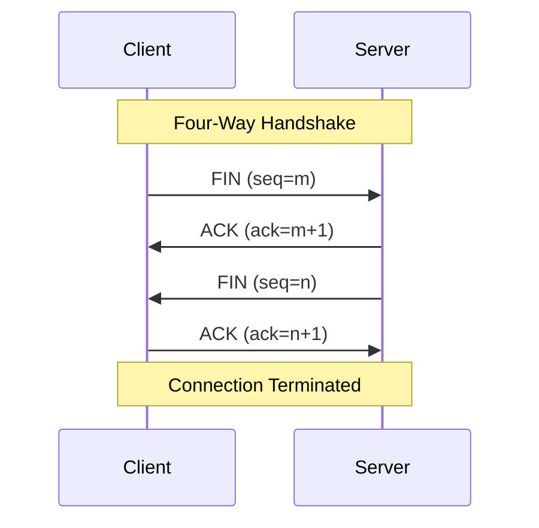

# Networks Connection Management

## Introduction

When applications on different devices need to communicate over a network, the transport layer plays a critical role in establishing, maintaining, and terminating connections between them. This process, known as **connection management**, ensures reliable data transfer and proper resource allocation.

Connection management is particularly important in connection-oriented protocols like TCP (Transmission Control Protocol), which creates a dedicated communication channel before any data exchange occurs. In this article, we'll explore how connections are handled at the transport layer, focusing on TCP's connection management mechanisms.

## Understanding Connection-Oriented vs. Connectionless Communication

Before diving into connection management details, let's understand the two primary approaches to network communication:

### Connection-Oriented Communication

In connection-oriented communication:
- A dedicated connection is established before data transfer
- The connection is maintained throughout the communication session
- The connection is properly terminated when communication ends
- Resources are allocated for the duration of the connection
- Example: TCP (Transmission Control Protocol)

### Connectionless Communication

In connectionless communication:
- No dedicated connection is established
- Each data packet (datagram) is sent independently
- No connection setup or teardown processes
- Generally less reliable but more lightweight
- Example: UDP (User Datagram Protocol)

This article focuses primarily on connection-oriented protocols, particularly TCP, as they implement sophisticated connection management techniques.

## TCP Connection Management

TCP employs a systematic approach for connection management that includes three main phases:

1. Connection establishment
2. Data transfer
3. Connection termination

Let's examine each phase in detail:

### TCP Connection Establishment: The Three-Way Handshake

TCP uses a process called the **three-way handshake** to establish connections. This procedure ensures both sides are ready to communicate and agree on initial sequence numbers for tracking data.



Let's break down this process:

1. **Step 1 (SYN)**: The client initiates the connection by sending a segment with the SYN (synchronize) flag set and an initial sequence number (x).
   
2. **Step 2 (SYN-ACK)**: The server responds with a segment that has both SYN and ACK (acknowledge) flags set. It acknowledges the client's sequence number (x+1) and provides its own initial sequence number (y).
   
3. **Step 3 (ACK)**: The client sends a segment with the ACK flag set, acknowledging the server's sequence number (y+1).

After these three steps, the connection is established, and both sides can begin sending data.

Here's an example using Wireshark packet capture notation:

```
[Client] -> [Server] TCP 74 [SYN] Seq=0 Win=65535 Len=0 MSS=1460 WS=4 SACK_PERM=1
[Server] -> [Client] TCP 74 [SYN, ACK] Seq=0 Ack=1 Win=65535 Len=0 MSS=1460 WS=4 SACK_PERM=1
[Client] -> [Server] TCP 66 [ACK] Seq=1 Ack=1 Win=131072 Len=0
```

### TCP Connection States

During the connection management process, a TCP connection goes through various states. Understanding these states helps in troubleshooting network issues:

- **CLOSED**: No connection
- **LISTEN**: Server waiting for connections
- **SYN-SENT**: Client has sent SYN, waiting for SYN-ACK
- **SYN-RECEIVED**: Server has received SYN, sent SYN-ACK
- **ESTABLISHED**: Connection established, data transfer possible
- **FIN-WAIT-1**: Initiated connection termination, sent FIN
- **FIN-WAIT-2**: Received ACK for FIN, waiting for other side's FIN
- **CLOSE-WAIT**: Received FIN, waiting for application to close
- **LAST-ACK**: Sent FIN, waiting for final ACK
- **TIME-WAIT**: Waiting to ensure remote TCP received termination ACK
- **CLOSING**: Both sides initiated close simultaneously

## Socket Programming: Connection Management in Practice

Let's look at how connection management is implemented in code using socket programming:

### TCP Server Example (Python)

```python
import socket

# Create a TCP socket
server_socket = socket.socket(socket.AF_INET, socket.SOCK_STREAM)

# Bind the socket to a specific address and port
server_socket.bind(('localhost', 8080))

# Listen for incoming connections (enter LISTEN state)
server_socket.listen(5)  # 5 is the backlog queue size
print("Server listening on port 8080...")

while True:
    # Accept a connection - completes the three-way handshake
    client_socket, client_address = server_socket.accept()
    print(f"Connection established with {client_address}")
    
    # Receive and send data
    data = client_socket.recv(1024)
    print(f"Received: {data.decode()}")
    client_socket.send("Hello from server!".encode())
    
    # Close the connection
    client_socket.close()
```

### TCP Client Example (Python)

```python
import socket

# Create a TCP socket
client_socket = socket.socket(socket.AF_INET, socket.SOCK_STREAM)

# Initiate connection with server (start three-way handshake)
client_socket.connect(('localhost', 8080))  # This blocks until connection is established
print("Connection established with server")

# Send and receive data
client_socket.send("Hello from client!".encode())
data = client_socket.recv(1024)
print(f"Received: {data.decode()}")

# Close the connection
client_socket.close()
```

In these examples:
- The server creates a socket, binds it to an address, and listens for connections
- The client initiates the connection with `connect()`
- The server accepts the connection with `accept()`
- Both sides can send and receive data
- Either side can close the connection with `close()`

## TCP Connection Termination: The Four-Way Handshake

When either side wants to terminate the connection, TCP uses a four-way handshake:



Here's the step-by-step process:

1. **Step 1 (FIN)**: The side initiating the termination sends a segment with the FIN (finish) flag set.
   
2. **Step 2 (ACK)**: The other side acknowledges the FIN.
   
3. **Step 3 (FIN)**: The other side sends its own FIN when it's ready to close.
   
4. **Step 4 (ACK)**: The initiating side acknowledges the FIN.

After these steps, the connection is terminated. However, the initiating side enters a TIME-WAIT state to ensure the final ACK was received.

## Connection Management Challenges and Solutions

### Challenge 1: Half-Open Connections

A half-open connection occurs when one side believes the connection is open, but the other has closed it or crashed:

```python
# Detecting a half-open connection (simplified example)
try:
    # Try to send data on a potentially half-open connection
    socket.send("Are you there?".encode())
    response = socket.recv(1024)
    print("Connection is still active")
except ConnectionError:
    print("Connection has been lost")
    socket.close()  # Clean up the socket
```

### Challenge 2: Simultaneous Open and Close

Sometimes both sides might try to establish or terminate a connection simultaneously. TCP has mechanisms to handle these scenarios correctly.

### Challenge 3: SYN Flooding

SYN flooding is a denial-of-service attack where an attacker sends many SYN packets without completing the handshake:

```python
# Simple SYN flood protection (server-side)
def handle_new_connection(server_socket):
    try:
        # Set a timeout for accept() to prevent blocking indefinitely
        server_socket.settimeout(1.0)
        client_socket, client_address = server_socket.accept()
        
        # Track connection attempts from this address
        if client_address[0] in connection_attempts:
            connection_attempts[client_address[0]] += 1
            if connection_attempts[client_address[0]] > MAX_ATTEMPTS:
                # Potential SYN flood, take protective action
                client_socket.close()
                return None
        else:
            connection_attempts[client_address[0]] = 1
            
        return client_socket
    except socket.timeout:
        return None
```

## Real-World Applications

### Web Browsing (HTTP/HTTPS)

When you access a website, your browser establishes a TCP connection with the web server before sending HTTP requests:

1. Browser initiates TCP three-way handshake with the web server
2. HTTP request is sent over the established connection
3. Web server responds with the requested content
4. Connection may be kept alive for subsequent requests or terminated

### Database Connections

Applications often maintain connection pools to databases to avoid the overhead of frequent connection establishment and termination:

```python
# Simplified database connection pool example
class DBConnectionPool:
    def __init__(self, max_connections=10):
        self.pool = []
        self.max_connections = max_connections
        
    def get_connection(self):
        if self.pool:
            return self.pool.pop()
        else:
            # Create new connection if pool is empty (up to max_connections)
            return create_new_db_connection()
    
    def release_connection(self, connection):
        if len(self.pool) < self.max_connections:
            self.pool.append(connection)
        else:
            connection.close()  # Close excess connections
```

### File Transfer (FTP)

FTP uses multiple TCP connections – a control connection for commands and data connections for file transfers:

1. Client establishes a control connection to the server (port 21)
2. For each file transfer, either:
   - Active mode: Server initiates a data connection to the client
   - Passive mode: Client initiates a data connection to the server
3. File is transferred over the data connection
4. Data connection is terminated, but control connection remains open for further commands

## Connection Management in IPv6

IPv6 connection management works similarly to IPv4, but with 128-bit addresses instead of 32-bit addresses:

```python
# IPv6 server socket example
server_socket = socket.socket(socket.AF_INET6, socket.SOCK_STREAM)
server_socket.bind(('::', 8080))  # '::' is the IPv6 equivalent of '0.0.0.0'
server_socket.listen(5)
```

## Summary

Connection management is a crucial aspect of the transport layer, especially for connection-oriented protocols like TCP. The key points covered in this article include:

- The difference between connection-oriented and connectionless communication
- TCP's three-way handshake for connection establishment
- TCP connection states
- Socket programming for implementing connection management
- TCP's four-way handshake for connection termination
- Common challenges in connection management and their solutions
- Real-world applications of connection management

By understanding these concepts, you'll have a solid foundation for building networked applications that establish, maintain, and terminate connections effectively.

## Further Exercises

1. **Implement a Simple Chat Application**: Create a client-server chat application in Python that properly handles connection establishment and termination.

2. **Investigate Connection States**: Write a program that monitors and displays the current state of TCP connections on your computer (similar to `netstat` command).

3. **Connection Pool Implementation**: Build a connection pool for a specific application (web server, database client) that efficiently manages connections.

4. **Protocol Analysis**: Use Wireshark to capture and analyze the three-way handshake and four-way termination of a real TCP connection when you visit a website.

5. **Resilient Connections**: Implement connection retry logic for a client that gracefully handles server unavailability and reconnects when the server becomes available again.