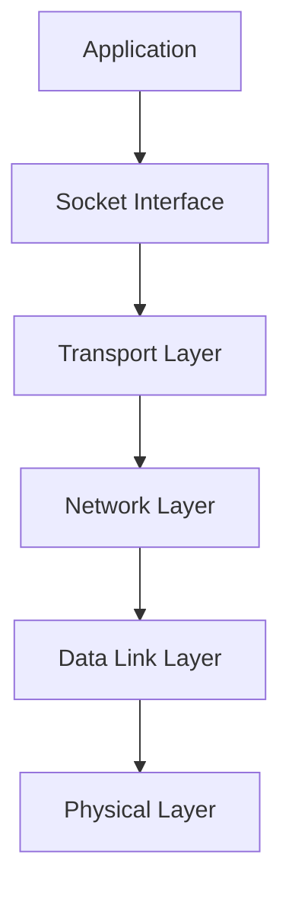
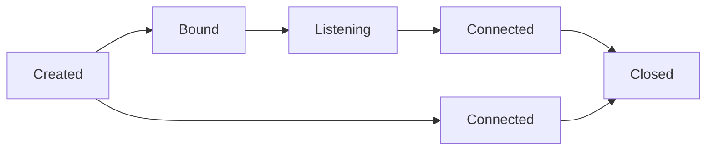

# Network Sockets

## Introduction

Network sockets are the fundamental building blocks that allow applications to communicate over a network. Think of a socket as an endpoint for sending or receiving data across a network connection. Just like a physical electrical socket provides an interface for devices to connect to a power supply, a network socket provides an interface for software applications to connect to a network.

Sockets are crucial in understanding how data moves between applications, whether they're running on the same computer or on different devices across the internet. They serve as the bridge between the application layer and the transport layer in the networking stack.

## What Are Sockets?

A socket is a software endpoint that establishes bidirectional communication between a server program and one or more client programs. The socket associates the server program with a specific hardware port on the machine where it runs so any client program anywhere in the network can address it.

Sockets are implemented at the transport layer of the networking stack and typically represent a combination of:
- IP address (where to find the computer)
- Port number (which application on the computer)
- Protocol (rules for communication)



## Types of Sockets

There are several types of sockets, but the two most common ones are:

### 1. Stream Sockets (TCP)

Stream sockets use the Transmission Control Protocol (TCP) to ensure reliable, ordered, and error-checked delivery of data. They establish a connection before data exchange begins, making them connection-oriented.

Key characteristics:
- Reliable data transfer
- Data arrives in the order it was sent
- Built-in error detection and recovery
- Slower than datagram sockets but more dependable
- Ideal for applications that require accuracy over speed (e.g., file transfers, web browsing)

### 2. Datagram Sockets (UDP)

Datagram sockets use the User Datagram Protocol (UDP) and operate in a connectionless manner. They send independent packets of data without establishing a dedicated connection first.

Key characteristics:
- Faster but less reliable than stream sockets
- No guarantee of delivery, ordering, or duplicate protection
- No connection establishment required
- Lower overhead and latency
- Suitable for applications where speed is more important than perfect reliability (e.g., video streaming, online gaming, DNS lookups)

## Socket Programming Basics

Let's go through the basic steps of socket programming for both client and server applications.

### Server-Side Socket Operations

A typical server program follows these steps:

1. **Create a socket** - Allocate resources for a new socket
2. **Bind the socket** - Associate the socket with an IP address and port number
3. **Listen for connections** - Set the socket to listen for incoming connections
4. **Accept connections** - Accept a connection request from a client
5. **Send/receive data** - Exchange data with the connected client
6. **Close the socket** - Release the socket and its resources

### Client-Side Socket Operations

A typical client program follows these steps:

1. **Create a socket** - Allocate resources for a new socket
2. **Connect to server** - Establish a connection to a specific server's IP address and port
3. **Send/receive data** - Exchange data with the server
4. **Close the socket** - Release the socket and its resources

## Socket Programming Examples

Let's see some practical examples of socket programming in different languages.

### Python Socket Programming Example

Here's a simple example of a TCP socket server and client in Python:

#### TCP Server

```python
import socket

# Create a TCP/IP socket
server_socket = socket.socket(socket.AF_INET, socket.SOCK_STREAM)

# Bind the socket to the address and port
server_address = ('localhost', 8000)
server_socket.bind(server_address)

# Listen for incoming connections (maximum 1 queued connection)
server_socket.listen(1)
print(f"Server is listening on {server_address[0]}:{server_address[1]}")

try:
    while True:
        # Wait for a connection
        print("Waiting for a connection...")
        client_socket, client_address = server_socket.accept()
        print(f"Connection from {client_address}")
        
        try:
            # Receive data
            data = client_socket.recv(1024)
            print(f"Received: {data.decode('utf-8')}")
            
            # Send response
            message = "Hello from server!"
            client_socket.sendall(message.encode('utf-8'))
        finally:
            # Clean up the connection
            client_socket.close()
            print("Connection closed")
            
except KeyboardInterrupt:
    print("Server shutting down")
finally:
    server_socket.close()
```

#### TCP Client

```python
import socket

# Create a TCP/IP socket
client_socket = socket.socket(socket.AF_INET, socket.SOCK_STREAM)

# Connect the socket to the server
server_address = ('localhost', 8000)
print(f"Connecting to {server_address[0]}:{server_address[1]}")
client_socket.connect(server_address)

try:
    # Send data
    message = "Hello from client!"
    client_socket.sendall(message.encode('utf-8'))
    
    # Receive response
    data = client_socket.recv(1024)
    print(f"Received: {data.decode('utf-8')}")
    
finally:
    # Clean up
    client_socket.close()
    print("Connection closed")
```

**Example Output:**

When running the server:
```
Server is listening on localhost:8000
Waiting for a connection...
Connection from ('127.0.0.1', 52436)
Received: Hello from client!
Connection closed
Waiting for a connection...
```

When running the client:
```
Connecting to localhost:8000
Received: Hello from server!
Connection closed
```

### UDP Socket Example in Python

UDP sockets work differently since they're connectionless:

#### UDP Server

```python
import socket

# Create a UDP socket
server_socket = socket.socket(socket.AF_INET, socket.SOCK_DGRAM)

# Bind the socket to the address and port
server_address = ('localhost', 8000)
server_socket.bind(server_address)
print(f"UDP Server is listening on {server_address[0]}:{server_address[1]}")

try:
    while True:
        # Wait for data
        print("Waiting for data...")
        data, client_address = server_socket.recvfrom(1024)
        print(f"Received {len(data)} bytes from {client_address}")
        print(f"Data: {data.decode('utf-8')}")
        
        # Send response
        message = "Hello from UDP server!"
        server_socket.sendto(message.encode('utf-8'), client_address)
except KeyboardInterrupt:
    print("Server shutting down")
finally:
    server_socket.close()
```

#### UDP Client

```python
import socket

# Create a UDP socket
client_socket = socket.socket(socket.AF_INET, socket.SOCK_DGRAM)

server_address = ('localhost', 8000)
message = "Hello from UDP client!"

try:
    # Send data
    print(f"Sending: {message}")
    client_socket.sendto(message.encode('utf-8'), server_address)
    
    # Receive response
    data, server = client_socket.recvfrom(1024)
    print(f"Received: {data.decode('utf-8')}")
    
finally:
    # Close socket
    client_socket.close()
```

**Example Output:**

When running the UDP server:
```
UDP Server is listening on localhost:8000
Waiting for data...
Received 21 bytes from ('127.0.0.1', 52437)
Data: Hello from UDP client!
Waiting for data...
```

When running the UDP client:
```
Sending: Hello from UDP client!
Received: Hello from UDP server!
```

## Socket Options and Parameters

Sockets have various options and parameters that can be configured to change their behavior:

- **SO_REUSEADDR**: Allows reuse of local addresses
- **SO_KEEPALIVE**: Maintains connection during periods of inactivity
- **SO_LINGER**: Controls what happens when a socket is closed with data still present
- **TCP_NODELAY**: Disables Nagle's algorithm for send coalescing (Nagles algorithm combines small packets)
- **SO_RCVBUF** and **SO_SNDBUF**: Control receive and send buffer sizes

Here's an example of setting socket options in Python:

```python
import socket

# Create socket
s = socket.socket(socket.AF_INET, socket.SOCK_STREAM)

# Allow address reuse
s.setsockopt(socket.SOL_SOCKET, socket.SO_REUSEADDR, 1)

# Set receive buffer size (8KB)
s.setsockopt(socket.SOL_SOCKET, socket.SO_RCVBUF, 8192)

# Enable keep-alive
s.setsockopt(socket.SOL_SOCKET, socket.SO_KEEPALIVE, 1)
```

## Socket States and Connection Lifecycle

A socket goes through several states during its lifecycle:



1. **CLOSED**: The starting state of a socket
2. **LISTEN**: Server socket awaiting connection requests (TCP)
3. **SYN_SENT**: Client has sent a connection request (TCP)
4. **SYN_RECEIVED**: Server has received and responded to a connection request (TCP)
5. **ESTABLISHED**: Connection is established, data can be exchanged
6. **FIN_WAIT**, **CLOSE_WAIT**, **LAST_ACK**: Various states during connection termination
7. **TIME_WAIT**: Waiting for enough time to ensure remote TCP received connection termination acknowledgment

## Non-blocking Sockets and I/O Multiplexing

By default, socket operations are blocking, meaning they'll pause program execution until the operation completes. For scalable applications, you often need non-blocking sockets.

There are several ways to handle multiple sockets efficiently:

1. **Non-blocking mode**: Set sockets to non-blocking mode
2. **select()**: Monitor multiple sockets for readiness
3. **poll()**: An improved alternative to select()
4. **epoll()** (Linux) or **kqueue()** (BSD): High-performance alternatives

Here's an example using `select()` in Python:

```python
import socket
import select

# Create a TCP socket
server = socket.socket(socket.AF_INET, socket.SOCK_STREAM)
server.setblocking(0)  # Set non-blocking
server.bind(('localhost', 8000))
server.listen(5)

# Sockets to monitor
inputs = [server]
outputs = []

while inputs:
    # Wait for at least one socket to be ready
    readable, writable, exceptional = select.select(inputs, outputs, inputs)
    
    # Handle readable sockets
    for s in readable:
        if s is server:
            # New connection
            connection, client_address = s.accept()
            connection.setblocking(0)
            inputs.append(connection)
        else:
            # Existing connection has data
            data = s.recv(1024)
            if data:
                # Handle the data
                print(f"Received: {data.decode('utf-8')}")
                # Echo back
                s.send(data)
            else:
                # Connection closed by client
                inputs.remove(s)
                s.close()
```

## Common Socket Errors and Troubleshooting

When working with sockets, you might encounter various errors:

1. **Connection refused**: Server not running or wrong address/port
2. **Connection timed out**: Server unreachable or network issues
3. **Address already in use**: Port already bound by another process
4. **Permission denied**: Insufficient permissions (e.g., binding to privileged ports)
5. **Network unreachable**: No route to the specified host

Tips for troubleshooting:
- Use tools like `netstat`, `ss`, or `lsof` to check port usage
- Verify firewall settings
- Check network connectivity with `ping`, `traceroute`, or `telnet`
- Enable socket error logging in your application

## Real-world Applications of Sockets

Sockets are used extensively in various applications:

1. **Web browsers and servers**: HTTP communication uses TCP sockets
2. **Email clients and servers**: SMTP, POP3, IMAP protocols use sockets
3. **Chat applications**: Real-time messaging via sockets
4. **Online gaming**: Fast UDP communication for game state
5. **File transfer applications**: FTP and related protocols
6. **Database clients**: Connection to database servers
7. **IoT devices**: Communication between devices and servers

## WebSockets: Modern Web Communication

WebSockets are an extension of the socket concept specifically for web applications. They provide a persistent connection between a client (typically a web browser) and a server, allowing for bidirectional communication.

Benefits of WebSockets:
- Full-duplex communication
- Lower latency than HTTP polling
- Protocol overhead is reduced after the initial handshake
- Ideal for real-time applications like chat, gaming, and live updates

Basic WebSocket handshake example:

```
Client request:
GET /chat HTTP/1.1
Host: server.example.com
Upgrade: websocket
Connection: Upgrade
Sec-WebSocket-Key: dGhlIHNhbXBsZSBub25jZQ==
Sec-WebSocket-Version: 13

Server response:
HTTP/1.1 101 Switching Protocols
Upgrade: websocket
Connection: Upgrade
Sec-WebSocket-Accept: s3pPLMBiTxaQ9kYGzzhZRbK+xOo=
```

## Summary

Network sockets provide a powerful abstraction for network communication, enabling applications to exchange data regardless of their physical location. Key points to remember:

- Sockets act as endpoints for network communication
- TCP sockets provide reliable, connection-oriented communication
- UDP sockets offer faster, connectionless communication
- Socket programming follows a client-server model
- Understanding socket states and proper error handling is crucial
- Modern applications like WebSockets build on socket fundamentals

By mastering socket programming, you gain the ability to create networked applications ranging from simple client-server programs to complex distributed systems.

## Exercises

1. Write a simple TCP echo server that accepts connections and echoes back any message it receives.
2. Modify the TCP client example to send multiple messages before closing.
3. Create a UDP client that can handle packet loss by implementing a simple timeout and retry mechanism.
4. Implement a multi-client chat server using the `select()` function.
5. Experiment with different socket options (like buffer sizes) and observe how they affect performance.

## Additional Resources

- [Python Socket Programming Documentation](https://docs.python.org/3/library/socket.html)
- [Beej's Guide to Network Programming](https://beej.us/guide/bgnet/)
- [RFC 793: Transmission Control Protocol](https://datatracker.ietf.org/doc/html/rfc793)
- [RFC 768: User Datagram Protocol](https://datatracker.ietf.org/doc/html/rfc768)